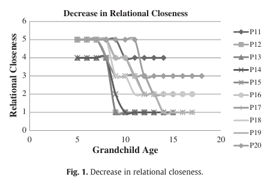
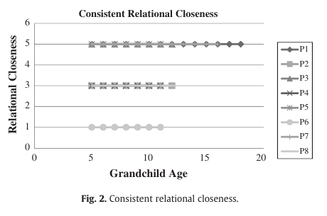
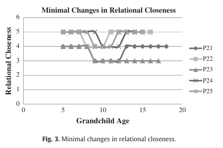
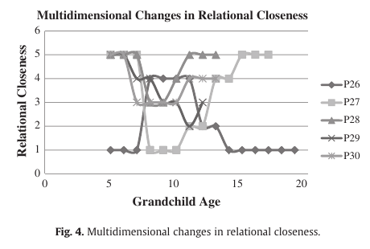
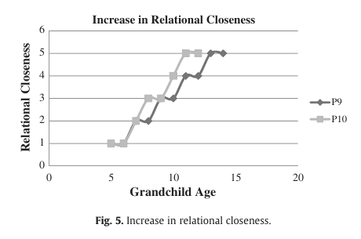
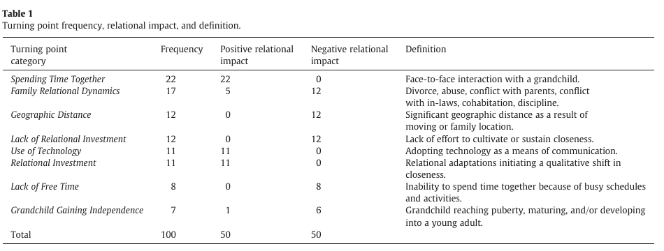

# 장거리 조부모–손자녀 관계의 전환점

> Lauren R. Bangerterᵃ,* · Vincent R. Waldronᵇ

> ᵃ 펜실베이니아주립대학교, 미국. ᵇ 애리조나주립대학교, 미국.

> *Journal of Aging Studies*, 29, 88–97 (2014). DOI: https://doi.org/10.1016/j.jaging.2014.01.004.

> 논문 이력: 2013년 10월 9일 접수; 2014년 1월 30일 수정본 접수; 2014년 1월 30일 게재 승인; 2014년 3월 3일 온라인 공개.

> 교신저자: Department of Human Development and Family Studies, The Pennsylvania State University, University Park, PA 16802, United States. 이메일 주소: lrb207@psu.edu (L.R. Bangerter), vincent.waldron@asu.edu (V.R. Waldron).

> 0890-4065/© 2014 Elsevier Inc. 모든 권리 보유.

## 초록

본 연구는 관계의 전환점과 궤적을 확인하여 조부모와 청소년기 손자녀 사이의 장거리 관계가 어떻게 변화하는지 살펴본다. 조부모 면접에서 수집한 자료를 질적으로 분석한 결과 고유한 전환점 100개가 도출되었다. 지속적 비교분석을 통해 관계 전환점의 서로 다른 여덟 범주, 즉 함께 시간 보내기, 가족관계 역동, 지리적 거리, 관계 투자 부족, 기술 사용, 관계 투자, 여가시간 부족, 손자녀의 독립성 증대를 확인했다. 이 범주들은 관계적 친밀감에 긍정적 또는 부정적으로 영향을 미친 정도가 서로 달랐다. 회고적 면접기법(Retrospective Interview Technique, RIT)을 적용하여 관계적 친밀감의 감소, 관계적 친밀감의 증가, 관계적 친밀감의 다차원적 변화, 관계적 친밀감의 최소 변화, 일관된 관계적 친밀감이라는 서로 다른 다섯 관계 궤적을 도출했다. 연구 결과는 장거리 조부모가 마주하는 의사소통의 어려움, 이러한 관계의 다양성, 그리고 조부모 관계의 유대가 시간에 따라 변하는 방식을 드러낸다. 조부모–손자녀 관계를 더 풍부하게 이해하기 위한 함의와 가족을 위한 실천적 적용 방안을 살펴본다.

## 핵심어

장거리 조부모 역할; 청소년기 손자녀; 관계적 친밀감

## 서론

질 높은 조부모–손자녀 관계는 가족에게 안정, 사회적 지지, 만족의 원천이 될 수 있다. 이러한 관계가 시간에 걸쳐 유지되면 자녀와 그 부모, 조부모 자신 모두가 혜택을 얻을 가능성이 크다. 더욱이 조부모가 제공하는 지지는 보조금을 받는 보육, 방과후 프로그램, 위기 가족을 위한 휴식지원 서비스처럼 그렇지 않다면 국가가 제공해야 할 수도 있는 자원에 대한 가족의 필요를 줄일 수 있다(Dolbin-McNab & Keiley, 2009). 오랫동안 가족학 연구자들은 조부모 역할을 소홀히 다루었지만, 조부모–손자녀 관계에 관한 새롭고 더 나은 연구가 필요하다는 설득력 있는 촉구가 이어진 데 힘입어 지난 10년 동안 관심이 급증했다(Harwood, 2000a; Soliz, Lin, Anderson, & Harwood, 2006). 본 연구는 이러한 관계의 안정과 변화에 기여하는 요인에 관한 선행연구(Holladay et al., 1998)를 토대로 한다. 우리는 조부모가 중요한 지지원이 될 수 있는, 잠재적으로 격동적인 발달 시기인 손자녀의 청소년기에 초점을 둔다(Attar-Schwartz, Tan, & Buchanan, 2009). 연구자들은 조부모가 가족과 지리적으로 떨어져 있을 때 관계상의 어려움에 직면한다고 지적했지만(예: Holladay & Seipke, 2007), 많은 조부모가 멀리 사는 손자녀와 정서적으로 가까운 유대를 유지할 방법을 찾는다는 연구도 있다(Waldron, Giteson, & Kelley, 2005). 본 연구는 청소년기 전반에 걸쳐 장거리 조부모–손자녀 관계의 질을 높이거나 낮추는 관계적 실천과 생애사건을 질적으로 분석한다.

### 조부모 역할

2006년 미국에는 5,600만 명(56백만 명)이 넘는 조부모가 거주했으며(US Census Bureau, 2006), 인구 고령화와 함께 그 수가 증가하고 있다. Center For Disease Control and Prevention(2003)에 따르면 미국의 80세 이상 인구는 2030년에 1,950만 명(19.5백만 명)으로 증가할 전망이다. 30세 손자녀의 약 75%는 생존한 조부모가 있으며(Soliz et al., 2006), 수명 연장은 더 많은 손자녀가 더 오랜 기간 조부모를 알 수 있는 기회를 만든다(Bernal & Anuncibay, 2008; Kemp, 2007).

조부모–손자녀 관계는 흔하지만 그 양상은 상당히 다양하다. 이러한 다양성은 여러 조부모 역할 유형을 관찰한 Neugarten과 Weinstein(1964)의 초기 연구에서 분명히 드러났다. 예를 들어 어떤 조부모는 조언과 지혜의 원천으로 여겨졌다. 다른 조부모는 주로 즐거움을 함께 추구하는 동반자 역할을 했다. 일부는 가족 유지에 매우 적극적으로 관여했고 때로는 대리부모 역할을 했다. 네 번째 집단은 본인의 선호 또는 상황 때문에 거리를 두고 관여하지 않았다. 이후 경험연구는 영향력 있는 유형, 지지적 유형, 수동적 유형, 권위 지향적 유형, 거리 두는 유형을 포함해 조부모가 자신의 역할을 수행하는 방식을 살펴보았다(Mueller, Wilhelm, & Elder, 2002). 더 최근에는 Soliz(2008)가 조부모가 제공하는 ‘지지 실행’의 유형으로 정서적 지지, 안정, 중재, ‘솔직한 대화’, 가족사에 관한 정보를 확인했다.

이러한 역할 수행은 성장하는 손자녀의 필요와 변화하는 가족생활의 현실에 조부모가 적응하면서 시간에 따라 달라질 수 있다. 어린 시절 손자녀는 조부모가 곁에 있고 신체적 애정을 표현하는 데서 혜택을 얻을 수 있다(Holladay & Seipke, 2007). 아이가 청소년기에 들어서면 이것이 달라질 수 있다. 학교생활과 또래관계가 더 많은 시간과 관심을 차지하면서 조부모와 보내는 시간이 줄어들 수 있다. 의사소통의 빈도, 부모의 격려, 계속 관여하려는 조부모의 노력이 청소년이 정서적으로 더 멀어지는 경향을 상쇄할 수 있는 것으로 보인다(Attar-Schwartz et al., 2009). 청소년의 부모가 스트레스가 큰 이혼을 겪는 경우처럼 생애사건이 친밀감 증가의 촉매가 될 수도 있다(Soliz, 2008). 손자녀가 청소년기 후기나 성인기 초기에 들어서면 관계는 다시 변할 수 있다. 손자녀가 조부모와 정서적으로 덜 가까워질 수 있지만, 이들은 흔히 높은 수준의 감사와 존경을 보고한다(Attar-Schwartz et al., 2009).

### 장거리 조부모 역할

장거리 조부모 역할은 이 전통적인 가족 역할의 또 다른 변형이다(Harwood, 2000b). 직장 때문에 이주하거나, 자녀가 대학에 진학하려고 집을 떠나거나, 직장에서 은퇴한 조부모가 이주하기 때문에 미국 중산층 가족에서는 손자녀와 지리적으로 떨어져 사는 일이 상당히 흔하다(Waldron, Giteson, & Kelley, 2005; Waldron, Giteson, Kelley, & Regalado, 2005). 이 문헌의 종설들은 지리적 근접성이 조부모–손자녀 관계의 정서적 친밀감을 촉진한다고 시사한다(Harwood, 2007). 플로리다의 은퇴 공동체에 사는 장거리 조부모를 연구한 Holladay와 Seipke(2007)는 응답자 대부분이 손자녀와 직접 대면해 소통하는 횟수가 1년에 고작 ‘몇 차례’ 이하였음을 확인했다. Waldron과 동료들은 애리조나 은퇴 공동체에 사는 조부모에게 멀리 있는 손자녀와 관계를 유지하는 일이 걱정거리임을 확인했다. 그러나 전자통신을 이용해 손자녀와 연락을 유지한 사람들은 삶의 만족도가 더 높다고 보고했다. 다른 연구에서는 잦은 이메일이나 전화 대화, 특히 손자녀가 먼저 시작한 의사소통을 통해 장거리 관계의 친밀감을 유지할 수 있음을 확인했다(Harwood, 2000a; Holladay & Seipke, 2007).

문헌을 종합하면 장거리 조부모–손자녀 관계는 흔히 어렵게 경험되며, 조부모가 관계 유지에 상당한 노력을 기울여야 한다(Waldron & Waldron, 2009). 장거리 조부모–손자녀 관계의 긍정적 또는 부정적 변화를 촉발하는 요인에 관한 조부모의 관점을 이해하려고 이들에게 직접 물은 연구자는 거의 없다.

### 조부모 관계의 전환점

전환점은 관계가 어떤 방식으로든 변화하는 변혁적 사건이다(Baxter & Erbert, 1999). 전환점 틀은 심리적 친밀감의 증가와 감소에 주목함으로써 생애과정의 긴 기간에 걸쳐 관계 궤적을 추적할 수 있게 한다(Cappeliez, Beaupré, & Robitaille, 2008). 기존의 여러 연구는 조부모와 관련된 전환점을 탐색했다. Dun(2010)은 부모 23명을 대상으로 새로운 손자녀가 태어나는 전후의 시기를 연구했다. 조부모가 너무 멀리 살아 부모를 돕거나 손자녀에게 직접 관여할 수 없을 때 거리가 하나의 요인이 되었다. 다른 변화들은 가족생활이라는 더 큰 생태적 장에서 비롯되었다. Dun의 전환점 연구는 시사점을 주지만, 조부모–손자녀 관계가 아직 성숙하지 않은 손자녀 생애의 첫 몇 달에 초점을 맞췄다는 한계가 있다.

더 직접적으로 관련되는 연구는 Holladay 등(1998)이 수행한 할머니–손녀 관계의 전환점에 관한 질적 연구이다. 청년 여성 42명(평균 연령 = 19세)을 면접한 결과, 연구자들은 공유 활동, 가족 구성원의 심각한 건강 사건, 가족의 혼란으로 관계적 친밀감이 증가했다고 결론 내렸다. 지리적 근접성의 증가도 친밀감 증가와 관련되었다. 할머니와의 부정적인 관계 경험은 친밀감 감소와 관련되었으며, 지리적 분리와 손자녀가 대학에 진학하려고 집을 떠나는 일도 마찬가지였다. 관련 연구(예: Holladay & Seipke, 2007; Mansson, 2013; Mansson & Booth Butterfield, 2011)는 생애사건이나 성숙에 대한 반응으로 일어나는 관계 변화를 고려하지 않는다. 대신 한 시점에 측정한 의사소통 양식을 관계의 질을 나타내는 안정적인 지표로 개념화하고, 이것이 시간에 걸쳐 지속된다고 가정한다.

### 연구 근거와 연구질문

조부모–손자녀 관계는 특히 손자녀가 청소년기를 거치면서 변화할 가능성이 크다. 그러나 조부모가 경험하는 이러한 관계의 궤적에 관해서는 알려진 바가 거의 없다. 일부 연구자가 추측했듯이(예: Attar-Schwartz et al., 2009), 손자녀가 또래집단과 학교생활에 몰두하기 때문에 친밀감이 계속 낮아지는가? 어떤 관계는 실제로 시간이 지나면서 더 가까워지고, 다른 관계는 생애사건에 반응하여 친밀한 상태와 거리를 둔 상태 사이를 오갈 수도 있다(Holladay et al., 1998). 따라서 우리는 조부모가 다양한 관계적 친밀감 궤적을 보고하고, 이러한 궤적이 손자녀와 조부모 양쪽의 생애사건뿐 아니라 가족 안에서 일어나는 사건에도 달려 있을 것으로 예상했다. 동시에 이러한 궤적의 정확한 성격은 예측할 수 없었으므로, 분석을 이끌 연구질문 1을 제시했다.

> **RQ1.** 손자녀의 청소년기 동안 조부모–손자녀 관계의 친밀감은 어떤 방식으로 변화하는가?

Holladay 등(1998)은 할머니와의 지리적 분리를 손녀들이 부정적인 전환점으로 확인했음을 밝혔다. 이 결과에 따라 우리는 장거리 관계의 전환점만을 살펴보게 되었다. 이러한 유대의 정서적 활력을 유지하는 책임은 조부모가 상당 부분 맡는다. 따라서 조부모는 관계를 형성하는 가족 역동에 관한 고유한 관계적 통찰을 발달시킬 것으로 추정된다. 그러나 연구자들은 아직 조부모의 관점에서 전환점을 연구하지 않았다. 두 번째 연구질문은 이러한 관계 궤적을 형성하는 구체적인 전환점을 확인하는 데 초점을 두었다. 선행연구에 근거하여 우리는 지리적 거리가 조부모가 보고하는 관계 사건에서 고유한 역할을 할 것으로 분명히 예상했고, 지리적 거리에 긍정적으로 적응한 조부모는 시간에 걸쳐 손자녀와 더 높은 수준의 관계의 질을 유지할 수 있으리라 보았다. 그러나 다른 가능성도 나타날 것으로 예상되었으므로 다음 연구질문에 따라 연구를 진행했다.

> **RQ2.** 조부모는 멀리 사는 청소년기 손자녀와의 관계에서 어떤 유형의 관계 사건을 긍정적·부정적 전환점으로 가장 많이 확인하는가?

## 방법

### 참여자

참여자는 지역사회의 노년층을 위해 마련된 대학 부설 비학점 교육 프로그램인 Osher Lifelong Learning Institute와 협력하여 모집했다. 애리조나주립대학교 Osher Lifelong Learning Institute의 당시 참여자 전원에게 연구 및 참여 자격을 설명하는 이메일을 보내거나 유인물을 제공했다. 참여하려면 12세에서 19세 사이의 손자녀가 적어도 한 명 있어야 했고, Guldner와 Swensen(1995)을 수정한 다음 진술에 동의해야 했다. “내 손자녀 가운데 적어도 한 명은 너무 멀리 살아서 내가 매일 만나는 것이 매우 어렵거나 불가능하다.”

참여자 35명(N = 35)을 대상으로 이들의 집과 대형 대학 캠퍼스에서 질적 반구조화 면접을 실시했다. 면접 5건은 전사할 수 없었다. 참여자의 연령은 60–82세(M = 70.9, SD = 5.34), 손자녀의 연령은 12–19세(M = 14.7, SD = 2.36)였다. 참여자 29명은 자신의 인종/민족을 백인이라고 밝혔고, 1명은 히스패닉으로 확인되었다. 모든 참여자는 전문 돌봄제공자에게 의존하지 않고 생활했다. 참여자 23명은 은퇴자 주거 공동체에서 시간제 또는 전일제로 거주했고, 7명은 은퇴자 공동체 밖의 주택에 살았다. 여성 참여자는 21명(N = 21), 남성 참여자는 9명(N = 9)이었다. 참여자 26명은 기혼이었고, 4명은 미혼/사별/이혼 상태로 확인되었다. 이 집단을 대상으로 한 이전 연구에서는 소득에 관한 질문이 참여자를 불편하게 만드는 경향이 있었으므로 묻지 않았다. 그러나 더 큰 모집단인 OSHER 평생학습 프로그램 참여자들은 일관되게 ‘중간 수준’의 소득이 있는 것으로 파악되었으며, 은퇴자 공동체의 주택은 전국 평균과 비슷하거나 약간 높은 가격에 거래된다. 거주자 대부분은 적어도 대학 교육을 일부 이수했고 약 50%는 대학 학위를 가지고 있다. 따라서 본 표본은 주로 중산층이고 기혼이며 비교적 교육수준이 높은 은퇴자로 구성된다.

### 절차

전환점은 제보자에게 관계 안에서 일어난 전환점을 면접으로 묻는 회고적 면접기법(RIT)을 사용하여 도출했다. 이어 참여자에게 이러한 전환점을 격자 위에 그래프로 표시하게 하여 관계가 시간에 걸쳐 어떻게 변화했고 어떤 사건이 이러한 변화를 일으켰는지 파악했다(Baxter & Pittman, 2001). RIT는 참여자와 연구자가 관계를 시각적으로 표현할 수 있게 하는 특히 상호작용적인 방법론이며, 참여자와 연구자의 라포를 형성하는 데 매우 적합하다. 따라서 이 전략은 조부모와 손자녀의 친밀감을 형성하는 관계 사건을 타당하게 이해하는 데 적절하고, 이러한 사건을 발달적 관점에서 이해할 수 있게 한다.

참여자가 연구의 이 중요한 측면을 이해하도록 ‘친밀감’이라는 용어를 따로 떼어 매우 자세히 논의했다. Golish(2000)에 따라 친밀감은 조부모가 손자녀에게 느끼는 심리적 유대로 정의했다. 참여자가 관계적 친밀감의 정의를 이해한 것이 분명해지면, 면접은 관계적 친밀감의 변화를 일으키는 전환점을 논의하고 정의하는 단계로 넘어갔다. 관계 전환점이라는 이론적 개념을 충분히 설명하고, 가족의 죽음, 결혼, 다른 주로의 이사, 자녀의 출생처럼 선행연구(예: Holladay et al., 1998)에서 제시된 전환점 사례를 여러 개 제공했다. 면접 과정 초기에 이러한 용어를 정의함으로써 참여자가 연구 목적에 부합하는 방식으로 이 관계들을 생각할 수 있도록 했다.

다음으로 참여자에게 면접에서 이야기할, 멀리 사는 손자녀 한 명을 선택하도록 했다. 이어 y축에는 친밀감 수준(1 — 가장 가까움; 5 — 가장 멂), x축에는 손자녀의 연령을 표시한 RIT 그래프를 제시했다. 참여자들은 손자녀가 5세였을 때부터 현재 연령까지 관계적 친밀감의 변화를 그래프로 나타냈다. 관계적 친밀감 연구를 5세부터 시작한 근거는 유사한 회고연구(Golish, 2000)뿐 아니라 Piaget의 인지발달 전조작기 이론에도 있었다. 약 5세에 해당하는 전조작기에는 관계 발달에 필수적인 정신능력이 생겨난다(Miller & Church, 2003). 이어 면접은 각 전환점에 관한 논의로 넘어갔다. 면접 시간은 약 7분에서 45분이었다. 면접 직후 녹음 내용을 전사하여 두 줄 간격 텍스트 116쪽을 얻었다. 손으로 그린 RIT 그래프 30개는 디지털 그림으로 변환했다(그림 1–5 참조).

### 자료분석

지속적 비교방법(Glaser & Strauss, 1967)은 범주의 경계를 설정하고 범주 간 개념적 유사성을 식별하기 위한 주요 지적 도구로 비교와 대조를 사용한다(Tesch, 1990). 우리는 지속적 비교방법을 사용하여 참여자가 확인한 전환점과 관계 궤적의 유형론을 도출했다. 각 전환점을 앞선 전환점과 비교하여 유사점과 차이점을 확인했다. 코딩 메모에는 전환점에 관한 설명을 함께 묶거나 분리한 이유를 기록했다. 이 과정은 선행 저자들이 보고한 전환점에 대한 우리의 이해와 장거리 관계가 고유한 변화의 힘을 받을 수 있다는 예상 모두의 안내를 받았다. 제1저자는 면접 표본을 검토하여 초기 범주 집합을 만들었다. 범주의 대표성과 명확성을 높이기 위해 그 정의와 사례를 제2저자 및 여러 조부모와 논의했다. 이 과정을 통해 여러 범주의 정의를 다듬고 의미가 비슷하다고 판단한 여러 범주를 통합했다. 이어 제1저자는 부정적 사례를 면밀히 찾으면서 전체 자료에 범주 체계를 다시 적용했다. 부정적 사례는 발견되지 않았다. 자료의 약 75%를 검토한 뒤 이론적 포화에 도달한 것으로 보였지만, 전체 자료를 코딩했다.

관계 궤적의 유형을 확인하는 과정도 비슷했다. 그래프 30개를 각각 검토한 뒤, 친밀감이 뚜렷하고 꾸준히 감소하는 양상이나 친밀감이 증가하고 감소하는 격동적 양상처럼 변화의 프로필이 비슷한 다른 그래프와 함께 분류했다. 이러한 방식으로 참여자가 보고한 관계 변화 유형의 유사점과 차이점을 모두 포착했다.

## 결과

연구질문 1은 이러한 관계 안에서 나타난 변화의 궤적을 살펴보았다. 코딩 과정은 관계적 친밀감의 뚜렷한 감소(N = 10), 일관된 관계적 친밀감(N = 8), 친밀감의 최소 변화(N = 5), 친밀감의 다차원적 변화(N = 5), 관계적 친밀감의 뚜렷한 증가(N = 2)라고 명명한 서로 다른 다섯 관계 궤적을 제시했다.

시간에 따라 관계적 친밀감이 뚜렷하게 감소하는 궤적을 그림 1에 제시했다. 참여자들은 손자녀와 초기에 친밀했던 시기에 이어 친밀감이 완만하거나 급격하게 낮아졌다고 설명하는 경향이 있었으며, 이는 궤적의 변화 속도가 서로 다름을 나타낸다. 이 관계 대부분은 비교적 높은 수준의 친밀감으로 시작했고, 다수는 손자녀 발달의 비슷한 시점부터 친밀감이 약해지기 시작한 것으로 보인다. 두 번째 유형의 궤적(그림 2)은 일관성과 안정성이 특징이다. 이 참여자들은 RIT 그래프에 직선을 그어 관계적 친밀감의 변화를 전혀 경험하지 않았다고 나타냈다. 선은 그래프의 서로 다른 지점에 그려졌다. 이는 어떤 조부모는 상당한 친밀감을 유지한 반면 다른 조부모는 일관되게 거리가 먼 관계를 경험했음(리커트형 척도에서 5)을 뜻한다.

그림 1. 관계적 친밀감 감소. 접근성 설명: P11–P20의 궤적 10개를 손자녀 연령 0–20세와 관계적 친밀감 0–6의 축에 표시했다. 대부분은 약 4–5 수준에서 시작해 아동기 후기 또는 청소년기에 1–4 수준으로 이동한다.

그림 2. 일관된 관계적 친밀감. 접근성 설명: P1–P8의 궤적 8개는 관찰된 손자녀 연령 전반에 걸쳐 관계적 친밀감 수준 1, 3 또는 5에서 수평으로 유지된다.

세 번째 관계 궤적 유형(그림 3)은 여러 차례의 작은 변화를 포함했으며, 변화의 크기는 언제나 척도 1점이었다. 조부모들은 이러한 변화를 사소한 변동으로 해석했고, 여러 시점에 작은 이동이 있었음에도 관계의 시작 시점과 현재 시점 모두에서 높은 수준의 친밀감을 보였다. 그림 4는 관계적 친밀감이 극단적으로 오르내렸다고 인식한 참여자 5명이 보고한 다차원적 변화를 보여 준다. 관계 대부분은 참여자 #26을 제외하면 비교적 친밀한 지점에서 시작했지만, 이후 어느 한 방향으로 뚜렷한 변화를 보였다. 종점은 상당히 다양했다. 참여자 2명만이 보고한 마지막 궤적은 시간에 따른 친밀감의 두드러진 증가를 포함했다(그림 5). 이 관계들은 시작점이 비교적 낮았다는 점에서 독특했다.

그림 3. 관계적 친밀감의 최소 변화. 접근성 설명: P21–P25의 궤적 5개는 관찰된 손자녀 연령에 걸쳐 관계적 친밀감 수준 3–5 사이에서 제한적인 이동을 보인다.

그림 4. 관계적 친밀감의 다차원적 변화. 접근성 설명: P26–P30의 궤적 5개는 관찰된 손자녀 연령에 걸쳐 여러 방향으로 오르내리며, 표시된 수준의 범위는 1–5이다.

그림 5. 관계적 친밀감 증가. 접근성 설명: P9와 P10의 궤적 2개는 더 어린 연령에 표시된 수준 1에서 약 12–14세까지 수준 5로 이동한다.

연구질문 2는 긍정적·부정적 전환점의 성격을 다루었다. 고유한 전환점은 총 100개였다. 표 1은 전환점 자료의 명칭, 빈도, 방향성, 정의를 제시한다. 전환점 수의 범위는 0–10개였다. 참여자 8명은 손자녀와의 관계에서 전환점을 전혀 경험하지 않았다고 밝혔다.

표 1. 전환점의 빈도, 관계에 미친 영향 및 정의. 접근성 설명: 함께 시간 보내기: 빈도 22, 긍정 22, 부정 0, 손자녀와의 대면 상호작용.; 가족관계 역동: 빈도 17, 긍정 5, 부정 12, 이혼, 학대, 부모와의 갈등, 인척과의 갈등, 동거, 훈육.; 지리적 거리: 빈도 12, 긍정 0, 부정 12, 이사 또는 가족의 거주지 때문에 생긴 상당한 지리적 거리.; 관계 투자 부족: 빈도 12, 긍정 0, 부정 12, 친밀감을 키우거나 유지하려는 노력의 부족.; 기술 사용: 빈도 11, 긍정 11, 부정 0, 의사소통 수단으로 기술을 채택함.; 관계 투자: 빈도 11, 긍정 11, 부정 0, 친밀감의 질적 변화를 시작하는 관계적 적응.; 여가시간 부족: 빈도 8, 긍정 0, 부정 8, 바쁜 일정과 활동 때문에 함께 시간을 보낼 수 없음.; 손자녀의 독립성 증대: 빈도 7, 긍정 1, 부정 6, 손자녀가 사춘기에 이르거나 성숙하거나 청년으로 발달함. 합계: 빈도 100, 관계에 미친 긍정적 영향 50, 관계에 미친 부정적 영향 50.

가장 많이 언급되고 전원이 긍정적으로 평가한 전환점은 함께 시간 보내기였다. 이는 주로 손자녀와의 상호작용, 방문, 가족휴가 또는 명절 모임을 포함했다. 이 범주에서 친밀감 증가를 이끄는 힘은 틀림없이 참여자와 손자녀가 나누는 상호작용의 질이다. 한 참여자는 15세 손녀와 함께 보낸 시간을 다음과 같이 설명했다.

> 이제 (친밀감 수준이) 다시 올라오기 시작해요. 말씀드렸듯이 지난 3년 동안 그 애가 여기로 왔거든요. 1년에 한 번씩 혼자 와요. 그러니 그 애만을 위한 정말 좋은 시간을 보내고, 주변의 다른 가족 구성원이 끼어들지 않아요.

다른 참여자들도 이러한 양질의 시간을 더 큰 가족 단위의 일부가 되었음을 나타내는 상징으로 보았다. 한 참여자는 15세 손자가 어렸을 때 함께 보낸 시간 덕분에 더 가깝다고 느꼈음을 암시했다. “제가 그 집에 머물거나 엄마 아빠가 외출하면 우리는 더 많은 시간을 함께 보냈어요. 함께한 시간이 우리를 더 가깝게 만든 요인이었죠.”

가족관계 역동에는 가족 갈등과 가족 안에서 일어난 예상치 못한 변화가 많이 포함된다. 이러한 사례 대부분은 관계적 친밀감을 낮췄지만(N = 12), 일부 가족 관련 문제는 참여자와 손자녀를 더 가깝게 만들었다. 한 참여자가 설명하듯이, 15세 손녀가 겪은 학대는 두 사람의 관계를 긍정적인 방향으로 변화시켰다.

> 우리 손녀는 다른 일도 있었지만 아버지에게 정서적으로 학대받고 있었어요. 어, 보호가 필요했고 그건 그 애가 아기였을 때부터였죠… 그래서 뒤이어 가까워진 시기가 있었어요. 그 애가 문제에 대처하도록 돕고, 자기 아버지가 개자식이고, 아프고, 아프고, 미쳤다는 걸 알도록 도왔죠. 정신적으로 아픈 사람이란 걸요.

이 범주에 속한 또 하나의 가족 내부 상황은 동거였다. 한 참여자는 현재 18세인 손녀와 몇 달 동안 함께 산 일이 두 사람의 관계에 긍정적인 토대가 되지 못했다고 인정했다.

> 유대가 생기는 경험이 되길 바랐지만, 돌이켜 보면 딸이 그곳에 없어서 제가 훈육하는 사람이 되어 버렸어요… 그 8개월이 끝날 무렵에는 우리 셋 사이에 긴장과 스트레스가 아주 심했죠.

선행연구와 일관되게(즉, Holladay et al., 1998), 지리적 거리는 상당히 자주 언급되었으며 참여자에게 부정적인 전환점으로 여겨졌다. 한 참여자는 이사 때문에 16세 손녀와의 유대가 약해졌다고 말했다.

> 글쎄요, 친밀감이 약해진 것은 부모나 관계의 잘못이 아니라, 그 애가 6세가 될 때까지 줄곧 같은 동네에 살다가 이혼 때문에 미국 동부로 이사해서 제가 예전만큼 자주 볼 수 없게 된 탓이었어요… 그래서 우리는 가깝기는 하지만, 같은 동네에 살았다면 그랬을 만큼 가깝지는 않아요.

다른 참여자도 15세 손자와 겪은 비슷한 경험을 다음과 같이 말했다. “그 가족이 더 멀리 이사하고 저는 더 바빠졌으며 그 애의 부모가 둘 다 일하게 되면서, 우리는 그 진정한 친밀감의 일부를 그냥 잃었어요.”

다른 참여자들은 친밀감이 더 심하게 줄어들었다고 표현했다. 한 할아버지는 자신과 12세 손녀 사이의 지리적 거리 때문에 손녀와 적극적으로 관여하는 관계를 키우지 못했다고 말했다.

> 우리는 그 애를 1년에 아마 한두 번 봐요. 만날 때마다 새로운 관계의 시작이고 처음부터 다시 시작하는 셈이죠. 그 애가 성장한 모습을 보면 무척 기쁘지만, 그 성장에 제가 한 일이 거의 없다는 점은 실망스러워요.

관계 투자 부족도 자주 언급되었다. 한 참여자는 19세 손녀가 두 사람의 관계에 관심을 보이지 않아 느낀 좌절을 설명하며 이 난처한 상황을 보여 주었다.

> 우리가 추수감사절에 가면 그 애는 우리와 저녁을 먹고 나서 ‘친구들 만나러 가야 해요’라고 말해요. 아니, 조부모가 방금 400마일을 운전해 왔고 언제부터인지도 모르게 오랫동안 못 봤는데, 저녁을 먹고 조금 더 머무르면서 우리 사는 이야기를 물어봐 주기를 기대하는 게 그렇게 잘못된 일인가요… 그래서 이게 실망인지 화인지 모르겠지만, 분명히 마음이 상해요. 일종의 소외감 같은데, 실제라기보다 심리적인 것일 수도 있죠. 관계가 너무 일방적으로 느껴지기 시작하고, 노력도 한쪽에서만 하는 것 같아요.

이 참여자의 감정은 이 범주의 전환점 전반에서 되풀이된다. 비슷한 좌절을 털어놓은 18세 손녀의 할머니도 그 예이다.

> 하지만 이제 우리 사이에는 아무런 연결도 없어요. 제가 여러 번 찾아갔지만 그 애는 친구들과 함께 있거나 그림을 그리거나 전자 장난감 중 하나를 가지고 놀아요. 앉아서 이야기할 생각이 없어 보이고, 저나 제 삶에는 관심이 없는 것 같아요.

기술 사용은 현대적 의사소통 방식이 이러한 관계를 강화하는 데 할 수 있는 역할을 잘 보여 주며, 이메일과 유선전화 같은 이전 기술을 살펴본 선행연구(즉, Harwood, 2000a; Holladay & Seipke, 2007)를 확장한다. 이 범주는 압도적으로 긍정적이었다. 한 할아버지는 문자메시지가 15세 손녀와의 관계에서 중요한 부분이 되었다고 말했다. “기술이 한몫하죠. 지금 손녀에게 휴대전화가 있어서 그 전화로 전화를 걸 수도 있고 문자를 보낼 수도 있어요. 저도 답장을 보낼 수 있고요.” 다른 참여자는 문자메시지 덕분에 17세 손녀와의 관계가 더 열리게 된 일을 회상했다. “그 애가 ‘할머니, 문자 할 줄 알아요?’라고 해서 제가 ‘그럼, 문자하자!’라고 했어요.”

이 범주에는 조부모가 손자녀와 더 연결되어 있다고 느끼게 해 준 소셜미디어도 포함된다. 한 할머니는 Facebook에서 ‘친구’가 된 뒤 13세 손녀(그리고 14세 손녀)와의 관계가 어떻게 더 풍성해졌는지 이야기했다.

> 있잖아요, 저는 그게 정말 재미있어요. 보통은 입을 다물고 있죠. 아이들은 제가 거기 있다는 걸 알고 지금까지는 그래도 불편해하지 않아요. 저는 아이들과 친구들 사이의 관계 같은 데는 절대 끼어들지 않아요. 그런데 아이들이 하는 일을 보는 게 정말 재미있어요. 제가 전화해서 그런 일들을 좀 말해 보라고 했다면 그런 일은 일어나지 않았을 거예요.

다른 참여자는 Skype 덕분에 13세 손녀와 다시 연결될 수 있었던 일을 말했다.

> 그 애가 한 일은 말이죠, 제가 8개월, 어쩌면 7개월 동안 그 애를 못 봤는데, 그 애가 그냥 컴퓨터를 침대 위에 놓았어요. 제가 ‘아, 벽에 새 포스터를 붙인 것 같네’라고 했고, 그래서 우리는 그 애 방을 조금 가상으로 둘러본 셈이었어요. 그 애와 제가 그냥 같이 시간을 보내는 것 같았죠. 집 안의 다른 사람들은 우리가 이야기하는지도 몰랐고, 그 애 방문은 닫혀 있었어요. 저는 컴퓨터 화면 속에 있었고, 정말 멋졌어요.

관계 투자는 많은 참여자에게 긍정적인 전환점으로 나타났으며, 손자녀나 조부모가 어떤 방식으로든 접촉을 시작하거나 관계적 친밀감을 유지하려고 노력한 사례를 포함한다. 관계적 친밀감을 높이는 접촉을 서로 먼저 시작하는 일이 중요하다는 점은 다른 연구에서도 제시되었다(즉, Harwood, 2000a, 2000b). 한 사례는 12세 손자의 숙제를 도와준 일을 이야기한 참여자에게서 나왔다.

> 숙제를 도와줄 때는 할아버지가 꽤 잘하니까 우리는 잘 지내요… 그 애와는 제가 숙제를 도와줄 수 있게 된 지난 1년 정도 사이에 더 가까워졌다고 말할 수 있겠네요.

이 범주에는 손자녀가 한 관계 투자도 포함되었다. 한 참여자는 16세 손자가 자신에게 먼저 연락하고 자기 삶의 여러 측면에 자신을 일부러 참여시켰던 일을 회상했다. “외로울 때면 전화를 걸어 이야기를 나누고 학교에서 무슨 일이 있는지 같은 걸 말해 주곤 했어요. 그게 계속 이어져 와서 저는 그 애의 선생님과 친구를 한 명 한 명 다 알아요.”

관계의 질은 더 직접적인 방식으로도 향상되었다. 한 참여자는 17세 손녀와의 관계에 관해 다음과 같이 말했다.

> 그 애가 ‘할머니, 제가 어렸을 때 이후로 할머니와 단둘이 있는 건 이번이 처음이라는 거 알아요?’라고 했어요. 저는 한 번도 생각해 본 적이 없는데, 그 애는 분명 생각해 왔던 거죠. 그래서 제가 ‘다시는 이렇게 되게 두지 말자’라고 했어요. 그게 4년 전이었고, 그 뒤 지난 3년 동안은 그 애 혼자 이곳에 왔어요. 좋은 일이었죠.

여가시간 부족은 청소년기 손자녀의 바쁜 일정과 활동 때문에 가족관계가 어떻게 어려움을 겪을 수 있는지를 보여 준다. 한 할아버지는 바쁜 일정 때문에 19세 손녀 및 다른 가족 구성원과의 관계가 밟아 온 궤적을 다음과 같이 설명했다.

> 친밀감은 그 애가 무용에 아주, 그러니까 정말 깊이 몰두할 무렵까지는 계속되었던 것 같아요. 중학교에 들어가자 그 두 가지가 겹치면서 그 애의 여가시간이 줄어들기 시작했죠… 그래서 우리 넷이 함께 보낼 시간이 늘 충분하지는 않았어요.

다른 참여자는 15세 손자를 만나려고 노력하려는 마음이 줄어든 일을 설명했다.

> 하지만 아이들은 이웃 친구들, 학교, 다른 활동에 너무 깊이 빠져 있어서 앉아 속마음을 조금 나눌 시간도 마음도 없어요… 나이가 들수록 친구들과 바깥 활동에 너무 몰두해서, 우리 존재는 거의 보이지 않는다고 해야 할 것 같아요.

또 다른 참여자는 16세 손녀가 정말 바쁘지만 자신 역시 여가시간이 많지 않음을 인정하고, 둘 다 일정이 바빠서 늘 서로 볼 수 있는 것은 아니라고 받아들였다.

> 제가 그렇게 선을 그린 것은 여기서 제 생활방식이 아주 활동적이고, 그 애의 학교생활도 아주 활동적이기 때문이라고 말할 수 있어요. 제가 바라는 만큼 자주 연락하지는 못하지만, 소프트볼과 밴드 연습, 사교 행사가 연락보다 우선순위가 되는 그 나이의 특성일 뿐이라고 생각해요.

손자녀의 독립성 증대는 조부모가 인식하는 관계적 친밀감을 낮추는 것으로 나타났다. 참여자들은 손자녀가 십대에 들어서면서 관계의 질이 낮아졌다고 자주 설명했다. 한 할머니는 15세 손녀에 관해 이렇게 말했다. “우선 아마 십대가 된 것과 그에 따라오는 모든 일이라고 말하겠어요. 사생활을 원하고 할머니를 더 이상 그렇게 대단한 사람으로 생각하지 않게 되는 것 말이에요.”

다른 할머니도 14세 손녀와 비슷한 부조화를 표현했다. “어쨌든 그 애는 사춘기 전 단계 같은 것을 겪었는데, 전혀 소통할 방법이 없었고 아주 말이 없고 위축되어 있다가 이상할 정도로 사소한 일에 갑자기 울음을 터뜨리곤 했어요.” 이 범주의 전환점은 대부분 부정적이고 다소 극적인 것으로 확인되었지만, 한 참여자는 17세 손녀가 ‘성장한’ 덕분에 자신이 손녀가 젊은 여성으로 발달하는 과정에서 옹호자 역할을 할 수 있었다고 말했다.

> 그 애의 16번째 생일을 맞아 제가 그 애 엄마를 설득해서 피임약을 복용하게 했어요. 그 애가 제게 전화해서 ‘고마워요, 고마워요 할머니!’라고 했죠. 그건 그냥 삶의 현실이고, 전에도 우리가 그 얘기를 나눠서 그 애는 제가 한 일임을 알아요. 저는 그게 좋고 그 애도 그래요. 그 애도 정말 좋게 생각해요.

## 논의

본 연구 결과는 장거리 조부모–손자녀 관계에 관한 축적되는 문헌에 기여한다. 조부모가 보고한 서로 다른 여러 변화 궤적과 청소년기 손자녀와의 관계에서 나타난 긍정적·부정적 전환점을 확인함으로써 그렇게 한다. 다른 연구자들처럼(예: Holladay et al., 1998) 우리도 관계적 친밀감의 변화에 관한 질적 자료를 생성하는 데 전환점 방법론이 유용함을 확인했다. 참여자 22명의 보고만으로 실질적인 변화 사건 100개가 넘게 도출되었다. 이는 조부모 관계의 유대를 돕거나 방해하는 상황에 관한 풍부한 통찰이다. 동시에 조부모 8명은 친밀감의 변화를 전혀 인식하지 못했다. 이는 최근 다른 연구자들이 살펴본 것처럼(Corman, Noonan, Reichman, & Schwartz-Soicher, 2011) 전환점의 가정이 보편적으로 적용되지 않을 수 있음을 보여 준다. 이 결과는 이러한 유형의 연구에서 안정과 변화 모두에 기여하는 요인을 살펴봐야 함을 시사한다.

관계 궤적 분석에서는 선행문헌을 바탕으로 예상할 수 있는 것보다 관계 경로가 더 다양하게 나타났다. 장거리 조부모의 약 3분의 1은 손자녀가 청소년기로 발달하면서 친밀감이 뚜렷하게 낮아지는 것을 관찰했다. 이러한 감소는 아동의 독립성이 커지고 또래 및 성인으로 이루어진 확대되는 사회연결망에 더 많이 관여하기 때문이라고 설명되어 왔다(Harwood, 2007). 본 연구 결과는 청소년의 사회연결망이 커지고 활동에 대한 요구가 늘어나면서 관계 유지에 노력을 투자하기가 더 어려워지고, 아마 그 동기도 줄어듦을 보여 준다. 이전에는 조부모가 제공하던 정체성 확인과 그 밖의 관계적 보상을 이제 다른 원천에서 얻을 수 있게 되었을지도 모른다. 동시에 참여자들은 이 기간에 은퇴나 질병 같은 생애변화를 보고했다. 선행연구(Holladay et al., 1998)와 일관되게, 본 연구의 조부모들은 손자녀의 청소년기 동안 멀리 이사했거나 자신이 새로운 활동에 참여하게 되었다고 보고했다. 이러한 방식으로 친밀감이 감소하는 경향은 양쪽 당사자의 생애변화로 더 심해지는 것으로 보인다.

본 자료는 관계적 친밀감이 시간에 따라 필연적으로 감소한다는 생각을 지지하지 않았다. 실제로 면접 참여자들은 손자녀의 청소년기에도 안정성을 자주 보고했다. 일부 조부모는 시간에 따른 변화를 전혀 인식하지 못했다. 적어도 한 사례에서 낮은 관계적 친밀감은 손자녀의 아주 어린 시절부터 조부모가 가족생활에 제한적으로 관여했음을 반영했다. 그러나 다른 조부모들은 청소년기 손자녀와 의도적으로 교류하려는 노력을 통해 안정성을 키운 것으로 보였다. 이들은 방문 일정을 잡거나 문자메시지, 소셜미디어, Skype 같은 새로운 의사소통 방식을 채택했다. 이 결과는 손자녀와의 직접 접촉을 전화 대화로 대체하는 것이 한 가지 이유가 되어 조부모가 장거리 관계에 비교적 만족한다고 제시한 Holladay와 Seipke(2007)의 결과와 일관된다. 본 자료는 어느 한쪽의 지속적인 관계 투자 또는 그러한 투자의 부재가 관계의 전환점으로 인식됨을 시사한다.

청소년기에 친밀감이 약해졌을 때 조부모들은 방문을 계획하거나 소셜미디어를 통해 먼저 연락하는 등의 조정을 했다고 보고했다. 대면 관계와 마찬가지로(Mansson, Myers, & Turner, 2010 참조), 장거리 유대도 당사자들이 관계 유지 활동에 적극적으로 참여하면 안정시킬 수 있는 것으로 보인다. 이 결과는 잠재적으로 어려운 청소년기를 거치면서 관계를 어떻게 유지할 수 있을지 고민하는 조부모에게 특히 희망적일 수 있다. 그러나 이 관계 가운데 작지만 무시할 수 없는 일부는 더 극적인 변화를 경험했다는 점에 주목할 필요가 있다. 다른 연구에서도 관찰했듯이(예: Holladay et al., 1998), 이러한 변화는 때로 죽음, 질병, 부모의 이혼 같은 가족생활의 중대한 혼란에서 비롯되었다.

RQ1과 관련된 결과를 종합하면, 장거리 조부모는 청소년기 손자녀와의 관계에서 친밀감이 어느 정도 감소할 것으로 예상할 수 있다. 그러나 이 결과는 지리적 거리가 과거에 보였던 것만큼 큰 관계 장벽은 아님도 시사한다(예: Harwood, 2000a). 지난 10년 동안 특히 청소년 사이에서 휴대전화와 소셜미디어 플랫폼의 사용이 급증했다. 어떤 면에서 기술은 조부모가 손자녀와 직접 소통하고 이들의 생활을 계속 파악할 기회를 만들었다. 면접 결과를 보면 이러한 기술을 사용하는 조부모가 시간에 걸쳐 가까운 관계를 유지할 가능성이 더 높은 것으로 나타났다.

두 번째 연구질문은 장거리 조부모가 보고한 전환점의 유형에 주목하게 했다. 이 가운데 몇 가지는 선행연구에서 보고된 것과 일관되었다. 함께 시간 보내기와 지리적 거리라는 두 전환점은 Holladay 등(1998)의 손녀 연구에서 보고된 주제와 비슷했다. 당사자들이 멀리 살면 함께할 시간을 마련하기가 더 어려우므로, 거리라는 장벽을 극복하려는 노력은 상당한 상징적 중요성을 지니는 것으로 보였다. 물론 가족 구성원이 물리적으로 곁에 있는 것만으로도 자기개방, 상호 인정, 친밀감을 촉진하는 그 밖의 의사소통 활동을 할 기회가 생긴다.

가족관계 역동은 부모의 이혼, 거주형태의 변화, 학대, 가족체계 생태의 그 밖의 변화를 포함하는 복잡한 주제였다. 앞서 Soliz(2008)는 이혼 과정에서 조부모가 청소년에게 중요한 지지원이 될 수 있다고 주장했다. 이에 관한 본 연구 결과는 그다지 고무적이지 않거나 적어도 양가적이다. 최근 이혼한 어머니 및 손자녀와 할머니가 주거공간을 함께 사용한 사례처럼 새로운 동반자 관계와 일상적 대화를 나눌 기회가 긍정적 전환점으로 여겨진 경우도 있었다. 그러나 이혼으로 한쪽 부모가 가족의 ‘반대편’ 조부모와 접촉하지 못하게 한 경우처럼 가족의 복잡한 상황은 더 자주 친밀감의 장벽이 되었다. 다른 사례에서 조부모는 재정지원이나 약물남용을 둘러싼 갈등 때문에 자신의 자녀와 멀어졌다. 지리적으로 가까이 있는 조부모와 비교할 때 장거리 조부모는 이러한 가족 혼란으로 특히 더 불리해질 수 있다.

전원이 부정적으로 평가한 전환점 범주인 관계 투자 부족은 조부모 또는 손자녀 어느 한쪽이 관계에 대체로 관심이 없다는 느낌을 드러냈다. 이 범주에서 참여자들은 편지와 전화로 소통하거나 손자녀에게 방문을 권하는 자신의 노력에 청소년기 손자녀가 화답하지 않는다고 말하며 관계를 흔히 ‘일방적’이라고 규정했다. 상호 호응이 조부모에게 지니는 상징적 중요성은 다른 연구에서도 지적되었다(Harwood, 2000; Holladay & Seipke, 2007). 이러한 경험은 참여자에게 손자녀가 자신을 심리적으로 ‘배제했다’는 느낌을 남겼고, 일부 사례에서는 관계에 투자하려는 의욕을 약화한 것으로 보인다. 여가시간 부족 역시 부정적 전환점이었지만, 대체로 관계에 미치는 해로움은 더 작은 것으로 일반화되었다. 손자녀가 조부모와 보낼 시간이 제한적인 것은 아동 발달에 필요한 한 부분으로 여겨지는 경우가 많았고, 참여자들은 일반적으로 이를 개인적인 일로 받아들이지 않았다. 친밀감에 미친 영향은 부정적이었지만 그 정도는 그리 크지 않았다. 아마 참여자들이 손자녀가 여러 활동에 참여하기 때문에 관계에 상당한 투자를 할 수 없다는 점을 더 잘 받아들였기 때문일 것이다.

본 연구 결과는 소셜미디어가 빠르게 등장하기 전에 수행된 초기 연구(예: Harwood, 2000b)를 최신 상황에 맞게 확장한다. 조부모들은 기술 사용을 긍정적 전환점으로 언급했다. Skype, Facebook, 문자메시지를 채택하면서 친밀감이 높아졌다고 인식했다. 실제로 여러 참여자는 기술이 친밀감을 높이는 다른 경험과 대화를 촉진했다고 말했다. 참여자들은 기술 덕분에 의사소통이 더 빈번하고 다채로워졌다고 평가했다. Facebook을 사용하는 조부모는 최근 사진이나 게시물을 보는 기쁨을 이야기했고, 그 결과 손자녀의 삶에 더 관여한다고 느꼈다고 말했다. 일부에게 Facebook은 관계 역할을 확대해 주어 청소년의 또래연결망에 참여하고, 이전에는 알지 못했거나 허용되지 않았던 상호작용(예: 상태 게시)에 함께할 수 있게 했다. 이처럼 또래의 영향력이 확대되어 때로 조부모–손자녀 관계를 밀어내는 청소년기에 기술은 특히 도움이 되는 수단일 수 있다. 선행연구(Mansson, 2013)는 대학생 연령의 손자녀가 조부모가 자신의 성취를 축하하고 유머를 나누며 긍정적인 추억을 더할 때 긍정적으로 반응함을 보여 준다. 소셜미디어는 장거리 조부모에게 바로 이러한 종류의 의사소통을 위한 플랫폼을 제공한다.

손자녀의 독립성 증대 범주는 12–19세 손자녀를 다루는 본 연구의 관심을 고려할 때 예상된 주제였다. 참여자들은 손자녀가 십대가 되고 이 발달단계에 친구와 시간을 보내는 것을 선호한다고 말했다. 참여자들은 자신의 자녀를 키운 경험을 이야기하면서 십대 시절을 예측할 수 없는 호르몬 변화 탓으로 돌렸던 하나의 단계로 기억했다. 이 조부모에게 ‘지나가기를 기다리는 것’은 관계 전술이었으며, 자신의 생애과정 이해에 맞춘 방법으로 보였다. 관계적 친밀감의 감소는 장기적으로 이어질 것으로 예상한 관계 안에서 일어나는, 예상 가능하고 일시적인 후퇴였다.

## 한계와 결론

본 연구 결과는 어느 정도 주의해서 해석해야 한다. 한 가지 한계는 관계적 친밀감이 매우 주관적이라는 점에서 비롯된다. 전환점 방법론의 핵심 요소에 ‘친밀감’이라는 용어를 명확히 하는 과정이 포함되었지만, 조부모마다 이 용어를 다르게 적용할 수 있다. 일부 장거리 조부모는 처음부터 손자녀의 삶에 거의 관여하지 않았던 것으로 보였으며(선택 또는 상황 때문), 그 결과 전환점을 인식하지 못했다. 또 다른 한계는 문화적 다양성이 제한된 표본과 관련된다. 향후 연구는 지리적 분리가 불안하고 낙인찍히며 어려운 일일 가능성이 큰 전통적 히스패닉 가족 같은 문화적 맥락에서 장거리 조부모 역할을 살펴봐야 한다. 마지막으로 여기서 보고한 관계 궤적은 부분적이다. 일부 손자녀는 아직 청소년기를 마치지 않았다. 우리는 5세 이전의 전환점을 추적하지 않았다. 따라서 이러한 유형의 관계에서 친밀감을 형성하는 생애 초기 또는 후기 사건 일부를 놓쳤을 수 있다.

추가 연구를 위한 여러 경로가 제시된다. 첫째, 장거리 조부모–손자녀 관계에서 새로 등장하는 기술의 사용은 탐구할 내용이 풍부한 영역이다. 사진 공유, Skype, 그 밖의 도구로 관계를 어느 정도 향상할 수 있는지는 아직 충분히 탐색되지 않았다. 또 다른 관심사는 관계 기대의 역할이다. 부정적 전환점은 손자녀와 함께 시간을 보내는 데 관한 기대가 충족되지 않아 생기는 경우가 많아 보였다. 특정한 관계적 실천보다 기대의 일치 여부가 더 중요할 수 있다. 마지막으로 장거리 조부모 역할의 문화적 차이를 이해할 필요가 있다. 문화규범이 청소년과 조부모를 포함한 확대가족 구성원 사이의 강한 사회적 유대를 지지할 때, 기대와 의사소통 활동은 민족집단에 따라 어떻게 달라지는가?

본 연구 결과는 조부모와 이들을 지원하는 사람들에게 실천적 함의를 지닌다. 첫째, 조부모는 일부 관계에서 친밀감을 높이거나 안정시킬 수 있다. 멀리 사는 손자녀와 시간을 보낼 방법을 찾는 것(예: 방문 일정을 잡거나 휴가를 함께 보내기)이 그중 하나다. 새로 등장하는 기술을 사용하는 법을 배우는 것도 긍정적인 조치이며, 멀리 사는 조부모에게 특히 중요할 수 있다. 기억은 힘의 원천이 될 수 있다. 자기 자녀의 청소년기를 회상한 조부모는 청소년기 손자녀의 변화를 더 잘 견디는 것으로 보였다. 손자녀가 나이를 먹으면서 기대를 바꾸는 것도 도움이 될 수 있다. 청소년이 시간과 노력을 투자하리라는 기대를 낮춘 조부모는 실망을 덜 경험하는 것으로 보였다. 마지막으로 가족체계 혼란이 대체로 미치는 부정적인 영향은 가족상담을 하는 사람들이 관심을 가져야 한다. 일부 선행연구와 달리 조부모와 손자녀는 가족 위기 동안 더 가까워지는 경향을 보이지 않았는데, 이는 거리로 인한 복잡성 때문일 수 있다. 가족이 어려움을 겪는 시기에 이 조부모들이 계속 관여하고 청소년을 지지하게 할 방법을 찾는 일은 가족치료에서 논의할 주제가 될 수 있다.

## 참고문헌

Attar-Schwartz, S., Tan, J., & Buchanan, A. (2009). Adolescents' perspectives on relationships with grandparents: The contribution of adolescent, grandparent, and parent–grandparent relationship variables. Children and Youth Services Review, 31, 1057–1066.

Baxter, L. A., & Erbert, L. A. (1999). Perceptions of dialectical contradictions in turning points of development in heterosexual romantic relationships. Journal of Social and Personal Relationships, 16, 547–569.

Baxter, L. A., & Pittman, G. (2001). Communicatively remembering turning points of relational development in heterosexual romantic relationships. Communication Reports, 14, 1–17.

Bernal, J., & Anuncibay, R. (2008). Intergenerational grandparent–grandchild relations: The socioeducational role of grandparents. Educational Gerontology, 34, 67–88.

Cappeliez, P., Beaupré, M., & Robitaille, A. (2008). Characteristics and impact of life turning points for older adults. Ageing International, 32, 54–64.

Center For Disease Control and Prevention (2003). Public health and aging: Trends in aging—United States and worldwide. Morbidity and Mortality Weekly Report, 52, 101–106.

Corman, H., Noonan, K., Reichman, N. E., & Schwartz-Soicher, O. (2011). Life shocks and crime: A test of the “turning point” hypothesis. Demography, 48, 1177–1202.

Dolbin-McNab, M. L., & Keiley, M. K. (2009). Navigating interdependence: How adolescents raised solely by grandparents experience their family relationships. Family Relations, 58, 162–175.

Dun, T. (2010). Turning points in parent–grandparent relationships during the start of a new generation. Journal of Family Communication, 10, 194–210.

Glaser, B. G., & Strauss, A. L. (1967). The discovery of grounded theory: Strategies for qualitative research. New York: Aldine De Gruyter.

Golish, T. D. (2000). Changes in closeness between adult children and their parents: A turning point analysis. Communication Reports, 13, 79–97.

Guldner, G. T., & Swensen, C. H. (1995). Time spent together and relationship quality: Long-distance relationships as a test case. Journal of Social and Personal Relationships, 12, 313–320.

Harwood, J. (2000). Communicative predictors of solidarity in the grandparent–grandchild relationship. Journal of Social and Personal Relationships, 17, 743–766.

Harwood, J. (2000). Communication media use in the grandparent–grandchild relationship. Journal of Communication, 50, 56–78.

Harwood, J. (2007). Understanding communication and aging. Los Angeles, CA: Sage Publications.

Holladay, S., Lackovich, R., Lee, M., Coleman, M., Harding, D., & Denton, D. (1998). (Re)constructing relationships with grandparents: A turning point analysis of granddaughters' relational development with maternal grandmothers. International Journal of Aging & Human Development, 46, 287–303.

Holladay, S. J., & Seipke, H. (2007). Communication between grandparents in geographically separated relationships. Communication Studies, 58, 281–297.

Kemp, C. L. (2007). Grandparent–grandchild ties: Reflections on continuity and change across three generations. Journal of Family Issues, 28, 855–881.

Mansson, D. H. (2013). College students' mental health and their received affection from their grandparents. Communication Research Reports, 30, 157–168.

Mansson, D. H., & Booth Butterfield, M. (2011). Grandparents' expressions of affection for their grandchildren: Examining grandchildren's relational attitudes and behaviors. Southern Communication Journal, 76, 422–442.

Mansson, D. H., Myers, S. A., & Turner, L. H. (2010). Relational maintenance behavior in the grandchild–grandparent relationship. Communication Research Reports, 27, 68–79.

Miller, S. A., & Church, E. B. (2003). Helping children develop logic and reasoning skills. Early Childhood Today, 17(4), 32–37.

Mueller, M. M., Wilhelm, B., & Elder, G. H. (2002). Variations in grandparenting. Research on Aging, 24, 360–388.

Neugarten, B. L., & Weinstein, K. (1964). The changing American grandparent. Journal of Marriage and Family, 26, 199–204.

Soliz, J. (2008). Intergenerational support and the role of grandparents in post-divorce families: Retrospective accounts of young adult grandchildren. Qualitative Research Reports in Communication, 9, 72–80.

Soliz, J., Lin, M. C., Anderson, K., & Harwood, J. (2006). Friends and allies: Communication in grandparent–grandchild relationships. In K. Floyd, & M. Morman (Eds.), Widening the family circle: New research on family communication (pp. 63–79). Newbury Park, CA: Sage.

Tesch, R. (1990). Qualitative research. Analysis types and software. London: Falmer Press.

US Census Bureau (2006, July 10). Profile America facts and figures: Grandparents Day 2006. http://www.census.gov/newsroom/releases/archives/facts_for_features_special_editions/cb06-ff13.html (Retrieved from)

Waldron, V. R., Giteson, R., & Kelley, D. (2005). Gender differences in social adaption to a retirement community: Longitudinal changes and the role of mediated communication. Journal of Applied Gerontology, 24(4), 283–298.

Waldron, V. R., Giteson, R., Kelley, D., & Regalado, J. (2005). Losing and building supportive relationships in later life: A four-year study of migrants to a planned retirement community. Journal of Housing for the Elderly, 19(2), 5–25.

Waldron, K., & Waldron, V. R. (2009). Managing boundaries: Boomerang kids, adult children, and grandparenting. In V. Waldron, & D. Kelley (Eds.), Marriage at midlife: Counseling strategies and analytical tools. New York: Springer Publishing Company.
