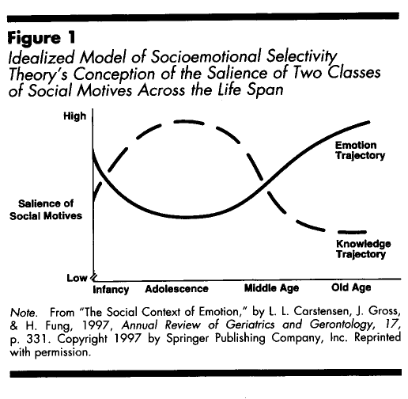
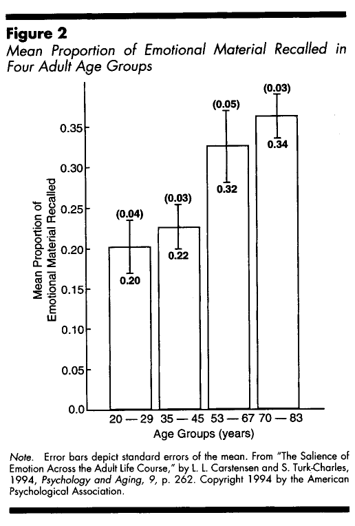

# Taking Time Seriously: A Theory of Socioemotional Selectivity

> Laura L. Carstensen · Stanford University
> Derek M. Isaacowitz · University of Pennsylvania
> Susan T. Charles · Stanford University

> American Psychologist, 54(3), 165–181 (1999) · https://doi.org/10.1037/0003-066X.54.3.165

## Abstract

Socioemotional selectivity theory claims that the perception of time plays a fundamental role in the selection and pursuit of social goals. According to the theory, social motives fall into 1 of 2 general categories—those related to the acquisition of knowledge and those related to the regulation of emotion. When time is perceived as open-ended, knowledge-related goals are prioritized. In contrast, when time is perceived as limited, emotional goals assume primacy. The inextricable association between time left in life and chronological age ensures age-related differences in social goals. Nonetheless, the authors show that the perception of time is malleable, and social goals change in both younger and older people when time constraints are imposed. The authors argue that time perception is integral to human motivation and suggest potential implications for multiple subdisciplines and research interests in social, developmental, cultural, cognitive, and clinical psychology.

> I often feel that death is not the enemy of life, but its friend, for it is the knowledge that our years are limited which makes them so precious.—Rabbi Joshua L. Liebman (1961, p. 106)

> Editor's note. Denise C. Park served as action editor for this article.

> Author's note. Laura L. Carstensen and Susan T. Charles, Department of Psychology, Stanford University; Derek M. Isaacowitz, Department of Psychology, University of Pennsylvania. Work on this article was supported by National Institute on Aging Grant RO1-8816. We are greatly indebted to Helene Fung and Eleanor Maccoby for their comments on drafts of this article. Correspondence concerning this article should be addressed to Laura L. Carstensen, Department of Psychology, Stanford University, Stanford, CA 94305-2130.

The monitoring of time is so basic to human functioning that it was likely instrumental in the evolution of human thought and cognition (Suddendorf & Corballis, 1997). Markings engraved in ancestral bones dating back to the Ice Age reflect systematic recordings of a lunar calendar (Marshack, 1972), and the sophistication of Aztec sundials reveals that time has been interwoven into the social and political fabrics of societies for centuries (Aveni, 1995). Although cultures clearly differ in their treatment of time, such as the tempo with which life is lived (Levine, 1997), a basic awareness of time is ubiquitous in all known cultures and peoples. Scholars of theoretical physics, anthropology, astronomy, and philosophy have written extensively about people's perception of time; in contrast, psychologists have remained conspicuously silent on the topic. This is not to say that tacit conceptions of time have been absent in social science. On the contrary, psychologists have studied the influence of historical periods on human development (Elder & Clipp, 1994; Elder, Pavalko, & Hastings, 1991), life-stage effects on values and attitudes (Sears, 1981), cultural differences in the social norms pertaining to time (Jones, 1988), and individual differences in time orientation (Gonzalez & Zimbardo, 1985). To the extent that chronological age is an index of the passage of time, the entire subdiscipline of developmental psychology is inherently organized around this concept. Yet, if one really takes time seriously and acknowledges that time provides the structure from which people plan and implement all short- and long-term goals, the implications for psychology are far-reaching and have been largely ignored (Birren & Cunningham, 1985). People are always aware of time—not only of clock and calendar time, but of lifetime. Biologist John Medina (1996) wrote,

> When contemplating life we inevitably assume the presence of an internal clock. Wound to zero at birth, it incessantly and inherently ticks away during our entire terrestrial tenure. So solid are these concepts in our mind that we have coined the term, "life span" to denote its boundaries, (p. 9)

As people move through life they become increasingly aware that time is in some sense "running out." More social contacts feel superficial—trivial—in contrast to the ever-deepening ties of existing close relationships. It becomes increasingly important to make the "right" choice, not to waste time on gradually diminishing future payoffs. Increasingly, emotionally meaningful goals are pursued. In the following pages we argue that the perception of time as constrained or limited as opposed to expansive or open-ended has important implications for emotion, cognition, and motivation. In particular, we argue that the approach of endings is associated with heightened emphasis on feelings and emotion states. Activities that are unpleasant or simply devoid of meaning are not compelling under conditions in which time is perceived as limited. Interest in novel information, because it is so closely intertwined with future needs, is reduced. Instead, when endings are primed people focus on the present rather than on the future or the past, and this temporal shift leads to an emphasis on the intuitive and subjective rather than the planful and analytical. The argument we make herein is that a temporal emphasis on the present increases the value people place on life and emotion, importantly influencing the decisions they make.

Subsequently, we argue that the perception of time is inevitably linked to the selection and pursuit of social goals. Our arguments are grounded in socioemotional selectivity theory (Carstensen, 1991, 1993, 1995, 1998; Carstensen, Gross, & Fung, 1997), which is a life-span theory of social motivation in which the perception of time plays a central role in the prioritization of social goals and subsequent preferences for social partners. Because chronological age is inextricably and negatively associated with the amount of time left in life, age-related patterns do emerge, but even these age patterns can be altered when individuals adopt a time perspective different from what is predicted by their place in the life cycle.

In the following pages, we overview socioemotional selectivity theory and describe a program of empirical research that tests its postulates. Because we believe that time is fundamental to human motivation, we then consider the broader implications that boundaries on time may have for theory building and research in psychology.

## Socioemotional Selectivity Theory

### General Tenets of the Theory

Socioemotional selectivity theory addresses the role of time in predicting the goals that people pursue and the social partners they seek to fulfill them. Three presumptions underlie the theory. First, the theory adopts as axiomatic the belief that social interaction is core to survival, with predispositions toward social interest and social attachment having evolved over the millennia. Second, it considers humans to be inherently agentic and to engage in behaviors guided by the anticipated realization of goals (Bandura, 1982, 1991, 1997). Third, it presumes that because people simultaneously hold multiple—sometimes opposing—goals, the selection of goals is a precursor to action. Socioemotional selectivity theory maintains that the view of time as expansive or limited influences the appraisal process that precedes goal selection.

Over the years, different motivation theorists have posited different sets of "basic" human needs or goals that instigate action (Deci & Ryan, 1991; James, 1890; Maslow, 1968; Ryan, 1991, 1993; White, 1959). Socioemotional selectivity theory is less concerned with which goals are essential than with how social goals function to direct behavior. According to the theory, diverse social goals, ranging from seeking the answer to a question about the weather to seeking emotional comfort, can be classified into one of two broad functional categories: those related to the acquisition of knowledge and those related to the regulation of emotion.

A tremendous amount of social behavior is motivated by the pursuit of information. Contact with other people provides a primary source of knowledge. Observations of others and direct instruction from them play a central role in human survival. Indeed, the intergenerational transmission of language, values, and culturally shared mental representations are accomplished largely through social means (D'Andrade, 1981; Shweder & Sullivan, 1990). Knowledge acquisition through social contact is typically necessary to master even nonsocial skills. And familiarizing oneself with a broad spectrum of people allows individuals to understand the social climate, come to know their own likes and dislikes, and begin to make evaluative comparisons of themselves in relation to others. Thus, the category of knowledge-related goals refers to acquisitive behavior geared toward learning about the social and physical world.

The category of emotion motives refers in its broadest sense to the regulation of emotional states via contact with others. As Rothbart (1994) states "from the earliest days, emotion is regulated by others, and many of our emotions and cognitions about emotion [are] developmentally shaped in a social context" (p. 371). Along with attempts to avoid negative states and experience positive ones (Higgins, 1997; Tomkins, 1970), the category of emotion motives also encompasses the desire to find meaning in life, gain emotional intimacy, and establish feelings of social embeddedness.

According to the theory, knowledge- and emotion-related goals together comprise an essential constellation of goals that motivates social behavior throughout life. On a day-to-day basis, social goals compete with one another, and often emotional goals vie with knowledge-related ones. Seeking information, for example, may entail emotional risks. A scientist interested in critical feedback from a colleague may expect to feel disheartened by it but will pursue the feedback nonetheless. In our culture, maintaining a satisfying relationship with an intimate partner typically requires that one refrain from seeking novel intimate experiences. In addition, although people are motivated in certain circumstances to seek confirmatory evidence of their self-views, the same people in other circumstances are motivated to disconfirm self-relevant views in order to stimulate growth. Even though the desire to experience positive emotions clearly motivates much behavior (Higgins, 1987, 1997), in some cases, social contact is pursued precisely because it elicits aversive emotions that motivate achievement in some other domain (Norem & Cantor, 1986). When knowledge-related goals compete with goals involving the regulation of emotions, the relative importance of the two goals is weighed, and action is taken or not taken accordingly.

The cardinal tenet of socioemotional selectivity theory is that the assessment of time plays a critical role in the ranking and execution of behaviors geared toward specific goals. Cognitive appraisal of time assists people in balancing long- and short-term goals in order to adapt effectively to their particular circumstances. An expansive future is associated with the pursuit of knowledge-related goals. The young boy talks to his older cousin about college, not because the information is relevant to him at the moment, but because it may become so at some point in the future.

The student arriving for her first year at college finds a wide range of social partners appealing and invests much time and energy in making new friends. The young newlywed couple spends considerable time trying to discover ways to solve problems in their relationship because solutions will allow them to avoid future conflicts. The theory predicts that future-oriented goals such as these will be adaptively prioritized when the future is perceived as expansive, and that this will be the case even when knowledge-related goals entail the delay of emotional rewards or emotional costs.

When the conclusion of the appraisal process is that time is limited, the acquisitive mode associated with unlimited time is transformed into a more present-oriented state. Present orientation is likely to involve goals related to feeling states, deriving emotional meaning, and experiencing emotional satisfaction. Relieved of concerns about the future, attention shifts to experiences occurring in the moment. When emotion regulation is the primary goal, people are highly selective in their choice of social partners, nearly always preferring social partners who are familiar to them, because with these partners emotions are predictable and often quite positive. Moreover, when time is limited social interactions are navigated carefully in order to ensure that their emotional quality is high. In contrast to the young couple described above, the elderly couple often decides to accept their relationship as it is, to appreciate what is good, and ignore what is troubling, rather than seek new solutions to problems. The college senior approaching graduation is uninterested in meeting new students and instead shows strong preferences for spending time with her best friends. And sadly, the young boy living in a crime-ridden neighborhood who believes that he will not live past the age of 20 is decidedly uninterested in conversations about college. According to the theory, he will pursue present-oriented goals, perhaps by establishing strong social bonds through gang membership. Like the older person, he perceives his future as largely irrelevant and focuses his attention on the present.

Clearly, the two classes of social goals described in socioemotional selectivity theory do not reflect absolute, nonoverlapping categories. First, there is an emotional component to all goal-directed behavior (Zajonc, 1997); even the accounting process by which informational goals are selected involves valenced evaluations of prospective targets. Therefore, any distinction among goals in which some are classified as emotional and others are classified as nonemotional is, in some ways, problematic. We do not dispute that there is an emotional component to information seeking or that, conversely, there are elements of information seeking in the pursuit of emotional goals. Clearly, there are. Second, there is ample evidence that when information holds relevance to the immediate situation, it will be sought regardless of temporal orientation (e.g., Turk-Charles, Meyerowitz, & Gatz, 1997). For example, a hungry person who perceives the future as limited will nonetheless speak to a waiter in a restaurant.

Rather, the delineation of social goals suggested by socioemotional selectivity theory concerns those that are primarily oriented to gaining knowledge or preparing for the future and those that are primarily aimed at satisfying emotional needs. Another way to think about the distinction is that one class of goals is related to preparedness and one to satisfaction in the moment. Interest in an attractive stranger, although likely to involve both positive and negative emotions (e.g., happiness and anxiety), is acted on primarily because of future possibilities. The potential emotional satisfaction that may result from contact remains largely unknown. We expect that much heterosocial contact in adolescence is governed more by excitement or the thrill of novelty than by emotional satisfaction. Young people may embark on an exploration of potential mates, for example, in order to find out what other people are like in this type of relationship. Such behaviors are far from unemotional, but the core motive underlying action is not a search for emotionally meaningful experience. Thus, although "knowledge-related" and "emotional" may be imperfect labels for motivations, we argue that the underlying heuristics point to coherent streams of behavior aimed at realizing goals and, more important, allow for complex human behavior to be distinguished on functional grounds such that useful predictions can be made.

### Theoretical Relevance to Life Span Development

Human aging, inherently chronicled by the passage of time, provides an ideal ground for exploring differences in time perspective. Empirical studies suggest that people do carry with them diffuse expectations about the relatively expansive or limited future that awaits them. In our laboratory we have collected questionnaire data from highly diverse samples spanning adolescence through very old age that document clear associations between age and perceived time left in life (Carstensen & Lang, 1997a). Older people relative to their younger counterparts describe their futures as limited and recognize that they do not have "all the time in the world" left to pursue their goals. We expect that the monitoring of time occurs regularly at an unconscious level and is also primed acutely on a periodic basis by discrete events that mark time, such as a child's wedding or a friend's death.

Although research shows that older people consider the past as the time of greatest activity and potency in contrast to younger people's anticipation of future development (Shmotkin, 1991; see also Cross & Markus, 1991; Heckhausen, Dixon, & Baltes, 1989), the primary age difference in time orientation concerns not the past but the present. Older people are mostly present-oriented, less concerned than the young with the far distant future (Fingerman & Perlmutter, 1995). They do not dwell on the past, however, as popular stereotypes suggest.¹ Rather, more than other age groups, they focus on the here and now.

Socioemotional selectivity theory suggests that age-related differences in the anticipated future lead to developmental trends in the ranking of knowledge-related and emotional goals. The knowledge trajectory starts high during the early years of life and declines gradually over the life course as knowledge accrues and the future for which it is banked grows shorter. The emotion trajectory is high during infancy² and early childhood, declines from middle childhood throughout early adulthood, and rises from later adulthood into old age as future-oriented strivings become less relevant.

Because knowledge strivings are so important from late adolescence to middle adulthood, they are pursued relentlessly even at the cost of emotional satisfaction. By late adolescence and early adulthood, the regulation of feeling states is relegated lower status than acquiring knowledge. During this period of life, the exploration of the world demands emotional resilience in the face of failures and social rejections. Later in life, however, goals that are satisfied by the resulting "feeling" state are more likely to be pursued because they are experienced in the here and now, a valuable commodity in the face of limited time. Figure 1 provides the idealized trajectories of knowledge-related and emotional goal salience across the life span.

Figure 1. Idealized Model of Socioemotional Selectivity Theory’s Conception of the Salience of Two Classes of Social Motives Across the Life Span. Note. From “The Social Context of Emotion,” by L. L. Carstensen, J. Gross, & H. Fung, 1997, Annual Review of Geriatrics and Gerontology, 17, p. 331. Copyright 1997 by Springer Publishing Company, Inc. Reprinted with permission. Accessibility description: The vertical axis runs from low to high salience of social motives; the horizontal axis runs from infancy through adolescence and middle age to old age. The emotion trajectory is high in infancy, lower across adolescence and middle age, and higher again in old age. The knowledge trajectory rises from infancy, remains high through adolescence and middle age, and declines toward old age.

Finally, socioemotional selectivity theory predicts that endings are associated with qualitative changes in emotional experience. In part, this is the consequence of increasingly selective social partner choices and engagement in smaller, but more emotionally meaningful, social networks (Carstensen et al., 1997). By shaping the social world, negative emotional responses can be avoided and positive ones optimized. This form of emotion control, referred to in the literature as "antecedent regulation of emotion" (see Gross, in press), is arguably the most effective way to manage emotional experience at any age, but theoretically improves over time. Older people not only interact with fewer people, they interact primarily with people who are well-known to them (Field & Minkler, 1988). In old age, people's inner social circles are composed primarily of old friends and family members. Kahn and Antonucci (1980) refer to the handful of significant others who accompany individuals through life as "social convoys." In old age, social convoys knit individuals into kin and friendship networks with unmatched capabilities to affirm the sense of self and provide support in times of need (Antonucci, 1990, 1991; Antonucci & Akiyama, 1997; Antonucci & Jackson, 1987). Moreover, the life-long history of support exchange in long-term relationships can allow even the very frail older person to feel needed by others (Carstensen & Lang, 1997b). In short, the predictability of interactions with familiar social partners permits people to better navigate difficult social transactions, to more reliably elicit positive emotions, and to obtain a sense of social embeddedness and meaning in life.

In addition, the theory suggests that the knowledge that time is limited has direct effects on emotional experience. Appreciation of the fragility of life, recognition that the passage of time cannot be stopped, and heightened awareness of one's immediate surroundings directly alters the experience of emotion.³ We also expect that, relieved of concerns for the future, endings bring out the best qualities in people; kindness becomes a more prominent feature of social exchanges during graduations, funerals, or retirements. As people approach the ultimate ending—death—lives are evaluated, and a search for existential meaning in life places emotion at center stage.

We have conducted several lines of research and used a variety of research methods to test postulates from the theory. In keeping with theoretical and empirical links between time perspective and chronological age, much of this research has considered age a proxy for time left in life. Over the years, however, we have made repeated attempts to decouple age from time, by drawing on studies of naturally occurring subgroups (e.g., young people living with a terminal illness) and by using experimental methods to tease apart the effects of age and time. In the following section, we describe our program of empirical research. It is organized around four general research themes that reflect central postulates of socioemotional selectivity theory: (a) life-cycle differences in the salience of emotion, (b) age differences in the regulation of emotion, (c) age differences in social network composition, and (d) social preferences under conditions characterized by limited or expansive time.

> Footnote 1. Past orientation is associated with depressive symptoms (e.g., Holman & Silver, 1998), but age is not reliably associated with past focus.

> Footnote 2. In very early childhood, limited cognitive capacity precludes the appreciation of abstract concepts of time. Subsequently, the type of goal competition predicted by the theory is minimal. Infants are highly motivated by both knowledge-related and emotional goals.

> Footnote 3. Some previous research on time perspective associates present orientation, and the concomitant failure to delay gratification, with hedonism (Gonzalez & Zimbardo, 1985). However, these studies measure time orientation within a relatively narrow time period; for example, will a person study today or tomorrow? In contrast, "time" as construed in socioemotional selectivity theory spans the life course. Although an emphasis on the present is common to both, present orientation activated by awareness of mortality leads to mixed emotional reactions, such as poignancy, as opposed to hedonism.

## Empirical Findings From Socioemotional Selectivity Theory

### The Salience of Emotion as People Approach the End of Life

A central postulate of socioemotional theory is that the salience of particular social goals is influenced by the perception of time. According to the theory, open-ended time is associated with the pursuit of knowledge, and constraints on time are associated with the prioritization of emotional goals. Such changes are presumed to be evident in the ways that people think about social partners and the relative attention paid to emotion in cognitive operations. Below we summarize findings from three studies that examined the cognitive dimensions along which people mentally represent social partners and the relative weights placed on these dimensions at different points in the life cycle. At the close of this section, we also report findings from a study of age differences in incidental memory for social narrative.

#### Mental Representations of Social Partners

We recognized early on in our research that we needed to obtain evidence that the goal dimensions posited in socioemotional selectivity theory are actually evident in people's thinking about social partners (Fredrickson & Carstensen, 1990). Because direct questions about social goals (e.g., Would you learn something new by interacting with your mother?) pose serious concerns about demand characteristics, we developed an experimental procedure based on similarity judgments. By asking people to classify various social partners on the basis of perceived similarities, we were able to explore the cognitive dimensions that people use to make such judgments.

This experimental approach also allowed us to examine the relative weights placed on specific cognitive dimensions by different groups of people. In two studies we examined age differences in samples that included participants as young as adolescents and as old as octogenarians. Samples in both studies spanned a similar age range, but the second was far more representative than the first in that it was constructed such that men and women, blue- and white-collar workers, and African and European Americans were evenly distributed across the targeted age range (Carstensen & Fredrickson, 1998). Together, these first two studies allowed us to examine both the reliability and generalizability of cognitive dimensions and their salience in different age groups.

The third sample differed importantly in that age was held constant across subsamples. In each subsample, the average age was 37 years, and all participants were male. However, each subsample differed by HIV status (Carstensen & Fredrickson, 1998). One subsample was HIV-negative, another HIV-positive but asymptomatic, and a third subsample was HIV-positive and actively experiencing symptoms of AIDS. Therefore, each subsample was comparably aged, but differed in life expectancy, allowing us to examine closeness to the end of life independent of the experience factor that typically confounds chronological age with place in the life cycle. Put differently, the first two samples allowed us to examine mental representations as a function of time since birth. The third sample allowed us to examine the same questions as a function of time until death. In all three studies, we predicted that identified cognitive dimensions would reflect emotional and knowledge-related qualities of others and that closeness to the end of life would be associated with greater emphasis on the emotional as opposed to the knowledge-related dimension.

The experimental procedures were identical in each study. Research participants were presented with a set of 18 cards, each of which described a particular type of social partner. The set of social partners was designed to span a broad spectrum of people, some of whom are likely to provide novel information in the course of social interaction (e.g., the author of a book you've read) and others who are more likely to yield emotional payoffs (e.g., a close friend). Participants were asked to sort the cards into as many or as few piles as they wished according to how similarly they would feel interacting with the person described on the card. After participants classified prospective social partners on the basis of similarity judgments, data were submitted to multidimensional scaling analysis, which revealed the dimensions along which people sorted the cards.

The same three dimensions accounted reliably for most of the variance in the mathematical solution in each study. The first dimension clearly represented a valenced (i.e., good-bad) dimension, which we labeled the "affective potential" of the social partners described on the cards. Both additional dimensions were consistent with knowledge-related qualities of the social partners: One was interpreted as "future contact" and the other as "information-seeking." Thus, people do indeed appear to think about others in terms of the trajectories posited in the theory.

More pertinent to the study hypotheses were group differences in the degree to which these dimensions governed their classifications. We found that successive age groups placed increasingly greater emphasis on the affective potential of social partners, whereas younger adults weighted the three dimensions fairly evenly. Not only was this true for the overall study samples, but within the samples the patterns held for men and women, blue- and white-collar workers, and African and European Americans. Moreover, in our study based on HIV status, the profile of findings paralleled those from our age-based samples. HIV-positive, symptomatic, male participants represented prospective social partners nearly exclusively along affective dimensions, just as our oldest participants did in our previous studies. We drew two conclusions from this series of studies. First, the goal categories posited in socioemotional selectivity theory are reliably reflected in people's thinking about others, and second, the importance of emotion in these assessments is more central in people nearing the end of life.

#### Memory for Social Narratives

If emotion is more salient to older as compared with younger adults, older adults may process emotional information more deeply and subsequently remember it better than nonemotional information. Using an incidental memory paradigm, we explored the type of information older and younger people recall about an emotionally charged social interaction (Carstensen & Turk-Charles, 1994). In light of well-documented age differences in memory performance (Smith, 1996), we did not predict that older adults would remember more emotional information than younger adults. Rather we predicted that of the material remembered, proportionately more would concern emotional aspects of the situation.

We recruited a sample of research participants aged 20 to 83 years and asked them to read a two-page selection drawn from a popular novel. At the end of an experimental hour in which participants completed other unrelated questionnaires, they were asked to recall all that they could about the story. Responses were transcribed and classified as emotional or nonemotional. We calculated the proportion of emotional to nonemotional information and examined its relationship to age. As depicted in Figure 2, the proportion of emotional material recalled increased with age. Each successive age group recalled proportionately more emotional material than nonemotional information from the narratives.

Figure 2. Mean Proportion of Emotional Material Recalled in Four Adult Age Groups. Note. Error bars depict standard errors of the mean. From “The Salience of Emotion Across the Adult Life Course,” by L. L. Carstensen and S. Turk-Charles, 1994, Psychology and Aging, 9, p. 262. Copyright 1994 by the American Psychological Association. Accessibility description: Mean proportions (standard errors in parentheses) were .20 (.04) for ages 20–29, .22 (.03) for ages 35–45, .32 (.05) for ages 53–67, and .34 (.03) for ages 70–83.

All told, the above findings suggest that emotion is an important dimension along which people consider others across adulthood. Findings also suggest that emotional qualities of others assume greater importance in mental representations about social partners and in memory about social interactions among increasingly older age-cohorts. A similar profile occurs among subsamples of younger people constructed according to their probable life expectancies; closeness to the end of life is related to the prominence of emotion in mental representations. The striking similarity between the profile of older adults and the profile of younger adults approaching death challenges a purely developmental account of change and implicates the approach of an important ending in the instigation of cognitive shifts.

### Age Differences in the Regulation of Emotion

Evidence that emotion is more prominent in social cognitive processing in groups of people nearing the end of life is consistent with socioemotional selectivity theory's contention that emotion and emotional goals are increasingly important as people approach endings. To the extent that greater value is placed on emotionally meaningful goals, there also should be a concomitant enhancement of emotional experience and, very likely, better regulation of emotional experience (see Carstensen & Charles, in press). That is, more investment in emotional goals should be related to more resource allocation to these goals. We argue that as people approach endings, they pay more attention to the emotional quality of social exchanges and engage in strategic attempts to optimize emotional aspects of important social relationships. In everyday terms, awareness of limited time provides the sense of perspective that softens the experience of negative emotions (why get angry now?) and enhances the appreciation of positive aspects of life. The sense that "this may be the last time" changes emotional reactions to positive and negative social exchanges.

We do not believe that this occurs only as people approach the end of life. On the contrary, the theory suggests that this experience is common. We expect that saying your last goodbyes to a friend (even if the friendship has been rocky), or approaching graduation or retirement, should also be characterized by efforts to make the experience emotionally positive. Yet, old age is the life stage where potential "last times" are ubiquitous, and thus the theory makes clear predictions about emotional functioning during the last stage of life.

Although emotion in old age has been decidedly understudied, diverse evidence from a number of laboratories is beginning to converge to suggest that people function very well in emotional domains of life in the later years. Studies examining social reasoning and decision making are suggestive of improved understanding of basic emotion states well into adulthood as well as better integration of emotion into cognitive processing (Blanchard-Fields, 1986; Labouvie-Vief, DeVoe, & Bulka, 1989; Labouvie-Vief, Hakim-Larson, DeVoe, & Schoeberlein, 1989). Mood inductions under controlled laboratory conditions result in subjective experiences that are comparably intense for younger and older adults (Levenson, Carstensen, Friesen, & Ekman, 1991), but older people nevertheless report superior self-regulation of emotion, including decreased lability and surgency and better control over negative emotions (Lawton, Kleban, Rajagopal, & Dean, 1992).

Although there have been no longitudinal studies of emotion regulation, leaving open the possibility that cohort differences are responsible for age differences, Gross et al. (1997) recently reported findings from a project based on multiple samples including Norwegians, Catholic nuns, African Americans, Chinese Americans, and European Americans. Across these diverse samples, older people reported better control of emotion, and consistent with Lawton et al.'s (1992) earlier report, older adults in all samples reported fewer negative emotions. Thus, if cohort accounts for generational differences in the perceived regulation of emotion, they are surprisingly widespread. Finally, the self-reported reduction in surgency (Gross et al., 1997; Lawton et al., 1992) finds convergent support from studies in which autonomic reactivity is measured directly during emotional episodes; older people display relatively lower levels of physiological activity during mood inductions and while engaging in discussions of emotionally charged topics (Levenson et al., 1991; Levenson, Carstensen, & Gottman, 1994). All told, empirical research on emotion and aging suggests that emotional functioning is at the least well-preserved in old age, and may even improve.

In an effort to understand the dynamics of emotional exchanges among intimates at different ages, Carstensen and two colleagues, John Gottman and Robert Levenson (1995; see also, Levenson, Carstensen, & Gottman, 1993, 1994), conducted a study of middle-aged and older couples who had been married for many years. After an initial screening to ensure that both happy and unhappy couples were included in both age groups, couples completed a number of questionnaires about married life. They indicated the degree to which various issues presented problems in their relationships (e.g., finances, children, in-laws) and the degree of pleasure they derived from other activities along with a variety of instruments that assessed emotional and physical health. Couples were then observed while they discussed a conflict in their relationship. After an experimenter helped couples agree on a conflict appropriate for discussion (e.g., both parties had to agree it was a conflict), they were left alone in a room equipped with remote cameras and asked to discuss the conflict for 15 minutes. Throughout the interaction, cameras recorded the interaction, and physiological activity was monitored as couples discussed conflictual aspects of their relationships.

Subjective evaluations and direct observations of discussions both pointed to superior emotion regulation in older couples. By self-report, the conflicts in a number of domains (e.g., finances, children, and so on) were less severe in older as compared with middle-aged couples; it is important to note that this was true even for unhappily married couples. Moreover, older couples reported that they derived greater pleasure than middle-aged couples in four arenas: talking about children and grandchildren, doing things together, taking vacations, and "dreaming." Thus, compared with middle-aged couples, older couples reported experiencing less conflict and taking greater pleasure in their marriages (Levenson et al., 1993).

However, this project went beyond self-reported evaluations of the relationships we studied. The videotaped discussions of conflict provided a rich source of observational data. Coding of specific affects revealed direct evidence for emotion regulation. Even after controlling for marital satisfaction, older couples, compared with their middle-aged counterparts, expressed lower levels of anger, disgust, belligerence, and whining. Moreover, they were more likely than middle-aged couples to express affection to one another, even as they discussed a problematic aspect of their relationship. Older couples were not less involved in the task; they displayed levels of tension and domineeringness similar to those of middle-aged couples. Rather, they interwove expressions of affection along with expressions of discontent (Carstensen et al., 1995; Carstensen, Graff, Levenson, & Gottman, 1996).

Previous research, our own included, suggests that where there are differences, older people experience fewer negative emotions and have greater control over their emotions in everyday life. Our observational research on married couples is certainly consistent with these reports. Still, the bulk of the evidence in the literature relies on self-reports, which are susceptible to distortion as a function of demand characteristics and implicit theories about what behavior "should be like" at different life stages. Very recently, we completed a project designed to sample emotions in everyday life (Carstensen, Pasupathi, & Mayr, 1998). The experience sampling method we adopted allowed us to examine emotional experience and regulation without asking participants for global judgments about regulatory control.

We recruited a sample spanning the ages of 18 to 95 years to participate in a study of emotions in everyday life.

We used an experience sampling technique that required participants to carry electronic pagers for a one-week period and to record their emotions each of 35 times they were paged. At random times, throughout the days and evenings, participants were paged. Each time they were signaled, they indicated which emotions they were experiencing and how intensely they were felt on a response sheet that listed 19 emotional states. Both positive and negative states were represented on the response sheet; some were basic emotions, like anger and sadness, and others were mood states, like anxiety or jealousy. At the end of each day, participants mailed their response sheets back to the laboratory for coding.

We tested several hypotheses about aging and emotion, based on socioemotional selectivity theory's general contention that emotional experience is optimized and better regulated in old age. We postulated that the frequency of positive emotions would be comparable across age groups, but the frequency of negative emotional experience would decline. Our findings showed that positive emotions are maintained in both frequency and intensity across adulthood. Negative emotions decline in frequency, but not intensity. This age trend persists across adulthood until very old age, at which point negative emotions do occur somewhat more frequently. At no point in old age, however, are negative emotions experienced more often than in young adulthood.

We examined the regulation of emotion by computing conditional probabilities that an emotion would occur given that it occurred on the previous page. Here we found that the natural duration of positive emotional experience is similar for old and young, but the duration of negative emotions, as indexed by conditional probabilities, is lesser for older as compared with younger adults.

Finally, we explored the postulate that emotional experience is more mixed in older as opposed to younger people. In day-to-day life, people frequently experience multiple emotions concurrently in response to an elicitor. Within a matter of seconds, they may feel anger, sadness, and perhaps even some degree of happiness (e.g., satisfaction that the villain has shown his true colors). Socioemotional selectivity theory predicts that emotional experience becomes more multifaceted with age because limited time changes the character of positive emotions and negative emotions. We tested this hypothesis in two ways. First, we computed the simple correlation between positive emotional experience and negative emotional experience and then assessed the degree to which positive and negative emotions are experienced simultaneously as a function of age. We found that the association increases with age. Second, we computed a factor analysis for each participant based on the 35 data points obtained during their participation. We then computed the correlation between age and the average number of factors that typified participants' responses. We reasoned that more differentiated experience would result in more factors, whereas less differentiated experience would result in fewer factors. Once again, the number of factors characterizing participants' emotional experiences was positively associated with age.

In summary, empirical evidence accrued during the past decade paints a distinctly positive picture of aging in the emotion domain. The theoretical postulate that emotion is better regulated at the end of life is supported in studies based on self-report, observational, and experience sampling methods. Improved emotion regulation with age, though interestingly inconsistent with the adulthood trajectory of cognitive functioning, is not terribly surprising. Experience, no doubt, plays a role in the regulation of emotion. However, if based purely on experience one might predict improvement through direct suppression of emotion or, alternatively, through emotional withdrawal. When experienced, however, negative and positive emotions are felt just as intensely among young and old. The principle age differences involve the frequency of negative emotional experience and the complexity of emotional experience. Anger is intertwined with affection; happiness and sadness are more likely experienced in the same moment. Far more research is needed to establish the reliability of these preliminary findings and the viability of our interpretations. Age differences in emotional experience are consistent, however, with theoretical predictions about the way that emotion may change under conditions that limit time. These findings, in conjunction with those described in the previous section, suggest that emotion is not only more salient when time in life is limited, but that the quality of these experiences may change as well.

### Life Cycle Differences in the Composition of Social Networks

To the extent that mental representations of others and the prioritizing of emotion goals reflect social preferences, such preferences have implications for social networks. Socioemotional selectivity theory predicts that, ideally, older people have relatively small social networks concentrated with social partners who are most likely to provide a social climate in which they feel validated and loved. In contrast, younger people have relatively larger, more diverse social networks that include a high proportion of relatively novel social partners.

Age differences in social network size have been well-documented in social gerontology. Longitudinal and cross-sectional studies reveal far smaller social networks among older as compared with younger people (Lee & Markides, 1990; Palmore, 1981). Most theorizing about this highly reliable difference has focused on age-related losses, such as poor health, deaths of social partners, and ageist societal practices that limit access to other people (Havighurst & Albrecht, 1953). One highly influential model—disengagement theory—suggested that reduced social contact stems from the mutual, emotional withdrawal of individuals from societies (and societies from them) in symbolic preparation for death (Cumming & Henry, 1961). The motivational approach we have adopted, however, construes people as active agents who construct social worlds to match their social goals. In contrast to both disengagement theory, which suggests that people withdraw most from those closest to them, and explanations that hold social and physical barriers responsible for reduced social network size, we hypothesized that people systematically hone their social networks such that available social partners satisfy emotional needs. At the time we began our research on social networks, virtually all of the published research focused on comparisons of overall network size, typically between middle and old age. Given that losses do accumulate across this period of life, attributing age differences to loss was certainly reasonable; loss must play a role to some degree. Nevertheless, proactive processes may also contribute. Socioemotional selectivity theory suggests that goal trajectories change gradually across adulthood. If age differences in network size reflect the culmination of lifelong selection processes, evidence should be apparent relatively early in adulthood.

A study was designed to assess potential changes in social contact from early to middle adulthood (Carstensen, 1992) that involved the reanalysis of longitudinal data from the Child Guidance Study (MacFarlane, 1938). In 1930, MacFarlane selected a sample of infants whom she (and subsequently others) followed into adulthood, assessing and reassessing their status at regular time intervals. In adulthood, the participants in the Child Guidance Study were interviewed four times, at ages 18, 30, 40, and 50 years. Interviews addressed participants' satisfactions and sorrows associated with various types of social partners, ranging from acquaintances to close friends and relatives. Interviews also included questions about the frequency of contact with specific types of social partners. Thus, these data allowed the life course charting of a spectrum of relationships, some of which had considerable potential to provide novel information (e.g., acquaintances) and others which offered the potential for emotional satisfaction (e.g., intimates). We hypothesized that contact with acquaintances would decline over time, whereas contact with intimates (e.g., spouses, parents, children) would remain stable or increase.

As predicted, rates of interaction with acquaintances declined from early to middle adulthood, as did participants' satisfaction with remaining contact with acquaintances. Across the same years, however, interaction rates with spouses, parents, and siblings were maintained or increased. In other words, reductions in contact appeared to begin long before age-related loss could be the cause, and reductions were restricted to acquaintances. The picture that emerged was consistent with a selection process that begins by early adulthood, excludes novel social partners, and maintains emotionally close ones.

Returning to a consideration of old age, we conducted a cross-sectional comparison of the social networks of old and very old adults (Lang & Carstensen, 1994). Theoretically, selectivity should be greatest in old age because this is the time in life when endings are most salient. Our target sample was a representative group of old and very old people recruited to participate in the Berlin Aging Study (P. B. Baltes, Mayer, Helmchen, & Steinhagen-Thiessen, 1993). Research participants ranged in age from 69 to 104 years. Our results indicated that the oldest participants had fewer social partners compared with relatively younger participants. However, independent consideration of close and less close social partners revealed an interesting pattern. The number of peripheral social partners was greatly reduced among the very old compared with the young-old, yet there was little difference in the number of emotionally close social partners they reported. Even among the very old, the number of social partners identified as part of the participants' "inner circle" was virtually the same as it was among adults as much as 30 years their junior. In a subsequent study based on the same sample, we examined potential differences in selectivity as a function of personality and family status and found that the selectivity effect held across these individual difference variables (Lang, Staudinger, & Carstensen, 1998). Although the design of this cross-sectional comparison prohibits conclusions about developmental change, findings are consistent with a longitudinal analysis of a smaller sample of participants across a comparable time frame (Field & Minkler, 1988) and, moreover, fit well into the larger profile of findings generated by socioemotional selectivity theory.

In summary, research on social networks suggests that there are systematic age differences, not only in social network size, as have been reported repeatedly over the years, but also in composition. Across adulthood, an increasingly larger percentage of the total network is occupied by emotionally close social partners. This change begins far too early in life to consider loss the exclusive explanation, and because emotionally close social partners are systematically retained in the process, emotional disengagement is not likely the cause. We interpret these findings as evidence for a proactive pruning process that selectively emphasizes emotionally close social partners and disregards more peripheral ones as time in life grows increasingly limited.

### Social Preferences as a Function of Time

With the exception of our research on HIV-positive and HIV-negative men, the work described so far treats age as a proxy for time. In this section we describe our experimental attempts to decouple age from time. In these studies, we have found reliably that time, as opposed to age per se, appears to be the critical factor in the age differences in social patterns we have observed.

Psychological theory and research published over the past two to three decades documents well the proactive, agentic nature of human functioning (Bandura, 1987; Ryan, 1993). People do not simply react to environments in which they find themselves; rather the choices that they make contribute actively to the creation of their social worlds. Socioemotional selectivity theory predicts that these choices are influenced by the perception of time. When time is perceived as expansive, social preferences reflect knowledge-related goals. When time is limited, they reflect emotional goals.

Several years ago, Fredrickson and Carstensen (1990) developed an experimental procedure in which social partner preferences were assessed under conditions of limited and open-ended time. Our original objective was to document age differences in social partner preferences predicted by the theory and, further, to assess whether social preferences could be modified by manipulating perceived time. Modified versions of this experimental approach have now been used in four other studies also described below (Fung, Carstensen, & Lutz, 1998).

In our first study we asked research participants aged 11 to 92 years to indicate which of three social partners they preferred under two experimental conditions. We hypothesized that older people, by virtue of age, face limited time and subsequently are likely to pursue emotionally relevant social contact. Younger people, in contrast, are more likely to prefer novel social partners because interactions with these types of social partners are more likely to yield new information. As a result, older people were expected to show a bias for familiar social partners, whereas younger people were not. In keeping with our thinking about the role of time in social goals, however, we also hypothesized that younger people would show a preference for familiar social partners if they perceived time to be limited.

Research participants were asked to choose from among three prospective social partners: (a) a member of their immediate family (the emotionally salient choice), (b) a recent acquaintance with whom they seemed to have much in common (novel partner related to future possibilities and knowledge gain), and (c) the author of a book they had read (novel partner who is a potential knowledge source). Selections were made under two experimental conditions. The first simply required participants to imagine that they had 30 minutes of free time and decided to spend it with another person. The second required participants to imagine a situation in which time was limited due to an approaching geographical move, and to choose again from among the same three social partners.

Our hypotheses were confirmed. Older people showed strong preferences for familiar social partners. This was true under both conditions. In contrast, younger adults' preferences differed by condition. Under open-ended conditions, younger people failed to show a preference for familiar social partners, but in the second condition, in which constraints were placed on time, responses of younger and older participants were indistinguishable.

Subsequently, we completed another study very similar to the first, but instead of an ending condition, participants were asked to imagine a hypothetical situation in which the future was expanded (Fung et al., 1998). The second experimental condition required participants to imagine that they had just received a telephone call from their physician, who had informed them of a new medical breakthrough that would likely add 20 years to their life. In this study, the social preferences of younger people were stable across experimental conditions but responses of older people changed. Once again, under the open-ended condition, which was a straight replication of the first condition in our initial study, social preferences of older people revealed a strong bias for familiar social partners. Under the expanded time condition, however, this bias disappeared. Older people were no more likely than younger people to prefer familiar social partners.

We recently completed two additional studies in Hong Kong (Fung et al., 1998). In one, we conducted a modified replication of our initial study in an Asian culture. We recruited Hong Kong participants aged 8 to 90 years and asked them to choose from among the three social partners listed previously. The first condition involved the selection of social partners under open-ended conditions. The second condition required that participants imagine an approaching emigration before they made their selection. Findings from our U.S. sample were replicated in Hong Kong. Under open-ended conditions, older Hong Kong citizens were more likely than their younger counterparts to select familiar social partners. When a hypothetical ending was imagined, however, younger people also favored familiar social partners.

Later the same year, Hong Kong's political return to the People's Republic of China became increasingly salient around the world, but especially among the people of Hong Kong. Newspaper headlines such as "Can Hong Kong Survive?" implied the certain end of a political era and possibly of a way of life. Calendars sold in Hong Kong in 1997 marked the number of days until the handover. Many Hong Kong citizens reported that they would likely emigrate (Skeldon, 1995). We postulated that this macrolevel political change was producing a sense of anticipated endings in an entire population. Because we had collected evidence about social preferences earlier the same year, we decided to repeat the procedure just four months before the handover. As we predicted, both younger and older adults at this time preferred familiar over novel social partners.

Very recently, we repeated the study again, one year after the handover, expecting that the sense of the Hong Kong "ending" would have passed. As expected, age associations with social preferences at this point in time were indistinguishable from those identified in our surveys one year before the handover. Thus, this set of findings suggests that endings other than death, such as geographical moves or political transitions, may instigate the same kinds of changes in social preferences observed in old age.

Taken as a whole, this body of research supports the contention that the anticipation of time plays an important role in social cognition and social behavior. We argue that socioemotional selectivity represents an adaptive process (see Lang & Carstensen, 1994). When the future is expansive, novel experiences with others are at a premium. Contact with a wide range of people helps individuals to prepare for an unknown future and the myriad experiences and challenges that await them. When time is limited, familiar social partners are valued because they are best able to influence emotional states and are realized immediately during the social exchange. Although, obviously, close social relationships are not uniformly positive, they nevertheless remain the relationships in which emotional support and emotional meaning are most likely to be found.

## Broader Applicability of Time in Psychological Research

Throughout this article, we have outlined theoretical and empirical support for the contention that the perception of time, especially recognition of approaching endings, exerts a reliable influence on human behavior. Much of the research we have reviewed has focused on age differences predicted by the theory on the basis of time's relationship to age. However, in studies where we have eliminated age confounds—as in our study of HIV-infected men or in our experimental studies of time and social preferences—our predictions are also supported, strengthening our contention that time is an important factor in the ranking and execution of social goals. Because people approach endings in many different contexts and at many times during their lives, the remainder of our comments address broader theoretical implications as they apply to different subdisciplines within psychology.

### Implications for Life Span Developmental Psychology

Socioemotional selectivity theory has obvious implications for the study of life span development, many of which we have alluded to above. It bears mentioning, however, that this program of research offers an important alternative to deficit models of aging. Our findings suggest that behavioral changes in old age do not simply reflect efforts to cope with loss, but rather reflect active adaptation to particular circumstances, social niches, and environments, which are inevitably framed by time. In this program of research, age is not construed as a fixed, intractable state; rather aging is conceptualized as providing a set of conditions that frequently alters behavioral, cognitive, and emotional goals and brings to the fore different, but nevertheless basic, human processes that operate throughout life.

Although there is no doubt that people experience an increasingly disproportionate number of losses as compared with gains as they age, and fully expect such changes to occur (Heckhausen et al., 1989), we argue that the program of research we have outlined contributes an important complement to theoretical models that presume age differences reflect the accommodation to actual or even anticipated loss (e.g., Brandtstädter & Greve, 1994; see Carstensen & Freund, 1994). In our theoretical formulation, loss is not a precondition for change; rather many changes reflect proactive shifts due to the salience of different goals at different points in the life cycle. Something in the finite nature of time appears to make life precious, especially as the end nears. Within this framework, age changes may reflect increased appreciation of life rather than despair about loss.

Socioemotional selectivity theory also complements well the model of selective optimization with compensation (SOC) introduced by P. B. Baltes and Baltes in 1990 (see also M. M. Baltes & Carstensen, 1996; P. B. Baltes, 1997). According to SOC, development (or adaptation) throughout life requires three essential processes: selection, optimization, and compensation. Because organisms inevitably pursue some specializations and not others (e.g., language, occupations, social relationships), selection is the cardinal feature of development. Optimization refers to the basic human drive to master environmental and self-related life tasks in a way that maximizes adaptation. Compensation involves the utilization of internal and external resources in order to obtain selected goals. Hence, SOC describes processes that are necessary for the realization of developmental goals.

However, the SOC model does not prescribe or predefine specific criteria or goals of development (M. M. Baltes & Carstensen, 1996). Thus, predictions about the types of goals that are selected, the compensatory strategies that people use, and the nature of optimization are left to domain-specific theories. Socioemotional selectivity theory makes specific predictions in the domains of emotion and social relations. When social endings are approached, the penultimate of which is represented by old age, emotional goals are selected (i.e., assume highest priority) over other goals (e.g., information seeking, making new friends, and so on). When the regulation of emotion assumes greatest priority among social motives, social partners are systematically selected to optimize emotional experience, and social interactions are navigated carefully to maintain an emotionally balanced and meaningful life. By narrowing the range of social partners, older people compensate for reductions in physical and cognitive resources, freeing time and energy to direct toward selected social relationships.

### Implications for Social and Personality Psychology

Of all the subdisciplines in psychology, time perspective has received most attention in social psychology (McGrath, 1988). Unfortunately, research on time in this subdiscipline has been highly instrumental in nature (cf. Freedman & Edwards, 1988) and even at its most philosophical has ignored the fact that time ends (McGrath, 1988). Rather, social psychological consideration of time has focused primarily on individual differences in time perspective among young college students. Moreover, in most of this research, even future and present orientation are operationalized within a relatively limited time frame (e.g., Do you put off until tomorrow what you can do today?). If, as we argue, the perception of time left in life is fundamental to motivation, it has far-reaching implications for the study of social behavior. Certainly, it underscores the inadequacy of the "college sophomore" as the prototype for human behavior. Not only is age correlated with time perspective, the college years are arguably unmatched in their emphasis on future preparedness.

Even in college student samples in which time orientation is inevitably restricted, those who are future-oriented place greater emphasis on goal-directed behavior and engage in a greater number of activities geared toward achieving long-term goals (Murrell & Mingrone, 1994). We expect, however, that the temporal framing of life has more subtle implications for motivation. Perceiving an ending may play an important role in identity processes, such that endings promote greater self-acceptance and less striving toward an abstract ideal. The concepts of past, present, and future selves (Markus & Nurius, 1986; Markus & Wurf, 1987) represent a notable exception in social psychology in that they are embedded within a life-course time frame. Indeed, research on age differences in self-concept suggests that advanced age is related to greater self-acceptance (Cross & Markus, 1991), and discrepancies between "actual" and "ideal" selves are reduced (Ryff, 1991).

Self-completion theory suggests that perceived inconsistencies between personal characteristics and important identity strivings lead to self-symbolizing behavior (Gollwitzer, 1986). For example, an athlete who is told that a personality inventory reveals that she is unlike most other athletes is likely to emphasize her athletic prowess on subsequent experimental tasks. Gollwitzer and his colleagues have demonstrated this effect in an elegant program of research. They interpreted the symbolic behavior as reparative; that is, individuals symbolically overcompensate for the threat by reasserting themselves. It is interesting that Wicklund and Gollwitzer (1981) found that expertise is inversely related to self-symbolizing. They suggest that people who are secure in their self-views are less likely than others to engage in symbolic representations. A slightly different take on the same effect relates to time: Implicit in self-completion theory is the notion that the threat to self has implications for future performance. If the negative predictive value is removed, the same information may not undermine the self at all. Indeed, it may serve to affirm a sense of individuality.

The approach of endings may affect the behavior of people moving to new areas, undergoing job relocations, or completing major life tasks, such as graduating from college or launching one's own children from the home "nest." Fredrickson (1995) compared college seniors with new college students and found that seniors preferred familiar partners over people they did not know, whereas entering college students were more interested in meeting others. And recall that young Hong Kong citizens showed preferences similar to those of older citizens just prior to the Hong Kong handover (Fung et al., 1998). Thus, consideration of both naturalistic and individualized social endings appears to be central in the ranking of social goals.

### Implications for Cultural Psychology

In all likelihood, human appreciation of time, the need for social relatedness, and the inevitable association of age with mortality are universal. Cross-cultural investigation of the theory, however, may be fruitful in terms of both refining the theory and illuminating possible reasons for certain types of cultural differences. The ways in which time is construed, the value placed on specific goals, the meaning of relationships, and even the understanding of the afterlife may influence social preferences and goal pursuit in important and culturally distinct ways. Thus, although the essential postulate of the theory should replicate in any culture, the theoretical centrality of cognitive construals and social conditions (as opposed to intractable individual differences) are highly compatible with basic premises of cultural psychology (Markus, Kitayama, & Heiman, 1996).

The Fung et al. (1998) studies conducted in Hong Kong, for example, suggest that there may be important similarities and differences across cultures. Age differences were found in the first and third studies, but the second study conducted in the intervening period when Hong Kong was undergoing a profound political change suggests that the approach of a broad-scale cultural ending influences social preferences in the same way that more personal endings influence preferences. Although our own exploration of cultural differences remains quite limited, the Hong Kong findings suggest that entire populations may be sensitive to time-relevant changes.

Although we can only speculate about other cultural differences that may affect time perspective and subsequent behavior, there are many. For one, religious beliefs about an afterlife may influence time perspective. Christians who believe that they will be reunited with loved ones after death may view lifetime quite differently than atheists or, for that matter, Hindus, whose beliefs in reincarnation lead to afterlife in very different forms. If, as we have shown, relatively transient social conditions alter time perspective, cultural and religious beliefs about time may exert similar influences.

Moreover, to the extent that temporal framing influences goal selection, cultures that differ in their orientation to time (Helfrich, 1996; Kluckhohn & Strodtbeck, 1961) may also differ in behavioral practices. Taken to its logical end, the theory predicts age by culture interaction effects. That is, the universal association of chronological age and closeness to death should lead to relative age differences within cultures. But cultural or religious beliefs about time may influence the degree to which younger or older people deviate from predicted life-cycle differences. Jones (1988), for example, observed that African culture and African American subcultures encourage a temporal focus on the present and that such cultures place relatively more value on pleasantness and enjoyment of life than cultures dominated by a future orientation.

Certainly the specific ways in which we have primed endings experimentally may differ across cultures. In studies conducted in the United States and Hong Kong, for example, we have instigated changes in time perspective by asking people to imagine an impending move. The identical experimental manipulation may be entirely ineffective in influencing time perspective in a nomadic culture where moves are frequent and returns are expected.

In short, socioemotional selectivity theory contends that the approach of endings directs attention to emotionally meaningful goals. To the degree that cultures vary in the meaning of endings and the relationships and actions that are considered emotionally meaningful, we anticipate considerable cultural variability in the types of stimuli that prime the attentional shift and the specific interpersonal goals that people pursue.

### Implications for Cognitive Psychology

For the most part, research on judgment, decision-making, and memory performance has proceeded without serious consideration of time. If, as we argue herein, time provides the structure within which people set goals, consideration of time and, by association, chronological age may yield fruitful predictions about cognitive performance. Prospect theory (Kahneman & Tversky, 1979), for example, maintains that when people make decisions, they weigh potential gains and losses. Socioemotional selectivity theory predicts that the perception of gains and losses is influenced importantly by individuals' temporal frameworks. Pursuing a relationship with a new acquaintance, for example, holds more potential gains (e.g., the possibility of developing a long-term friendship) and fewer potential losses (e.g., investing in an unsatisfying relationship) when time is expansive than when time is limited. Without a future, the promise of a new acquaintance is reduced considerably. Time will not allow potential gains to be realized. Joint consideration of prospect theory and socioemotional selectivity theory may increase the precision of theoretical predictions about social behavior.

Many aspects of cognitive functioning show clear deficits with age. None is more reliable than the decline in short- (Smith, 1996) and long-term memory (Park et al., 1996). Source memory in particular appears to deteriorate. Compared with their younger counterparts, older people recall fewer sensory, visual, and spatial details about the origins of their memories (Hashtroudi, Johnson, & Chrosniak, 1990). It is interesting to note, however, that older adults recall more than younger people about their thoughts and feelings related to the source. It remains unclear whether performance is related to motivation or disinhibition, although experimental manipulations of attentional focus do reduce age differences somewhat (Hashtroudi, Johnson, Vnek, & Ferguson, 1994). Specifically, older people perform better when instructed to focus on factual information, and younger people perform more poorly when affective focus is instructed. Hashtroudi et al. (1994) concluded that affective focus impedes source memory in younger and older people. To the extent that older adults display increased attention to emotion in everyday life, associated effects on cognitive functioning merit continued research. In addition, investigation into the specific aspects of cognitive performance most influenced by affective focus as well as identification of particular situations that heighten affective focus—such as getting feedback about a serious medical condition from a physician—may be of practical and conceptual importance for people of all ages.

Our findings fit well into the larger literature on social cognition and aging (see Hess, 1994). In a program of research on social decision-making, Blanchard-Fields and her colleagues have shown reliably that older adults weigh negative affective information about target persons more heavily than younger adults (Blanchard-Fields, 1996, 1997; Blanchard-Fields, Jahnke, & Camp, 1995). Older adults also appear to be more proficient at contextualizing formal logic and reintegrating affect into reasoning than their younger counterparts (Labouvie-Vief, 1997; Labouvie-Vief et al., 1989).

Biologically based reductions in cognitive resources and deficiencies in cognitive processing are widely believed to account for observed age-related differences in performance (Lindenberger & Baltes, 1997). We do not contest this basic influence. However, we also argue that motivational consequences of constraints on time imposed by advanced age may play a contributory role and should be given greater consideration.

### Implications for Clinical Psychology

The ability to contemplate life constrained by mortality was considered important by early theorists, like Sigmund Freud (1920/1955), and remains central in scholarly work in psychiatry and existential psychology (e.g., Yalom, 1989). However, such emphasis has been nearly lost in empirical research on human behavior (cf. Greenberg, Simon, Pyszczynski, Solomon, & Chatel, 1992). Moreover, even though positive consequences of the awareness of death have been acknowledged over the years (Jung, 1917/1956; Yalom & Lieberman, 1991), primary emphasis, when mortality has been studied, has been placed on negative consequences rooted in death anxiety, such as social isolation (A. Freud, 1946), emotional rigidity (Banham, 1951), and social withdrawal (Cumming & Henry, 1961).

A number of dynamic and existential theorists have posited that perceptions of endings are a risk factor for depression (Yalom, 1989). Our findings suggest that endings in themselves do not increase negative affect. On average, older people—who are actually closer to the end of life than younger people—experience fewer negative emotions and more positive ones than younger people do (Gross et al., 1997). Even people approaching death due to life-threatening illnesses frequently describe life as better than ever before (Taylor, 1989; Taylor & Brown, 1988; Taylor et al., 1992). Although there are exceptions (which we address below), by and large, naturalistic "endings conditions" appear to direct attention to present-oriented goals, which subsequently holds benefits for emotional well-being.

Age differences in the incidence of psychopathology revealed by the Epidemiological Catchment Area Study (Regier et al., 1988) are certainly consistent with this general reasoning. With the exception of the dementias, findings from this national, multisite project suggest relatively low point-prevalence of virtually all psychological disorders among older adults, including major depression and anxiety disorders. Although surprising when initially reported, on reflection, these results are not so surprising. Anxiety disorders involve excessive worry about the future. The concern and dread inherent in clinical depression invoke a future in which dire scenarios will play out. Possibly, limited time focuses attention on the present, directs attention to emotional goals, and contributes to low rates of psychopathology. Value in life, for better or worse, is derived from the experience of the moment, not in what may or may not happen in the future.

Although this remains conjecture on our part, encouragement to adopt a focus on the present may help to treat depression in cases where people approaching the end of life are distressed with their lives. That is, even though mental health in general improves in old age, psychiatric settings are filled with exceptions to the rule. Some individuals do become clinically depressed when facing the end of life. Theoretically, the reframing of time could direct attention to present states and emotional goals and, in turn, entail therapeutic effects. The argument fits nicely into current models of depression. According to hopelessness theory (Abramson, Metalsky, & Alloy, 1989), for example, preoccupation with the future is a necessary precursor for the development of this depressive subtype.

Therapy termination is also relevant to time. Yalom (1989), in his discussion of psychotherapy, discusses ways in which the end of a therapeutic relationship can influence both the client and the therapist. Although therapy termination has less explicit meaning in cognitive and behavioral interventions, the general point remains that the end of therapy can loom large during the course of the therapeutic relationship. The argument we outline herein suggests that encouraging a present focus in clients may help to alleviate some of the anxiety associated with the termination of therapy.

## Concluding Comments

Early theory and research on motivation attempted to describe an essential set of human motives. Only during the last two decades have researchers begun to address systematically the dynamic interplay of emotions and cognitions with particular environmental conditions that lead to the subsequent pursuit of particular goals. This article focused on a critical, yet often overlooked, element of motivation, namely the perception of time. Socioemotional selectivity theory posits that the approach of endings is related to increased investment in emotionally close social partners and increased focus on emotion regulation in everyday life. Specifically, we argue that boundaries on time provide the framework within which individuals select and prioritize goals. When time is perceived as expansive, long-term goals are chosen over others because they optimize future possibilities. Under such conditions, contact with novel social partners is prioritized over contact with familiar social partners because possible long-term payoffs have much time to be realized. When time is limited, however, short-term goals, such as social connectedness, social support, and emotional regulation assume highest priority. Under these conditions, focus shifts from the future to the present. Individuals seek out social partners with whom they experience close ties, and emotional experience is characterized by greater complexity.

Rabbi Liebman's quote, which began this article, finds support in the program of research we have described herein. Recognition of the timed fragility of the human circumstance appears to instigate motivational changes that lead to representation of the social world in emotional terms, appreciation of close emotional ties, and efforts to manage the quality of emotional experience in day-to-day life.

## References

Abramson, L. Y., Metalsky, G. I., & Alloy, L. B. (1989). Hopelessness depression: A theory-based subtype of depression. Psychological Review, 96, 358-372.

Antonucci, T. C. (1990). Social supports and social relationships. In R. H. Binstock & L. K. George (Eds.), Handbook of aging and the social sciences (pp. 205-226). San Diego, CA: Academic Press.

Antonucci, T. C. (1991). Attachment, social support, and coping with negative life events in mature adulthood. In E. M. Cummings, A. L. Greene, & K. H. Karraker (Eds.), Life-span developmental psychology: Perspectives on stress and coping (pp. 261-276). Hillsdale, NJ: Erlbaum.

Antonucci, T. C., & Akiyama, H. (1997). Social support and the maintenance of competence. In S. Willis, K. W. Schaie, & M. Hayward (Eds.), Societal mechanisms for maintaining competence in old age (pp. 182–206). New York: Springer.

Antonucci, T. C., & Jackson, J. S. (1987). Social support, interpersonal efficacy, and health: A life course perspective. In L. L. Carstensen & B. A. Edelstein (Eds.), Handbook of clinical gerontology (pp. 291–311). New York: Pergamon Press.

Aveni, A. (1995). Empires of time: Calendars, clocks and cultures. New York: Kodansha America.

Baltes, M. M., & Carstensen, L. L. (1996). The process of successful ageing. Ageing and Society, 16, 397-422.

Baltes, P. B. (1997). On the incomplete architecture of human ontogeny: Selection, optimization, and compensation as foundation of developmental theory. American Psychologist, 52, 366-380.

Baltes, P. B., & Baltes, M. M. (1990). Psychological perspectives on successful aging: The model of selective optimization with compensation. In P. B. Baltes & M. M. Baltes (Eds.), Successful aging: Perspectives from the behavioral sciences (pp. 1-34). New York: Cambridge University Press.

Baltes, P. B., Mayer, K. U., Helmchen, H., & Steinhagen-Thiessen, E. (1993). The Berlin Aging Study (BASE): Overview and design. Ageing and Society, 13, 483-515.

Bandura, A. (1982). Self-efficacy mechanisms in human agency. American Psychologist, 37, 122-147.

Bandura, A. (1987). Self-regulation of motivation and action through goal systems. In V. Hamilton, G. H. Bower, & N. H. Frijda (Eds.), Cognitive perspectives on emotion and motivation (pp. 37-61). Dordrecht, the Netherlands: Kluwer Academic Publishers.

Bandura, A. (1991). Self-regulation of motivation through anticipatory and self-regulatory mechanisms. In R. A. Dienstbier (Ed.), Perspectives on motivation: Nebraska symposium on motivation (Vol. 38, pp. 69–164). Lincoln: University of Nebraska Press.

Bandura, A. (1997). Self-efficacy: The exercise of control. New York: Freeman.

Banham, K. M. (1951). Senescence and the emotions: A genetic theory. Journal of Genetic Psychology, 78, 183.

Birren, J., & Cunningham, W. (1985). Research on the psychology of aging: Principles, concepts and theory. In J. Birren & K. W. Schaie (Eds.), Handbook of the psychology of aging (2nd ed., pp. 3-34). New York: Van Nostrand Reinhold Company.

Blanchard-Fields, F. (1986). Reasoning on social dilemmas varying in emotional saliency: An adult developmental perspective. Psychology and Aging, 1, 325-333.

Blanchard-Fields, F. (1996). Social cognitive development in adulthood and aging. In F. Blanchard-Fields & T. Hess (Eds.), Perspectives on cognitive change in adulthood and aging (pp. 454-487). New York: McGraw-Hill.

Blanchard-Fields, F. (1997). The role of emotion in social cognition across the adult life span. Annual Review of Geriatrics and Gerontology, 17, 238-266.

Blanchard-Fields, F., Jahnke, H. C., & Camp, C. (1995). Age differences in problem-solving style: The role of emotional salience. Psychology and Aging, 10, 173-180.

Brandtstädter, J., & Greve, W. (1994). The aging self: Stabilizing and protective processes. Developmental Review, 14, 52-80.

Carstensen, L. L. (1991). Selectivity theory: Social activity in life-span context. Annual Review of Gerontology and Geriatrics, 11, 195-217.

Carstensen, L. L. (1992). Social and emotional patterns in adulthood: Support for socioemotional selectivity theory. Psychology and Aging, 7, 331-338.

Carstensen, L. L. (1993). Motivation for social contact across the life span: A theory of socioemotional selectivity. Nebraska Symposium on Motivation, 40, 209-254.

Carstensen, L. L. (1995). Evidence for a life-span theory of socioemotional selectivity. Current Directions in Psychological Science, 4, 151–156.

Carstensen, L. L. (1998). A life-span approach to social motivation. In J. Heckhausen & C. Dweck (Eds.), Motivation and self-regulation across the life span (pp. 341-364). New York: Cambridge University Press.

Carstensen, L. L., & Charles, S. T. (in press). Emotion in the second half of life. Current Directions in Psychological Science.

Carstensen, L. L., & Fredrickson, B. F. (1998). Socioemotional selectivity in healthy older people and younger people living with the human immunodeficiency virus: The centrality of emotion when the future is constrained. Health Psychology, 17, 1-10.

Carstensen, L. L., & Freund, A. (1994). The resilience of the aging self. Developmental Review, 14, 81-92.

Carstensen, L. L., Gottman, J. M., & Levenson, R. W. (1995). Emotional behavior in long-term marriage. Psychology and Aging, 10, 140-149.

Carstensen, L. L., Graff, J., Levenson, R. W., & Gottman, J. M. (1996). Affect in intimate relationships: The developmental course of marriage. In C. Magai & S. McFadden (Eds.), Handbook of emotion, adult development and aging (pp. 227-247). Orlando, FL: Academic Press.

Carstensen, L. L., Gross, J., & Fung, H. (1997). The social context of emotion. Annual Review of Geriatrics and Gerontology, 17, 325-352.

Carstensen, L. L., & Lang, F. (1997a). [Measurement of time orientation in diverse population]. Unpublished data, Stanford University, Stanford, CA.

Carstensen, L. L., & Lang, F. (1997b). Social support in context and as context: Comments on social support and the maintenance of competence in old age. In S. Willis & K. W. Schaie (Eds.), Societal mechanisms for maintaining competence in old age (pp. 207-222). New York: Springer.

Carstensen, L. L., Pasupathi, M., & Mayr, U. (1998). Emotion experience in the daily lives of older and younger adults. Manuscript submitted for publication.

Carstensen, L. L., & Turk-Charles, S. (1994). The salience of emotion across the adult life course. Psychology and Aging, 9, 259-264.

Cross, S., & Markus, H. (1991). Possible selves across the life span. Human Development, 34, 230-255.

Cumming, E., & Henry, W. E. (1961). Growing old: The process of disengagement. New York: Basic Books.

D'Andrade, R. G. (1981). The cultural part of cognition. Cognitive Science, 5, 179-195.

Deci, E. L., & Ryan, R. M. (1991). A motivational approach to self: Integration in personality. Nebraska Symposium on Motivation, 38, 237-288.

Elder, G., & Clipp, E. (1994). When war comes to men's lives: Life-course patterns in family, work, and health. Psychology and Aging, 9, 5-16.

Elder, G., Pavalko, E. K., & Hastings, T. J. (1991). Talent, history, and the fulfillment of promise. Psychiatry, 54, 251-267.

Field, D., & Minkler, M. (1988). Continuity and change in social support between young-old, old-old, and very-old adults. Journal of Gerontology, 43, P100-P106.

Fingerman, K., & Perlmutter, M. (1995). Future time perspective and life events across adulthood. Journal of General Psychology, 122, 95-111.

Fredrickson, B. L. (1995). Socioemotional behavior at the end of college life. Journal of Social and Personal Relationships, 12, 261-276.

Fredrickson, B. L., & Carstensen, L. L. (1990). Choosing social partners: How old age and anticipated endings make us more selective. Psychology and Aging, 5, 335-347.

Freedman, J. L., & Edwards, D. R. (1988). Time pressure, task performance, and enjoyment. In J. E. McGrath (Ed.), The social psychology of time: New perspectives (pp. 113-133). Newbury, CA: Sage.

Freud, A. (1946). The ego and mechanisms of defense. New York: International Universities Press.

Freud, S. (1955). Beyond the pleasure principle. In J. Strachey (Trans.), The standard edition of the complete psychological works of Sigmund Freud (Vol. 18, pp. 3-64). London: Hogarth Press. (Original work published 1920)

Fung, H. H., Carstensen, L. L., & Lutz, A. (in press). The influence of time on social preferences: Implications for life-span development. Psychology and Aging.

Gollwitzer, P. M. (1986). The implementation of identity intentions: A motivational-volitional perspective on symbolic self-completion. In F. Halisch & J. Kuhl (Eds.), Motivation, intentions and volition. Heidelberg, Germany: Springer-Verlag.

Gonzalez, A., & Zimbardo, P. G. (1985, March). Time in perspective. Psychology Today, 21-26.

Greenberg, J., Simon, L., Pyszczynski, T., Solomon, S., & Chatel, D. (1992). Terror management and tolerance: Does mortality salience always intensify negative reactions to others who threaten one's worldview? Journal of Personality and Social Psychology, 63, 212–220.

Gross, J. J. (in press). Antecedent and response focused emotion regulation: Divergent consequences for experience, expression and physiology. Journal of Personality and Social Psychology.

Gross, J. J., Carstensen, L. L., Pasupathi, M., Tsai, J., Götestam Skorpen, C., & Hsu, A. (1997). Emotion and aging: Experience, expression, and control. Psychology and Aging, 12, 590-599.

Hashtroudi, S., Johnson, M., & Chrosniak, L. (1990). Aging and qualitative characteristics of memories for perceived and imagined complex events. Psychology and Aging, 5, 119-126.

Hashtroudi, S., Johnson, S. A., Vnek, N., & Ferguson, S. A. (1994). Aging and the effects of affective and factual focus on source monitoring and recall. Psychology and Aging, 9, 160-170.

Havighurst, R. J., & Albrecht, R. (1953). Older people. New York: Longmans.

Heckhausen, J., Dixon, R. A., & Baltes, P. B. (1989). Gains and losses in development throughout adulthood as perceived by different adult age groups. Developmental Psychology, 25, 109-121.

Helfrich, H. (1996). Psychology of time from a cross-cultural perspective. In H. Helfrich (Ed.), Time and mind (pp. 103-118). Seattle, WA: Hogrefe & Huber.

Hess, T. M. (1994). Social cognition in adulthood: Aging-related changes in knowledge and processing mechanisms. Developmental Review, 14, 373-412.

Higgins, E. T. (1987). Self-discrepancy: A theory relating self and affect. Psychological Review, 94, 319-340.

Higgins, E. T. (1997). Beyond pleasure and pain. American Psychologist, 52, 1280-1300.

Holman, E. A., & Silver, R. C. (1998). Getting "stuck" in the past: Temporal orientation and coping with trauma. Journal of Personality and Social Psychology, 74, 1146-1163.

James, W. (1890). The principles of psychology (Vols. 1 & 2). New York: Holt.

Jones, J. M. (1988). Cultural differences in temporal perspectives: Instrumental and expressive behaviors in time. In J. E. McGrath (Ed.), The social psychology of time: New perspectives (pp. 21-38). Newbury, CA: Sage.

Jung, C. (1956). Two essays on analytical psychology. R. F. C. Hull, (Trans.). New York: Meridian Books. (Original work published 1917)

Kahn, R. L., & Antonucci, T. C. (1980). Convoys over the life course: Attachment, roles and social support. In P. B. Baltes & O. G. Brim (Eds.), Life-span development and behavior (pp. 254-283). New York: Academic Press.

Kahneman, D., & Tversky, A. (1979). Prospect theory: An analysis of decision under risk. Econometrica, 47, 283-291.

Kluckhohn, F., & Strodtbeck, F. (1961). Variations in value orientations. Evanston, IL: Row, Peterson.

Labouvie-Vief, G. (1997). Cognitive-emotional integration in adulthood. Annual Review of Geriatrics and Gerontology, 17, 206–237.

Labouvie-Vief, G., DeVoe, M., & Bulka, D. (1989). Speaking about feelings: Conceptions of emotions across the life span. Psychology and Aging, 4, 425-437.

Labouvie-Vief, G., Hakim-Larson, J., DeVoe, M., & Schoeberlein, S. (1989). Emotions and self-regulation: A life span view. Human Development, 32, 279-299.

Lang, F. R., & Carstensen, L. L. (1994). Close emotional relationships in late life: Further support for proactive aging in the social domain. Psychology and Aging, 9, 315-324.

Lang, F. R., Staudinger, U., & Carstensen, L. L. (1998). Perspectives on socioemotional selectivity in late life: How personality and social context do (and do not) make a difference. Journals of Gerontology: Psychological Science, 53, P21-P30.

Lawton, M. P., Kleban, M. H., Rajagopal, D., & Dean, J. (1992). The dimensions of affective experience in three age groups. Psychology and Aging, 7, 171-184.

Lee, D. J., & Markides, K. S. (1990). Activity and mortality among aged persons over an eight-year period. Journals of Gerontology: Social Sciences, 45, S39-S42.

Levenson, R. W., Carstensen, L. L., Friesen, W. V., & Ekman, P. (1991). Emotion, physiology, and expression in old age. Psychology and Aging, 6, 28-35.

Levenson, R. W., Carstensen, L. L., & Gottman, J. M. (1993). Long-term marriage: Age, gender, and satisfaction. Psychology and Aging, 8, 301-313.

Levenson, R. W., Carstensen, L. L., & Gottman, J. M. (1994). Marital interaction in old and middle-aged long-term marriages: Physiology, affect, and their interrelations. Journal of Personality and Social Psychology, 67, 56-68.

Levine, R. (1997). A geography of time: The temporal misadventures of a social psychologist. New York: Basic Books.

Liebman, J. L. (1961). Peace of mind. New York: Bantam Books.

Lindenberger, U., & Baltes, P. (1997). Intellectual functioning in old and very old age: Cross-sectional results from the Berlin Aging Study. Psychology and Aging, 12, 410–432.

MacFarlane, J. (1938). Studies in child guidance: 1. Methodology of data collection and organization. Monographs of the Society for Research in Child Development, 3, 1-254.

Markus, H., Kitayama, S., & Heiman, R. (1996). Culture and "basic" psychological principles. Social psychology: Handbook of basic principles (pp. 857-913). New York: Guilford Press.

Markus, H., & Nurius, P. (1986). Possible selves. American Psychologist, 41, 954-969.

Markus, H., & Wurf, E. (1987). The dynamic self-concept: A social psychological perspective. Annual Review of Psychology, 38, 299-337.

Marshack, A. (1972). The roots of civilization. New York: McGraw-Hill.

Maslow, A. H. (1968). Toward a psychology of being. (2nd ed.). New York: Van Nostrand.

McGrath, J. E. (1988). The place of time in social psychology. In J. E. McGrath (Ed.), The social psychology of time: New perspectives (pp. 7-17). Newbury, CA: Sage.

Medina, J. J. (1996). The clock of ages: Why we age, how we age, winding back the clock. New York: Cambridge University Press.

Murrell, A. J., & Mingrone, M. (1994). Correlates of temporal perspective. Perceptual and Motor Skills, 78, 1331-1334.

Norem, J., & Cantor, N. (1986). Defensive pessimism: Harnessing anxiety as motivation. Journal of Personality and Social Psychology, 51, 1208–1217.

Palmore, E. (1981). Social patterns in normal aging: Findings from the Duke Longitudinal Study. Durham, NC: Duke University Press.

Park, D., Smith, A., Lautenschlager, G., Earles, J., Frieske, D., Zwahr, M., & Gaines, C. (1996). Mediators of long-term memory performance across the life span. Psychology and Aging, 11, 621-637.

Regier, D. A., Boyd, H. J., Burke, J. D., Rae, D. S., Myers, J. K., Kramer, M., Robins, L. N., George, L. K., Karno, M., & Locke, B. Z. (1988). One-month prevalence of mental disorders in the United States. Archives of General Psychiatry, 45, 977-986.

Rothbart, M. K. (1994). Emotional development: Changes in reactivity and self-regulation. In P. Ekman & R. J. Davidson (Eds.), The nature of emotion: Fundamental questions (pp. 369-372). Oxford, England: Oxford University Press.

Ryan, R. M. (1991). The nature of the self in autonomy and relatedness. In J. Strauss & G. R. Goethals (Eds.), The self: Interdisciplinary approaches (pp. 208-238). New York: Springer-Verlag.

Ryan, R. M. (1993). Agency and organization: Intrinsic motivation, autonomy, and the self in psychological development. Nebraska Symposium on Motivation, 40, 1-58.

Ryff, C. D. (1991). Possible selves in adulthood and old age: A tale of shifting horizons. Psychology and Aging, 6, 286-295.

Sears, D. (1981). Life stage effects on attitude change, especially among the elderly. In R. W. Fogel & J. G. March (Eds.), Aging: Stability and change in the family (pp. 183-204). New York: Academic Press.

Shmotkin, D. (1991). The role of time orientation in life satisfaction across the life span. Journals of Gerontology: Psychological Sciences, 46, P243-P250.

Shweder, R. A., & Sullivan, M. A. (1990). The semiotic subject of cultural psychology. In L. A. Pervin (Ed.), Handbook of personality: Theory and research (pp. 399-418). New York: Guilford Press.

Skeldon, R. (1995). Immigration and population issues. In S. Y. L. Cheung & S. M. H. Sze (Eds.), The other Hong Kong report: 1995 (pp. 303-316). Hong Kong: The Chinese University Press.

Smith, A. D. (1996). Memory. In J. Birren, & W. Schaie (Eds.), Handbook of the psychology of aging (pp. 236-250). San Diego, CA: Academic Press.

Suddendorf, T., & Corballis, M. C. (1997). Mental time travel and the evolution of the human mind. Genetic, Social, and General Psychology Monographs, 123, 133-167.

Taylor, S. (1989). Positive illusions: Creative self-deception and the healthy mind. New York: Basic Books.

Taylor, S., & Brown, J. (1988). Illusion and well-being: A social psychological perspective on mental health. Psychological Bulletin, 103, 193–210.

Taylor, S., Kemeny, M. E., Aspinwall, L. G., Schneider, S. G., Rodriguez, R., & Herbert, M. (1992). Optimism, coping, psychological distress, and high-risk sexual behavior among men at risk for acquired immunodeficiency syndrome (AIDS). Journal of Personality and Social Psychology, 63, 460-473.

Tomkins, S. S. (1970). Affect as the primary motivational systems. In M. B. Arnold (Ed.), Feelings and emotions (pp. 101-110). New York: Academic Press.

Turk-Charles, S., Meyerowitz, B., & Gatz, M. (1997). Age differences in information-seeking among cancer patients. International Journal of Aging and Human Development, 45, 85-98.

White, R. W. (1959). Motivation reconsidered: The concept of competence. Psychological Review, 66, 297-333.

Wicklund, R. A., & Gollwitzer, P. M. (1981). Symbolic self-completion, attempted influence and self-deprecation. Basic and Applied Social Psychology, 2, 89-114.

Yalom, I. D. (1989). Love's executioner and other tales of psychotherapy. New York: Basic Books.

Yalom, I., & Lieberman, M. (1991). Bereavement and heightened existential awareness. Psychiatry, 54, 334-345.

Zajonc, R. (1997). Emotions. In D. Gilbert, S. T. Fiske, & G. Lindzey (Eds.), Handbook of social psychology (4th ed., pp. 591-631). Cambridge, MA: McGraw-Hill.
