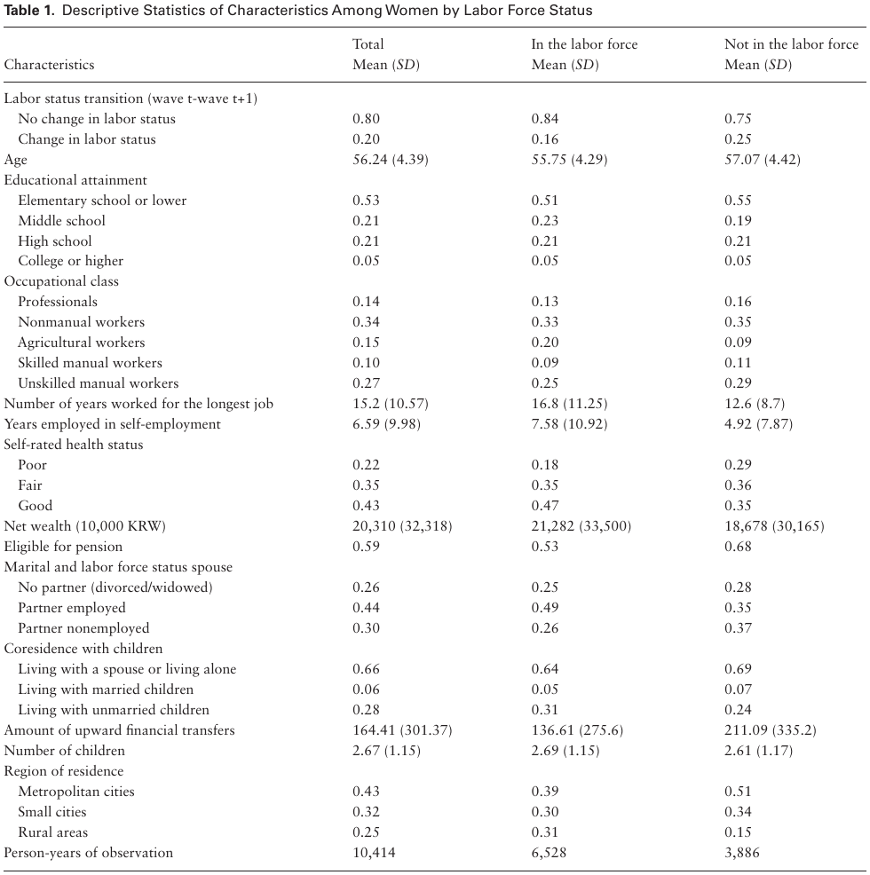
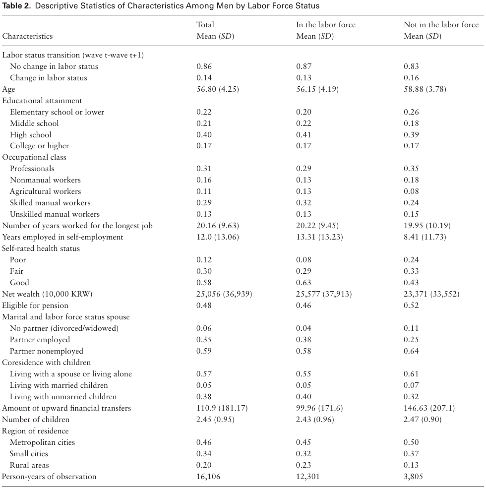
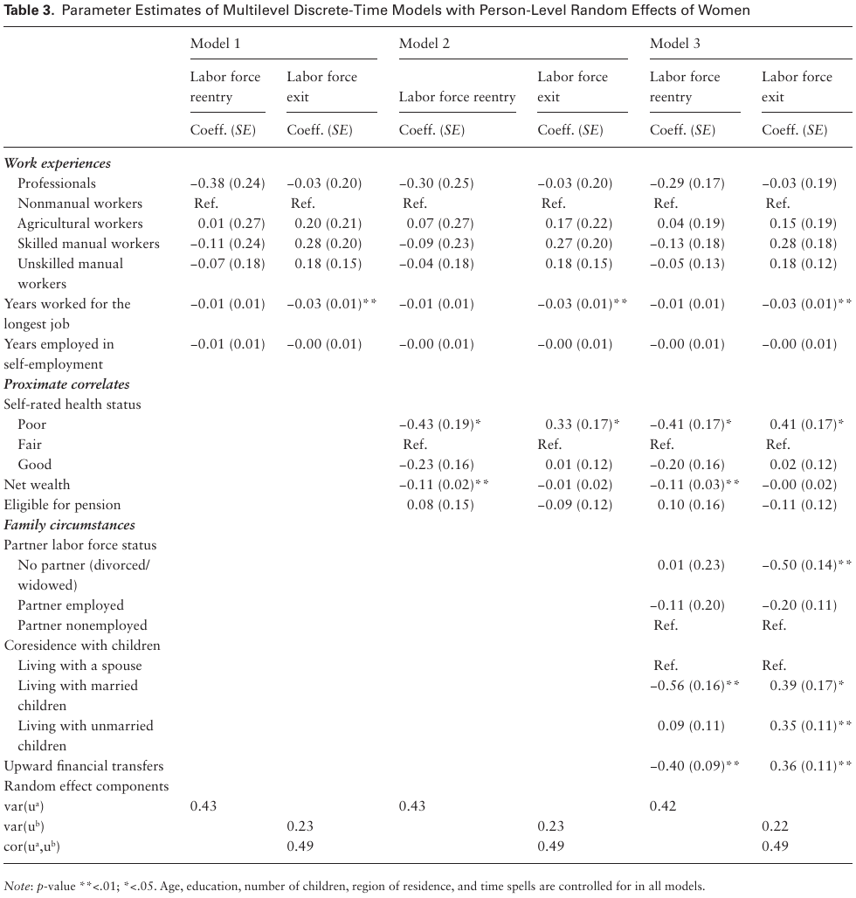
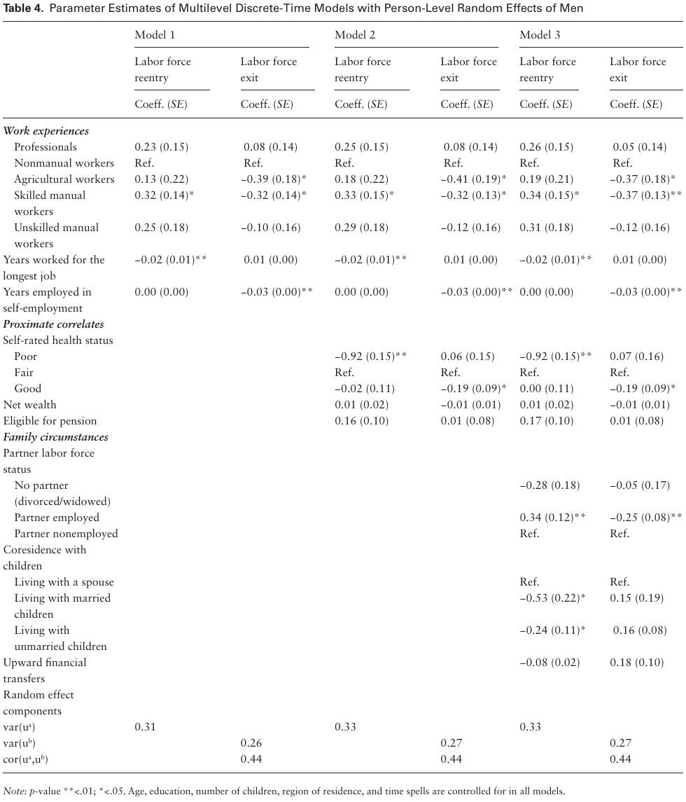

# The Country That Never Retires: The Gendered Pathways to Retirement in South Korea

> Yeonjin Lee, PhD¹˒²* and Wei-Jun Jean Yeung, PhD³˒⁴˒⁵

> ¹ Department of Social Work and Social Administration, The University of Hong Kong. ² School of Public Health, LKS Faculty of Medicine, The University of Hong Kong. ³ Department of Sociology, National University of Singapore. ⁴ Asia Research Institute, National University of Singapore. ⁵ Centre for Family and Population Research, National University of Singapore.

> *Journals of Gerontology: Social Sciences*. Cite as: *J Gerontol B Psychol Sci Soc Sci*, 2021, Vol. 76, No. 3, 642–655. doi:10.1093/geronb/gbaa016. Advance Access publication February 6, 2020.

> Received: February 6, 2019; Editorial Decision Date: January 6, 2020.

> Decision Editor: James Raymo, PhD.

> *Address correspondence to:* Yeonjin Lee, PhD. E-mail: yjinl@hku.hk

> © The Author(s) 2020. Published by Oxford University Press on behalf of The Gerontological Society of America. All rights reserved. For permissions, please e-mail: journals.permissions@oup.com.

## Abstract

**Objectives.** Among all Organization for Economic Cooperation and Development countries, South Korean older adults work until the latest age. We investigate the extent to which work experiences over the life course and family circumstances can be associated with older workers’ incentives to remain in the labor force beyond the statutory pension age. We explore gender-specific patterns of labor force exit and labor force re-entry in later life.

**Methods.** Using panel data of South Korean older workers and retirees from 2006 to 2016, we estimate multilevel discrete-time models with random effects to predict their labor force transition process that unfolds over time.

**Results.** Results show that skilled manual workers are less likely to exit employment and more likely to re-enter the labor force. A longer history of self-employment is related to later retirement. The relationship between career characteristics and the risk of retirement is only significant for men. Late-aged employment transition among women appears to be more related to family conditions. Women who receive financial support from adult offspring are more likely to remain out of the labor force but this relationship is not pronounced among men.

**Discussion.** Policies aimed at extending working lives need to provide various types of social support to older job seekers, especially those who had low-class jobs and those without family networks.

## Keywords

Family, Gender, Intergenerational relations, Retirement, Work

## Introduction

With many countries facing high costs in terms of the need for public pension funds, governments have started encouraging individuals to engage in paid work until a later age by implementing policy reforms that increase a statutory pension age (Van Solinge & Henkens, 2014). In fact, in recent years, the previously prominent early retirement trend seems to have stopped and even reversed (OECD, 2017). Tensions between forces to extend working lives and incentives to retire have become increasingly widespread. Accordingly, patterns of labor market exit among aging people have been complicated in many aging societies. Some retirees repeatedly move in and out of the labor force as an alternative to a complete withdrawal from the labor force (Maestas, 2010). Others who have left work for a long time return to the labor force and then retire again. In this sense, retirement needs to be understood as a whole process of labor market transitions that unfold over time rather than a one-time labor force exit (Fasang, 2012; Tang & Burr, 2015).

In order to have a clear idea about the changing nature of late careers, it is important to explore whether and in what ways retirees who remain out of the labor force differ in the precursors of retirement from those who seek re-employment after retirement. Predictors of the retirement decision are embedded in life experiences interrelated with broader institutional characteristics (Cahill, Giandrea, & Quinn, 2017). The extent to which different life domains jointly affect individuals’ incentives to remain in or out of the labor force is less known in the later exits regimes.

Studies conducted in Western countries have shown that differences in early- and midlife employment conditions may result in disparities in later-life resources for retirement (Damman, Henkens, & Kalmijn, 2011; O’Rand, 1996; Raymo, John, Megan, Robert, & Ho, 2011). The family circumstance is another factor linked to older workers’ retirement transitions, as it can shape the chances and ability of an individual to continue working (Hank, 2004; Szinovacz, DeViney, & Davey, 2001). The implications of career characteristics and family roles for (un)retirement may be inconsistent across gender. What remains unanswered are gendered precursors that structure employment transition patterns in later life particularly in societies where there are traditional gender disparities in the distribution of financial resources, lifetime earnings, and family obligations. Therefore, further studies are needed to address gender differences in factors that determine choice over retirement or postretirement employment using a nationally representative sample.

This study aims to bridge the gap in knowledge regarding later-life career shift by focusing on older adults in South Korea (hereafter, Korea) with the largest recorded gap between effective retirement age and pensionable age, when compared with other countries in the Organization for Economic Cooperation and Development (OECD) (OECD, 2013). Methodologically, we extend prior studies by using a multiple spell model of work transitions including correlated unobserved heterogeneity across spells. Theoretically, one of the goals of this research is to assess how earlier work experiences and family circumstances predict decisions to exit the labor force or re-enter the labor market, and whether the relationships differ by gender. We also investigate whether proximate correlates of retirement such as health, wealth, and pension eligibility explain the pathways of labor force exit among individuals with different career paths. From a policy perspective, understanding the gendered life experiences that lead to less standardized pattern of retirement has crucial implications for reducing social inequalities among growing aging workers.

## Work Experiences

According to the theories of life course and cumulative social stratification, the occupations in which an individual spends most of their working life has a long-term effect on his or her late-life careers (Visser, Gesthuizen, Kraaykamp, & Maarten, 2016). Disadvantages and advantages of earlier work experiences accumulate throughout the life course, setting the context in which individuals plan for retirement or postretirement employment (Raymo, Warren, Sweeney, Hauser, & Ho, 2010). The pathways through which occupational characteristics of the mid-career are associated with work behaviors in later life require further empirical exploration in contexts that rely on defined contribution pension.

One of the established proximal factors of a worker’s retirement is health. There is consistent evidence that health affects retirement exits and postretirement employment among older adults (Schuring, Robroek, Otten, Arts, & Burdorf, 2013; Van den Berg, Elders, & Burdorf, 2010). An important social determinant of health in later life is quality of occupation across adulthood. Exposure to physically demanding and psychologically stressful work conditions may be related to a higher likelihood of health decline over time, which can eventually lead to involuntary early retirement (Damman et al., 2011). Workers who have higher levels of job-related stressors and low job autonomy are likely to be faced with health problems that increase the risk of labor force withdrawal. The risk of labor force exit tends to be higher for those who are involved in precarious employment, as they are more likely to be exposed to health risk factors and work disability (Hayward, Friedman, & Chen, 1998).

Financial preparedness for retirement (e.g., accumulated wealth and pension eligibility) is shaped by occupation, work interruptions, and employment stability over the course of the career. The exposure to careers of lower occupational levels may lead individuals to decide to keep working beyond the statutory pension age because they have not accumulated adequate financial resources that enable them to choose permanent retirement (Clarkberg & Moen, 2001; Mein et al., 2000). Prior studies have provided evidence supporting the idea that those without long-tenured jobs appear to have insufficient pension earnings, thus prohibiting them from choosing full retirement and compelling them to stay longer in the labor force for maintaining preretirement status (Cahill, Giandrea, & Quinn, 2006; Damman et al., 2011; Raymo et al., 2011). Workers who have been in precarious jobs are likely to search for re-employment after retirement until they become eligible for social security and public pension benefits (Coe, Mashfiqur, & Matthew, 2013; Kalleberg, Reskin, & Hudson, 2000). Older adults who experienced nonemployment and short employment spells over the career are less likely to retire, due to the limited pension contributions and their overall low level of wealth (O’Rand & Shuey, 2007). This may be true for self-employed workers who are less likely to accumulate occupational pension wealth and thus, have a greater incentive to remain in the labor force. Self-employed workers may also have stronger job attachment because of entrepreneurship, which can provide a higher motivation to remain active in the labor market (Leinonen, Tarani, Mikko, & Pekka, 2018; Parker & Rougier, 2007).

There can be opposing factors associated with career characteristics that push older adults to remain in the labor force while at the same time, drive them out of the labor force. For example, workers who have been exposed to a job loss and income volatility during mid-adulthood may need to extend their working lives to supplement limited wealth. At the same time, the large proportion of them may lose human capital because of job insecurity, which push them out of the rigid labor market (O’Rand, 1996). Difficulties in re-employment that older lower class workers face might be greater than those that individuals of higher occupational status may experience. Workers who have low-skill jobs may be less competitive in the job market, and thus, their accessibility to paid jobs after retirement can be more limited. On the other hand, individuals who spend most of their lives in professional jobs may be more competitive, leading them to better postretirement employment opportunities. They are more likely to remain in the labor force with stronger career attachment and work identity (Dingemans & Möhring, 2019). However, it is also plausible that individuals in professional jobs that provide generous pensions are likely to choose an early retirement option (Aaron & Jean, 2011; Schils, 2008). The availability of these retiree benefits provides an incentive for professional workers to exit the labor force when they reach a particular age.

Men and women may differ in their career trajectories. In countries with a gendered labor market, women are more likely to have career interruptions and part-time employment than men (Möhring, 2018; Radl & Himmelreicher, 2015). The chances to accumulate wealth and pension benefits may also be limited for women who leave work for a while for marriage or childbirth (Jefferson, 2009; Sefton, Evandrou, & Falkingham, 2011). The impact of job tenure on the labor force exit is posited to be stronger among women because older women with long spells of employment tend to be a more selective group, thereby having a stronger attachment to the labor force. However, some studies have demonstrated that the variation in the retirement pathways associated with occupational characteristics is more pronounced among men as women’s retirement decisions tend to depend on other factors such as family circumstances (e.g., partner’s employment status, intergenerational relations; Dingemans & Möhring, 2019; Raymo et al., 2011; Tang & Burr, 2015).

## Family Circumstances

Labor force participation of older adults can be affected by family environments. Marital status and the partner’s work status are relevant factors, considering that both shape one’s economic condition and disposition toward retirement. For example, people with no spouse tend to take up a new job following retirement due to the absence of financial support from the partner, as opposed to married people who may have spousal income. If one’s spouse is economically active, an individual may feel that it is inappropriate to adopt a retiree identity and will thereby delay retirement to hold a work role (Szinovacz & DeViney, 2000). This can be particularly true for husbands who may believe that retirement threatens their main-earner status in the family. Recent literature sheds some light on the relationship between change in marital status and a couple’s retirement timing, but the evidence has been mixed. Some studies have documented that widows are more likely to remain in the labor market (Finch, 2014) while other studies found that widows are more likely to choose earlier retirement, as they receive survivor pensions (Radl & Himmelreicher, 2015).

The response of women to change in marital status in terms of retirement decisions is different from that of men (Szinovacz & DeViney, 2000). In a patriarchal society, married men tend to be primary breadwinners and are more work-oriented, while married women devote more time to caregiving and nonpaid family work (Kimmel & Connelly, 2007). In this context, women are likely to be systematically excluded from access to high quality jobs during their working lives. Even if women try to re-enter the labor force later in life, many of them may end up taking jobs for which they are overqualified (Raymo & Lim, 2011). Therefore, women appear to evaluate the feasibility of retirement and postretirement employment based on the resources of their partner. Women are likely to extend their paid work or re-enter the labor force to mitigate the financial consequences of marital dissolution and compensate for the spousal income (Honig, 1998). On the other hand, men’s financial losses related to marital dissolution are less likely to be significant (Andreß et al., 2006). It is also possible that reduced family obligations encourage women to stay in the labor force, while this may not be the case for men.

It is well documented that parents with children are less likely to choose early retirement (Hank & Julie, 2013; Higgs, Mein, Ferrie, Hyde, & Nazroo, 2003). However, whether parents who have financially independent children choose to retire early has yet to be investigated. Upward intergenerational support needs to be considered in order to understand older adults’ labor force decision making. That is to say, children can use their resources to help older parents maintain an acceptable standard of living in tandem with private family care (Choi, 1994); as a result, this can negatively influence the parent’s motivation to remain in the labor force. In Asian countries, personal care is often provided in the form of coresidence with offspring. At the same time, older parents provide instrumental support to their adult children by caring for grandchildren or helping with housework. This kind of intergenerational support may lower older adults’ incentive to extend their working lives (Hochman & Lewin-Epstein, 2013).

The contribution of the children’s resources to the retirement of their parents varies by gender since it may depend on the gender role beliefs within the family. For instance, mothers are more likely to sacrifice their career to achieve a normative role as the main caregiver and adult children’s support is more likely to be valued as a symbolic asset. It is also possible that the impact of children’s transfers on labor force participation is more significant for individuals who otherwise have fewer financial resources; it can be expected that women who are more likely to have job interruptions during adulthood. It is necessary to explore how intergenerational support contributes to decisions regarding work-retirement transitions among older men and women in countries with an asymmetric gender division of labor.

## Context Matters: Pension System and Labor Force Participation

The national pension program started in Korea in 1988, and covered workers in firms with more than 10 employees. The program was expanded to include agricultural workers in rural areas in 1995 and then self-employed workers in city areas in 1999 (Moon, 2002). With this program, full-time employees who have been insured for more than 10 years are eligible to be paid pension benefits after age 60, but the age was adjusted to 61 in 2013. Although pension eligibility has gradually expanded, only about 37.6% of the population aged 65 and older receive national pension benefits, and the amount of the pension is around 51% of the minimum cost of living (KOSTAT, 2013).

The Basic Old-Age Pension (BOAP) program is a type of social security that can be obtained when a certain income standard is met, even if the beneficiary did not pay the premium. The BOAP program was initiated in 2008 and targeted populations older than 65 and those falling below the 70% category for the household income of the population, but this program provides much less support when compared to that required for the minimum cost of living. Although the benefits may decrease if an individual has full-time employment at the time of receipt, the BOAP disregards a beneficiary’s wage when evaluating its eligibility in order to encourage older adults’ labor force participation (Yoon, 2013).

Older adults in Korea have reported that more than 60% of their income came from work, 21% from savings, and only 16% from public pension and social security (OECD, 2013). The labor force participation rate of individuals aged 65 and older in Korea is stably high, rising from 29.2% in 1985 to 32.2% in 2018. During that same period, the percentage of older workers’ labor force participation in the United States rose from 10.8% to 19.6%. In Germany, the percentage rose from 3.3% to 7.5% (OECD, 2018). Despite older adults’ higher labor force participation, they are likely to be concentrated in manual and agricultural jobs, and self-employment in agricultural sector was the most prevalent among dual-earner couples (KOSTAT, 2013).

Significant institutional barriers in the Korean labor market have led to interruptions of the occupational careers of women upon childbearing. Women have lower earnings and shorter periods of pension contribution relative to men. According to the national statistics, percentage of women covered by the old-age pension system was much lower (30.8%) than that of men (69.2%) and the poverty rate among older women was the highest among the OECD countries (KOSTAT, 2013). Given that women may have limited access to full-time jobs with retirement benefits over the life course due to their investments to the care-giving role, their late-aged career transition is likely to be determined by family circumstances.

Given the lack of provision from a public pension, Korea has a traditional expectation of private support for retirees and adult offspring provide an important source of old-age financial support. While having a patriarchal sociocultural system, there has been a strong differentiation between the role of mothers and fathers within the family in Korea. For instance, mothers are likely to leave their jobs to ensure that their children achieve a high level of education. On the other hand, Korean fathers, as the major breadwinners, are likely to be anxious for the consequences of retirement such as losing social status. Support from children is likely to be valued, increasing parental economic satisfaction and the implication of intergenerational transfer upon retirement may be more important for mothers (Lee, 2018). Thus, women’s decision to remain out of the labor force may rely more heavily on the transferred resources of their children than do men. In the preliminary analyses, we tested whether the relationship between family environment and workforce change varies by gender by adding interaction terms of gender and marital status and intergenerational relationship indicators into the model. Significant interaction effects were identified indicating that gender functions as a moderator of the associations.

Based on this context, we aim to explore six relevant hypotheses. First, we hypothesize that older adults who were in manual jobs or self-employed for a major part of their adulthood are more likely to remain in the labor force (Hypothesis 1a). The relationships will be reduced when proximate correlates of retirement (e.g., health, wealth, and public pension) are additionally considered in the model (Hypothesis 1b). We expect that the links between earlier work experiences characterized by occupational class, job tenure, self-employment, and the transition into or out of the workforce in later life will be more pronounced among men (vs women; Hypothesis 1c). We posit that individuals who experience marital dissolution are more likely to remain in the labor force and that this effect will be observed only among women (Hypothesis 2a). We hypothesize that individuals with intergenerational supports indicated by coresidence with children and upward financial transfer are less likely to remain in the labor force (Hypothesis 2b). We expect that the effect of intergenerational support on the work-retirement transition will be more pronounced among women than among men (Hypothesis 2c).

## Data

The current analyses are based on a nationally representative survey, the Korean Longitudinal Study of Aging (KLoSA), which focused on individuals who were at least 45 years old. The survey was conducted in 2006, and it followed the respondents until 2016, resulting in a maximum follow-up period of 10 years. The survey used a multistage stratified probability sampling approach and selected 71% of the households. The individual response rate within a household was around 75% (KLI, 2010). The survey collected information on an individual’s work status, sociodemographic characteristics, and individual and household economic status, including different sources of assets such as liquid assets, savings, and debt. Respondents provided information about children such as age, intergenerational living arrangement, and upward financial support.

The sample is restricted to individuals aged 50–64 years in the baseline survey year, who turned 60–74 years in 2016. Korean statistics show that the labor force participation rate begins to fall when individuals reach age 50 (KOSTAT, 2017). Thus, it can be speculated that individuals enter the risk set of early retirement at aged 50 and older. We limit the sample to those aged through 74 in the latest wave because the average effective age of labor market exit of Koreans is around age 73 (OECD, 2017). This suggests that the sample is mainly composed of people who used early retirement schemes, subsequently left the labor force, remained in the labor force beyond statutory pension age (age 60), and re-entered the labor force after retirement. Individuals who did not have any paid work experience through the life course were excluded (n = 1,295). Therefore, the current sample may over-represent women who are more work-oriented. Among individuals at risk for changing labor status around 27% of participants had multiple labor force transitions.

Among the sample, 14.3% of the respondents who did not give information on labor status for at least three waves of the six waves of data collection were dropped. Mortality was the main reason for attrition and accounted for around 14% of the observation loss. The final sample for this study consists of 2,600 individuals, including 1,579 men and 1,021 women, contributing 26,520 person years of observations. Around 29% of the sample had continued work and around 36% of them left a job before the survey and re-entered the labor force during a decade of follow-up. We use retrospective information of the work history data collected in 2007 to construct indicators of prior employment experiences and estimate the duration of employment. The data include the years that workers started and left a job and all types of jobs they held throughout their lives.

## Measures

The outcome of interest is the occurrence of an event during the specified period. Event indicates a transition from one labor force state to another between wave at time t and t + 1. It is a dichotomous variable having the value of 1 for the wave when employment state changes and 0 for the wave when there is no change. Nonabsorbing states are remaining in the labor force and being nonemployed/retired at each wave. The labor force state is self-reported and individuals who are working include those who have been engaged in their primary career employment at the time of interview. Out-of-work retirees who report that they are receiving income from a paid job are classified as those who re-enter the labor market. An individual may have experienced multiple spells of labor status change over the observation period. The period of risk is the duration between the start of observation and the first labor force status transition.

## Explanatory Variables

Work experience during adulthood is one of our main interests for this study. We drew upon the prior studies to develop indicators of occupational experiences related to cumulative exposure to the labor market (dis)advantages. An indicator of the employment sector is measured using the retrospective information on the industry in which individuals have spent most of their lives since they completed their education. The variable is time-constant and categorized as: professional workers, nonmanual workers (e.g., service and sales workers), skilled manual workers, agricultural workers, and unskilled manual workers. We consider the number of years throughout the life course that an individual has been self-employed. The duration of the job that an individual held for most of his/her working-life without an interruption is also considered. For some individuals who report holding multiple jobs for the same length of time, we use information from the most recent labor force experience.

The mechanisms underlying the relationship between work experience and retirement outcomes are explored by including time-varying antecedents of the retirement process: self-reported health status (good, fair, poor) and financial resources. Self-rated health is adjusted for as a push factor of retirement intentions, assuming that people move towards retirement when they have health problems (McGarry, 2004). Financial resources are indicated by net wealth and pension eligibility (yes, no). To estimate the net value of accumulated wealth the sum of debt is subtracted from the sum of asset from various sources including liquid wealth. We additionally control for age, region of residence (metropolitan areas, city areas, rural areas), and educational attainment. The educational attainment of individuals is coded as follows: elementary school, middle-school graduates, high-school graduates, and college or above. If information of a covariate is missing, we impute the data with the ones from the most recent available year.

Family environments are measured by marital status, economic status of a spouse, and support from children. A time-variant variable of marital status and employment status of a spouse is categorized as follows: (a) married and a partner is in the labor force, (b) married and a partner is already retired, and (c) no partner (single/divorced/separated/widowed). Among the nonpartnered individuals, the proportions of divorced and widowed were around 12% and 83.9%, respectively.

To consider support from children in the model, we group older adults’ living arrangements into three categories based on their child coresidence and the child’s marital status: (a) living alone or living with a spouse only, (b) living with married children, and (c) living with unmarried children. The children include biological children and children-in-law. The amount of upward financial transfer is based on the total amount of money sent from all children in the previous year over an observation period from 2007 to 2016. The upward transfer is logged for both women and men because the value was skewed and including logged values produced better model fits. Missing information on the amount of upward transfer is imputed by the average amount of financial support from children. The variables of coresidence with children and intergenerational financial transmission are time-varying. Number of children is also controlled for in the model.

## Statistical Analysis

To investigate episodes of both movements in and out of employment, we structure multilevel discrete-time models with random effects. The estimation is specified by two equations, addressing the multiple-spell structure with some re-entries over time: one for transitions out of the labor force, and a second for transitions into the labor force. An individual-level random effect is included in each equation, and those random effects are allowed to be correlated through simultaneous modeling. Jointly estimated equations allow us to deal with omitted characteristics (i.e., unobserved heterogeneity relevant to labor force transitions) that might lead to residual correlation in each shift across different labor force states (Raymo & Lim, 2011; Steele, 2011). Individuals are right-censored when it comes to the loss to follow up or death. To reduce the bias regarding attrition, we use the full-information maximum likelihood approach and all estimates are survey adjusted and weighted for the probability of nonresponse. Our assumption is that attrition is random and systematically associated with the variables included in the model.

We test gender differences in the life experiences surrounding the retirement transition process by including interaction terms between gender and predictors. Given that the interaction terms are statistically significant, final models are stratified by gender. The stratified models evaluate whether prior labor market experiences and family circumstances shape the transitions to retirement in different ways for men and women

We focus on incentives and disincentives to remain in the labor force across individuals with different work experiences (Model 1). We adjust for the plausible correlates of retirement decision to understand underlying pathways (Model 2). We consider family circumstances to see how they affect older workers’ career change (Model 3). The multilevel discrete-time models that address unobserved heterogeneity in the propensity to experience labor state changes are structured as follows (Raymo & Lim, 2011; Steele, 2011):

> ln [pᵃᵢₜ / 1 − pᵃᵢₜ] = αᵃDᵢₜ + βᵃXᵢ + δᵃYᵢₜ + γᵃZᵢₜ + uᵃᵢ + eᵃᵢₜ

> ln [pᵇᵢₜ / 1 − pᵇᵢₜ] = αᵇDᵢₜ + βᵇXᵢ + δᵇYᵢₜ + γᵇZᵢₜ + uᵇᵢ + eᵇᵢₜ

In the equations, i refers to an individual, t refers to each wave of the survey, and a (b) indicates movement into (out of) the labor force across time. Variable D indicates discrete time spells. X, Y, and Z are time-constant and time-variant covariates of interest such as work history, marital status, work status of a spouse, and intergenerational support. The equations are linked by allowing for a correlation between random effects of ua i and ub i.

## Results

Table 1 shows that among women, those employed at wave t, around 16% left their job while around 25% of the sample out of the labor market at wave t re-entered the labor force. Women with agricultural jobs were more likely to remain in the labor force and women with long periods of employment were more likely to remain in the labor force. The amount of upward transfers increased when women were not in the labor force. According to the sample statistics in Table 2, among men those employed at wave t, around 13% exited the labor force while around 16% re-entered the labor market. Professional or nonmanual workers were more likely to be out of the labor force compared to manual workers. Men with longer self-employment experiences were more likely to continue to work.

Table 1. Descriptive Statistics of Characteristics Among Women by Labor Force Status. Accessibility description: The table compares total, in-the-labor-force, and not-in-the-labor-force observations for women. Change in labor status is .20 overall, .16 among those in the labor force, and .25 among those outside it; the corresponding person-years are 10,414, 6,528, and 3,886. The source crop preserves all age, education, occupational class, job-duration, self-employment, health, wealth, pension, spouse, child-coresidence, transfer, fertility, and region cells.

Table 2. Descriptive Statistics of Characteristics Among Men by Labor Force Status. Accessibility description: The table compares total, in-the-labor-force, and not-in-the-labor-force observations for men. Change in labor status is .14 overall, .13 among those in the labor force, and .16 among those outside it; the corresponding person-years are 16,106, 12,301, and 3,805. The source crop preserves all age, education, occupational class, job-duration, self-employment, health, wealth, pension, spouse, child-coresidence, transfer, fertility, and region cells.

We found significant interaction terms with gender (0 = women, 1 = men; see Supplementary Appendix Table A1). For example, the negative relationship between the number of years that an individual has been self-employed and the likelihood of labor force exit was stronger for men (interaction term: coeff. = −0.02, p < .001). For men, a longer job tenure was associated with a greater decrease in the likelihood of labor force re-entry (interaction term: coeff. = −0.03, p < .05). Men were less likely to return to the labor force when they experienced marital dissolution, as compared to women (interaction term: coeff. = −0.38, p < .01). Coresidence with children was significantly related to the likelihood of labor force exit among women, while the relationship was less pronounced among men (interaction term: coeff. = −0.28, p < .01). Upward financial transfers from children were negatively linked to the likelihood of the labor force re-entry only among women (interaction term: coeff. = 0.44, p < .05).

Table 3. Parameter Estimates of Multilevel Discrete-Time Models with Person-Level Random Effects of Women. Accessibility description: Models 1–3 each report labor-force reentry and exit coefficients with standard errors. Model 3 includes work experiences, proximate correlates, and family circumstances; its child-coresidence and upward-transfer coefficients retain their signs, significance marks, and reference groups. Random-effect correlations are .49 in all three models. The note states that age, education, number of children, region, and time spells are controlled in all models and defines ** as p < .01 and * as p < .05. Exact cells are preserved in the source crop.

In Table 3, Models 1, 2, and 3 show coefficients predicting labor force changes for women. As we expected (Hypothesis 1c), work trajectory characterized by occupational class does not seem to predict labor state transitions in later life for women (Model 1). There was a significant relationship between years at the longest job and the odds of retirement; women who have worked in the same employment sector for a longer period were more likely to remain in the labor force. The result reflects that women who have stayed in the labor force until a later age have constituted a selective group that had paid a high cost to fulfill the work role early in their adult life course. The number of years that an individual has been self-employed was not strongly associated with labor status transitions.

Women with poorer health were less likely to remain in the labor force. Women with higher net wealth were less likely to search for another job once they left the labor market (e^(−0.11) = 0.90). However, the relationship between wealth and the likelihood of remaining in the labor force was not statistically significant. Pension eligibility does not appear to affect the odds of labor force re-entry and exit, rarely explaining the relationship between job duration and movement into the labor market.

For women, the most important factors predicting labor force transitions in later life were family circumstances (Model 3). Women who were divorced or widowed were more likely to remain in the labor force. The odds ratio of the labor force exit of nonpartnered women was around 39% lower than women with a spouse who retired. Coresidence with married children was negatively associated with the odds of labor force re-entry. Coresidence with unmarried adult offspring was related to a 42% increase in the odds of leaving the labor force. Likewise, upward financial transfers from children substantially decreased women’s incentives to remain in the labor force. Financial support from children decreased the odds of re-entering the labor force and increased the likelihood of leaving the labor force. Our preliminary analyses showed consistent findings such that for women, the likelihood of delay in retirement declined as they reported more frequent social interactions with adult children (results not shown here). The findings indicate that older women’s pathway of workforce re-entry can be significantly related to economic resources in the broader family unit and intergenerational ties.

Significant variance component and random effect deviation factors indicate that there was significant unobserved heterogeneity between individuals. Positive correlation between random effects (ρ = 0.49) implies that women with shorter period of employment were more likely to re-enter the labor force with shorter durations of un-employment.

Table 4. Parameter Estimates of Multilevel Discrete-Time Models with Person-Level Random Effects of Men. Accessibility description: Models 1–3 each report labor-force reentry and exit coefficients with standard errors. Across models, skilled manual work is positively associated with reentry and negatively associated with exit, longer tenure predicts lower reentry, and more self-employment years predict lower exit; Model 3 adds spouse and child measures. Random-effect correlations are .44 in all three models. The note states that age, education, number of children, region, and time spells are controlled in all models and defines ** as p < .01 and * as p < .05. Exact cells are preserved in the source crop.

Table 4 shows the results for men. Unlike women, indicators of previous labor market experiences were significantly linked with the shift from worker to retiree. Being engaged in skilled manual jobs over the major part of their career increased the odds of workforce re-entry and decreased the odds of labor market exit. Skilled manual workers tend to be employed in the obsolete sector, which has downsized during the deindustrializing stage in Korea. They are also likely to be un-unionized workers without retiree benefits. This market conditions put the manual workers at the bottom of the wage structure, forcing them to extend working lives due to lack of job security (Lee, 2011). Retirement seems to be less common for those engaged in agricultural occupations, as compared to nonmanual workers (e^(−0.39) = 0.68) and for those in rural areas. We could not find statistically significant relationships between professional and unskilled manual jobs and work-retirement processes. Men who spent longer periods of their lives working in the same sector were less likely to search for another job once they left work (e^(−0.02) = 0.98). In other words, workers who experienced frequent job interruptions were more likely to move in and out of employment in later life, having blurred patterns of retirement. Career trajectory characterized by self-employment spells reduced the likelihood of retirement (e^(−0.03) = 0.97), and this relationship persisted statistically significant even after financial conditions were adjusted for.

Model 2 shows that health status and financial resources rarely explained the effect of labor market experiences.Net wealth was not a significant predictor of men’s labor force transitions. Given that the national pension scheme has still not matured and that the noncontributory basic pension benefit is modest, a pension may not be a crucial factor for determining retirement constraints or feasibility. The results also suggest that nonfinancial factors, such as job satisfaction and work attachment, can be one of the drivers of prolonged work life among men.

The odds of moving into retirement were lower for married men with a working spouse than for a married man with a nonworking spouse. Married men who had a working spouse were themselves likely to re-enter the labor market, and the odds of labor force exit were reduced by approximately 22%. These results support the idea that men have a stronger labor market attachment, and thus, to retire earlier than wives could cause a loss of identity for a breadwinner. As we hypothesized, we could not find meaningful implications of marital dissolution for the career transition process among men. Men who live with their children were less likely to re-enter the labor force than their counterparts living with a spouse only. However, coresidence with children was not strongly associated with the odds of labor force exit. Being consistent with Hypothesis 2c, unlike women, the relationship between financial support from children and the likelihood of labor force transition was not statistically significant for men.

The variances of random effects indicate that there was a significant heterogeneity for the labor force re-entry and exit. We found strong and positive correlation (ρ = 0.44) between the random effects for the two equations, which shows that men who were likely to leave jobs also had higher likelihood of the labor force re-entry.

## Discussion

The global aging trend has prompted many countries to extend the working lives of adults. Understanding why some workers un-retire while others leave the labor force is not well understood. Using high-quality data that include repeated observations of older workers and retirees over time in Korea, we explored variations in gendered pathways of labor force status changes. This study has endeavored to evaluate precursors of retirement by analyzing a 10-year period for those of the conventional retirement age, while conceptualizing retirement as a process outcome. To our knowledge, this is the first study to utilize simultaneous hazard models, which addressed unobserved heterogeneity in the likelihood of labor force re-entry and exit in Korea. It adds to the existing literature by demonstrating who works beyond the normative retirement age in a society that does not offer status-leveling social security for older workers.

We find that the decision to work until a later age is contingent upon occupational class and that this relationship is more pronounced for men than for women. An interrupted career trajectory appears to discourage workers from choosing a complete withdrawal from the labor force. For men, prior experiences of career interruptions are related to a higher likelihood of returning to the labor market, after controlling for pension eligibility. This suggests that in a context where there is a weak public old-age support system, older workers exposed to unstable work trajectories are likely to experience recurring transitions between work and retirement.

The findings support the hypothesis that workers who have skilled manual jobs for a major part of their adult lives are more likely to extend their working lives than nonmanual workers. The results that skilled manual workers tend to stay in the labor market and simultaneously search for re-employment after retirement imply cumulative disadvantages that the employees experience. This is to say that they have been exposed to higher risks of involuntary labor force exit even while they continued to remain in the labor force throughout their lives. The Korean government supports the liberal market system that allowed employers to lay off senior workers to reduce labor costs and then replace permanent jobs with temporary jobs through the economic crisis of 1997 (Hyun, 2016). In the absence of intervention to protect workers in the waning industrial sector, it is imperative to provide social insurance to better enable them to manage job insecurity in later years.

We also find that the negative relationship between previous self-employment spells and the labor force exit remained statistically significant even after proximate correlates of retirement were taken into account. Self-employed workers, who may have fewer constraints with which to prepare for retirement, have preference for continued work. They are less likely to have access to retirement benefits while having higher flexibility in regards to controlling the timing of their retirement. Cultural norms that value work attachment may also encourage them to maintain a work role until a later age. Our additional analyses found that there is a positive link between economic satisfaction and self-employment status after adjusting for household income and wealth (results not shown here).

This study demonstrates gender differences in the effects of family circumstances on late-aged labor force transitions. For women, change in marital status is a significant predictor of labor force participation. Our study shows that nonmarried women are more likely to remain in the workforce than their married counterparts, while this relationship is not significant for men. In Korea, survivor pensions are proportional to the pension entitlements of the spouse and the benefit amount is modest in most cases. There is no additional pension benefit for the divorced partner. Hence, women with no partner who have lower social status are more likely to experience financial hardships than men do, which motivates women who experienced marital dissolution to work. It is also possible that reduced family obligations and work–family constraints encourage older women to stay in the labor force. On the other hand, men are more likely to remain in the labor force when their wives are economically active. This suggests that Korean men tend to view their worker role as an important indicator of their status in the family and perceive retirement as a threat to this status at home. We find that private transfers from children also influence incentives to exit the labor force, but this effect is only significant for women. The strict gender role division and gender discrimination in the labor market lead to lower levels of economic autonomy for older Korean women. Limited access to resources for women over their life course means that their children’s resources are important for their financial security. Since a mother is the main caregiver, there also can be a closer social bond between children and their mothers.

The current research reveals social disparities in work-retirement transitions among aging older adults. It suggests that the public old-age support system in Korea is not structured adequately to cover aging workers with lower occupational class and offers limited benefits and income security features to beneficiaries. The high-income insecurity among the older adults, especially for women without family support and for men with job interruptions, may thus force them to remain in the workforce. The results that factors pushing people to return to the labor force are related to less favored conditions suggest that extended working life may not always reduce economic inequalities and social burdens

This study has some limitations. We are unable to test cohort effect which can be an important factor in considering changes in intergenerational circumstances and gendered labor market conditions. Further studies are needed to evaluate whether macro-level changes in pension policy, labor market organizations, and gender norms make changes in precursors of late-aged career transitions. Although we controlled for several proxy measures of the workers’ retirement feasibility, additional evidence is needed to address nonfinancial mechanisms underlying the relationship between work experiences and older workers’ labor force participation. Further analyses including proxy of work orientation, risk aversion, or reason for chosen occupation would help developing discussions.

Despite these limitations, the current study extends our understanding about people opting to work beyond the normative retirement age in a society where limited public old-age support is available and net pension replacement rate is relatively low. The findings underscore the importance of providing better quality jobs and other forms of trainings to older job seekers, especially for low-skilled workers or those who have no family members to care for them. Hence, the findings help demonstrate how retirement policies, labor market conditions, family circumstances, and gender norms are associated with the patterns of the older adults’ engagement in work. From a practical stance, it can inform social policies and program development in many countries similarly facing the challenge of an aging population that seek to promote active and productive aging, especially when the baby boom generation’s retirement has now begun globally.

## Supplementary Material

Supplementary data is available at The Journals of Gerontology, Series B: Psychological Sciences and Social Sciences online.

## Funding

This work was supported by Asia Research Institute, National University of Singapore, and W-J. J. Yeung is also supported by Steven Riady foundation.

## Conflict of Interest

None reported.

## References

Aaron, H. J., & Jean, M. C. (2011). “Who Retires Early?” Working Paper No. 2011-10. Chestnut Hill, MA: Center for Retirement Research at Boston College. Retrieved from http://crr.bc.edu/working-papers/who-retires-early-ii/

Andreß, H.-J., Borgloh, B., Bröckel, M., Giesselmann, M., & Hummelsheim, D. (2006). The economic consequences of partnership dissolution—A comparative analysis of panel studies from Belgium, Germany, Great Britain, Italy, and Sweden. European Sociological Review, 22, 533–60. doi:10.1093/esr/jcl012

Cahill, K. E., Giandrea, M. D., & Quinn, J. (2006). Retirement patterns from career employment. The Gerontologist, 46, 514–523. doi:10.1093/geront/46.4.514

Cahill, K. E., Giandrea, M. D., & Quinn, J. (2017). To what extent is gradual retirement a product of financial necessity? Work, Aging and Retirement, 3, 25–54. doi:10.1093/workar/waw027

Choi, G. (1994). Patterns and determinants of social service utilization: Comparison of the childless elderly and elderly parents living with or apart from their children. The Gerontologist, 34, 353–362. doi:10.1093/geront/34.3.353

Cho, K.-H., Chung, Y., Roh, Y.-K., Cho, B., Kim, C.-H., & Lee, H.-S. (2004). Health care for older persons: A country profile—Korea. Journal of the American Geriatrics Society, 52, 1199–1204. doi:10.1111/j.1532-5415.2004.52322.x

Clarkberg, M., & Moen, P. (2001). Understanding the time-squeeze married couples’ preferred and actual work-hour strategies. American Behavioral Scientist, 44, 1115–1136. doi:10.1177/0002764201044007005

Coe, N. B., Mashfiqur, K., & Matthew, S. R. (2013). How important is Medicare eligibility in the timing of retirement? Issue in Brief 13–7. Chestnut Hill, MA: Center for Retirement Research at Boston College. Retrieved from http://crr.bc.edu/wp-content/uploads/2013/05/IB_13-7_508x.pdf

Damman, M., Henkens, K., & Kalmijn, M. (2011). The impact of midlife educational, work, health, and family experiences on men’s early retirement. The Journals of Gerontology, Series B: Psychological Sciences and Social Sciences, 66, 617–627. doi:10.1093/geronb/gbr092

Dingemans, E., & Möhring, K. (2019). A life course perspective on working after retirement: What role does the work history play? Advances in Life Course Research, 39, 23–33. doi:10.1016/j.alcr.2019.02.004

Fasang, A. (2012). Retirement patterns and income inequality. Social Forces, 90, 685–711. doi:10.1093/sf/sor015

Finch, N. (2014). Why are women more likely than men to extend paid work? The impact of work–family life history. European Journal of Ageing, 11, 31–39. doi:10.1007/s10433-013-0290-8

Hank, K. (2004). Effects of early life family events on women’s late life labour market behaviour: An analysis of the relationship between childbearing and retirement in Western Germany. European Sociological Review, 20, 189–198. doi:10.1093/esr/jch017

Hank, K., & Julie, M. K (2013). Parenthood and retirement: Gender, cohort, and welfare regime differences. European Societies, 15, 446–461. doi:10.1080/14616696.2012.750731

Hayward, M. D., Friedman, S., & Chen, H. (1998). Career trajectories and older men’s retirement. The Journals of Gerontology, Series B: Psychological Sciences and Social Sciences, 53, S91–S103. doi:10.1093/geronb/53B.2.S91

Higgs, P., Mein, G., Ferrie, J., Hyde, M., & Nazroo, J. (2003). Pathways to early retirement: Structure and agency in decision-making among British civil servants. Ageing & Society, 23, 761–778. doi:10.1017/S0144686X03001326

Hochman, O., & Lewin-Epstein, N. (2013). Determinants of early retirement preferences in Europe: The role of grandparenthood. International Journal of Comparative Sociology, 54, 29–47. doi:10.1177/0020715213480977

Honig, M. (1998). Married women’s retirement expectations: Do pensions and social security matter? The American Economic Review, 88, 202–206.

Hyun, J. (2016). Job reallocation, financial crises, and policy reforms: Evidence from Korea. Contemporary Economic Policy, 34, 729–745. doi:10.1111/coep.12174

Jefferson, T. (2009). Women and retirement pensions: A research review. Feminist Economics, 15, 115–145. doi:10.1080/13545700903153963

Kalleberg, A. L., Reskin, B. F., & Hudson, K. (2000). Bad jobs in America: Standard and nonstandard employment relations and job quality in the United States. American Sociological Review, 65, 256–278. doi:10.2307/2657440

Kimmel, J., & Connelly, R. (2007). Mothers’ time choices caregiving, leisure, home production, and paid work. Journal of Human Resources, 42, 643–681. doi:10.3368/jhr.XLII.3.643

Korea Labor Institute (KLI). (2010). About KLoSA: Korean longitudinal study of aging. Seoul, Korea: Korea Labor Institute.

Korean Statistics (KOSTAT). (2013). Retirement pension statistics. Retrieved from http://kostat.go.kr/portal/korea/kor_nw_pension

Korean Statistics (KOSTAT). (2017). Labor force participation by age and sex. Retrieved from http://kostat.go.kr/portal/korea/kor_nw_labor

Lee, S. (2011). The shift of labor market risks in deindustrializing Taiwan, Japan, and Korea. J Perspectives on Global Development and Technology, 10, 241–269. doi:10.1163/156914911X582413

Lee, Y. (2018). Adult children’s educational attainment and the cognitive trajectories of older parents in South Korea. Social Science & Medicine (1982), 209, 76–85. doi:10.1016/j.socscimed.2018.05.026

Leinonen, T., Tarani, C., Mikko, L., & Pekka, M. (2018). Socio-economic differences in retirement timing and participation in post-retirement employment in a context of a flexible pension age. Ageing & Society 1–21. doi:10.1017/S0144686X18000958

Ma, L. (2016). Female labour force participation and second birth rates in South Korea. Journal of Population Research, 33, 173–195. doi:10.1007/s12546-016-9166-z

Maestas, N. (2010). Back to work expectations and realizations of work after retirement. Journal of Human Resources, 45, 718–748. doi:10.3368/jhr.45.3.718

McGarry, K. (2004). Health and retirement do changes in health affect retirement expectations? Journal of Human Resources, 39, 624–648. doi:10.3368/jhr.XXXIX.3.624

Mein, G., Martikainen, P., Stansfeld, S. A., Eric, J. B., Fuhrer, R., & Marmot, M. (2000). Predictors of early retirement in British civil servants. Age and Ageing, 29, 529–536. doi:10.1093/ageing/29.6.529

Möhring, K. (2018). Is There a motherhood penalty in retirement income in Europe? The role of lifecourse and institutional characteristics. Ageing & Society, 38, 2560–2589. doi:10.1017/S0144686X17000812

Moon, H. (2002). “The Korean pension system: Current state and tasks ahead.” typescript. Sejong City, South Korea: Korea Development Institute.

O’Rand, A. M. (1996). The precious and the precocious: Understanding cumulative disadvantage and cumulative advantage over the life course. The Gerontologist, 36, 230–238. doi:10.1093/geront/36.2.230

O’Rand, A. M., & Shuey, M. (2007). Gender and the devolution of pension risks in the US. Current Sociology, 55, 287–304. doi:10.1177/0011392107073315

Organisation for Economic Cooperation and Development (OECD). (2013). Pensions at a glance 2013 retirement-income systems in OECD and G20 countries. Retrieved from http://dx.doi.org/10.1787/pension_glance.

Organisation for Economic Cooperation and Development (OECD). (2017). Labor force participation rate in OECD countries. Retrieved from https://data.oecd.org/emp/labour-force-participation-rate

Organisation for Economic Cooperation and Development (OECD). (2018). OECD Labor force statistics. Paris: OECD Publishing. doi:10.1787/oecd_lfs-2018-en

Parker, S. C., & Rougier, J. (2007). The retirement behaviour of the self-employed in Britain. Applied Economics, 39, 697–713. doi:10.1080/00036840500447807

Radl, J., & Himmelreicher, R. K. (2015). The influence of marital status and spousal employment on retirement behavior in Germany and Spain. Research on Aging, 37, 361–387. doi:10.1177/0164027514536403

Raymo, J. M., John, R., Megan, M., Robert, H., & Ho, J. (2011). Precarious employment, bad jobs, labor unions, and early retirement. The Journals of Gerontology, Series B: Psychological Sciences and Social Sciences, 66, 249–259. doi:10.1093/geronb/gbq106

Raymo, J. M., & Lim, S. J. (2011). A new look at married women’s labor force transitions in Japan. Social Science Research, 40, 460–472. doi:10.1016/j.ssresearch.2010.10.005

Raymo, J. M., Warren, J. R., Sweeney, M. M., Hauser, R. M., & Ho, J. H. (2010). Later-life employment preferences and outcomes: The role of mid-life work experiences. Research on Aging, 32, 419–466. doi:10.1177/0164027510361462

Schils, T. (2008). Early retirement in Germany, the Netherlands, and the United Kingdom: A longitudinal analysis of individual factors and institutional regimes. European Sociological Review, 24, 315–329. doi:10.1093/esr/jcn009

Schuring, M., Robroek, S. J., Otten, F. W., Arts, C. H., & Burdorf, A. (2013). The effect of ill health and socioeconomic status on labor force exit and re-employment: A prospective study with ten years follow-up in the Netherlands. Scandinavian Journal of Work, Environment & Health, 39, 134–143. doi:10.5271/sjweh.3321

Sefton, T., Evandrou, M., & Falkingham, J. (2011). Family ties: Women’s work and family histories and their association with incomes in later life in the UK. Journal of Social Policy, 40, 41–69. doi:10.1017/S0047279410000255

Steele, F.(2011). Multilevel discrete-time event history models with applications to the analysis of recurrent employment transitions. Australian & New Zealand Journal of Statistics, 53, 1–20. doi:10.1111/j.1467-842X.2011.00604.x

Szinovacz, M., & DeViney, S. (2000). Marital characteristics and retirement decisions. Research on Aging, 22, 470–498. doi:10.1177/0164027500225002

Szinovacz, M. E., DeViney, S., & Davey, A. (2001). Influences of family obligations and relationships on retirement: Variations by gender, race, and marital status. The Journals of Gerontology, Series B: Psychological Sciences and Social Sciences, 56, S20–S27. doi:10.1093/geronb/56.1.s20

Szinovacz, M., Lauren, M., & Adam, J. (2014). Recession and expected retirement age: Another look at the evidence. The Gerontologist, 54, 245–257. doi:10.1093/geront/gnt010

Tang, F., & Burr, J. (2015). Revisiting the pathways to retirement: A latent structure model of the dynamics of transition from work to retirement. Ageing & Society, 35, 1739–1770. doi:10.1017/S0144686X14000634

Van den Berg, T. I., Elders, L. A., & Burdorf, A. (2010). Influence of health and work on early retirement. Journal of Occupational and Environmental Medicine, 52, 576–583. doi:10.1097/JOM.0b013e3181de8133

Van Solinge, H., & Henkens, K. (2014). Work-related factors as predictors in the retirement decision-making process of older workers in the Netherlands. Ageing and Society, 34, 1551–1574. doi:10.1017/S0144686X13000330

Visser, M., Gesthuizen, M., Kraaykamp, G., & Maarten, H. J. (2016). Inequality among older workers in the Netherlands: A life course and social stratification perspective on early retirement. European Sociological Review, 32, 370–382. doi:10.1093/esr/jcw013

Yoon, H. S. (2013). Korea: Balancing economic growth and social protection for older adults. The Gerontologist, 53, 361–68. doi:10.1093/geront/gnt01
