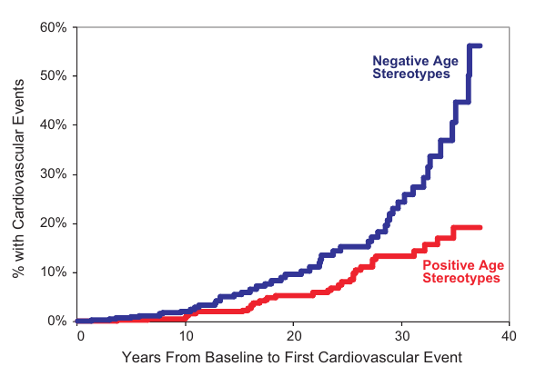
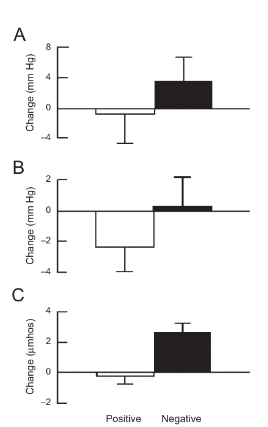

# 고정관념 체화: 노화에 대한 심리사회적 접근

> Becca Levy · Yale University School of Public Health, Social and Behavioral Sciences Program · Current Directions in Psychological Science, 18(6), 332-336 (2009)

## 초록

연구자들은 연령 고정관념을 지닌 젊은 사람들에서 그 고정관념의 대상이 되는 노인들에게로 점차 관심을 돌려 왔다. 이렇게 초점을 바꾼 연구는 노인 자신이 지닌 긍정적·부정적 연령 고정관념이 다양한 인지적·신체적 결과에 각각 유익하거나 해로운 영향을 줄 수 있음을 보여 주었다. 이 글은 그러한 실험연구와 종단연구를 토대로 고정관념 체화 이론을 제시한다. 이 이론에 따르면 주변 문화의 고정관념을 동화한 결과가 자기정의로 이어지고, 그 자기정의가 다시 기능과 건강에 영향을 줄 때 고정관념이 체화된다. 이론은 네 가지 구성요소를 갖는다. 고정관념은 (a) 생애 전반에 걸쳐 내면화되고, (b) 무의식적으로 작동할 수 있으며, (c) 자기관련성을 띨 때 현저성이 커지고, (d) 여러 경로를 활용한다. 이 이론과 이를 뒷받침하는 연구의 중심 메시지는 노화 과정이 부분적으로 사회적 구성물이라는 것이다.

## 노화에 대한 심리사회적 접근

노화 과정은 피할 수 없는 쇠퇴의 생리적 과정만으로 완전히 설명할 수 있다고 널리 가정된다. 이를 잘 보여 주는 문장은 다음과 같다. “생물노년학자와 일반인이 노화라는 용어를 사용할 때, 그들은 대개 ··· 성인기에 진행되는 점진적 악화를 뜻한다”(Masoro, 2006, p. 44). 그러나 이러한 필연성의 가정으로는, 예를 들어 노인의 건강에서 발견되는 상당한 문화적 차이를 설명할 수 없다. 그러므로 노화에 대한 심리사회적 접근이 필요하다. 이 글이 취하는 구체적인 접근은 연령 고정관념, 즉 노인 일반에 관한 믿음에 기초한다.

전통적으로 연령 고정관념 연구는 그 대상인 노인보다 고정관념을 적용하는 사람, 즉 젊은 성인에게 초점을 맞추었다. 그러나 최근에는 연구의 초점이 대상에게로 이동했다. 이렇게 초점을 바꾼 연구에는 노인을 대상으로 한 일련의 실험실 연구가 포함된다. 이 연구들은 긍정적·부정적 연령 고정관념이 다양한 인지기능 및 신체기능 결과에 각각 유익하거나 해로운 영향을 줄 수 있음을 보여 주었다. 그 결과가 좋지 않을 때에는 흔히 노화 과정이라고 부르는 것의 여러 측면, 예컨대 기억 수행, 균형, 보행 속도, 청력 등이 나타난다(예: Levy, 1996; Levy, Slade, & Gill, 2006; Levy & Leifheit-Limson, 2009).

노년기에 연령 고정관념이 자기 자신을 향하게 되는 시점부터 그것은 노화에 대한 자기지각으로 분류할 수 있다. 이러한 자기지각의 장기적 효과는 Ohio Longitudinal Study of Aging and Retirement 자료에 기초한 2개 연구에서 입증되었다. 연구 시작 시점에 50세 이상이었던 참여자들을 20년 넘게 추적했다(Levy, Slade, & Kasl, 2002; Levy, Slade, Kunkel, & Kasl, 2002). 시작 시점에 노화에 대한 자기지각이 더 긍정적이었던 참여자들은 연구기간 동안 기능적 건강이 더 좋았고, 더 부정적인 자기지각을 지녔던 사람들보다 평균 7.5년 더 오래 살았다. 시작 시점의 기능적 건강과 그 밖의 관련 변수를 조정한 뒤에도 이러한 건강상의 이점은 유지되었다(Levy, Slade, & Kasl, 2002; Levy, Slade, Kunkel, & Kasl, 2002). 이후 유럽과 아시아에서도 연령에 관한 믿음과 장기 건강의 비슷한 관계가 발견되었다. 그 가운데 독일 노인을 6년간 추적한 연구에서는 건강이 연령 고정관념을 예측하는 것보다 연령 고정관념이 건강을 유의하게 더 잘 예측했다(Wurm, Tesch-Römer, & Tomasik, 2007).

이러한 결과의 패턴이 생기는 과정을 설명하기 위해 이 글은 고정관념 체화 이론을 제시한다. 이 이론은 주변 문화의 고정관념을 동화한 결과가 자기정의로 이어지고, 그 자기정의가 다시 기능과 건강에 영향을 줄 때 고정관념이 체화된다고 본다. 이론에는 네 가지 구성요소가 있다. 고정관념은 (a) 생애 전반에 걸쳐 내면화되고, (b) 무의식적으로 작동할 수 있으며, (c) 자기관련성으로 인해 현저성이 커지고, (d) 여러 경로를 활용한다. 따라서 이 구성요소들은 두 방향으로 진행되는 하나의 과정을 이룬다. 하나는 사회에서 개인으로 향하는 하향식 방향이고, 다른 하나는 아동기에서 노년기로 이어지는 시간적 방향이다.

## 연령 고정관념 체화를 뒷받침하는 연구

### 생애 전반에 걸친 고정관념의 내면화

노인은 아동이 고정관념을 적용할 가능성이 가장 큰 사람들의 기준에 들어맞는다. 예를 들어 노인은 사실상의 분리를 경험한다(Bigler & Liben, 2007). 또한 아동은 자신을 위해 특별히 만들어진 매체를 포함해 주변 환경에서 연령 고정관념에 자주 노출된다. 한 예로 베스트셀러 아동문학 작가의 소설 첫머리는 중심인물을 “그 회색빛 늙은 물고기 같은 할머니 ··· 누렇게 바랜 이와 개의 엉덩이처럼 작고 오므라든 입을 하고 있었다”라고 묘사한다(Dahl, 1981, pp. 1-2).

사회에 널리 퍼진 연령 고정관념을 내면화하는 과정은 아동기 이후에도 계속된다(예: Levy & Banaji, 2002). 부정적 연령 고정관념이 자기 자신을 향하기 전에 그것을 접하면, 그 고정관념에 맞서 방어해야 한다는 필요를 느끼기 어렵다. 따라서 받아들일 가능성이 극대화된다. 더구나 젊은 성인은 부정적 연령 고정관념을 유지할 유인을 가질 수 있다. 그러한 고정관념이 단기적 이익을 주기 때문이다. 구체적으로 말하면, 고정관념에서 비롯되고 그 고정관념으로 정당화되는 차별로 인해 제한된 자원, 예컨대 지방자치단체 프로그램을 배분하는 사람이 젊은 성인에게 우선권을 줄 수 있다. 이러한 단기 이익은 부정적 연령 고정관념이 동시에 젊은 성인에게 주는 불이익, 예를 들어 노인과의 관계 악화보다 그것을 받는 사람에게 더 잘 보일 수 있다.

그러나 장기적으로 보면 이 사람들은 노년기까지 지니고 가는 부정적 연령 고정관념 때문에 해를 입을 수 있다. 최근 연구에서는 생애 초기에 지닌 부정적 연령 고정관념이 노년기의 더 나쁜 건강을 예측했다(Levy, Zonderman, Slade, & Ferrucci, 2009). 18세에서 49세 사이인 참여자 440명의 코호트에서, 시작 시점에 연령 고정관념이 더 부정적이었던 사람들은 심혈관질환 가족력 같은 관련 공변량을 조정한 뒤에도 이후 38년 동안 심혈관 사건을 경험할 가능성이 유의하게 더 높았다(그림 1 참조). 또한 18세에서 39세 사이인 더 젊은 하위표본 229명에서는 시작 시점에 연령 고정관념이 더 부정적이었던 사람들이 더 긍정적인 사람들보다 60세 이후 심혈관 사건을 경험할 가능성이 두 배 높았다. 이 결과 역시 관련 공변량을 조정한 뒤에 나타났다(Levy et al., 2009).

연령 고정관념에 대한 노출과 내면화는 노년기까지 이어지지만, 노인이 지닌 긍정적 고정관념과 부정적 고정관념의 비율에는 상당한 개인차가 있다(Levy & Langer, 1994; Levy et al., 2006). 이러한 차이는 노년기에 도달하기 전과 후 모두에서 미국 주류문화에 얼마나 깊이 들어가 있었는가로 일부 설명할 수 있다. 이 문화의 대표적인 예인 텔레비전은 노인을 자주 비하하는 방식으로 제시한다. 따라서 평생 텔레비전을 더 많이 시청한 노인은 더 부정적인 연령 고정관념을 지니는 경향이 있다(Donlon, Ashman, & Levy, 2005).

그림 1. 젊은 성인기에 지닌 부정적(파란색) 연령 고정관념과 긍정적(빨간색) 연령 고정관념이 이후 38년 동안 심혈관 사건, 예를 들어 울혈성 심부전, 심장마비, 뇌졸중의 위험과 보이는 관련성. 분석은 Baltimore Longitudinal Study of Aging 자료에 기초했다. Levy, Zonderman, Slade, and Ferrucci(2009), p. 297에서 수정했다.

### 연령 고정관념의 무의식적 작동

실험연구는 긍정적 연령 고정관념과 부정적 연령 고정관념이 모두 무의식 수준에서 활성화되어 예측된 방향으로 기능에 영향을 줄 수 있음을 보여 주었다(예: Levy, 2003). 이 효과는 learned나 confused 같은 연령 고정관념 단어를 컴퓨터 화면에 역하 속도로 번쩍 제시했을 때 나타났다. 대부분의 사람에게 55밀리초인 이 속도는 의식적으로 지각하지 못할 만큼 빠르지만 부호화할 수 있을 만큼은 느리다. 점화 절차에 관한 전체 설명은 Levy(1996)를 참조할 수 있다.

이러한 역하 연령 고정관념 연구 가운데 하나는 일반적으로 의식적으로 통제하지 않는 필적을 살펴보았다(Levy, 2000). 부정적 연령 고정관념 점화에 노출된 사람의 필적은 노출 전 표본과 비교했을 때 더 늙어 보였으며, 악화된, 노망이 든, 떨리는 특성이 유의하게 증가했다는 평가를 받았다. 반대로 긍정적 연령 고정관념 점화에 노출된 사람의 필적은 더 젊어 보였으며, 성취한, 자신감 있는, 지혜로운 특성이 유의하게 증가했다는 평가를 받았다(Levy, 2000).

또 다른 실험연구는 연령 고정관념이 무의식 수준에서 작동하여 살고자 하는 의지라는 마음상태에 영향을 줄 수 있는지를 검토했다(Levy, Ashman, & Dror, 2000). 노인 참여자에게 점화를 역하로 제시한 다음, 치명적일 수 있는 질병을 묘사한 상황을 보여 주었다. 그리고 저축을 잃고 가족에게 광범위한 돌봄 부담을 준다는 두 가지 비용이 생기더라도 생명연장 의료개입을 선택할 것인지 물었다. 긍정적 연령 고정관념 집단은 생명연장 개입을 받아들이는 경향이 있었고, 부정적 연령 고정관념 집단은 거부하는 경향이 있었다(Levy, Ashman, & Dror, 2000).

역하 점화 실험은 과정이 인식 없이 일어나므로 사회적으로 바람직하게 보이려는 반응이 개입할 가능성이 작고, 그만큼 참여자 반응의 진정성을 확보할 수 있다는 장점이 있다. 그러나 일상생활에서 노인이 부정적 연령 고정관념 자극을 알아차리지 못한다면 오히려 불리할 수 있다. 인지건강이나 신체건강의 악화를 환경의 힘이 아니라 노화 탓으로 돌리고, 그 결과 부정적 연령 고정관념을 다시 강화할 수 있기 때문이다.

### 자기관련성으로 인한 현저성 증가

객관적 기준에서 노년기의 시작은 개인이 여러 가지 자의적이고 일관되지 않은 날짜로 공식 규정된 문턱에 도달할 때 생긴다. 영화관에서 “경로” 할인을 받거나 Social Security에 가입하는 시점이 그 예다. 이러한 인위적 경계는 노년기가 멀리 떨어진 상태에서 현재 존재하는 상태로 바뀌었다고 개인이 인식할 때 생기는 주관적 노년기 시작과는 다르지만, 그 주관적 시작에 기여할 가능성이 있다.

이러한 통과는 자신이 노인인 다른 사람과 동일시하도록 만들기 때문에 연령 고정관념에 자기관련성, 즉 개인적 울림을 부여한다(Levy, 2003). 실험실 연구에서 연령 고정관념 점화가 노인 참여자에게 고정관념과 일치하는 효과를 낸 것은 참여자가 자신의 노인 정체성을 활성화했기 때문이라고 일부 설명할 수 있다. 반대로 젊은 참여자가 같은 실험에 포함되어 노인 참여자와 동일한 절차를 따랐을 때에는 효과가 없거나 훨씬 약한 경향이 있었다(예: Hess, Hinson, & Statham, 2004; Levy, 1996; Levy, Ashman, & Dror, 2000).

연령 고정관념이 개인에게 자기관련성을 띠는 과정은 자신이 늙었다는 것을 알려 주는 수많은 사회적 단서, 대개 비하적인 단서를 접하면서 촉진된다. 인종차별이나 성차별 같은 다른 형태의 편견·차별과 달리 연령차별은 정치적 올바름에 의해 금지되는 경향이 없기 때문에 이러한 단서는 널리 퍼져 있다. 처음에는 부정으로 단서를 물리칠 가능성도 있지만, 단서가 워낙 많아서 결국 저항을 넘어서는 경향이 있다(Levy & Banaji, 2002). 출생 때부터 낙인찍혀 자기 하위집단에서 대처전략을 배울 수 있는 사람과 달리, 개인은 부정적 연령 고정관념에 저항할 준비가 되지 않은 채 노년기에 들어가는 경향이 있다.

연령 고정관념을 자기관련적인 것으로 전환하도록 촉발하는 노년기 단서는 대인관계 수준에서 나타날 수 있다. 젊은 사람이 노인에게 잘난 체하며 말하는 방식이 한 예다. 노인이 고용이나 적절한 의료처치를 거부당할 때에는 제도 수준의 단서가 제시될 수 있다. 또는 한 대학병원의 노인 의사가 묘사했듯 제도적 환경에서 대인관계 단서를 마주할 때 두 수준이 합쳐질 수도 있다. “젊은 [의사]들은 우리가 시대에 뒤떨어졌거나 무능하거나, 드물지 않게 자신들이 자리를 넘겨받는 것을 우리가 막고 있다고 걱정하게 만든다”(Spiro, 2008, p. 563).

내면화된 연령 고정관념이 시간이 지나며 자기관련성을 띠는 경향이 있다는 선행연구의 가정을 검증하기 위해(Levy, 1996) 5년 종단연구가 수행되었다(Rothermund, 2005). 그 결과 “'전형적인 노인'과 연결된 속성이 노인의 현재 및 미래 자기관에 통합되는 경향이 있다”는 점이 발견되었다(Rothermund, 2005, p. 232).

### 여러 경로의 활용

연령 고정관념은 심리적·행동적·생리적인 세 경로를 따라 영향을 미치는 것으로 보인다. 심리적 경로의 대표 사례는 기대다. 최근 실험은 연령 고정관념이 자기충족적 예언으로 작동하는 기대를 만들어 내는 것으로 보인다는 점을 발견했다(Levy & Leifheit-Limson, 2009). 이 연구에서 노인들은 긍정적 인지 고정관념(예: wise), 부정적 인지 고정관념(예: senile), 긍정적 신체 고정관념(예: spry), 부정적 신체 고정관념(예: frail) 가운데 하나를 역하로 점화하는 집단에 무작위 배정된 뒤 인지과제와 신체과제를 모두 수행했다. 결과는 “고정관념 일치 효과”를 뒷받침했다(Levy & Leifheit-Limson, 2009, p. 232). 즉, 긍정적·부정적 연령 고정관념이 인지기능과 신체기능에 미치는 영향은 고정관념의 내용이 결과의 영역과 일치할 때 가장 컸다. 이러한 일치는 기대가 관련 결과를 향하도록 만들기 때문에 고정관념이 만들어 낸 기대의 힘을 키운 것으로 보였다. 또한 긍정적 연령 고정관념에 노출된 사람들은 인지과제와 신체과제 모두에서 부정적 연령 고정관념에 노출된 사람보다 수행이 좋았다(Levy & Leifheit-Limson, 2009).

연령 고정관념의 행동적 경로는 건강행동에서 볼 수 있다. 부정적 연령 고정관념은 건강문제가 나이 듦의 필연적 결과라는 가정에 흔히 기초하기 때문에 건강행동을 해도 소용없다고 여기게 하는 경향이 있다(Levy & Myers, 2004). 또한 부정적 연령 고정관념은 자기효능감을 저해할 수 있다(Levy, Hausdorff, Hencke, & Wei, 2000). 그러나 노화에 대한 자기지각이 더 긍정적인 노인은 더 부정적인 노인보다 이후 18년 동안 처방약 복용 같은 건강행동을 실천할 가능성이 유의하게 더 높았다(Levy & Myers, 2004).

연령 고정관념이 영향을 미치는 생리적 경로에는 환경 스트레스에 반응하는 중추신경계의 한 분지인 자율신경계가 관여할 가능성이 있다. 부정적 연령 고정관념에 역하로 노출된 노인은 수학 및 언어 과제로 유발된 스트레스에 대해 더 큰 심혈관 반응을 보였지만, 긍정적 연령 고정관념에 역하로 노출된 노인은 스트레스에 대한 심혈관 반응이 감소했다(그림 2 참조; Levy, Hausdorff, Hencke, & Wei, 2000). 스트레스에 대한 심혈관 반응이 반복해서 높아지면 심장문제에 취약해진다. 이는 생애 초기에 지닌 부정적 연령 고정관념을 노년기까지 가져가는 것이 심혈관 사건의 위험을 유의하게 높인 이유를 설명할 수도 있다(Levy et al., 2009). 또한 부정적 연령 고정관념은 급성 심혈관 사건에서 회복하는 데 부정적인 영향을 줄 수 있다(Levy, Slade, May, & Caracciolo, 2006).

그림 2. 역하로 점화한 연령 고정관념이 (A) 수축기 혈압, (B) 이완기 혈압, (C) 피부전도도에 미친 영향. 긍정적 연령 고정관념은 스트레스에 대한 심혈관 반응을 감소시켰고, 부정적 연령 고정관념은 그 반응을 증가시켰다. B.R. Levy, J.M. Hausdorff, R. Hencke, & J.W. Wei의 “Reducing Cardiovascular Stress With Positive Self-Stereotypes of Aging,” 2000, Journals of Gerontology, Series B: Psychological Sciences and Social Sciences, 55, p. P211에서 재수록했다. Copyright 2000, Gerontological Society of America. 허가를 받아 재수록했다.

## 향후 연구 방향

지금까지 살펴보았듯, 연령 고정관념을 통해 개인을 식별하는 매우 비인격적인 방식이 기능과 건강이라는 매우 개인적인 방식으로 그 사람에게 영향을 줄 수 있다. 그러나 연령 고정관념이 미치는 영향의 전체 범위는 추가 연구를 통해서만 확인할 수 있다. 또한 어떤 연령 고정관념의 영향이 가장 큰지, 어떤 영역·개인·집단이 그 영향에 가장 취약한지를 더 넓고 깊게 이해할 필요가 있다.

부정적 연령 고정관념이 주는 해로운 효과는 노인의 긍정적 연령 고정관념이 일상생활에서 미치는 영향을 극대화할 개입을 개발해야 한다는 점을 가리킨다. 긍정적 고정관념과 부정적 고정관념을 역하 점화로 활성화한 실험실 연구는 그러한 개입의 가능성을 보여 주었다. 남은 과제는 긍정적 연령 고정관념의 활성화를 지속적으로 이루는 것이다.

이 논문은 고정관념 체화가 고정관념으로 낙인찍힌 모든 집단에 확장되는 현상이라고 주장하려 하지 않았다. 실제로 연령 고정관념이 다른 고정관념과 다른 측면이 있다. 예를 들어 노인을 고정관념의 대상으로 삼는 모든 젊은 사람은 충분히 오래 살면 결국 그 집단에 들어간다. 또한 부정적 형태의 연령 고정관념에는 흔히 언급되는 쇠약의 궁극적 결과인 죽음의 전망이 스며들어 있을 수 있다. 그럼에도 적어도 일부 전제가 적어도 일부 다른 대상 집단에 적용되고, 적어도 일부 기능이 영향을 받는다는 징후가 있다. 고정관념 체화가 다른 집단에도 적용될 수 있는지는 향후 연구에서 평가해야 한다.

## 추천 읽기

Butler, R. (2008). Ageism: Another form of bigotry. In The longevity revolution: The benefits and challenges of living a long life (pp. 40-59). New York: Public Affairs. 이 장은 노인이 사회에서 낙인찍히는 광범위한 방식을 제시한다.

Mead, G.H. (1934). Mind, self, and society (C.W. Morris, Ed.). Chicago: University of Chicago Press. 공동체의 태도가 개인의 자기지각에 영향을 미치는 과정을 고전적으로 설명한 책이다.

O’Brien, L.T., & Hummert, M.L. (2006). Memory performance of late middle-aged adults: Contrasting self-stereotyping and stereotype threat accounts of assimilation to age stereotypes. Social Cognition, 24, 338-358. 이 실험은 서로 다른 두 접근을 검증했다. 하나는 현재 Current Directions 논문에서 보고한 연구에 근거한 내면화된 연령 고정관념의 가정이고, 다른 하나는 고정관념 위협 이론이다. 저자들은 후자가 아니라 전자가 기억수행의 결함을 설명한다는 점을 발견했다.

## 감사의 말

이 연구는 Patrick and Catherine Weldon Donaghue Medical Research Foundation Investigator Award, National Heart, Lung, and Blood Institute 연구비(R01HL089314), National Institute on Aging 연구비(K01AG001051, R01AG032284)의 지원을 받았다.

## 참고문헌

Bigler, R.S., & Liben, L.S. (2007). Developmental intergroup theory: Explaining and reducing children’s social stereotyping and prejudice. Current Directions in Psychological Science, 16, 162-166.

Dahl, R. (1981). George’s Marvelous Medicine. New York: Puffin Books.

Donlon, M., Ashman, O., & Levy, B.R. (2005). Re-vision of older television characters: A stereotype-awareness intervention. Journal of Social Issues, 61, 307-319.

Hess, T.M., Hinson, J.T., & Statham, J.A. (2004). Explicit and implicit stereotype activation effects on memory: Do age and awareness moderate the impact of priming? Psychology and Aging, 19, 495-505.

Levy, B. (1996). Improving memory in old age through implicit self-stereotyping. Journal of Personality & Social Psychology, 71, 1092-1107.

Levy, B., & Langer, E. (1994). Aging free from negative stereotypes: Successful memory in China and among the American deaf. Journal of Personality and Social Psychology, 66, 989-997.

Levy, B.R. (2000). Handwriting as a reflection of aging self-stereotypes. Journal of Geriatric Psychiatry, 33, 81-94.

Levy, B.R. (2003). Mind matters: Cognitive and physical effects of aging self-stereotypes. Journals of Gerontology, Series B: Psychological Sciences and Social Sciences, 58, P203-P211.

Levy, B.R., Ashman, O., & Dror, I. (2000). To be or not to be: The effects of aging stereotypes on the will to live. Omega, 40, 409-420.

Levy, B.R., & Banaji, M.R. (2002). Implicit ageism. In T. Nelson (Ed.), Ageism: Stereotyping and prejudice against older persons. Cambridge, MA: MIT Press.

Levy, B.R., Hausdorff, J.M., Hencke, R., & Wei, J.Y. (2000). Reducing cardiovascular stress with positive self-stereotypes of aging. Journals of Gerontology, Series B: Psychological Sciences and Social Sciences, 55, P205-P213.

Levy, B.R., & Leifheit-Limson, E. (2009). The stereotype-matching effect: Greater influence on functioning when age stereotypes correspond to outcomes. Psychology and Aging, 24, 230-233.

Levy, B.R., & Myers, L.M. (2004). Preventive health behaviors influenced by self-perceptions of aging. Preventive Medicine, 39, 625-629.

Levy, B.R., Slade, M.D., & Gill, T.M. (2006). Hearing decline predicted by elders’ stereotypes. Journals of Gerontology, Series B: Psychological Sciences and Social Sciences, 61, P82-P87.

Levy, B.R., Slade, M.D., & Kasl, S.V. (2002). Longitudinal benefit of positive self-perceptions of aging on functional health. Journals of Gerontology, Series B: Psychological Sciences and Social Sciences, 57, P409-P417.

Levy, B.R., Slade, M.D., Kunkel, S.R., & Kasl, S.V. (2002). Longevity increased by positive self-perceptions of aging. Journal of Personality and Social Psychology, 83, 261-270.

Levy, B.R., Slade, M.D., May, J., & Caracciolo, E.A. (2006). Physical recovery after acute myocardial infarction: Positive age self-stereotypes as a resource. International Journal of Aging and Human Development, 62, 285-301.

Levy, B.R., Zonderman, A., Slade, M.D., & Ferrucci, L. (2009). Negative age stereotypes held earlier in life predict cardiovascular events in later life. Psychological Science, 20, 296-298.

Masoro, E.J. (2006). Are age-associated diseases an integral part of aging? In E.J. Masoro & S.N. Austad (Eds.), Handbook of the biology of aging. (6th ed., pp. 43-62) New York: Academic Press.

Rothermund, K. (2005). Effects of age stereotypes on self-views and adaptation. In W. Greve, K. Rothermund, & D. Wentura (Eds.), The adaptive self. (pp. ??-??) Cambridge, MA: Hogrefe & Huber.

Spiro, H. (2008). The aptitude of aging. Connecticut Medicine, 72, 563-564.

Wurm, S., Tesch-Römer, C., & Tomasik, M.J. (2007). Longitudinal findings on aging-related cognitions, control beliefs and health in later life. Journals of Gerontology Series B: Psychological Sciences and Social Sciences, 62, P156-P164.
