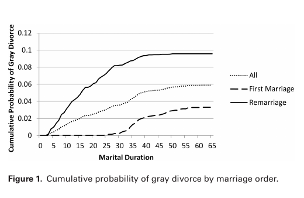
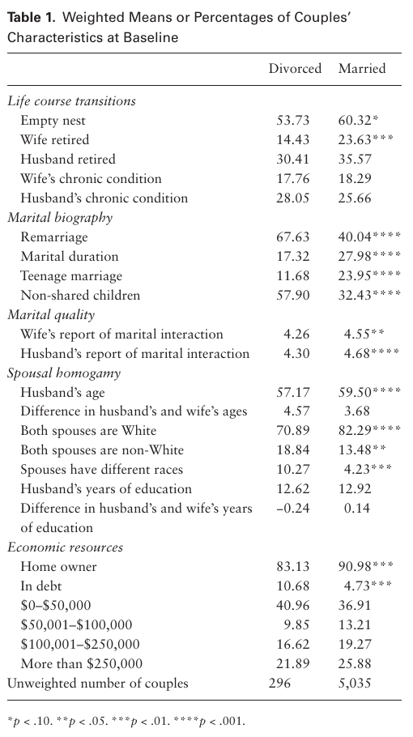
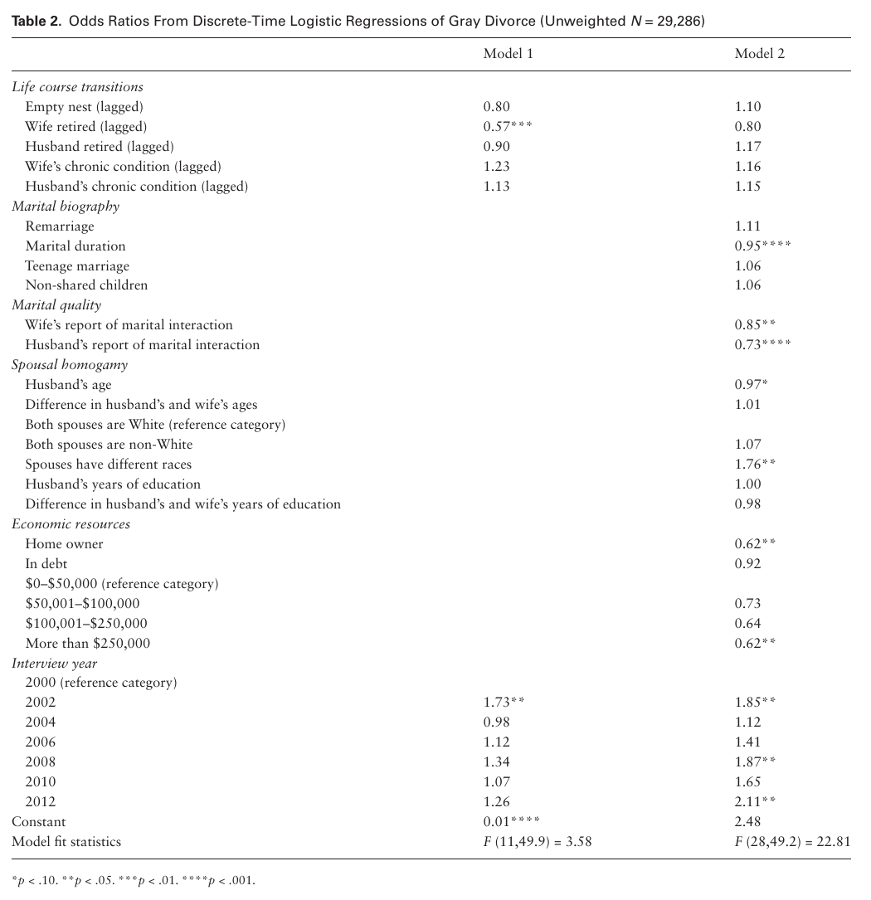

# 황혼이혼의 선행요인: 생애과정 관점

> I-Fen Lin · Susan L. Brown · Matthew R. Wright · Anna M. Hammersmith

> 미국 오하이오주 Bowling Green State University 사회학과. *The Journals of Gerontology: Series B, Social Sciences*, 73(6), 1022–1031 (2018). DOI: 10.1093/geronb/gbw164. 온라인 선게재 2016년 12월 15일.

> 교신: I-Fen Lin, PhD, Department of Sociology, Bowling Green State University, 217 Williams Hall, Bowling Green, OH 43403; ifenlin@bgsu.edu. 접수 2016년 7월 18일, 편집 결정 2016년 11월 18일. 담당 편집자: Deborah Carr, PhD.

> © 저자 2016. The Gerontological Society of America를 대신하여 Oxford University Press가 출판했다. 모든 권리를 보유한다. 허가 문의 이메일: journals.permissions@oup.com.

## 초록

**목적:** 이혼을 경험하는 노인이 점점 늘고 있지만, 50세 이후의 이혼(‘황혼이혼’이라 함)과 관련된 위험요인에 관해서는 알려진 바가 거의 없다. 본 연구는 생애과정 관점에 따라 노년기의 주요 전환점이 황혼이혼과 관련되는지를 살펴보았다.

**방법:** 1998–2012년 Health and Retirement Study 자료를 사용하여 황혼이혼의 선행요인을 부부 단위의 전향적 이산시간 사건사 분석으로 검토했다. 모형에는 주요 전환점(빈 둥지, 은퇴, 건강 악화)과 인구학적 특성 및 경제자원을 포함했다.

**결과:** 예상과 달리 빈 둥지의 시작, 아내나 남편의 은퇴, 아내나 남편의 만성질환은 황혼이혼 가능성과 관련이 없었다. 오히려 젊은 성인의 이혼과 전통적으로 관련된 요인들이 노인에게도 중요했다. 결혼기간, 결혼의 질, 주택 소유, 자산은 황혼이혼 위험과 부적으로 관련되었다.

**논의:** 황혼이혼은 사회경제적으로 불리한 부부에게서 특히 발생할 가능성이 크며, 이는 황혼이혼이 개인의 건강과 안녕에 미치는 결과에 관한 새로운 질문을 제기한다.

## 핵심어

만성질환—빈 둥지—결혼이력—결혼의 질—은퇴

중년 및 노년 성인의 이혼이 증가하고 있다. 최근 연구에 따르면 50세 이상인 사람의 이혼을 가리키는 황혼이혼의 비율은 1990년부터 2010년 사이 두 배로 증가했다(Brown & Lin, 2012). 황혼이혼율의 두 배 증가와 인구고령화가 결합하면서 오늘날 이혼을 경험하는 사람 가운데 생애 후반기에 있는 사람의 비중이 커졌다. 1990년에는 이혼하는 사람 10명 중 1명 미만이 50세 이상이었다. 2010년에는 그 비중이 4명 중 1명을 넘어섰다(Brown & Lin, 2012). 이제 황혼이혼은 전체 이혼에서 상당한 비중을 차지한다.

황혼이혼율의 급격한 증가에도 불구하고 노년기 이혼의 선행요인에 관해서는 알려진 바가 거의 없다(Wu & Schimmele, 2007). 1980년대와 1990년대 초에 발표된 소수의 연구가 노인의 이혼과 관련된 요인을 살펴보았지만, 이 연구들은 황혼이혼의 증가보다 앞서 이루어졌기 때문에 이제는 시의성이 떨어진다(Berardo, 1982; Hammond & Muller, 1992; Uhlenberg & Myers, 1981). 10여 년 전 AARP는 40세 이후 이혼에 관한 횡단연구를 수행했지만 이혼 전 특성은 포착하지 못했다(Montenegro, 2004). 보다 최근에 Brown과 Lin(2012)은 지난 수십 년간 황혼이혼율이 상승했음을 기록했으나, 기본적인 횡단면 인구총조사 자료를 사용한 분석이어서 황혼이혼 관련 요인을 제한적으로만 평가했다. 또한 Karraker와 Latham(2015)은 건강 악화가 황혼이혼과 관련되는지를 살펴보았지만, 연구 시작 시 신체적으로 건강했던 선별된 부부 표본에 의존했으므로 그 결과를 황혼이혼 위험에 놓인 모든 기혼 노인에게 일반화할 수 없다. 요컨대 연구는 황혼이혼의 위험요인을 규명하지 못했으며, 황혼이혼율의 가속화를 고려하면 이는 놀라운 공백이다.

본 연구는 1998–2012년 Health and Retirement Study(HRS)의 전향적 종단자료를 사용하여 배우자 중 적어도 한 명이 50세 이상인 기혼부부의 이혼과 관련된 요인을 살펴본다. 생애과정 관점에 따라 중·노년기에 이혼 위험을 높일 수 있는 세 가지 주요 전환점, 즉 빈 둥지, 은퇴, 건강 악화에 초점을 맞춘다. 다른 인구학적·경제적 특성을 통제한 뒤에도 이러한 전환점이 황혼이혼과 관련되는지를 검토한다. HRS는 대규모 기혼부부 표본에 관한 시간가변 정보를 포함하므로 연구 목적에 이상적이다. 실제로 HRS는 부부 양쪽의 자료를 제공하여 아내와 남편 모두의 특성과 경험을 포함하는 부부 단위 모형화를 가능하게 한다. 본 연구 결과는 중·노년기 부부의 이혼 위험과 관련된 요인을 밝힘으로써 황혼이혼에 관한 새로운 통찰을 제공할 것이다.

## 배경

1990년에는 50세 이상 기혼자 1,000명 가운데 약 5명이 지난 1년 사이 이혼을 경험했다. 2010년에는 그 수가 1,000명당 10명으로 두 배가 되었다(Brown & Lin, 2012). 비교하면 중년(50–64세) 성인의 이혼율은 1990년부터 2010년 사이 1,000명당 7명에서 13명으로 증가했다. 노년(65세 이상) 성인은 절대 수준이 상당히 낮았지만, 이 연령집단의 이혼율은 이 20년 동안 1,000명당 1.8명에서 4.8명으로 거의 세 배가 되었다. 더 넓은 맥락에서 보면 이러한 양상은 두드러진다. 이 20년 동안 전체 이혼율은 상당히 안정적이었던 반면 황혼이혼율은 상승했다(Kennedy & Ruggles, 2014).

황혼이혼의 혁명은 예상 밖의 일이 아니었다. 30여 년 전부터 연구자들은 노인의 이혼이 증가하는 추세가 될 것이라고 주장했다(Berardo, 1982; Hammond & Muller, 1992). Uhlenberg와 Myers(1981)는 노인의 이혼율이 상승할 몇 가지 이유를 제시했다. 첫째, 생애과정의 앞선 단계에서 경험한 이혼을 반영하여 고차 결혼에 있는 노인의 비중이 커지고 있다. 오늘날 노인은 젊은 성인기에 1970년대의 이혼 혁명을 경험한 세대다. 이들 이혼자 가운데 많은 사람이 결국 재혼했으며, 재혼은 초혼보다 이혼으로 끝날 가능성이 훨씬 크다. 둘째, 미국에서 이혼은 흔하므로, 노인 자신이나 주변 사람이 이혼을 경험함에 따라 앞으로도 노인은 이혼을 더 수용할 것이다. 셋째, 아내의 취업 증가는 여성이 결혼 밖에서도 스스로를 부양할 경제적 자율성을 제공하므로 이혼을 실행 가능한 선택으로 만든다. 마지막으로 기대수명의 증가는 궁극적으로 결혼이 사망으로 끝날 가능성을 낮추고 이혼 위험에 노출되는 기간을 늘린다(Uhlenberg & Myers, 1981).

### 황혼이혼에 대한 생애과정 관점

황혼이혼에 앞서 노년기를 고유하게 특징짓는 생애과정 경험이 나타날 수 있다. 빈 둥지, 은퇴, 건강 악화는 노년기의 규범적 사건으로서 부부의 결혼생활에서 ‘전환점’(Elder, Johnson, & Crosnoe, 2003)으로 작용하여 궁극적으로 결혼 안정성을 약화시킬 수 있다. 생애 중년기에는 대부분의 기혼부부가 자녀를 양육한다. 빈 둥지는 결혼생활의 새로운 장을 연다. 한편으로 자녀가 독립하는 단계는 부부의 가사 부담이 줄어 함께 보낼 시간이 늘어남을 뜻한다. 빈 둥지로 전환한 뒤 결혼만족도는 대체로 소폭 상승한다(Gorchoff, John, & Helson, 2008). 다른 한편으로 동거 자녀가 없어지면 이혼을 가로막던 잠재적 장벽도 제거된다. 어떤 부부에게는 자녀가 관계를 붙들어 두는 접착제다. 빈 둥지는 동거 자녀라는 완충장치가 사라지면서 드러나는 부부관계의 긴장이나 거리를 적나라하게 보여 줄 수 있다. 한 연구는 빈 둥지가 중년층의 더 높은 이혼 위험과 관련된다고 밝혔다(Hiedemann, Suhomlinova & O’Rand, 1998).

은퇴하면 부부 활동에 쓸 시간이 늘고 부부관계로 파급될 수 있는 직무 스트레스는 줄어든다. 은퇴는 전통적으로 부부의 황금기를 나타내는 표지이지만, 이 경험 역시 빈 둥지와 매우 비슷하게 작용하는 전환점이 될 수 있다. 관계가 견고한 부부에게 은퇴는 해롭지 않거나 오히려 유익할 수 있다(Wickrama, O’Neal, & Lorenz, 2013). 공통점이 거의 없거나 서로 멀어진 배우자들은 은퇴를 계기로 결혼생활을 재평가하고 관계를 끝내기로 할 수 있다(Canham, Mahmood, Stott, Sixsmith, & O’Rourke, 2014).

건강문제는 연령과 함께 증가한다. 건강 악화는 배우자가 새로운 현실에 적응하는 과정에서 부부관계의 역학을 근본적으로 바꿀 수 있다. 건강 악화는 결혼의 질에 파급효과를 미쳐 결혼 안정성을 낮추고 이혼 가능성을 높일 수 있다(Yorgason, Booth, & Johnson, 2008). 또한 배우자는 주된 돌봄제공자이며, 돌봄 스트레스는 흔히 부부갈등을 일으켜(Booth & Johnson, 1994) 이혼 가능성을 높일 수 있다. 건강한 중년부부 가운데 아내에게 질병이 시작되는 것은 이혼과 정적으로 관련된다. 그러나 남편의 질병 시작은 이혼 위험과 관련이 없다(Karraker & Latham, 2015).

이러한 생애과정 경험은 시간이 흐르면서 대체로 낮아지고 이혼과 부적으로 관련되는 결혼의 질을 통해 작용할 가능성이 있다(Karraker & Latham, 2015; Umberson, Williams, Powers, Chen, & Campbell, 2005). 질 높은 결혼은 이러한 생애과정 경험에 덜 취약하여 변화에 대한 완충장치를 제공할 수 있다. 실제로 이 모든 전환은 배우자가 서로 더 자주 접촉하게 하는데, 결혼의 질이 높은 부부에게는 바람직해 보이지만 질이 낮은 결혼에는 잠재적으로 혼란을 일으킬 수 있다.

### 황혼이혼의 인구사회학적 예측요인

많은 노인에게 노년기 생애과정을 상징하는 주요 전환점 외에도 일반 인구의 이혼과 관련된 여러 요인이 있으며(Amato, 2010; White, 1990), 따라서 본 연구는 이 요인들이 황혼이혼에도 관련되는지 살펴본다. 이 요인들은 결혼 생애과정을 더 폭넓게 특징짓고, 그런 점에서 생애과정 관점의 주요 주제와 부합한다(Elder, 1994; Spitze & South, 1985).

#### 결혼이력

생애과정 관점에 따르면 현재의 사건과 경험은 앞선 전환과 연결된다(Elder, 1994; Uhlenberg, 1996). 결혼차수와 결혼기간으로 포착한 결혼이력은 황혼이혼 위험을 이해하는 데 필수적이다. 황혼이혼율은 초혼인 사람보다 재혼한 사람에게서 2.5배 높다. 황혼이혼을 경험한 사람의 약 절반은 재혼 중이었다. 반대로 결혼상태를 유지한 사람의 80%는 초혼 중이었다. 결혼차수에 따른 차이는 부분적으로 결혼기간별 이혼 위험의 차이를 반영한다. 결혼기간이 짧은 결혼은 긴 결혼보다 황혼이혼 위험이 높고, 짧은 결혼에는 재혼이 불균형하게 많이 포함된다(Brown & Lin, 2012). 또한 십대에 결혼하는 것은 잘 확립된 이혼 위험요인이다. 1970년대와 1980년대에 결혼한 여성 가운데 십대에 결혼한 사람은 더 늦은 나이에 결혼한 사람보다 이혼 위험이 두 배 높았다(Martin & Bumpass, 1989). 따라서 십대 결혼은 오늘날 중년 및 노년 성인의 황혼이혼 승산 증가와 관련될 수 있다. 마지막으로 재혼가족은 특히 해체될 가능성이 크다(Sweeney, 2010). 재혼가족의 핵심 특징인 비공유 자녀는 흔히 기혼부부에게 결혼을 불안정하게 할 수 있는 중대한 관계상의 어려움을 일으킨다(Hetherington & Jodl, 1994). 재혼한 사람의 황혼이혼 위험이 높다는 점을 고려하여(재혼 가운데 전부는 아니지만 많은 경우 비공유 자녀가 있을 수 있다), 본 연구는 비공유 자녀가 황혼이혼 위험과 독립적으로 정적 관련을 보이는지 검토한다.

#### 결혼의 질

개인은 사회적 상황이 제공하는 기회와 제약 안에서 자신이 내리는 선택을 통해 자기 생애궤적을 구성한다(Elder, 1994). 평생 지속되는 제도로서 결혼이라는 규범은 약화되고 있는 듯하다. 한두 세대 전이라면 부부는 이혼하기보다 이처럼 껍데기만 남은 결혼을 유지했을 수도 있다. 오늘날에는 개인화된 결혼이라는 규범과 결혼과 개인적 성취 사이의 연결이 이혼의 낙인을 줄였다. 자기성취, 의사소통, 유연한 역할에 대한 강조는 결혼에 높은 가치를 부여한다는 신호인 동시에, 질 낮은 결혼에 대한 해결책으로 이혼을 받아들일 수 있음을 시사한다(Cherlin, 2009).

#### 배우자 동질혼과 공동 경제자원

부부의 삶은 상호의존적으로 연결되어 있다. 연령·인종·교육이 서로 다른 배우자는 가치관이 다를 수 있으므로 이혼 위험이 더 크다. 선행연구는 연령과 대학교육이 황혼이혼과 부적으로 관련되고 흑인은 백인과 히스패닉보다 황혼이혼 위험이 높음을 보여 주었지만(Brown & Lin, 2012), 배우자 동질혼이 황혼이혼 위험과 어떻게 관련되는지에 관한 경험적 증거는 제한적이다. Karraker와 Latham(2015)은 남편이 아내보다 훨씬 나이가 많은 경우 황혼이혼을 경험할 가능성이 더 크다고 밝혔다. 인종과 교육에서의 배우자 이질혼은 황혼이혼과 관련이 없다(Wilson & Waddoups, 2002). 또한 가구자산과 주택 소유는 이혼 승산 감소와 관련되는 두 요인이지만, 지금까지의 제한된 증거는 황혼이혼과의 유의한 관련을 보여 주지 않는다(Karraker & Latham, 2015). 이러한 지표와 황혼이혼 사이에 관련이 나타나지 않은 것은 신체적으로 건강한 부부에서 질병 시작이 황혼이혼에 미치는 역할에 초점을 둔 Karraker와 Latham(2015)의 선별 표본에서 비롯된 결과일 수 있다. 본 연구는 황혼이혼 위험에 놓인 기혼부부의 전국 대표 표본에서 이러한 요인을 검토한다.

## 본 연구

본 연구는 빈 둥지, 은퇴, 건강 악화를 포함한 주요 생애사건이 표준적인 이혼 예측요인(즉, 결혼이력, 결혼의 질, 배우자 동질혼, 경제자원)을 통제한 뒤에도 황혼이혼 위험과 어떻게 관련되는지를 살펴보도록 설계되었다. Brown과 Lin(2012)의 횡단면 증거를 고려하면 전통적인 이혼 예측요인 가운데 다수가 황혼이혼에도 비슷하게 작용할 것으로 예상하지만, 이러한 통상적 요인 외에도 노년기로의 전환을 대표하며 황혼이혼 위험에 중요한 역할을 할 가능성이 큰 고유한 생애사건이 있다.

노년기를 고유하게 특징짓는 세 가지 전환점과 황혼이혼의 관련성을 살펴봄으로써 본 연구는 생애과정 관점의 핵심 원칙에 부합한다. 또한 결혼차수, 결혼기간, 십대 결혼, 비공유 자녀를 포함하는 결혼이력이 황혼이혼 가능성과 어떻게 관련되는지도 조사한다. 과거에 이혼했거나 결혼기간이 짧은 사람은 계속 결혼상태를 유지했거나 결혼기간이 긴 사람보다 다시 이혼할 가능성이 크다. 마찬가지로 십대 결혼과 비공유 자녀는 잘 알려진 이혼 예측요인이다(Amato, 2010). 본 연구는 결혼차수와 결혼기간이 황혼이혼 가능성에 미치는 주효과와 상호작용효과를 모두 검토한다. 결혼차수와 황혼이혼의 관련성은 결혼기간이 길어질수록 약해질 수 있다. 결혼차수는 주요 생애사건(즉, 빈 둥지, 은퇴, 건강 악화)이 이혼과 관련되는 방식의 조건이 될 수도 있다. 고차 결혼을 한 사람은 초혼인 사람보다 이러한 잠재적 스트레스 전환에 대처할 수 있도록 결혼에 투자한 시간이 짧았으므로, 이 사건들은 초혼보다 재혼 중인 사람에게 더 큰 영향을 미칠 수 있다.

또한 인간 행위주체성이라는 생애과정 원칙에 따라, 질이 낮은 결혼 중인 오늘날의 중년 및 노년 성인이 이혼할 가능성이 더 큰지를 살펴보고 주요 생애사건과 황혼이혼 사이의 관련성이 결혼의 질에 의해 조절되는지도 검토한다. 마지막으로 생애과정 관점에 맞추어 배우자들의 생애과정 궤적 사이의 상호의존성을 인식한다. 이혼을 요구하는 사람이 배우자 중 한 명뿐일 수 있지만, 연령·인종·교육과 공동 경제자원 등 배우자 양쪽의 특성이 궁극적으로 이혼 가능성을 형성한다. 요컨대 본 연구는 남편과 아내 모두의 생애과정 사건과 특성을 포착하여 황혼이혼과 관련된 위험요인을 부부 단위에서 전향적으로 검토함으로써 소수의 선행연구를 넘어선다.

## 방법

분석자료는 1960년 이전에 태어난 미국인과 그 배우자로 이루어진 전국 대표 연속 코호트의 종단연구인 1998–2012년 HRS에서 얻었다. HRS는 빈 둥지, 은퇴, 건강상태, 인구사회학적 특성을 포함한 다양한 주제를 다룬다. 연구기간의 결합 해체에 관한 상세 정보와 완전한 결혼이력을 이용할 수 있어 본 연구 목적에 이상적인 자료다. HRS는 1931–1941년 출생자 코호트(HRS 코호트)를 대상으로 1992년에 면접을 시작했으며 이후 격년으로 재면접을 실시했다. 1998년에는 HRS 코호트에 Asset and Health Dynamics among the Oldest Old 연구(AHEAD 코호트), 1924–1930년에 태어난 새로운 코호트(대공황기 자녀[CODA] 코호트), 1942–1947년 출생자를 보충한 표본(전쟁아기[WB] 코호트)을 결합하여 50세 이상 인구의 전국 대표 표본을 구성했다. 본 연구는 AHEAD와 CODA 코호트가 68세 이상이 되어서야 연구에 들어왔고 황혼이혼은 50–64세 사이에 가장 흔히 발생하기 때문에 HRS와 WB 코호트만 다룬다(Brown & Lin, 2012). 각각 2004년과 2010년에 HRS에 추가된 최근의 두 코호트도 결혼의 질 문항을 묻지 않았기 때문에 분석에서 제외했다. 원래 HRS와 WB 기초선 면접의 응답률은 각각 82%와 70%였고, 재면접 응답률은 90%를 넘었다. 본 연구에서는 흑인·히스패닉·플로리다 거주 응답자의 불균등한 선택확률, 무응답, 표본탈락을 조정하기 위해 표본가중치를 사용했다(Ofstedal, Weir, Chen, & Wagner, 2011).

먼저 모든 HRS 응답자의 결혼이력 파일을 구축했다. 모든 기혼자를 추출한 뒤 파일을 개인 단위에서 부부 단위로 전환했다. HRS는 주응답자와 그 배우자를 면접하므로 아내와 남편 양쪽의 자료를 제공한다. 배우자 중 한 명이 응답하지 않은 부부의 경우 면접한 배우자가 보고한 정보에 의존했다. 드물게 보고가 서로 일치하지 않으면 아내의 정보를 사용했다. HRS 표본은 배우자 중 적어도 한 명이 HRS 또는 WB 코호트의 구성원이며 1998년 이후 면접에 참여한 기혼부부 5,566쌍으로 이루어졌다. 1998–2012년 동안 일부 응답자는 황혼이혼을 경험한 뒤 새 배우자와 재혼했다. 기혼부부 가운데 218쌍이 이 경우에 해당했다. 응답자마다 표본에 하나의 결혼만 기여하도록 새 배우자와 이루어진 이 218건의 재혼을 제외했다. 또한 동성부부(n = 11), 한 차례 자료수집 시점에서만 관찰된 부부(n = 189), 기초선 가중치가 0인 부부(n = 35)를 제외하여 최종적으로 부부 5,331쌍(부부-면접-연도 관측치 29,286개)을 분석했다.

### 측정

종속변수인 이혼은 해당 부부-면접-연도에 부부가 이혼했으면 1, 그렇지 않으면 0으로 코딩했다.

#### 세 가지 핵심 생애과정 전환

빈 둥지의 시작은 부부의 자녀가 집을 떠난 경우 1, 그렇지 않은 경우 0으로 코딩했다. 아내와 남편의 은퇴 시작은 본인이 (부분적으로) 은퇴했다고 보고한 경우 1, 그렇지 않은 경우 0으로 코딩했다. Karraker와 Latham의 연구(Karraker & Latham, 2015)에 따라 아내 또는 남편이 의사로부터 심장질환, 암, 폐질환, 뇌졸중 진단을 받았다고 보고하면 만성질환이 있는 것으로 코딩했다(1 = 예, 0 = 아니요). 부부가 빈 둥지를 경험하거나, 아내 또는 남편이 은퇴하거나, 아내 또는 남편이 만성질환 진단을 받은 뒤에는 남은 관찰기간 전체에 해당 생애전환 변수를 1로 코딩했다. 부부의 빈 둥지 상태, 아내와 남편의 은퇴 상태, 아내와 남편의 만성 건강상태는 모두 시간가변 변수였으며, 이혼보다 앞선 시간순서를 확립하기 위해 다변량 분석에서 한 면접 차수(즉, 2년)만큼 시차를 두었다. 예를 들어 이 전략은 t-2 시점의 빈 둥지 시작이 t 시점의 황혼이혼을 예측한다고 가정했다.

#### 결혼이력

재혼은 배우자 중 적어도 한 명이 현재 결혼 전에 결혼한 적이 있는지를 나타내는 시간불변 공변량이었다(1 = 예, 0 = 아니요). 결혼기간은 현재 결혼에서 보낸 연수를 나타내는 시간가변 공변량이었다. 시간불변 변수인 십대 결혼은 부부가 결혼할 당시 아내나 남편이 20세 미만이었음을 나타냈다(1 = 예, 0 = 아니요). 비공유 자녀 역시 시간불변 측정치로, 배우자 외 다른 상대와 낳은 자녀가 적어도 한 명 있는 부부(1로 코딩)와 공동 자녀만 있거나 자녀가 없는 부부(0으로 코딩)를 구분했다.

#### 결혼의 질

아내와 남편 각각의 부부 상호작용을 측정했다. 이 측정치는 여가시간을 어떻게 배분하는지에 관한 아내와 남편의 보고(1 = 대부분 함께, 2 = 일부는 함께하고 일부는 따로, 3 = 대부분 따로)와 함께 보낸 시간을 얼마나 즐기는지에 관한 보고(1 = 극도로 즐거움, 2 = 매우 즐거움, 3 = 어느 정도 즐거움, 4 = 별로 즐겁지 않음)를 나타내는 두 문항으로 구성했다. 함께 보낸 시간이 별로 즐겁지 않다고 보고한 응답자가 적었기 때문에 Bulanda의 연구(Bulanda, 2011)와 마찬가지로 이 응답범주를 ‘어느 정도 즐거움’과 합쳤다. 두 문항의 응답을 합산한 뒤 역코딩하여, 값이 높을수록 더 긍정적인 부부 상호작용을 나타내게 했으며 범위는 2–6이었다. 이 문항들은 부부가 처음 면접했을 때만 질문했으므로 아내와 남편이 보고한 결혼의 질을 시간불변 공변량으로 처리했다. 1992년에 처음 면접하고 1998년에도 결혼을 유지한 부부의 결혼의 질 점수는 1992년 면접에서 얻었다. 1992년에 처음 면접하고 헤어진 뒤 1998년까지 다른 사람과 재혼한 부부의 결혼의 질 점수는 처음 재혼했다고 보고한 면접에서 얻었다.

#### 배우자 동질혼

남편의 연령은 연수로 측정하여 시간가변 공변량으로 처리했다. 부부의 연령 동질성은 남편과 아내의 연령차로 정의했으므로 시간불변이었다. 시간불변 공변량인 인종 동질성은 두 배우자 모두 백인인 경우(준거범주), 두 배우자 모두 비백인인 경우(1 = 예, 0 = 아니요), 서로 다른 인종적 배경에 속하는 경우(1 = 예, 0 = 아니요)로 포착했다. 남편의 교육수준은 이수한 총 교육연수를 나타내는 연속측정치로 평가했으며 범위는 0–17년이었다. 교육 동질성은 남편과 아내의 교육연수 차이로 포착했다. 교육 측정치는 시간불변이었다.

#### 공동 경제자원

주택 소유는 해당 면접연도에 부부가 주택을 소유했는지를 나타내는 시간가변 공변량이었다(1 = 예, 0 = 아니요). 역시 시간가변 공변량인 부부의 자산은 여섯 범주, 즉 부채 있음, $0–$50,000(준거범주), $50,001–$100,000, $100,001–$250,000, $250,001 이상으로 구성했다. 두 변수군 모두 이혼보다 앞선 시간순서를 확립하기 위해 한 면접 차수(즉, 2년)만큼 시차를 두었다.

### 분석 전략

먼저 결혼기간별 부부의 생존확률을 추정했다. 결혼이력의 이 두 차원 사이에 있을 수 있는 상호작용효과를 평가하기 위해 초혼부부와 재혼부부를 구분하여 추정했으며, 결혼기간이 길수록 결혼차수의 영향이 작을 것이라고 예상했다. 다음으로 황혼이혼을 경험한 부부와 결혼상태를 유지한(또는 중도절단된) 부부 사이에서 각 변수의 평균 또는 백분율이 어떻게 다른지 보여 주기 위해 이변량 통계치를 계산했다. 마지막으로 로지스틱 회귀분석을 사용하여 황혼이혼을 예측하는 이산시간 사건사 모형을 추정하는 다변량 분석을 수행했다.

사건사 모형은 중도절단(예: 관찰기간이 끝난 뒤에도 사건을 경험할 위험이 계속되는 사람)과 이혼처럼 과정에 따라 일어나는 사건에 필수적인 시간가변 설명변수가 일으키는 문제를 다루는 데 가장 효과적인 접근이다(Allison, 1982). 결혼의 시작일과 종료일을 시간간격으로 측정했으므로 이산시간 모형은 연속시간 모형보다 이 연구에 적절하다. 이산시간 모형에는 시간가변 공변량을 쉽게 포함할 수 있고 모형 추정에 로그선형 방법을 사용할 수 있다는 등 여러 장점이 있다. 모형은 다음과 같이 명시한다.

> Pᵢₜ = 1 / [1 + exp(−αₜ − β′xᵢₜ)]

Pᵢₜ는 위험률이며 Pᵢₜ = Pr(T = t | T ≥ t)로 정의한다. 여기서 T는 중도절단되지 않은 사건 발생시간을 나타내는 이산확률변수다(Allison, 1982). 다시 말해 Pᵢₜ는 부부 i가 t 시점 이전에 이혼하지 않았다는 조건에서 그 시점에 이혼할 조건부확률이다. 본 연구는 이 위험률이 시간(αₜ)과 설명변수 벡터(xᵢₜ, 계수 벡터 β를 가짐)의 함수로 어떻게 나타나는지 살펴본다. 부부는 (a) 결혼 중이고 (b) 배우자 가운데 적어도 한 명이 50세 이상인 가장 이른 시점부터 관찰했다. 모든 부부는 결혼 중이었던 첫 면접(1998년 이후)부터 분석에 진입했다. 부부가 이혼하거나, 배우자 중 한 명이 사망하거나, 2012년 면접에 도달한(또는 표본에서 탈락한) 때 중도절단했다.

초기 모형에는 노년기의 세 가지 전환 지표, 즉 빈 둥지, 아내와 남편의 은퇴, 아내와 남편의 만성질환을 투입했다. 두 번째 모형에는 전통적인 이혼 예측요인이 전환의 역할을 어느 정도 설명하는지 평가하기 위해 모든 인구사회학적 통제변수를 추가했다. 추가 분석에서는 노년기 전환과 결혼이력 및 결혼의 질 사이에 있을 수 있는 상호작용효과를 검토했다. 모든 모형에는 시간의 효과를 반영하기 위해 면접연도 더미변수를 포함했다. 오늘날 황혼이혼은 20년 전보다 더 흔하다(Brown & Lin, 2012). 결측자료는 적었다. 예를 들어 핵심 독립측정치인 생애전환 변수에서 결측된 사례는 1%–3%에 불과했다. 한 변수의 결측값을 분석의 다른 공변량 함수로 대치하도록 Stata의 mi impute chained 명령을 사용하는 연쇄방정식 다중대치(Multivariate Imputation using Chained Equations, MICE) 절차를 수행했다(Raghunathan, Lepkowski, van Hoewyk, & Solenberger, 2001; van Buuren, Boshuizen, & Knook, 1999). 대치된 변수의 무작위성을 보존하기 위해 다섯 개의 무작위 다중대치 반복자료를 바탕으로 연구결과를 산출했다. 이변량 추정치와 다변량 추정치 모두 기초선 가중치를 적용했다.

## 결과

그림 1은 모든 결혼을 대상으로, 그리고 초혼과 재혼을 구분하여 결혼기간별 황혼이혼 누적확률을 보여 준다. 일반적으로 누적확률은 기간과 함께 상승했는데, 이는 황혼이혼이 시간에 따라 누적됨을 반영한다. 초혼부부의 황혼이혼 가능성은 결혼한 지 처음 약 20년 동안 사실상 0이었다가 약 30년부터 급격히 상승했다. 이 양상은 연구설계에서 비롯된 결과였다. 거의 모든 초혼은 배우자가 비교적 젊은 20대 또는 30대에 형성되므로, 초혼부부는 대체로 오랫동안 결혼을 유지해야 황혼이혼을 경험할 수 있는 대상이 된다. 반면 부부는 모든 연령에서 재혼하므로 재혼부부의 황혼이혼은 결혼기간과 더 가파른 관련성을 보였다. 중요한 점은 결혼기간이 긴(즉, 40년 이상) 부부 가운데 황혼이혼이 초혼부부보다 재혼부부에게서 거의 세 배 높았다는 것이다. 결혼기간은 초혼부부보다 재혼부부에게서 이혼을 막는 보호효과가 약했다. 결혼기간이 길어지면 황혼이혼에서 결혼차수에 따른 차이가 수렴할 것이라는 예상과 달리, 재혼부부의 이혼 가능성은 결혼기간이 매우 긴 경우에도 계속 높게 유지되었다.

그림 1. 결혼차수별 황혼이혼 누적확률. 접근성 설명: 모든 부부에서 황혼이혼 누적확률은 결혼기간과 함께 상승한다. 재혼 곡선이 가장 일찍 상승하여 약 .095에 이르고, 전체 결혼 곡선은 약 .058에 이르며, 초혼 곡선은 약 30년까지 0에 가까운 수준을 유지하다가 약 .032에 이른다.

### 이변량 결과

표 1은 기초선에서 측정한 모든 변수의 가중평균 또는 백분율을 이혼한 부부와 결혼상태를 유지한 부부로 나누어 보여 준다. 대체로 부부는 이혼 여부와 관계없이 노년기 전환에서 비슷한 수준을 보였다. 절반을 약간 넘는 부부에게 동거 자녀가 없었다(이혼한 부부의 53.73%, 결혼상태를 유지한 부부의 60.32%). 아내가 은퇴한 비율은 결혼상태를 유지한 부부보다 이혼한 부부에게서 유의하게 낮았지만(14.43% 대 23.63%), 남편이 은퇴한 비율은 유의하게 다르지 않았다(각각 30.41%와 35.57%). 아내와 남편의 만성질환 유병률은 이혼한 부부와 결혼상태를 유지한 부부 사이에 거의 차이가 없었다.

표 1. 기초선 부부 특성의 가중평균 또는 백분율. 주: 이혼한 부부(비가중 n = 296)와 결혼상태를 유지한 부부(비가중 n = 5,035)를 생애과정 전환, 결혼이력, 결혼의 질, 배우자 동질혼, 경제자원에 걸쳐 비교했다. 별표 범례: 1개 = p < .10, 2개 = p < .05, 3개 = p < .01, 4개 = p < .001. 정확한 값과 유의성 표지는 표 이미지에 보존되어 있다.

결혼이력은 이혼과 관련되었다. 이혼으로 끝난 결혼의 3분의 2(67.63%)는 재혼이었던 반면 유지된 결혼 가운데 재혼은 절반 미만(40.04%)이었다. 예상할 수 있듯 결혼기간은 이혼과 부적으로 관련되었다. 이혼한 부부의 평균 결혼기간은 17.32년이었다. 유지된 결혼의 평균은 27.98년으로 상당히 더 길었다. 십대에 결혼한 부부의 비율은 이혼한 부부에서 11.68%에 불과했던 반면 결혼상태를 유지한 부부에서는 23.95%였다. 이러한 예상 밖의 양상은 황혼이혼으로 끝난 결혼 가운데 재혼이 차지하는 비중이 큰 것을 반영하는 듯하다. 재혼은 십대에 이루어졌을 가능성이 작았다. 이혼한 부부 가운데 57.90%에게 비공유 자녀가 있었던 반면 결혼상태를 유지한 부부에서는 32.43%에 불과했다.

아내와 남편 모두의 결혼의 질은 이혼과 부적으로 관련되었다. 이혼한 부부에서 아내가 평가한 결혼의 질 평균값은 4.26, 남편의 평균값은 4.30이었던 반면, 결혼상태를 유지한 부부에서는 각각 4.55와 4.68이었다.

선행연구에서 이혼과 연결된 인구사회학적 요인은 대체로 예상한 방식으로 황혼이혼과 관련되었다. 이혼한 부부의 남편은 결혼상태를 유지한 부부의 남편보다 약 2세 젊었다(57.17세 대 59.50세). 이혼한 부부의 평균 연령차는 결혼상태를 유지한 부부와 비슷했다(4.57 대 3.68). 인종 이질혼은 이혼한 부부에게서 더 흔하여, 서로 다른 인종인 배우자가 10.27%였다. 결혼상태를 유지한 부부에서는 그 비율이 4.23%에 불과했다. 결혼상태를 유지한 부부 가운데 백인 부부는 82.29%로, 이혼한 부부의 70.89%보다 불균형하게 많았다. 남편의 교육수준은 두 집단 사이에 차이가 없었으며, 이혼한 부부는 12. 62년, 결혼상태를 유지한 부부는 12.92년 수준이었다. 이혼한 부부의 교육연수 차이는 −0.24로 아내의 교육연수가 남편보다 많다는 뜻이었다. 결혼상태를 유지한 부부의 평균 차이는 0.14로 남편이 교육을 약간 더 많이 받았다고 보고했음을 나타낸다. 경제자원은 결혼상태를 유지한 부부보다 이혼한 부부에게서 적은 경향이 있었다. 주택 소유율은 이혼한 부부가 83.13%, 결혼상태를 유지한 부부가 90.98%였다. 또한 부채가 있는 부부의 비율은 이혼한 부부(10.68%)가 결혼상태를 유지한 부부(4.73%)보다 두 배 넘게 높았다.

### 다변량 결과

예상과 달리 표 2의 모형 1에서 보듯 노년기의 주요 생애사건은 대체로 이혼 위험과 관련이 없었다. 빈 둥지의 시작도, 아내나 남편의 만성질환도 이혼과 관련되지 않았다. 아내의 은퇴 전환은 이혼과 부적으로 관련되었다. 아내가 은퇴한 부부의 이혼 승산은 약 43% 낮았다. 남편의 은퇴는 이혼 가능성과 관련이 없었다.

모형 2에는 결혼이력과 인구사회학적 요인을 투입했다. 아내의 은퇴와 이혼 사이의 관련성은 감소하여 유의하지 않게 되었다. 다른 노년기 전환도 이혼과 유의하게 관련되지 않았다. 결혼이력은 이혼 위험과 밀접하게 연결되었다. 재혼과 결혼기간은 높은 상관을 보였으며(r = −0.69), 두 지표를 모두 모형에 포함했을 때 결혼기간만 이혼과 유의하게 관련되었다. 결혼기간을 모형에서 제외하면 재혼은 예상한 대로 이혼과 유의한 정적 관련을 보였다(결과는 제시하지 않음). 이혼 위험은 결혼기간과 함께 감소했다. 십대 결혼과 비공유 자녀는 모두 이혼과 관련되지 않았다. 실제로 비공유 자녀와 재혼의 상관은 상당히 컸다(r = 0.79). 아내와 남편 모두의 결혼의 질은 이혼과 부적으로 관련되었다. 남편의 연령과 이혼 사이에도 한계적으로 유의한 부적 관련이 있었으며, 이는 이혼 위험이 연령과 함께 낮아진다는 생각을 반영한다. 인종이 다른 부부의 이혼 승산은 인종이 같은 부부의 1.76배였다. 주택 소유와 이혼 사이에는 부적 관련이 있었으며, 이는 공동재산이 결별을 가로막는 장벽 역할을 함을 시사한다. 마찬가지로 자산은 이혼 가능성과 부적으로 관련되었다. 자산이 $250,000을 넘는 부부의 이혼 승산은 자산이 $0–$50,000인 부부보다 약 38% 낮았다.

추가 분석에서는 노년기 전환과 이혼 사이의 관련성이 결혼의 질, 재혼 여부, 결혼기간에 따라 달라지는지를 조사했다. 유의한 상호작용효과는 나타나지 않았다.

표 2. 황혼이혼에 대한 이산시간 로지스틱 회귀분석의 승산비(비가중 N = 29,286). 주: 모형 1은 시차를 둔 노년기 전환과 면접연도를 포함하고, 모형 2는 결혼이력, 결혼의 질, 배우자 동질혼, 경제자원을 추가한다. 별표 범례: 1개 = p < .10, 2개 = p < .05, 3개 = p < .01, 4개 = p < .001. 정확한 승산비, 준거범주, 모형적합도 통계량, 유의성 표지는 표 이미지에 보존되어 있다.

## 논의

최근 수십 년 동안 황혼이혼이 빠르게 증가했음에도 중·노년기 부부의 이혼 위험과 관련된 요인에 관해서는 알려진 바가 거의 없다. 생애과정 관점에 따라 본 연구는 생애 후반기의 세 가지 주요 전환점이 황혼이혼과 관련되는지를 평가했다. 구체적으로 배우자 가운데 적어도 한 명이 50세 이상인 기혼부부에서 빈 둥지의 시작, 은퇴, 건강 악화가 이혼 가능성 증가와 관련되는지를 검토했다. HRS의 14년 종단자료를 사용한 사건사 분석 결과, 이러한 전환점은 유의한 이혼 위험요인이 아니었다. 아내의 은퇴와 황혼이혼 사이에는 처음에 부적 관련이 있었지만, 이는 결혼이력, 결혼의 질, 인구학적 특성, 경제자원으로 설명되었다.

실제로 젊은 성인의 이혼을 예측하는 보다 전통적인 요인은 50세가 넘은 사람에게도 비슷하게 작용하는 듯했다. 결혼차수와 결혼기간은 이혼과 관련되었으며, 재혼부부가 초혼부부보다 이혼할 가능성이 컸다. 이러한 차이는 재혼의 평균 결혼기간이 초혼보다 상당히 짧다는 사실을 반영하며 결혼기간과 교란되어 있었다. 이혼 위험과 부적으로 관련된 결혼기간이 결혼차수와 이혼 사이의 정적 관련을 흡수했다. 마찬가지로 비공유 자녀는 이변량 분석에서 이혼 위험과 관련되었지만, 다변량 모형에서 재혼과 결혼기간을 통제한 뒤에는 관련되지 않았다. 결혼이력이 황혼이혼에 중요하다는 결과는 Brown과 Lin(2012)의 연구와 일치하며, 생애 후반기의 결혼 안정성에도 결혼 생애과정이 지속적인 결과를 미침을 강조한다.

아내와 남편 모두의 결혼의 질은 이혼과 부적으로 관련되었지만 상호작용효과는 없었다. 예상과 달리 결혼의 질은 노년기 전환과 이혼 사이의 관련성도 조절하지 않았다. 유의한 상호작용이 나타나지 않은 것은 결혼의 질을 부부가 연구에서 처음 면접한 시점에만 측정한 데서 비롯된 결과일 수 있다. 따라서 많은 부부에게 결혼의 질은 생애과정 사건이 일어나기 여러 해 전에 측정되었다. 결혼의 질은 중·노년기에 상당히 안정적인 경향이 있지만(Glenn, 1998), 생애과정 전환 직전이나 직후에 변할 가능성도 있다. 안타깝게도 HRS는 매 면접에서 결혼의 질을 측정하지 않는다.

일부 인구학적·경제적 특성은 황혼이혼과 관련되었다. 본 연구는 연령, 인종, 교육이라는 세 가지 부부 이질혼을 검토했다. 인종이 다른 부부는 인종이 같은 부부보다 이혼 승산이 높았다. 그러나 연령 또는 교육에서 이질적인 부부는 동질적인 부부보다 이혼할 가능성이 높지 않았다. 이혼 위험은 교육에 따라 뚜렷하게 달라지지 않았으며, 이는 교육이 황혼이혼에서 제한적인 역할을 한다는 다른 연구와 일치한다(Brown & Lin, 2012). 구체적으로 주택 소유, 더 넓게는 자산이 이혼의 장벽으로 작용했다. 따라서 경제적 안정은 이혼에 대한 보호요인이다.

본 연구 결과는 황혼이혼의 선행요인에 관한 새로운 통찰을 제공한다. 노년기 전환 자체가 결혼을 탈선시키지는 않는다. 부부가 자녀가 성장하여 집을 떠날 때까지 이혼을 기다린다는 일화적 증거가 있지만(Bair, 2007), 본 연구는 이 주장을 뒷받침하지 않는다. 미국인의 대다수는 자녀가 있는 경우에도 이혼을 수용하며(Thornton & Young-DeMarco, 2001), 이는 불만족한 많은 부부가 빈 둥지가 될 때까지 이혼을 미룰 이유가 없다고 볼 수 있음을 시사한다. 마찬가지로 은퇴는 결혼의 질과 연결될 수 있지만(Moen, Kim, & Hofmeister, 2001; Szinovacz, 1996), 본 연구에서는 은퇴가 이혼과 관련된다는 증거를 찾지 못했다. 관련이 나타나지 않은 것은 이 영역에서 부부가 직면하는 제약과 기회가 다양하기 때문일 수 있다. 어떤 부부에게는 은퇴가 경제적으로 가능하지 않다. 반대로 경제적으로 안정된 부부는 쉽게 은퇴할 수 있다. 또 다른 부부는 비자발적으로 은퇴하거나 경제적으로 안정되어도 은퇴하려 하지 않을 수 있다. HRS는 이렇게 서로 다른 은퇴 이유를 포착할 수 없지만, 이는 은퇴와 이혼 사이의 관계를 관찰하지 못한 이유를 설명할 수 있다. Karraker와 Latham(2015)은 건강한 부부 표본에서 아내에게 만성질환이 시작된 뒤 이혼 위험이 상승한다고 밝혔지만, 본 연구는 이 양상이 기혼 노인의 대표 표본에서는 성립하지 않음을 보여 준다. 따라서 선별된 부부집단에서 나온 그들의 발견을 모든 기혼 노인에게 일반화할 수 없다.

생애과정 관점은 황혼이혼의 위험요인을 해석하는 데 유리하다. 노년기 전환은 황혼이혼과 관련되지 않았지만 결혼이력 같은 다른 요인은 중요했다. 본 연구의 전향적 종단 접근은 이혼에 관한 폭넓은 잠재적 위험요인을 엄격히 평가한다. 대규모 전국 표본을 사용해 부부 단위 분석을 수행함으로써, 기술적 연구(Brown & Lin, 2012)에 머물렀거나 기혼 노인의 하위집단에 제한되어 결과의 일반화 가능성이 낮았던(Karraker & Latham, 2015) 황혼이혼 선행연구를 확장했다. 본 연구는 생애과정 관점의 주요 원칙에 근거한 풍부한 전국 단위의 황혼이혼상을 제시한다.

여러 강점과 더불어 본 연구에는 몇 가지 약점도 있다. 모든 종단분석에서 표본탈락은 우려되는 문제이며, 결혼상태를 유지한 부부보다 이혼한 부부에게 탈락이 더 흔했다면 결과가 편향될 수 있다. HRS는 이전 조사차수에서 추적하지 못한 사람까지 포함해 모든 조사차수에서 응답자에게 연락하려 한다. 연구에서 탈락했던 일부 부부는 이후 조사차수에 다시 포착되어 분석에 포함할 수 있었다. HRS는 2004년에 초기 베이비붐 세대의 새 코호트를 도입했지만, 이 기혼부부 가운데 90% 넘게 본 연구의 핵심변수인 결혼의 질 자료가 결측되어 이 코호트를 제외했다. 이상적으로는 황혼이혼 위험의 가능한 코호트 차이를 평가하기 위해 이들을 포함하고자 했다. 앞서 언급했듯 결혼의 질은 최초 면접에서만 측정되었다. 노년기 전환의 효과가 결혼의 질에 따라 달라질 것이라고 예상했으므로, 결혼의 질을 시간가변 측정치로 삼아 노년기 전환에 관한 시간가변 지표와 조응시키는 것이 더 바람직했을 것이다. 더욱이 부부 상호작용의 역학, 관계폭력, 물질사용, 부정 등 결혼의 질과 과정의 다른 측면도 이혼과 관련되며(Amato, 2010) 황혼이혼과도 관련될 수 있지만 HRS에서는 이용할 수 없었다. 혼전동거와 성장기 가족구조(둘 다 HRS에서 측정되지 않음)를 포함하여 이혼과 관련된 다른 지표와 함께 이러한 요인을 황혼이혼의 선행요인에 관한 향후 연구에서 다루어야 한다.

황혼이혼의 혁명은 미국 이혼의 윤곽을 바꾸고 있다. 오늘날 이혼하는 사람 4명 중 1명은 50세가 넘지만, 황혼이혼의 선행요인에 관한 이해는 제한적이다. 본 연구는 황혼이혼의 잠재적 위험요인으로 지목된 노년기의 세 가지 전환점이 실제로는 미미한 역할만 함을 보여 줌으로써 연구를 진전시킨다. 그 대신 생애과정의 앞선 시기 이혼과 강하게 관련되는 결혼이력, 결혼의 질, 경제자원은 노년기 이혼에도 핵심적으로 관련된다. 젊은 부모와 미성년 자녀에게 이혼이 미치는 결과는 폭넓게 기록되었지만(Amato, 2010), 현재까지 연구는 황혼이혼이 노인, 특히 나이 든 부모와 그 성인자녀에게 미치는 영향을 다루지 않았다. 황혼이혼이 증가하는 상황에서 노년학 연구자는 황혼이혼의 고유한 위험요인이 있는지를 계속 탐색할 뿐 아니라 황혼이혼이 이혼 당사자와 그 성인자녀의 안녕에 어떤 영향을 미치는지도 살펴보아야 한다.

## 연구비 지원

이 논문의 연구는 National Institute on Aging이 첫 두 저자에게 수여한 연구비(R15AG047588)의 지원을 받았다. 추가 지원은 Eunice Kennedy Shriver National Institute of Child Health and Human Development의 핵심 연구비(P2CHD050959)를 받는 Bowling Green State University의 Center for Family and Demographic Research가 제공했다.

## 참고문헌

Allison, P. D. (1982). Discrete-time methods for the analysis of event histories. In S. Leinhardt (Ed.), Sociological Methodology (pp. 61–98). San Francisco, CA: Jossey-Bass. doi:10.2307/270718

Amato, P. R. (2010). Research on divorce: Continuing trends and new developments. Journal of Marriage and Family, 72, 650–666. doi:10.1111/j.1741-3737.2010.00723.x

Bair, D. (2007). Calling it quits: Late life divorce and starting over. New York, NY: Random House.

Berardo, D. H. (1982). Divorce and remarriage at middle age and beyond. Annals of the American Academy of Political and Social Science, 464, 132–139. doi:10.1177/0002716282464001012

Booth, A., & Johnson, D. R. (1994). Declining health and marital quality. Journal of Marriage and the Family, 56, 218–223. doi:10.2307/352716

Brown, S. L., & Lin, I.-F. (2012). The gray divorce revolution: Rising divorce among middle-aged and older adults, 1990–2010. The Journals of Gerontology Series B: Psychological Sciences and Social Sciences, 67, 731–741. doi:10.1093/geronb/gbs089

Bulanda, J. R. (2011). Gender, marital power, and marital quality in later life. Journal of Women & Aging, 23, 3–22. doi:10.1080/08952841.2011.540481

Canham, S. L., Mahmood, A., Stott, S., Sixsmith, J., & O’Rourke, N. (2014). ‘Til divorce do us part: Marriage dissolution in later life. Journal of Divorce & Remarriage, 55, 591–612. doi:10.1080/10502556.2014.959097

Cherlin, A. J. (2009). The marriage-go-round. New York, NY: Knopf.

Elder Jr., G. H. (1994). Time, human agency, and social change: Perspectives on the life course. Social Psychology Quarterly, 57, 4–15. doi:10.2307/2786971

Elder Jr., G. H., Johnson, M. K., & Crosnoe, R. (2003). The emergence and development of life course theory. In J. T. Mortimer & M. J. Shanan (Eds.), Handbook of the life course (pp. 3–19). New York: Kluwer Academic. doi:10.1007/978-0-306-48247-2_1

Glenn, N. D. (1998). The course of marital success and failure in five American 10-year marriage cohorts. Journal of Marriage and the Family, 60, 569–576. doi:10.2307/353529

Gorchoff, S. M., John, O. P., & Helson, R. (2008). Contextualizing change in marital satisfaction during middle age an 18-year longitudinal study. Psychological Science, 19, 1194–1200. doi:10.1111/j.1467-9280.2008.02222.x

Hammond, R. J., & Muller G. O. (1992). The late-life divorced: Another look. Journal of Divorce & Remarriage, 17, 135–150. doi:10.1300/j087v17n03_09

Hetherington, E. M., & Jodl, K. M. (1994). Stepfamilies as settings for child development. In A. Booth & J. Dunn (Eds.), Stepfamilies: Who benefits? Who does not (pp. 55–79). Hillsdale, NJ: Lawrence Erlbaum Associates.

Hiedemann, B., Suhomlinova, O., & O’Rand, A. M. (1998). Economic independence, economic status, and empty nest in midlife marital disruption. Journal of Marriage and Family, 60, 219–231. doi:10.2307/353453

Karraker, A., & Latham, K. (2015). In sickness and in health? Physical illness as a risk factor for marital dissolution in later life. Journal of Health and Social Behavior, 56, 420–435. doi:10.1177/0022146515596354

Kennedy, S., & Ruggles, S. (2014). Breaking up is hard to count: The rise of divorce in the United States, 1980–2010. Demography, 51, 587–598. doi:10.1007/s13524-013-0270-9

Martin, T. C., & Bumpass, L. L. (1989). Recent trends in marital disruption. Demography, 26, 37–51. doi:10.2307/2061492

Moen, P., Kim, J. E., & Hofmeister, H. (2001). Couples’ work/retirement transitions, gender, and marital quality. Social Psychology Quarterly, 64, 55–71. doi:10.2307/3090150

Montenegro, X. P. (2004). The divorce experience: A study of divorce at midlife and beyond. Washington, DC: AARP Public Policy Institute.

Ofstedal, M. B., Weir, D. R., Chen, K. T., & Wagner, J. (2011). Updates to HRS sample weights (HRS Report No. DR-013). Retrieved from University of Michigan, Health and Retirement Study website: http://hrsonline.isr.umich.edu/sitedocs/userg/dr-013.pdf

Raghunathan, T. E., Lepkowski, J. M., van Hoewyk, J., & Solenberger, P. (2001). A multivariate technique for multiply imputing missing values using a sequence of regression models. Survey Methodology, 27, 85–95.

Spitze, G., & South, S. J. (1985). Women’s employment, time expenditure, and divorce. Journal of Family Issues, 6, 307–329. doi:10.1177/019251385006003004

Sweeney, M. M. (2010). Remarriage and stepfamilies: Strategic sites for family scholarship in the 21st century. Journal of Marriage and Family, 72, 667–684. doi:10.1111/j.1741-3737.2010.00724.x

Szinovacz, M. (1996). Couples’ employment/retirement patterns and perceptions of marital quality. Research on Aging, 18, 243–268. doi:10.1177/0164027596182005

Thornton, A., & Young-DeMarco, L. (2001). Four decades of trends in attitudes toward family issues in the United States: The 1960s through the 1990s. Journal of Marriage and Family, 63, 1009–1037. doi:10.1111/j.1741-3737.2001.01009.x

Uhlenberg, P. (1996). Mortality decline in the twentieth century and the supply of kin over the life course. The Gerontologist, 36, 681–685. doi:10.1093/geront/36.5.681

Uhlenberg, P., & Myers, M. A. P. (1981). Divorce and the elderly. The Gerontologist, 21, 276–282. doi:10.1093/geront/21.3.276

Umberson, D., Williams, K., Powers, D. A., Chen, M. D., & Campbell, A. M. (2005). As good as it gets? A life course perspective on marital quality. Social Forces, 84, 493–511. doi:10.1353/sof.2005.0131

van Buuren, S., Boshuizen, H. C., & Knook, D. L. (1999). Multiple imputation of missing blood pressure covariates in survival analysis. Statistics in Medicine, 18, 681–694. doi:10.1002/(SICI)1097-0258(19990330)18:6<681::AID-SIM71>3.0.CO;2-R

White, L. K. (1990). Determinants of divorce: A review of research in the eighties. Journal of Marriage and the Family, 52, 904–912. doi:10.2307/353309

Wickrama, K. A. S., O’Neal, C. W., & Lorenz, F. O. (2013). Marital functioning from middle to later years: A life course–stress process framework. Journal of Family Theory & Review, 5, 15–34. doi:10.1111/jftr.12000

Wilson, S. E., & Waddoups, S. L. (2002). Good marriages gone bad: Health mismatches as a cause of later-life marital dissolution. Population Research and Policy Review, 21, 505–533. doi:10.1023/A:1022990517611

Wu, Z., & Schimmele, C. (2007). Uncoupling in late life. Generations, 31, 41–46.

Yorgason, J. B., Booth, A., & Johnson, D. (2008). Health, disability, and marital quality: Is the association different for younger versus older cohorts? Research on Aging, 30, 623–648. doi:10.1177/0164027508322570
