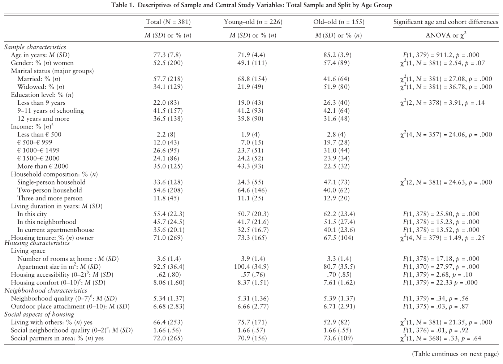
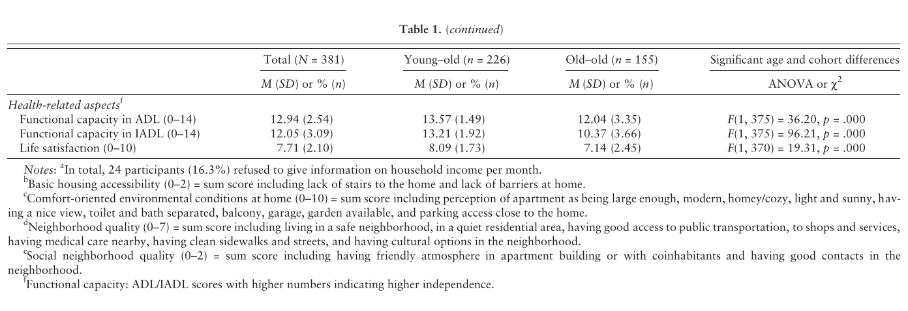
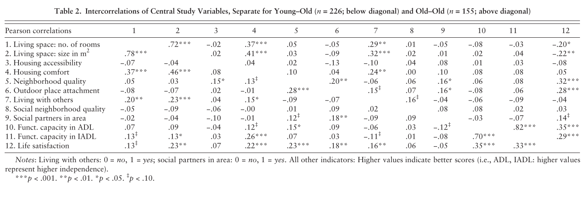
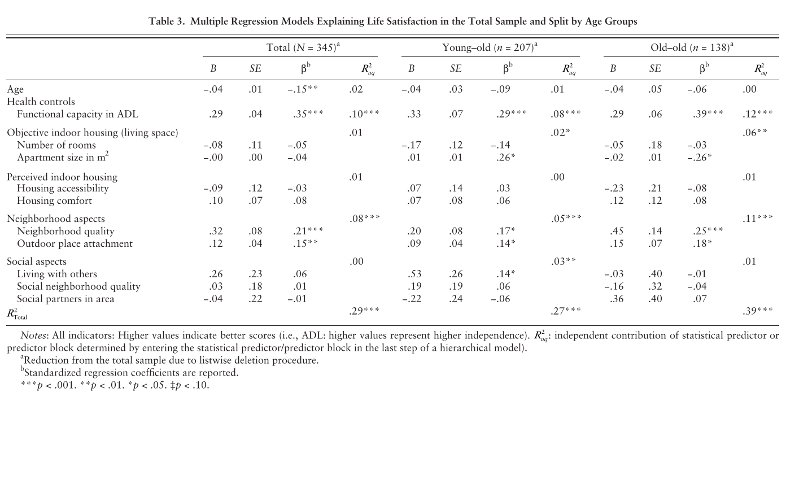

# Is Aging in Place a Resource for or Risk to Life Satisfaction?

> Frank Oswald, PhD¹ · Daniela Jopp, PhD² · Christoph Rott, PhD³ · Hans-Werner Wahl, PhD⁴

> ¹ Interdisciplinary Ageing Research, Faculty of Educational Sciences, Goethe University, Frankfurt, Germany. ² Department of Psychology, Fordham University, Bronx, New York. ³ Institute of Gerontology, University of Heidelberg, Heidelberg, Germany. ⁴ Department of Psychological Ageing Research, Institute of Psychology, University of Heidelberg, Heidelberg, Germany.

> *The Gerontologist*, 51(2), 238–250 (2011). DOI: 10.1093/geront/gnq096. Advance Access publication November 19, 2010.

> Received July 2, 2010; Accepted October 19, 2010. Decision Editor: William J. McAuley, PhD.

> Correspondence: Frank Oswald, Interdisciplinary Ageing Research, Faculty of Educational Sciences, Goethe University Frankfurt, Robert-Mayer-Str. 1, D-60325 Frankfurt, Germany. E-mail: oswald@em.uni-frankfurt.de.

> © The Author 2010. Published by Oxford University Press on behalf of The Gerontological Society of America. All rights reserved. For permissions, please e-mail: journals.permissions@oup.com.

## Abstract

**Purpose.** Given age-related health restrictions, the importance of the environment for life satisfaction may increase in later life. This study investigated whether objective and perceived physical and social environmental aspects of the home and of the surrounding neighborhood represent resources for or risks to life satisfaction among young–old and old–old individuals.

**Design and Methods.** A population-based sample of 381 community-dwelling individuals aged 65–94 years reported on their sociophysical environment and life satisfaction using questionnaires.

**Results.** On average, young–old differ from old–old in indoor physical environmental indicators but not in neighborhood characteristics or social aspects of housing. Regression analyses revealed that apartment size, perceived neighborhood quality, and outdoor place attachment explained life satisfaction independently, whereas social housing aspects played only a minor role. Separate analyses for both age groups revealed age differential explanation patterns. Apartment size was positively related to life satisfaction in the young–old but was negatively related in the old–old. For the old–old, perceived neighborhood quality and outdoor place attachment were more important than for the young–old. Living with others was positively related to life satisfaction only for the young–old.

**Implications.** Environmental characteristics at home and in the neighborhood need to be considered to better understand differential processes of aging in place with respect to well-being.

## Key Words

Community-dwelling elders, Housing, Neighborhood, Life satisfaction, Young–old, Old–old

## Introduction

The majority of older adults (65+) do not live in nursing homes but in community dwellings (Krout & Wethington, 2003; Oswald & Rowles, 2006). Most individuals display high residential stability into very old age and feel highly attached to their home and neighborhood (Rowles, Oswald, & Hunter, 2004; Scharf, Phillipson, & Smith, 2005). As a result of health issues faced in advanced age, very old people tend to decrease their action range and spend large portions of the day at home and in the immediate outdoor environment (M. M. Baltes, Maas, Wilms, Borchelt, & Little, 1999). Health limitations also increase the vulnerability to environmental challenges, which should enhance the importance of factors on housing and the neighborhood (Wahl, 2001; Wahl & Oswald, 2010). Empirical evidence exists for a link between home hazards and negative health events such as falls (Gillespie, Gillespie, Robertson, Lamb, Cumming, & Rowe, 2003; Gitlin, 2003). Further evidence speaks for a relation between neighborhood aspects and psychological distress, disability, cardiovascular risk, and depression (Beard et al., 2009; Clarke & George, 2005; Wight, Cummings, Karlamangla, & Aneshensel, 2009). From a normal aging perspective, environmental characteristics in the home and the neighborhood also have been studied in relation to general health-related psychological outcomes of well-being and life satisfaction (e.g., Wahl, Fänge, Oswald, Gitlin, & Iwarsson, 2009).

However, attempts to take a rather comprehensive approach regarding person–environment analyses in later life in relation to life satisfaction have remained rare in the previous literature (Wahl & Oswald, 2010). For one, studies often neglect the role of the neighborhood for the course and outcome of normal aging (Abbott, Carman, Carman, & Scarfo, 2009; Krause, 2004; A. E. Smith, 2009). Second, prior work seldom strives to take the multidimensional nature of the environment into consideration.

Therefore, we refer in this study to a conceptual framework that explicitly demands the simultaneous assessment of the physical, the perceived, and the social environment in relation to the major developmental outcomes of independence, identity, and well-being (Wahl & Oswald, 2010). As Wahl and Oswald argue, a view of person–environment agency mostly addressing the use of the physical environment as such must be complemented with a component of person–environment belonging, which includes various facets of experiencing and evaluating the physical environment. Similarly, the social environment deserves an objective as well as a perceived, that is, more subjective perspective.

Looking at agency in more detail and also referring to the common distinction between “young–old” and “old–old” individuals, whether a housing situation has a positive or negative effect can be predicted by processes of “objective p-e exchange” (Lawton, 1989, 1998). This includes utilizing and optimizing physical environmental resources, such as indoor and outdoor housing conditions, as well as avoiding risks, such as environmental barriers. Going further, one would argue that “young–old” individuals, that is, individuals in their third age (aged 65–80 years; P. B. Baltes & Smith, 2003; Neugarten, 1974) can more often proactively make use of the “environmental richness” (Lawton, 1989) in terms of physical environmental resources (e.g., living space) due to their higher levels of competence. In contrast, “old–old” individuals in their fourth age (80 years and older) more often have to cope with living conditions as “environmental press” or as environmental risks and barriers and have to be environmentally docile due to their limited level of competence in order to maintain independence and well-being (Gitlin, 1998; Lawton & Nahemow 1973; Scheidt & Norris-Baker, 2004; Scheidt & Windley, 2006; Wahl, 2001). For instance, a large apartment could serve as a housing resource for young–old individuals as it allows for more space to move deliberately or offers rooms to utilize in different ways. In contrast, living in a spacious apartment results in walking for longer distances, which could become a challenge, for example, in the presence of mobility restrictions. Utilizing environmental resources also includes out-of-home access and outdoor amenities. Barrier-free access and infrastructural conditions such as nearby health care services are likely to become more important resources for life satisfaction in old and especially very old age.

At the level of belonging, because the home and the neighborhood also represent subjectively important places, housing is defined not only by objective physical risks and barriers or resources but also by the experience of the place one lives in. This involves perceived indoor and outdoor aspects valued by the individual, such as having a nice view or having access to cultural interests in the neighborhood, as well as place attachment, reflecting the personal bonding on behavioral, cognitive, and emotional levels, as proposed by theories of place identity (Altman & Low, 1992; Brown, Perkins, & Brown, 2003; Oswald, Schilling et al., 2006; Stedman, 2002). For instance, place attachment includes feeling comfortable at home or feeling familiar with a certain place. Based on past experiences and everyday routines, place attachment usually occurs after having lived at a place for a significant length of time (Oswald & Wahl, 2004, 2005; Rowles et al., 2004; A. E. Smith, 2009; Taylor, 2001; Wahl & Lang, 2004). Thus, the experience of neighborhood quality and perceived neighborhood attachment may represent a resource for life satisfaction against the experience of decreasing health, particularly in very old age.

When considering the role of the environment, social exchange processes at home or in the neighborhood are also crucial, including objective and subjective issues (e.g., Krause, 2004; A. E. Smith, 2009; Wahl & Lang, 2004). Of specific importance and in keeping with classic social relations research are housing-related social aspects, such as having friends or relatives in the neighborhood, or experiencing a friendly atmosphere in one’s apartment building (Fingerman, 2003; Shaw, 2005). There is empirical evidence for the impact of such social housing aspects on well-being in later life, emphasizing the positive effect of social exchange and support in the immediate home environment (e.g., Krause, 2004; Rowles, 2008; Shaw, 2005).

Other concepts of the social neighborhood address aspects of social cohesion, disorder, control, or collective efficacy (e.g., Sampson, Raudenbush, & Earls, 1997). Findings further show that household composition is essential for aging well. For instance, living alone increases the risk for losing independence and autonomy (e.g., Iwarsson et al., 2007), whereas living with one’s partner is related to life satisfaction (Diener, Suh, Lucas, & Smith, 1999). Old–old community-dwelling elders often age in place alone after having lost their partner; however, they often seem well accustomed to it. Thus, household composition (i.e., living alone vs. living with others) could be considered a resource for life satisfaction among the young–old, whereas old–old individuals more often have adapted to living alone. At the same time, very old elder individuals who live alone in urban settings are often concerned about changes of the social quality of the neighborhood. Thus, the perceived social quality of neighbors and having social partners (friends and relatives) in the area should be especially important for old–old individuals’ life satisfaction.

The present study extends previous research in two ways. Given the need to better understand the exchange between person and environment in later life, we first offer a more comprehensive approach for examining the impact of environmental factors of physical and social p-e exchange (Oswald et al., 2006, 2007; Wahl & Oswald, 2010). As a second extension to prior research, we argue that p-e processes might differ between young–old and old–old individuals. As young–old age is characterized by relatively high levels of health, cognitive functioning, rich social exchange, and many activities, life satisfaction might be related to different aspects of p-e exchange processes than in old–old age, which, by contrast, comes with higher average risks of suffering from chronic conditions and health restrictions, loss of spouses, friends and neighbors, as well as increasing limitations of independence and a restricted action range within the neighborhood (e.g., Antonucci, 2001; P. B. Baltes & Smith, 2003; J. Smith, Borchelt, Maier, & Jopp, 2002).

## Research Aims

In order to explore the impact of p-e processes on life satisfaction in individuals aging in place more comprehensively, the aim of this study was to consider physical and social indoor housing and neighborhood aspects, both objectively and subjectively, in community-dwelling young–old and old–old individuals. We examined the explanatory value of environmental factors on life satisfaction while simultaneously controlling for functional capacity. Our set of measures represented objective and perceived aspects of the immediate physical indoor environment (e.g., living space, accessibility, and comfort) and the neighborhood (e.g., neighborhood quality, outdoor place attachment) and covered objective and perceived social environmental aspects (e.g., living alone vs. living with others, having social partners in the area, social neighborhood quality evaluation). In order to relate our findings to existing empirical evidence on the impact of environmental factors, we first investigated variables to explain life satisfaction within the total sample and then for both age groups separately. Although prior studies show that functional capacity explains interindividual differences in life satisfaction, we assumed that environmental aspects have additional explanatory value with neighborhood-related issues being particularly important.

Second, we explored whether specific aspects have age differential explanatory validity. Because p-e relationships differ with advancing age due to the changing patterns of environmental conditions and personal competencies (Lawton, 1998; Rowles et al., 2004), we assumed that young–old and old–old individuals profit differentially from specific factors. Whereas living space was assumed to be a resource for young–old individuals as they would be able to benefit from the opportunities provided by a larger apartment, it could represent a risk to life satisfaction for the old–old who have limited capacities to adapt to health restrictions in very old age. Accessibility was, by contrast, assumed to only play a (positive) role for the old–old. Neighborhood evaluations were assumed to have an increasingly positive effect for life satisfaction as people age. Living with others should be a resource for life satisfaction for those living with their spouse, that is, particularly the young–old, whereas having social partners in the area and social neighborhood quality should be a resource for the old–old.

## Methods

### Participants

This study is based on data collected for a study on aging in a district (about 16,500 inhabitants; 3,350 inhabitants aged 65 and older) of the city of Darmstadt, Germany (Hieber, Oswald, Rott, & Wahl, 2006). The community bureau of statistics drew a random sample of 773 potential participants, stratified for age (65–79 vs. 80–94 years old) and gender, who received the study questionnaire by mail. In order to maximize the response rate (52%) and to minimize selection effects, all nonresponders were reminded by phone (up to eight attempted calls). Three participants who were contacted by phone also completed the questionnaire together with the interviewer on the phone. After exclusion of 21 participants due to missing data, the present sample included 381 participants: 226 young–old (65–79 years old; 49.1% women) and 155 old–old (80–94 years old; 57.4% women) community-dwelling individuals. Sample characteristics are presented in Table 1.

Young–old participants were more often married than old–old who were more often widowed. The education level was comparable in both groups. The income differed across age groups, with the young–old indicating more frequently a higher income than the old–old. Long duration of living in the same place indicates high regional stability in both groups. Among the young–old, about two thirds lived in couple households, whereas among the old–old, about half of the sample lived alone. The proportions of home owners were comparable among young–old and old–old participants.

Table 1. Descriptives of Sample and Central Study Variables: Total Sample and Split by Age Group. Accessibility description: The first image reports sample, housing, neighborhood, and social characteristics for the total sample (N = 381), young–old group (n = 226), and old–old group (n = 155). The second image continues with ADL, IADL, and life satisfaction and contains notes a–f. Exact cells, significance tests, scales, and notes are preserved in the two source crops.

### Concepts and Related Measures

Physical and social aspects of housing and neighborhood can be assessed using very specific and elaborate measures (e.g., Iwarsson & Slaug, 2001; Sampson et al., 1997). Given that the present study was based on a survey with a questionnaire that the participants filled out alone at home, we refrained from using more differentiated measures to reduce the effort and complexity of the assessment. The concepts and measures used are described subsequently.

#### Indoor Housing

Indoor housing was defined as the immediate domestic home environment, including objective characteristics and the perception of the physical environmental housing characteristics assessed by the questionnaire. No objective environmental assessment took place in the homes or neighborhoods of the participants. As objective indoor housing indicators, we asked for the living space in terms of the number of available rooms at home as well as the apartment size in square meters. To address the perceived quality of the home environment, we used a basic housing accessibility evaluation score represented by the sum of two items including barrier-free access to all amenities within the home (1 = yes and 0 = no) and having access to the apartment/house front door without stairs (1 = yes and 0 = no). In order to assess more comfort-oriented physical environmental conditions at home, we built a sum score of housing comfort based on 10 items, including questions on the perception of the home as being large enough, modern, homey/cozy, light and sunny, having a nice view, separate bathroom and toilet, availability of a balcony, garage, garden, and having access to parking close to the home. The answering format for all items was 1 = yes and 0 = no.

#### Neighborhood

The concept of neighborhood was defined as the immediate out-of-home environment, including objective and perceived physical and infrastructural characteristics assessed by the questionnaire. To assess the objective neighborhood quality, we used a sum score of seven items, covering questions on the perception of living in a safe neighborhood, in a quiet residential area, of having good access to public transportation, access to shops and services, having medical care nearby, having clean sidewalks and streets, and having cultural options in the neighborhood. The answering format for all items was 1 = yes and 0 = no. The subjective bonding to the neighborhood, that is, the perceived outdoor place attachment, was assessed with an 11-point Likert-type rating ranging from 0 (“not at all attached”) to 10 (“fully attached”; Oswald, Hieber, Wahl, & Mollenkopf, 2005). This item was introduced with a detailed description of the concept of outdoor place attachment and comprehensive examples, allowing participants to reflect upon their affective and cognitive bonds to the neighborhood.

#### Social Aspects of Housing

The concept of social aspects was defined as household composition and perceived social neighborhood quality. To assess the social quality at home and in the neighborhood, we had three areas of inquiry. First, we asked for the objective household composition, that is, living with others (1 = yes and 0 = no). Second, we assessed the perceived social neighborhood quality in terms of immediate home environment and direct neighbors with a sum score asking whether the participants had a friendly atmosphere in the apartment building or among the coinhabitants (1 = yes and 0 = no) as well as good (i.e., satisfying) contacts in the neighborhood (1 = yes and 0 = no). Third, we asked for available social partners in the area, that is, whether participants lived close to friends and relatives (1 = yes and 0 = no).

#### Health-Related Aspects

Two indicators on functional capacity were used in this study as control variables. These were the activities of daily living (ADL; seven items: eat, dress, personal care, walk, get into/stand up from bed, shower, and use toilet) and the instrumental activities of daily living (IADL; seven items: shop, talk on the phone, cook, household chores, take medications, organize finances, and reach outdoor places by means of transportation), both assessed with the Older Americans Resources and Services procedure (Fillenbaum, 1988). Answering options were 2 = without help, 1 = with some help, and 0 = no longer possible, resulting in a score of 0 (completely dependent) to 14 (fully independent) for both scales.

#### Life Satisfaction

Life satisfaction refers to the cognitive dimension of well-being (Diener et al., 1999) and was represented by the outcome variable for this study. It was assessed by using an 11-point Likert-type single-item self-evaluation rating scale from 0 (totally unsatisfied) to 10 (totally satisfied). There have been concerns about the reliability of single-item indicators of satisfaction dealing with the vulnerability of such measures to different sources of measurement bias, leading to the conclusion that single-item measures are sufficient for the purpose of empirical research (e.g., Epstein, 1983; Scherpenzeel, 1995; Veenhoven, 1996).

### Analytic Procedure

First, differences between young–old and old–old participants in life satisfaction and its statistical predictors in terms of mean levels and frequencies were examined with analysis of variance (by the SPSS procedure ONEWAY) and chi-square (χ²) analysis. Second, relations between the central study variables were addressed based on zero-order Pearson correlations. Third, physical and social housing and neighborhood indicators were used concurrently in a set of regression analyses to explain interindividual differences in life satisfaction in the total sample as well as in both age groups while controlling for functional capacity. Although the relationship between some indicators (e.g., living space and functional capacity) was rather high (see Table 2), we used all variables separately in the regression analysis as they referred to somewhat different aspects. Controls for multicollinearity did not reveal any issues with this procedure, except for IADL, which had to be excluded. Commonality analyses were used to determine the proportion of independent (unique) variance by varying the sequence of predictors and predictor blocks. Finally, because the direct comparison of the regression coefficients of two groups only points to potential differences but does not determine whether the differences are significant, we conducted follow-up analyses for those environmental indicators that had showed differential explanation in the young–old and the old–old group. That is, follow-up analysis explored the statistical reliability of the differential explanatory patterns found in both age groups by testing age by predictor interaction effects.

## Results

### Mean Age-Group Differences of Central Study Variables

Significant age-group differences were found with respect to living space and housing comfort (see Table 1). The homes of young–old participants were on average larger compared with those of the old–old. Young–old participants reported about one (of 10) more comfort-related amenity features at home. No differences occurred with respect to basic environmental accessibility and neighborhood evaluations. As far as social aspects of housing are concerned, more young–old than old–old participants lived together with a partner, whereas no differences occurred in perceived social neighborhood quality and available social partners in the area. Age-group differences were also observed with respect to functional capacity and life satisfaction, with the young–old having higher levels than old–old individuals. As compared with all other variables, differences were strongest for functional capacity, particularly in IADL. Moreover, young–old participants’ life satisfaction was higher compared with the old–old.

### Intercorrelations of Central Study Variables

Zero-order correlations are shown in Table 2 separately for young–old (below diagonal) and old–old participants (above diagonal). Age groups differed with respect to the links between life satisfaction and neighborhood quality as well as outdoor place attachment, which were both higher in the old–old group. A different pattern was found with respect to living space: There was a positive low-to-moderate relationship to life satisfaction for the young–old and a negative relationship for the old–old, suggesting that living space may have a potential reverse effect and may represent a resource for the young–old and a risk for old–old participants with respect to life satisfaction. Further differences existed for housing comfort, which was positively linked to life satisfaction and functional capacity only in the young–old. The link between housing comfort and living with others was higher among the old–old compared with the young–old. Among the social housing aspects, living with others was positively linked to life satisfaction among the young–old group only. In the old–old, there was only a marginal effect for having social partners in the area.

Table 2. Intercorrelations of Central Study Variables, Separate for Young–Old (n = 226; below diagonal) and Old–Old (n = 155; above diagonal). Accessibility description: The correlation matrix covers living space, accessibility, comfort, neighborhood quality, outdoor place attachment, social housing variables, ADL, IADL, and life satisfaction. Living with others and social partners in the area are coded 0 = no and 1 = yes; higher values on the other indicators represent better scores. The source crop preserves every coefficient and significance mark.

### Explanation of Differences in Life Satisfaction

Table 3. Multiple Regression Models Explaining Life Satisfaction in the Total Sample and Split by Age Groups. Accessibility description: The models use N = 345 for the total sample, n = 207 for young–old participants, and n = 138 for old–old participants after listwise deletion. Total R² values are .29, .27, and .39; the unique ADL contributions are .10, .08, and .12; and the neighborhood blocks contribute .08, .05, and .11, respectively. The source crop preserves B, SE, standardized β, unique contributions, all predictor blocks, and significance marks.

A set of regression analyses show the explanatory value of physical and social environmental indicators while controlling concurrently for age and functional capacity (Table 3). The regression conducted for the full sample explained 29% of interindividual differences in life satisfaction. Neighborhood quality, outdoor place attachment, and functional capacity in ADL, which was the health control variable, were independent positively related to life satisfaction, whereas age was negatively related to life satisfaction. Thus, better neighborhood quality and higher cognitive and emotional attachment to the area lead to higher levels of life satisfaction. Being younger and having a better ADL functioning were also related to higher life satisfaction. Findings of commonality analyses showed that neighborhood variables together explained a notable amount of unique variance in life satisfaction (8%). Considering their specific contributions, neighborhood quality explained 4%, representing the largest amount of unique variance in the model, and outdoor place attachment explained another 2% of independent variance (not in the Table 3). Age, although significant, explained only 2% unique variance. Objective and perceived housing characteristics (i.e., living space, perceived housing accessibility, and housing comfort) as well as social aspects of housing made no significant contribution to explaining life satisfaction. ADL capacity, included as control variable, explained 10% of unique variance.

Conducting the same regression analysis for the young–old participants explained 27% of the interindividual differences in life satisfaction. The observed pattern of effects was largely comparable with the findings reported for the total sample: For instance, neighborhood quality and outdoor place attachment were also significantly related to life satisfaction, but their effects were smaller. Nevertheless, neighborhood quality and outdoor place attachment still explained 5% of unique variance. Again, their specific contribution was notable: Neighborhood quality explained 3% of unique variance, and outdoor place attachment explained another 2% of independent variance (not in the Table 3). Also parallel to the findings of the total sample, perceived housing accessibility and housing comfort were not related to life satisfaction in this age group. Functional capacity in ADL had a considerable effect, explaining 8% of unique variance. Comparing the young–old findings to the total sample, two notable differences emerged. In this age group, apartment size in square meters was positively linked to life satisfaction, explaining 2% unique variance (not in the Table 3), and living with others was positively related to life satisfaction, explaining another 3% of independent variance. By contrast, social neighborhood quality evaluations and having social partners in the area had no effect. In sum, for the young–old, life satisfaction was higher when they had larger homes, when they experienced a stronger outdoor place attachment and better neighborhood quality, and when they lived with a partner.

For the old–old group, a regression analysis with the same set of variables explained 39% of the variance in life satisfaction, representing a substantially larger amount of variance explanation. In this age group, the strongest statistical predictor for life satisfaction was the health control variable ADL (12% unique variance). Housing aspects were nevertheless significantly related to life satisfaction, including living space measured as apartment size in square meters, perceived neighborhood quality, and outdoor place attachment. As in the young–old group, perceived housing accessibility and housing comfort had no explanatory value for the life satisfaction of the old–old. Neighborhood quality and outdoor place attachment explained a total of 11% of unique variance compared with 5% in the young–old group. Thus, particularly in this age group, life satisfaction was clearly higher the better the neighborhood quality and the stronger the outdoor place attachment. In terms of portions of unique variance, neighborhood quality added 5% of unique variance (compared with 3% in the young–old) and place attachment added 3% of unique variance (compared with 2% in the young–old). In contrast to the young–old, however, apartment size in square meters was negatively associated with life satisfaction in the old–old, suggesting that large apartments may diminish life satisfaction in very old age, whereas life satisfaction was enhanced by more living space in younger ages. In terms of portions of unique variance, apartment size in square meters added 3% of unique variance compared with 2% in the young–old group. Also in contrast to the young–old, social aspects of housing were not related to life satisfaction among the old–old. In sum, older participants’ life satisfaction was higher when they had smaller apartments, evaluated their neighborhood as more positive, and were more attached to it.

Follow-up analyses for variables with differential explanatory quality, that is apartment size in square meters, neighborhood quality, and outdoor place attachment, provided additional evidence for reliable age-group differences in the explanatory value of all three environmental indicators.

## Discussion

When comparing the housing environments of young–old and old–old individuals, the findings reflect confirmed age or cohort differences in the urban housing situation in later life, partially due to changing marital status and increasing durations of living in the same home as people age in place (e.g., Krause, 2004; Oswald & Rowles, 2006). However, in both age groups, mean durations of living in the same place were comparable. Moreover, expected age-group differences in functional capacity highlight the need to include health-related differences on the level of everyday activities for both age groups as a control variable in order to disentangle the effects of environmental indicators and health on life satisfaction.

Correlative findings revealed insights into relationships between environmental indicators. For instance, interlinks between living space and perceived housing comfort but not perceived housing accessibility in both age groups reflected the importance of measuring such aspects on a detailed level. The findings further pointed to age-related differentiations in the links between environmental indicators and life satisfaction, hinting to a resource dynamic for the young–old and a risk dynamic for old–old participants.

Regression analysis addressing the concurrent explanatory value of the environmental factors in the total sample revealed that, despite the substantial effects of age and functional capacity, particularly neighborhood-related factors substantially contributed to life satisfaction. This finding supports our hypothesis that environmental and particularly neighborhood-related factors have separate explanatory values for this outcome (Krause, 2004; A. E. Smith, 2009; Wahl & Lang, 2004). In contrast to our expectations, indoor housing and social aspects seemed not to play a role; however, this was partially due to the differential effects in both age groups revealed by the following analysis. However, although the amount of explained variance was substantial, other variables that we did not include in our analysis may explain additional variance in life satisfaction beyond environmental aspects (e.g., finances; Diener et al., 1999).

Our second set of analyses addressed age-specific explanation patterns for life satisfaction, assuming that young–old and old–old individuals may profit from different factors. As expected, physical environmental housing variables, neighborhood variables, and social housing variables were of differential benefit for the life satisfaction of young–old versus old–old participants. Particularly, we found that one of our objective indoor housing indicators, namely apartment size in square meters, represents a resource for the life satisfaction of the young–old and a risk for the old–old participants. This finding empirically reflects the postulated differences in p-e relationships in terms of a proactive use of “environmental richness” in third age versus a docile adaptation to “environmental press” in fourth age (Lawton, 1989, 1998; Lawton & Nahemow, 1973; Scheidt & Norris-Baker, 2004). Supporting our hypothesis, comfort was related to life satisfaction in the young–old; this effect, however, disappeared when using the other variables concurrently. Against our expectation, however, living in accessible homes does not seem to provide an explanation for differences in life satisfaction at all, neither for the total sample nor for the specific age groups.

Our findings contrast existing knowledge on the relationship between housing accessibility and life satisfaction, particularly in very old age, based on extensive objective measures of accessibility (Iwarsson & Slaug, 2001; Iwarsson et al., 2007). Thus, it is possible that the differential nature of the measures was responsible for the missing relationship between accessibility and life satisfaction, in contrast to other studies (e.g., Oswald et al., 2007). In contrast, reported square meters may be considered as a “quasi-objective” measure, which allowed not for much interpretation, relative to our measures of accessibility or comfort.

Neighborhood characteristics, such as quality evaluation and outdoor place attachment, were important environmental statistical predictors to explain differences in life satisfaction in both age groups, which confirmed our expectations. It is also in accordance with the literature that both constructs were clearly more important in old–old versus young–old age (e.g., Oswald & Wahl, 2004, 2005; Rowles et al., 2004; A. E. Smith, 2009; Stedman, 2002; Wahl & Lang, 2004). Thus, given our data, about twice as much variance in life satisfaction of the old–old participants was explained by person–neighborhood relationship compared with the young–old participants. As neighborhood quality evaluations and outdoor place attachment were more important for life satisfaction in the old–old compared with young–old individuals from a practical perspective, person–neighborhood relationship should be considered more seriously in relation to well-being and healthy aging in research and in its application. On the positive side, neighborhood characteristics are related to well-being, particularly within the increasingly large group of very old community-dwelling elders, which are the ones who spend the most time in their neighborhood (Abbott et al., 2009; Krause, 2004; Krout & Wethington, 2003).

Housing-related social aspects were of minor significance for life satisfaction in this study. Thus, living together with others represented a resource only for the young–old participants’ life satisfaction and potentially meaningful neighborhood aspects were not relevant. Note that social aspects in this study were limited to environmental qualities, such as household composition or having social partners in the area. Weak links to life satisfaction, particularly in old–old age, could be interpreted as successful adaptation to unchangeable circumstances such as the loss of one’s partner and its consequence to live in a single household in very old age.

In sum, our findings clearly indicate that objective and perceived dimensions of housing and neighborhood characteristics are important to explain differences in life satisfaction and need to be addressed comprehensively in late life. The findings support previous work in environmental gerontology (Gitlin, 2003; Lawton, 1989, 1998; Rowles et al., 2004; Scheidt & Windley, 2006; Wahl, 2001). Moreover, our findings call for a differentiated perspective on p-e exchange in the neighborhood for young–old versus old–old individuals, which allows for the detection of different patterns of environmental characteristics that explain life satisfaction in specific phases of old age.

## Limitations

Four limitations need to be considered. First, data for this study were based on self-reports of old and very old individuals who participated in a mail-out survey on aging in their communities. As a consequence, the self-administered questionnaire for the sample of very old individuals had to be short and easy to understand, which precluded use of well-introduced measures due to their complexity. However, observer-based assessment of the objective environmental indicators would have been preferable, such as determining housing accessibility during home visits (Iwarsson & Slaug, 2001), assessing objective neighborhood conditions by means of expert audits (e.g., Michael et al., 2009) or questionnaires with various subdimensions and subfacets (e.g., Sampson et al., 1997). Such measures may have revealed stronger effects of objective environmental conditions on life satisfaction. Thus, the comparability of our results with findings based on extensive assessments is limited. Although the lack of observer-based housing measures may limit the objectivity of some of these variables (e.g., accessibility), this might not be the case for obvious indicators such as the number of rooms or square meters (usually indicated in German rent contracts). Moreover, the assessment of the neighborhood always comes with some vagueness due to individual definitions about geographic location, size, and relevant content. Nevertheless, to get the full picture of the neighborhood in relation to health and well-being, one has to consider objective and subjective issues of p-e exchange (Krause, 2004; Oswald, Schilling et al., 2006; Taylor, 2001), which is represented by our selection of objective indicators that were less likely to be biased (e.g., number of rooms) and the evaluation of the living situation (e.g., place attachment). A related shortcoming in terms of variable selection is that we used a limited number of constructs to explain life satisfaction due to the practicability of the survey. Although the explained variance was quite high in our regression models, there are, however, many more factors that contribute to life satisfaction (e.g., Diener et al., 1999).

Second, the single-item measure on life satisfaction may be considered a methodological shortcoming as single-item measures could be regarded as more sensitive to measurement error than multi item measures and thus lower correlations with other indicators (Epstein, 1983). However, there is considerable evidence indicating sufficient psychometric quality of single-item satisfaction measures (Scherpenzeel, 1995; Veenhoven, 1996).

Third, our sample consisted of old adults living in their urban community dwellings. Thus, the present study is limited in its potential to reflect the full range of the ageing population, particularly older adults living in rural areas as well as in institutions.

Finally, one limitation points to the cross-sectional nature of the data set. Age differential findings should not be misunderstood as developmental p-e changes over time, that is, from young–old into old–old age. Longitudinal data would be needed to examine whether, for instance, neighborhood quality also influences life satisfaction over time. This could give some indication of causality as well as whether the impact of neighborhood quality increases or decreases when a later stage in old age is reached.

## Conclusions

From an environmental gerontology research perspective, the findings clearly underscore the need for a conceptual differentiation of physical and social p-e–related resources and risks as part of a comprehensive understanding of aging in place, including the home and the neighborhood (Wahl & Oswald, 2010; Wahl et al., 2009). Thus, these results can add further evidence to findings from other studies emphasizing the home environment in old age (e.g., Iwarsson et al., 2007), fostering a complex picture of p-e exchange in relation to health and well-being in later life as well as the need to consider both in forthcoming conceptual frameworks.

From an applied perspective, these findings could affect individual and societal housing planning and community intervention strategies. On the individual level, knowledge of the complexity of p-e relationships at home and in the neighborhood may help to reflect upon individual housing needs and future plans and to increase anticipatory awareness of the process of environmental change over the life course. Thus, in terms of resources and risks, we need to move from a diffuse understanding of future residential possibilities and anxieties toward more concrete and deliberate planning in regard to neighborhoods, either in terms of aging in place in a residence or in an assisted living facility that are well adapted and accessible according to principles of universal design (Sanford, 2010). On the societal level, the focus on barrier-free building standards targeting objective aspects of the home needs to be expanded. A holistic approach should be taken to include perceived aspects of housing and the neighborhood. For professionals in the field of housing, health care, and city planning, it is important to determine and to make use of age differential explanation patterns in order to design well-suited environmental intervention for young–old and old–old individuals (Abbott et al., 2009; Krout & Wethington, 2003; Oswald & Rowles, 2006). The findings may also potentially encourage authorities to develop guidelines that combine supportive and meaningful neighborhood options for elder individuals and to thus inform age-friendly community principles.

## References

Abbott, P. S., Carman, N., Carman, J., & Scarfo, B. (Eds.), (2009). Recreating neighborhoods for successful aging. Baltimore, MD: Health Professional Press.

Altman, I., & Low, S. M. (Eds.), (1992). Place attachment, Vol. 12. New York: Plenum Press.

Antonucci, T. C. (2001). Social relations: An examination of social networks, social support, and sense of control. In J. E. Birren, & K. W. Schaie (Eds.), Handbook of the psychology of aging (5th ed. 427–453). San Diego, CA: Academic Press.

Baltes, M. M., Maas, I., Wilms, H.-U., Borchelt, M., & Little, T. (1999). Everyday competence in old and very old age: Theoretical considerations and empirical findings. In P. B. Baltes, & K. U. Mayer (Eds.), The Berlin Aging Study. Aging from 70 to 100 (pp. 384–402). Cambridge: Cambridge University Press.

Baltes, P. B., & Smith, J. (2003). New frontiers in the future of aging: From successful aging of the young old to the dilemmas of the fourth age. Gerontology, 49, 123–135.

Beard, J. R., Blaney, S., Cerda, M., Frye, V., Lovasi, G. S., Ompad, D., et al. (2009). Neighborhood characteristics and disability in older adults. Journal of Gerontology: Social Sciences, 64B, 252–257.

Brown, B., Perkins, D. D., & Brown, G. (2003). Place attachment in a revitalizing neighborhood: Individual and block levels of analysis. Journal of Environmental Psychology, 23, 259–271.

Clarke, P., & George, L. K. (2005). The role of the built environment in the disablement process. American Journal of Public Health, 95, 1933–1939.

Diener, E., Suh, E. M., Lucas, R. E., & Smith, H. L. (1999). Subjective well-being: Three decades of progress. Psychological Bulletin, 125, 276–302.

Epstein, S. (1983). Aggregation and beyond: Some basic issues on the prediction of behavior. Journal of Personality, 51, 360–392.

Fillenbaum, G. G. (1988). Multidimensional functional assessment of older adults: The Duke Older Americans Resources and Services procedures. Hillsdale, NJ: Lawrence Erlbaum Associates.

Fingerman, K. L. (2003). The consequential stranger: Peripheral social ties across the life span. In F. R. Lang, & K. L. Fingerman (Eds.), Growing together: Personal relationships across the life span (pp. 183–209). New York: Cambridge University Press.

Gillespie, L. D., Gillespie, W. J., Robertson, M. C., Lamb, S. E., Cumming, R. G., & Rowe, B. H. (2003). ‘Interventions for preventing falls in elderly people (Cochran Review)’. The Cochran Library, (3), 2001.

Gitlin, L. N. (1998). Testing home modification interventions: Issues of theory, measurement, design, and implementation. In R. Schulz, G. Maddox, & M. P. Lawton (Eds.), Annual review of gerontology and geriatrics. Interventions research with older adults (pp. 190–246). New York: Springer.

Gitlin, L. N. (2003). Conducting research on home environments: Lessons learned and new directions. The Gerontologist, 43, 628–637.

Hieber, A., Oswald, F., Rott, C., & Wahl, H.-W. (2006). Selbstbestimmt Älterwerden in Arheilgen. Abschlussbericht [Independent aging in Arheilgen. Final report]. Heidelberg, Germany: Department of Psychological Ageing Research, Institute of Psychology, University of Heidelberg.

Iwarsson, S., & Slaug, B. (2001). Housing enabler. An instrument for assessing and analyzing accessibility problems in housing. Lund, Sweden: Studentlitteratur.

Iwarsson, S., Wahl, H.-W., Nygren, C., Oswald, F., Sixsmith, A., Sixsmith, J., et al. (2007). Importance of the home environment for healthy aging: Conceptual and methodological background of the European ENABLE-AGE project. The Gerontologist, 47, 78–84.

Krause, N. (2004). Neighborhoods, health, and well-being in later life. In H.-W. Wahl, R. J. Scheidt, & P. G. Windley (Eds.), Aging in context: Socio-physical environments. (Annual Review of Gerontology and Geriatrics, 2003) (pp. 223–249). New York: Springer.

Krout, J. A., & Wethington, E. (Eds.), (2003). Residential choices and experiences of older adults. Pathways to life quality. New York: Springer.

Lawton, M. P. (1989). Environmental proactivity in older people. In V. L. Bengtson, & K. W. Schaie (Eds.), The course of later life (pp. 15–23). New York: Springer.

Lawton, M. P. (1998). Environment and aging: Theory revisited. In R. Scheidt, & P. G. Windley (Eds.), Environment and aging theory. A focus on housing (pp. 1–31). Westport, CT: Greenwood Press.

Lawton, M. P., & Nahemow, L. (1973). Ecology and the aging process. In C. Eisdorfer, & M. P. Lawton (Eds.), Psychology of adult development and aging (pp. 619–674). Washington, DC: American Psychological Association.

Michael, Y. L., Keast, E. M., Chaudhury, H., Day, K., Mahmood, A., & Sarte, A. F. I. (2009). Revising the senior walking environmental assessment tool. Preventive Medicine, 48, 247–249.

Neugarten, B. L. (1974). Age groups in American society and the rise of the young old. Annals of the American Academy of Social and Political Science, 415, 187–198.

Oswald, F., Hieber, A., Wahl, H.-W., & Mollenkopf, H. (2005). Ageing and person-environment fit in different urban neighbourhoods. European Journal of Ageing, 2, 88–97.

Oswald, F., & Rowles, G. D. (2006). Beyond the relocation trauma in old age: New trends in today’s elders’ residential decisions. In H.-W. Wahl, C. Tesch-Römer, & A. Hoff (Eds.), New dynamics in old age: Environmental and societal perspectives (pp. 127–152). Amityville, New York: Baywood.

Oswald, F., Schilling, O., Wahl, H.-W., Fänge, A., Sixsmith, J., & Iwarsson, S. (2006). Homeward bound: Introducing a four domain model of perceived housing in very old age. Journal of Environmental Psychology, 26, 187–201.

Oswald, F., & Wahl, H.-W. (2004). Housing and health in later life. Reviews of Environmental Health, 19, 223–252.

Oswald, F., & Wahl, H.-W. (2005). Dimensions of the meaning of home. In G. D. Rowles, & H. Chaudhury (Eds.), Home and identity in late life: International perspectives (pp. 21–45). New York: Springer.

Oswald, F., Wahl, H.-W., Naumann, D., Mollenkopf, H., & Hieber, A. (2006). The role of the home environment in middle and late adulthood. In H.-W. Wahl, H. Brenner, H. Mollenkopf, D. Rothenbacher, & C. Rott (Eds.), The many faces of health, competence and well-being in old age: Integrating epidemiological, psychological and social perspectives (pp. 7–24). Heidelberg, Germany: Springer.

Oswald, F., Wahl, H.-W., Schilling, O., Nygren, C., Fänge, A., Sixsmith, A., et al. (2007). Relationships between housing and healthy aging in very old age. The Gerontologist, 47, 96–107.

Rowles, G. D. (2008). Place in occupational science: A life course perspective on the role of environmental context in the quest of meaning. Journal of Occupational Science, 15, 127–135.

Rowles, G. D., Oswald, F., & Hunter, E. G. (2004). Interior living environments in old age. In H.-W. Wahl, R. Scheidt, & P. G. Windley (Eds.), Aging in context: Socio-physical environments. (Annual Review of Gerontology and Geriatrics, 2003) (pp. 167–193). New York: Springer.

Sampson, R. J., Raudenbush, S. W., & Earls, F. (1997). Neighborhoods and violent crime: a multilevel study of collective efficacy. Science, 277, 918–24.

Sanford, J. A. (2010). Assessing universal design in the physical environment. In T. Oakland, & E. Mpofu (Eds.), Rehabilitation and health assessment (pp. 255–278). New York: Springer.

Scharf, T., Phillipson, C., & Smith, A. E. (2005). Social exclusion of older people in deprived urban communities of England. European Journal of Ageing, 2, 76–87.

Scheidt, R. J., & Norris-Baker, C. (2004). The general ecological model revisited: Evolution, current status, and continuing challenges. In H.-W. Wahl, R. J. Scheidt, & P. G. Windley (Eds.), Aging in context: Socio-physical environments. (Annual Review of Gerontology and Geriatrics, 23) (pp. 59–84). New York: Springer.

Scheidt, R. J., & Windley, P. G. (2006). Environmental gerontology: Progress in the post-Lawton era. In J. E. Birren, & K. W. Schaie (Eds.), Handbook of the psychology of aging (6th ed. 105–125). San Diego, CA: Academic Press.

Scherpenzeel, A. (1995). A question of quality: Evaluating survey questions by multitrade-multimethod studies. Amsterdam, NL: Nimmo.

Shaw, B. (2005). Anticipating support from neighbors and physical functioning during later life. Research on Aging, 27, 503–525.

Smith, A. E. (2009). Ageing in urban neighbourhoods. Place attachment and social exclusion. Bristol, UK: The Policy Press.

Smith, J., Borchelt, M., Maier, H., & Jopp, D. (2002). Health and well-being in the young old and the oldest old. Journal of Social Issues, 58, 715–732.

Stedman, R. S. (2002). Toward a social psychology of place. Predicting behaviour from place-based cognitions, attitude and identity. Environment & Behavior, 34, 561–581.

Taylor, S. A. (2001). Place identification and positive realities of aging. Journal of Cross-Cultural Gerontology, 16, 5–20.

Veenhoven, R. (1996). Developments in satisfaction research. Social Indicators Research, 37, 1–46.

Wahl, H.-W. (2001). Environmental influences on aging and behavior. In J. E. Birren, & K. W. Schaie (Eds.), Handbook of the psychology of aging (5th ed. 215–237). San Diego, CA: Academic Press.

Wahl, H.-W., Fänge, A., Oswald, F., Gitlin, L. N., & Iwarsson, S. (2009). The home environment and disability-related outcomes in aging individuals: What is the empirical evidence? The Gerontologist, 49, 355–367.

Wahl, H.-W., & Lang, F. R. (2004). Aging in context across the adult life: Integrating physical and social research perspectives. In H.-W. Wahl, R. Scheidt, & P. G. Windley (Eds.), Aging in context: Socio-physical environments. (Annual Review of Gerontology and Geriatrics, 2003) (pp. 1–33). New York: Springer.

Wahl, H.-W., & Oswald, F. (2010). Environmental perspectives on aging. In D. Dannefer, & C. Phillipson (Eds.), International handbook of social gerontology (pp. 111–124). London: Sage.

Wight, R. G., Cummings, J. R., Karlamangla, A. S., & Aneshensel, C. S. (2009). Urban neighborhood context and change in depressive symptoms in later life. Journal of Gerontology: Social Sciences, 64B, 247–251.
