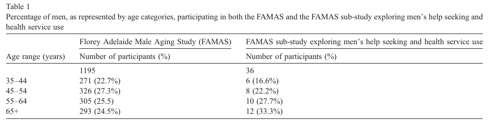
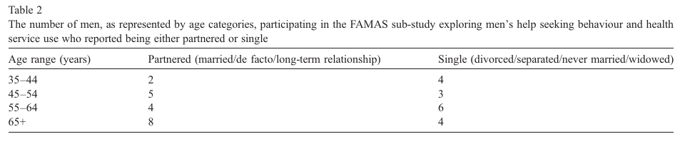
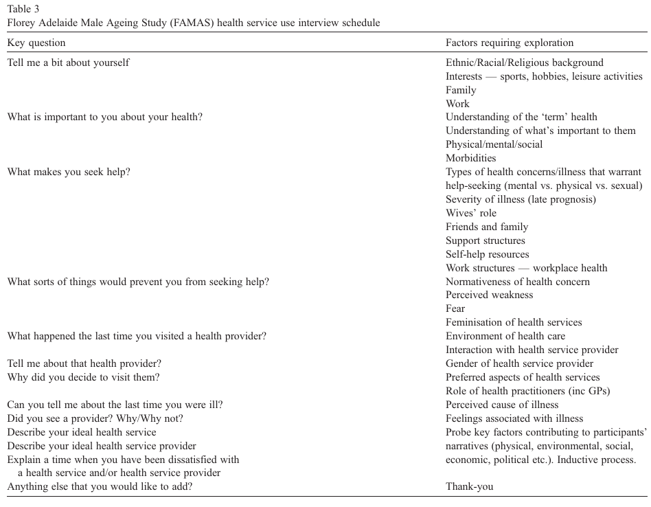

# “I’ve been independent for so damn long!”: Independence, masculinity and aging in a help seeking context

> James A. Smith a,b,⁎ · Annette Braunack-Mayer a,¹ · Gary Wittert b,² · Megan Warin c,³

> a Discipline of Public Health, School of Population Health & Clinical Practice, University of Adelaide, Level 9 — Tower Building (MDP 207), 10 Pulteney St., Adelaide SA 5005, Australia; b Discipline of Medicine, School of Medicine, University of Adelaide, Level 6 — Eleanor Harrald Building, Frome Road, Royal Adelaide Hospital, Adelaide SA 5005, Australia; c Department of Anthropology, University of Durham, 43 Old Elvet, Durham DH1 3HN, United Kingdom.

> *Journal of Aging Studies*, 21 (2007), 325–335. DOI: 10.1016/j.jaging.2007.05.004.

> Received 16 February 2007; received in revised form 26 April 2007; accepted 30 May 2007.

> ⁎ Corresponding author. Tel.: +61 8 8226 0799, +61 8 8342 5567. E-mail addresses: james.smith@adelaide.edu.au (J.A. Smith), annette.braunackmayer@adelaide.edu.au (A. Braunack-Mayer), gary.wittert@adelaide.edu.au (G. Wittert), megan.warin@durham.ac.uk (M. Warin). ¹ Tel.: +61 8 8226 0799 or +61 8 8303 3569. ² Tel.: +61 8 82225502. ³ Tel.: 44 101 3346177.

## Abstract

This paper draws on semi-structured interviews conducted with 36 older men to examine how older men's understandings of independence relate to their help seeking behaviours and health service use. We argue that discourses of masculinity and successful aging are both represented in men's talk about independence. Recognising that these discourses are intertwined is important for understanding how older men seek help and use health services. We outline the practice and policy implications of viewing older men's help seeking behaviours in this way, and how it might be useful for promoting older men's health.

## Keywords

Masculinity; Successful aging; Independence; Help-seeking

## Introduction

This paper examines the ways in which older men are encouraged to be independent as part of a discourse on successful aging while, at the same time, are criticized for maintaining their independence in the context of help seeking and health service use. There are stereotypical societal and cultural constructions of masculinity that expect men to behave independently, particularly in relation to health and health care (Hodgetts & Chamberlain, 2002; Lantz, Fullerton, Harshburger, & Sadler, 2001; O'hehir, 1996; Reevy & Maslach, 2001; While, 2002). When independence is viewed as a masculine trait it has been associated with men's engagement in risky health behaviors, health service avoidance and ignorance about their health, typified by comments such as “I should be able to handle this on my own” (Aoun, Donovan, Johnson, & Egger, 2002; Calasanti, 2003; Connell, 1997; Mansfield, Addis, & Mahalik, 2003; Reisberg, 2000; Taylor, Stewart, & Parker, 1998; While, 2002). According to this view, independence is perceived as a health-damaging concept.

In this paper, we argue that independence can have multiple meanings. An alternative discourse, where independence is perceived to be health-enhancing, is that which relates to aging. Here, the ability to maintain one's independence is embraced as a marker of aging successfully (Secker, Hill, Villeneau, & Parkman, 2003; Stephenson, Wolfe, Coughlan, & Koehn, 1999). We explore how these two discourses of independence interact for a group of older men living in North-West Adelaide.

### Hegemonic masculinity and independence

Hegemonic masculinity in Western society refers to the traditional, patriarchal view of men and men's behavior as the most influential and culturally accepted notion of ‘manliness’ (Courtenay, 2000a,b; Lee & Owens, 2002). The way in which hegemonic masculinity is socially constructed places an expectation on men to be independent, tough, assertive, emotionally restrictive, competitive, hardy, aggressive and physically competent (Gerschick & Miller, 1995; Lee & Owens, 2002; Moynihan, 1998; Riska, 2002; Taylor et al., 1998). Hegemonic masculinity's definition of independence privileges self-reliance and autonomy (Gerschick & Miller, 1995). Recent research, however, has criticized hegemonic constructions of masculinity, suggesting that masculinity differs between cultures and environments (Berg & Longhurst, 2003; Connell & Messerschmidt, 2005; Longhurst, 2000, 2001; Schofield, Connell, Walker, Wood, & Butland, 2000). Scholars have described hegemonic masculinity as a ‘hybrid term’, which has different meanings for different people (Speer, 2001). Yet, hegemonic constructions of masculinity remain important to understand how men conceptualise traits such as independence.

### Aging and independence

Aging is associated with loss of independence (Arber & Ginn, 1991; Bland, 1999; Secker et al., 2003). Literature relating to the loss of independence has focused on activities of daily living (Covinsky et al., 2003; Greiner, Snowdon, & Schmitt, 1996; Hebert, 1997); diet and healthy eating (McKie, 1999; Drummond & Smith, 2006); the capacity to recover from injuries (McColl, Stirling, Walker, Corey, & Wilkins, 1999); the capacity to engage in physical activity (Fiatarone, 1996; Galloway & Jokl, 2000; Shepard, 1993); and dementia (Woods, 1999). Loss of independence has also been used to explain older people's reluctance to consider residential care (Bland, 1999). Although definitions of successful ageing are diverse (Bowling & Dieppe, 2005; Steverink, Lindenberg, & Ormel, 1998; Torres, 1999), a consistent theme is that maintaining independence is important to older people and that successful aging includes the capacity to maintain independence (Arber & Ginn, 1991; Stephenson et al., 1999).

Biomedical theories define successful ageing in terms of the optimisation of life expectancy while minimising physical and mental deterioration and disability, whereas psychosocial approaches tend to emphasise life satisfaction, social participation and functioning, and psychological resources, including personal growth (Bowling & Dieppe, 2005). Both of these viewpoints have been somewhat distanced from how older people define successful aging from a lay perspective (Bowling & Dieppe, 2005).

As with previous studies, we found that lay perspectives of successful aging among the older men in our study were closely tied to being able to maintain their independence. This was consistent with sustained personal autonomy being perceived as a measure of successful aging (Arber, Davidson, & Ginn, 2003; Arber & Ginn, 1991; Davies, Laker, & Ellis, 1997; Ford et al., 2000). We recognise, however, that successful aging remains a fluid concept, and one which has been challenged, in recent gerontological scholarship. Firstly, there are variations in the way in that successful aging is constructed across cultures (Torres, 1999). Secondly, there are various kinds of dependency, and different levels of independence that ought to be considered within definitions of what successful aging might actually constitute (Scheidt, Humphreys, & Yorgason, 1999). That is, reliance on others is not necessarily perceived as ‘unsuccessful aging’. Rather, it is placed on a continuum of achievements that are not necessarily subject to simplistic normative assessments of success or failure (Bowling & Dieppe, 2005). As such, we recognise that independence is a broad concept that encompasses self-reliance, self-esteem, self-determination, purpose in life, personal growth and continuity of the self, among older people (Secker et al., 2003).

### Hegemonic masculinity and aging

The nexus between gender and ageing is a growing area of interest in gerontological research (Arber et al., 2003). Gender roles and the stereotypes associated with them change as men get older (Wilson, 1995). However, there remains a paucity of theoretical discussion in gerontological scholarship relating to masculinities and aging, particularly that which relates to independence (Arber et al., 2003; Calasanti, 2003, 2005; Spector-Mersel, 2006). Indeed, theories of masculinities have primarily been constructed through the eyes of younger men, and have tended to omit the views of older men (Arber et al., 2003; Calasanti, 2003). While it has been recognized that older men's social worlds are intimately tied to gender and distinct masculinities, relatively little is known about how older men understand and enact being male (Thompson & Whearty, 2004).

Scholarship which has attempted to examine the intersection between masculinity and aging has predominantly focused on the aging of male bodies. For example, the increased sexual capacity of aging men's bodies through the advent of medications for erectile dysfunction has contributed to this field of inquiry (Calasanti, 2005; Marshall, 2006). Older men's perceptions of their bodies have also been examined in the context of men undergoing androgen deprivation therapy for advanced prostate cancer (Oliffe, 2006). This involves the paradoxical nature of older men both perpetuating, and reformulating, ideals of hegemonic masculinity (Oliffe, 2006). Nevertheless, the embodiment of multiple forms of masculinity among older men has only recently started to be examined in men's health and masculinities research. In this paper we limit our discussion to the intersection between independence, masculinity and aging, in the context of men's help seeking and health service use.

## Methology

### Study context

Our research forms part of the Florey Adelaide Male Ageing Study (FAMAS) at the University of Adelaide. This longitudinal men's health study is a collaborative effort between multiple disciplines and includes both biomedical and social scientific perspectives on aging. The cohort consists of 1195 participants aged between 35 and 80 years of age randomly drawn from the North-West Adelaide region in South Australia using the white pages telephone directory. Further information on the FAMAS cohort can be found in Martin et al. (2007). From this larger sample, and using strata relating to age and marital status, we invited 36 men to participate in a qualitative study exploring men's help seeking behaviors and health service use. Table 1 shows the number of men, sorted by age category, participating in both the FAMAS and our sub-study exploring men's help seeking and health service use. Of the 36 men in our study, 22 men were over 55 years of age and 12 of these men were aged 65 or older. It is their understandings we have primarily drawn upon throughout this paper.

Table 1. Percentage of men, as represented by age categories, participating in both the FAMAS and the FAMAS sub-study exploring men's help seeking and health service use. Accessibility description: The full FAMAS cohort contains 1,195 men and the qualitative sub-study contains 36. For ages 35–44, 45–54, 55–64, and 65+, the respective cohort counts are 271 (22.7%), 326 (27.3%), 305 (25.5 in the printed table), and 293 (24.5%); sub-study counts are 6 (16.6%), 8 (22.2%), 10 (27.7%), and 12 (33.3%).

Of the men aged 65 or older, eight were married or in a de facto relationship; and four were divorced, separated, widowed or had never married. Table 2 shows the number of men, as represented by age categories, who participated in our sub-study and who reported being either partnered or single. All men who indicated that they were married, in a de facto relationship or in a long-term relationship, reported that they were co-habiting with their partner.

Table 2. The number of men, as represented by age categories, participating in the FAMAS sub-study exploring men's help seeking behaviour and health service use who reported being either partnered or single. Accessibility description: Partnered/single counts are 2/4 at ages 35–44, 5/3 at 45–54, 4/6 at 55–64, and 8/4 at 65+.

### Conducting interviews

The study was approved by the University of Adelaide Human Research Ethics Committee, and informed consent was obtained from each participant. Interviews lasted between one and one and three quarter hours. The primary author (JS) conducted all in-depth interviews. We carried out our interviews away from traditionally feminised environments in an effort to preserve our participants' masculine identities (Borbasi, Chapman, Gassner, Dunn, & Read, 2002; Oliffe & Mroz, 2005). This included avoiding health services where men were likely to feel threatened or alienated (Britten, 1995), resulting in the majority of interviews being conducted at the homes of our participants. The most common locations were dining rooms, lounge rooms or spaces immediately outside of the house, such as a patio area. There were four occasions where a university interview room or a participant's workplace was used as an alternate venue, but only at the request of participants. The majority of interviews were carried out in the afternoon or an evening, again, at the request of participants.

Table 3. Florey Adelaide Male Ageing Study (FAMAS) health service use interview schedule. Accessibility description: The semi-structured guide asks about personal background, meanings of health, triggers and barriers to help seeking, the latest health-care visit and provider, the latest illness, ideal services and providers, dissatisfaction, and any additional comments. Probes cover ethnic, racial, and religious background; family, work, leisure, morbidity, illness severity, wives, friends, support structures, self-help, workplace health, perceived weakness and fear, feminisation and environment of services, provider interaction and gender, practitioner roles, causes and feelings associated with illness, and participants' broader narratives.

We used a semi-structured interview format to encourage open-ended discussion among our participants. Specific questions raised and areas explored throughout the interview are included in Table 3. We used four pilot interviews to construct the interview schedule in Table 3, which resulted in the development of a core set of questions which were aligned to a checklist of factors to be probed in each interview. We found that this provided a flexible framework for interviews to be guided by the discussion of participants. We began most interviews by asking participants a little bit about themselves, often eliciting responses relating to family and work. This was useful for developing rapport with participants and providing scope for further questioning about how family and work relationships influenced their health. We then proceeded to ask participants what they perceived was most important to them about their health. This provided a meaningful context for a more detailed exploration of their help seeking behaviours and health service use.

Despite academic scholarship suggesting that men are reluctant to speak about their health (Mahalik, Good, & Englar-Carlson, 2003; Mansfield et al., 2003), we found that the men in our study were willing to speak about their health in an open manner when provided with an appropriate environment in which to do so. Rapport building was central to achieving this outcome. For JS this often meant building rapport in both traditional and non-traditional ways. Traditional ways included sharing mutual experiences and showing and interest in discussion about topics that appear to be unrelated to the research intent such as hobbies, leisure pursuits and relationships with friends and family. Non-traditional rapport building, reflective of the concept of mateship, extended to sharing a beer with participants, watching personal/family videos and sharing stories of stereotypical masculine endeavours such as engaging in risk-taking behaviours and sexual virility. Engaging our participants in this way meant that they were able to speak about a range of health concerns, including those perceived to be non-masculine or traditionally considered to be stigmatising among most groups of men. For example, discussion relating to mental health concerns such as depression, sexual health issues such as erectile dysfunction and emotional responses such as crying were all commonplace once JS had made an effort to establish rapport in both traditional and non-traditional ways.

It is noteworthy that age also played an important role in the exchange of information throughout the interviews. JS was 25 years of age, and the majority of participants were aged 55 years or over. Their life experiences were subsequently very different to each other. In order for JS and the participants to develop a shared understanding of the information being discussed, participants often reflected back on their younger years when telling their stories — using phrases such as “when I was your age…” or “back when I was a lad…”. These stories were reflective of comparative experiences drawn from across their life course and were indicative of yearning to share, with JS, the lessons they had learned throughout their life time. This provided an opportunity for JS to probe differing experiences relating to health and masculinity across our participants' lifespan.

JS transcribed each of the interviews verbatim, and included field notes where necessary. JS then coded the interview data using NVIVO software, with an inductive approach used during the thematic analysis.

## Study findings

In our introduction we noted that independence has an important role to play in two distinct spheres — aging and masculinity. Below, we explore how the participants in our study combined these two discourses of independence in their talk. The men in our study did not isolate these discourses from each other. Rather, their talk suggested that discourses on hegemonic masculinity and successful aging were intertwined. Independence, for our participants, meant both the ability to be self-sufficient as a marker of their masculine identity and the capacity to maintain a good quality of life as they age. In the sections that follow we demonstrate how and why acting independently with respect to help-seeking and health service use was important to the aging men in our study.

### Acting independently as part of a masculine discourse

Much of the talk of the men in our study could be construed as consistent with hegemonic constructions of masculinity. Masculine traits such as being tough, strong and in control were included within the ways our participants defined independence. For example, when speaking about having control over his diabetes, Conrad stated:

> I've spoken to a few people that I know that have got diabetes. They think that their legs are going to fall off, and that they're going to go blind and all this. You know, thinking that their life has ended. I've always said ‘take control of the diabetes and don't let the diabetes take control of you'. (Conrad, aged 63)

While having control over his health was important to Conrad, being strong was deemed important by other men. For example, when discussing a recent bout of ill health, Harry commented:

> You just have to try and be as strong as you can, to live through the situation, if you know what I mean. Just carry on with your life. You don't have to seek help all of the time. (Harry, aged 68)

Of interest to this paper is how acting independently, in the ways Conrad and Harry have explained above, influences older men's help seeking behaviour and health service use. Our analysis found that maintaining one's independence, through being strong and in control, is an integral component for understanding how older men approach help seeking. When asked whether he was proactive in seeking help Sam said:

> I'm not one to seek help straight away. I like to figure things out for myself. But if she (wife) thinks I'm not doing the right thing, she'll certainly let me know! (Sam, aged 74)

Likewise, when asked the same question about his help seeking behaviour, Ben stated:

> I can tell you what my wife thinks. She thinks I'm pigheaded and stubborn…I'm pretty independent, I'll acknowledge that. I don't like relying on other people. But sometimes you have to. (Ben, aged 74)

In this instance, Ben suggested that his wife perceives his delayed help seeking as stubbornness but simultaneously defended his behaviours by asserting that he likes to act independently. Scenarios such as this were commonplace, and it was clear that the men in our study often held different viewpoints from those of significant others in their lives. In this case, Ben perceived that his wife misunderstood his actions as stubbornness and as a form of non-compliance. Ben then went on to explain that he was reluctant to seek help because he didn't want to rely on others. Not wanting to rely on others was a consistent theme to arise among the men in our study, and one which influenced their ability to enact the masculine traits mentioned in the introduction of this section. For example, Arnold spoke about an episode where he opted not to seek help from his boarder/lodger when falling in his bathroom:

> I had a fall in the bathroom — in the toilet. Olivia was home. She was in bed, and I could have called her, you know. But I didn't. You tend, I suppose, to think that you're a load on other people or something. (Arnold, aged 76)

Arnold's experiences show how he internalized help seeking as health behavior that places a burden on others. He recognized that he could have asked for help but did not. This parallels scholarship relating to men's help seeking and masculinity, whereby independence is perceived as a health damaging concept (Galdas, Cheater, & Marshall, 2005; Lloyd, 2001; Taylor et al., 1998). Similarly, when Max was speaking about the proposition of twice weekly visits from a community care nurse he commented:

> I've told them not to, because I'm silly and stubborn, and I'm pigheaded.

> Why is that?

> It's just my way. It's not until I'm lying flat on the floor until I will ask for help.

> Why do you think that is?

> Because I've been independent for too long. I suppose this may be coming back to what we were talking about before. That is, I've had to look after myself for so long and that if it starts to get to the stage where I can't… (pause)…I might then give up altogether. But until such time that I can, even if it's only roughly, I'll continue to do so. I've been independent for so damn long! (Max, aged 70)

Max's excerpt highlights that being able to maintain an independent way of life is important to these men. Max's example, however, suggests that the ability to act independently is a characteristic of both his identity as a male and his concerns about the impact of getting older. Max initially asserted that he was “pigheaded” and “stubborn”, aligning his help seeking behaviours to a dominant discourse on masculinity. He then shifted his discussion to focus on the length of time he has been independent.

Max's example challenges the stereotypical constructions that have traditionally characterized men as stubborn and uncooperative when they delay seeking help for health concerns (Tudiver & Talbot, 1999; Courtenay, 2000a; Seymour-Smith, Wetherell, & Phoenix, 2002). It suggests that discourses of independence amongst older men need to incorporate, at the same time, an understanding of their positioning as older people. In the next section, we show how the aging men in our study described, and gave meaning to, acting independently.

### Acting independently as part of a discourse on successful aging

Our participants suggested that acting independently was achieved through maintaining daily functions and this assisted them to achieve a reasonable quality of life as they age. The middle-aged men in our study discussed maintaining daily functions in relation to quality of life. For example, David commented:

> I'm getting to the stage where I need to consider that I need to keep healthy to live as full a life as I can—quality of life too. Not just the length but how long you'll be able to look after yourself and do the things I want to do. (David, aged 52)

At age 52, David was already speaking of a ‘stage’ in his life where he has commenced legitimizing and prioritizing his own health in relation to quality of life over longevity. David has begun to question how diminished independence equates to a decrease in quality of life. David's emphasis on the importance of living a ‘full life’ in contrast to a ‘long life’ shows how the men in our study had a desire for, and recognized the benefits of, living a healthy and productive life.

We explored our participants' understandings of a healthy life by asking “what is important to you about your health?” Bob succinctly replied:

> Um, I suppose um, to keep good health really. I suppose being able to function independently. You know physically, cognitively and all those things. (Bob, aged 51)

In Bob's opinion maintaining independence is expressed through physical and cognitive capabilities. Being able to function independently was therefore considered to reflect his quality of life. Older participants gave similar responses. These, however, tended to focus on the consequences of specific health concerns, such as the deterioration of eyesight. For example, Wayne commented:

> My eyesight. It's the one thing I worry about. Coz once that goes, that's it.

> When you say that's it, what do you mean?

> Well it's like, I like to read and I like to drive the car. You know what I mean. But if I can't read that's it. (Wayne, aged 79)

By stating ‘that's it’, Wayne asserted that his quality of life would be severely diminished if he lost his eyesight. He went on to explain that this would directly impact upon his capacity to maintain daily functions such as being able to read and drive his car.

The older men in our study often related quality of life to concern about dying. Talk about dying was generally presented in two ways—near death experiences or the desire to die. For example, when reflecting back on his experiences of having a heart attack, Roger stated:

> When you look down the barrel and someone has the finger on the trigger — you start to worry. I just don't want to have a stroke where I'm left with someone feeding me, assisting me with my ablutions, where I sit like a vegetable and be a nuisance for everyone, especially if I don't have the capacity to say switch it [respirator] off. (Roger, aged 70)

For Roger, to be fed and cleaned by someone else was a burden he did not wish to place on anyone, and it took a near death experience (heart attack), exemplified by ‘when you look down the barrel’, for him to worry about the effect it had on his daily life. So, while a near death experience is a threat to one's longevity, it appears that it also serves to focus attention towards the quality of life one leads.

For other men, contemplation of dying or the prospect of death carried a different meaning. For example, Michael described the process of losing his driver's licence, and his subsequent loss of independence by commenting:

> Almost 12 months ago now, I lost my licence. And the doctor's reason for that was waning cognitive ability.

> Ok

> My interpretation of that is that there seems to be a partial open circuit between my eyes and my brain. I don't know if that's what it really means, but that's my interpretation of it.

> Was it the doctor who had to make that decision?

> Yes.

> Um, and how did you find that?

> Oh, terrible. It ruined my life! For a couple months I didn't care whether I lived or died. It leaves me feeling so remote. The train and bus transport is a fair way from my home. You cannot put gophers on buses. But losing the driver's license made a hell of a difference to my life. It's made me very despondent. And I still am to some extent…unless you're living, and REALLY living, there's not a lot of point in being alive. And I think those people that are surviving or existing, but not enjoying life are not really getting anything out of it. I know a lady who's been fed and breathing out a hole in her throat for 25 years. To me that's ridiculous. If I ever got to that stage I would rather be given a [bullet], the painless way and that's the problem ended. And those sort of thoughts have come about a lot since I lost my driver's license…I feel now that if I can't look after myself that I'd rather be euthanized than go into a nursing home. I wouldn't like it from my children's point of view, or my grandchildren's point of view. But from my own selfish point of view, I think that's the way I'd rather go. (Michael, aged 73)

Michael equated the loss of independence associated with losing his driver's license with ‘ruining’ his quality of life and, although not explicitly stated, a loss of his masculine identity. Moreover, Michael openly admitted that the prospect of death, at that particular stage in his life course, did not concern him. The concept of ‘really living’ was therefore brought into sharp focus. He maintained that enjoyment, in contrast to survival, should be a key focus of living an independent and productive life. This was also reflected in more positive stories, such as Arnold's, whose doctor had supported him in maintaining his independence in daily activities by encouraging him to purchase an electric scooter:

> I can't walk now. I can walk from here [kitchen table] from the back door and back, and that's about it. But the other day, last month I think, I brought myself an electric scooter, which I can get around in. It takes me down to the corner shop, chemist, post office, hotel, or whatever. I don't go very far on it. I get down there in about 5 minutes. It's real good.

> So that gives you a little bit more independence then?

> That's right. I can go about 40 km on this thing, but I don't try to do that. I just, well, to go to the doctor. He's next door to the [local] hotel. That is perhaps about 3 bus stops away. And I go up there on my own. (Arnold, aged 76)

With an electric scooter, Arnold was able to maintain an independent state in many facets of his life. This was reflective of a reformulation of idealized masculinity (Gerschick & Miller, 1995), in that independence was still important, but had taken on a different meaning for Arnold now that he was unable to walk. Clearly, for Arnold, independence was the means through which he was able to sustain a good quality of life. Noteworthy is that previous research has indicated that poor health and disability can have profound implications for an elderly person's self-image and self-esteem (Arber & Ginn, 1991). This did not appear to be the case for Arnold, rather he was able to maintain a good quality of life, exemplified by “and I go up there on my own”, by reformulating what independence actually meant to him. Indeed, for Arnold, the purchase of his scooter meant that he was able to maintain his independence through his daily functions, such as visiting his local shops and doctor.

For some of the men in this study survival was not necessarily a motivating factor when deciding whether to seek help. However, quality of life was. Focusing on masculine constructions of independence, whilst simultaneously relating them to independence as a marker of positive aging, provides an alternative way in which to view older men's help seeking behaviours. This alternate viewpoint acknowledges that maintaining daily physical and cognitive functioning is important for supporting aging men's independent state of being and also reflects the way they position themselves as men.

## Conclusion

In this paper we have shown that older men appreciate being able to act independently in relation to making decisions about their health. Their concern to maintain independence reflects both their identity as men and as older people. The meaning of independence as it relates to aging, however, is different to that prescribed by hegemonic masculinity. Yet, for our participants these two discourses were intricately intertwined.

While a focus on hegemonic constructions of masculinity has previously been used to explain men's apparent reluctance to use health services, this focus has its limitations. Our analysis suggests that it is unproductive to frame older men's independence in relation to masculinity alone. Indeed, there are other ways of describing why independence is important to older men, such as those that relate to successful aging. Independence among older men must therefore be viewed as both a characteristic of masculine identity and as a marker of successful aging. This is particularly important if we are to accurately reflect the ways in which older men negotiate help seeking and health service use.

Health service providers need to consider the effects of age and gender on help seeking and health service use. This requires health professionals to reconsider how they perceive older men's independent actions, as they can be both health-damaging and health-enhancing concepts. Promoting independence as a health-enhancing trait among older men is an untapped tool for engaging older men in discussion about their health during health encounters. It also provides an alternative framework through which to discuss potential treatment options, to approach medication compliance, and a way to encourage older men to have greater control over, and take greater responsibility for, their own health. For health service providers involved in preventive health activities, the adoption of health promotion strategies that focus on the health-enhancing benefits of older men acting independently, warrants further exploration. Such strategies are likely to connect with older men in ways that have been overlooked in the past.

Our analysis also has significant implications for policy development, particularly that relating to men's health. Current men's health policy debates have focused on the health-damaging effects of hegemonic masculine traits, such as those relating to independence.

This paper has demonstrated that key aspects of independence change for men as they age. It is these changes that need to be taken into account in both practice and policy contexts. An approach to men's health policy development that is less universal may be a useful starting point. This approach should account for the unique concerns faced by specific sub-groups of men, including those affecting older men. As shown in this paper, multiple perspectives are required to achieve this outcome.

We have begun to examine the public health implications of the links between independence, masculinity and aging. However, closer scrutiny is warranted. Of particular concern is whether health practitioners and policy makers have the capacity to support older men to maintain their independence in ways that enhance their health and increase their quality of life. This requires a more thorough examination of how older men define health; a broader exploration of how older men are expected to behave in relation to their health; a deeper understanding of the personal and social relationships that influence older men's decisions about their health; careful consideration of whether existing services meet the health needs of older men; and the development of innovative strategies to engage older men in discussion about their health.

## Acknowledgements

We would like to acknowledge the support of the Florey Adelaide Male Aging Study Team. We would also like to acknowledge the Florey Medical Research Foundation, the Faculty of Health Sciences at the University of Adelaide and the King and Amy O'Malley Trust for providing support to carry out this research.

## References

Aoun, S., Donovan, R., Johnson, L., & Egger, G. (2002). Preventive care in the context of men's health. Journal of Health Psychology, 7(3), 243−252.

Arber, S., Davidson, K., & Ginn, J. (2003). Changing approaches to gender and later life. In S. Arber, K. Davidson, & J. Ginn (Eds.), Gender & ageing: Changing roles and relationships Maidenhead: Open University Press.

Arber, S., & Ginn, J. (1991). Gender and later life: A sociological analysis of resources and constraints. London: Sage Publications.

Berg, L., & Longhurst, R. (2003). Placing masculinities and geography. Gender, Place and Culture, 10, 351−360.

Bland, R. (1999). Independence, privacy and risk: Two contrasting approaches to residential care for older people. Ageing & Society, 19, 539−560.

Borbasi, S., Chapman, Y., Gassner, L., Dunn, S., & Read, K. (2002). Perceptions of the researcher: In-depth interviewing in the home. Contemporary Nurse, 14, 24−37.

Bowling, A., & Dieppe, P. (2005). What is successful ageing and who should define it? British Medical Journal, 331, 1548−1551.

Britten, N. (1995). Qualitative research: Qualitative interviews in medical research. British Medical Journal, 311(6999), 251−253.

Calasanti, T. (2003). Masculinities and care work in old age. In S. Arber, K. Davidson, & J. Ginn (Eds.), Gender & ageing: Changing roles and relationships (pp. 15−30). Maidenhead: Open University Press.

Calasanti, T. (2005). Firming the floppy penis: Age, class and gender relations in the lives of old men. Men & Masculinities, 8, 3−23.

Connell, R. (1997). Men, masculinities and feminism. Social Alternatives, 16(3), 7−10.

Connell, R., & Messerschmidt, J. (2005). Hegemonic masculinity: Rethinking the concept. Gender & Society, 19, 829−859.

Courtenay, W. (2000a). Constructions of masculinity and their influence on men's well-being: A theory of gender and health. Social Science & Medicine, 50, 1385−1401.

Courtenay, W. (2000b). Engendering health: A social constructionist examination of men's health beliefs and behaviours. Psychology of Men & Masculinity, 1, 4−15.

Covinsky, K., Palmer, R., Fortinsky, R., Counsell, S., Stewart, A., Kresevic, D., et al. (2003). Loss of independence in activities of daily living in older adults hospitalized with medical illnesses: Increased vulnerability with age. Journal of the American Geriatric Society, 51, 451−458.

Davies, S., Laker, S., & Ellis, L. (1997). Promoting autonomy and independence for older people within nursing practice: A literature review. Journal of Advanced Nursing, 26, 408−417.

Drummond, M., & Smith, J. (2006). Ageing men's understanding of nutrition: Implications for health. Journal of Men's Health and Gender, 3, 56−60.

Fiatarone, M. (1996). Physical activity and functional independence in aging. Research Quarterly for Exercise & Sport, 67, S70.

Ford, A., Haug, M., Stange, K., Gaines, A., Noelker, L., & Jones, P. (2000). Sustained personal autonomy: A measure of successful aging. Journal of Aging & Health, 12, 470−489.

Galdas, P., Cheater, F., & Marshall, P. (2005). Men and health help-seeking behaviour: Literature review. Journal of Advanced Nursing, 49, 616−623.

Galloway, M., & Jokl, P. (2000). Aging successfully: The importance of physical activity in maintaining health and function. Journal of the American Academy of Orthopaedic Surgeons, 8, 37−44.

Gerschick, T., & Miller, A. (1995). Coming to terms: Masculinity and physical disability. In D. Sabo & D. Gordon (Eds.), Men's health and illness: Gender, power and the body (pp. 183−204). Thousand Oaks: Sage Publications.

Greiner, P., Snowdon, D., & Schmitt, F. (1996). The loss of independence in activities of daily living: The role of low normal cognitive function in elderly nuns. American Journal of Public Health, 86, 62−66.

Hebert, R. (1997). Functional decline in old age. Canadian Medical Association Journal, 157, 1037−1045.

Hodgetts, D., & Chamberlain, K. (2002). The problem with men': Working-class men making sense of men's health on television. Journal of Health Psychology, 7(3), 269−283.

Lantz, J., Fullerton, J., Harshburger, R., & Sadler, G. (2001). Promoting screening and early detection of cancer in men. Nursing and Health Sciences, 3, 189−196.

Lee, C., & Owens, G. (2002). The psychology of men's health. Buckingham: Open University Press.

Lloyd, T. (2001). Men and health: The context for practice. In N. Davidson & T. Lloyd (Eds.), Promoting men's health: A guide for practitioners (pp. 3−43). Edinburgh: Bailliere Tindall.

Longhurst, R. (2000). Geography and gender: Masculinities, male identity and men. Progress in Human Geography, 24, 439−444.

Longhurst, R. (2001). Geography and gender: Looking back, looking forward. Progress in Human Geography, 25, 641−648.

Mahalik, J., Good, R., & Englar-Carlson, G. (2003). Masculinity scripts, presenting concerns, and help seeking: Implications for practice and training. Professional Psychology, Research and Practice, 34, 123−131.

Mansfield, A., Addis, M., & Mahalik, J. (2003). Why won't he go to the doctor?: The psychology of men's help seeking. International Journal of Men's Health, 2(2), 93−109.

Marshall, B. (2006). The new virility: Viagra, male aging and sexual function. Sexualities, 9, 345−362.

Martin, S., Haren, M., Taylor, A., Middleton, S., & Wittert, G. & Members of the Florey Adelaide Male Ageing Study FAMAS 2007. Cohort profile: The Florey Adelaide Male Ageing Study FAMAS. International Journal of Epidemiology, 1−5 (Advanced access published January 12, 2007).

McColl, M., Stirling, P., Walker, J., Corey, P., & Wilkins, R. (1999). Expectations of independence and life satisfaction among ageing spinal cord injured adults. Disability and Rehabilitation, 21, 231−240.

McKie, L. (1999). Older people and food: Independence, locality and diet. British Food Journal, 101, 528−536.

Moynihan, C. (1998). Theories in health care and research: Theories of masculinity. British Medical Journal, 317, 1072−1075.

O'hehir, B. (1996). Men's health: Uncovering the mystery. Mount Gambier: Kingston Publisher.

Oliffe, J. (2006). Embodied masculinity and androgen deprivation therapy. Sociology of Health and Illness, 28, 410−432.

Oliffe, J., & Mroz, L. (2005). Men interviewing men about health and illness: Ten lessons learned. Journal of Men's Health & Gender, 2, 257−260.

Reevy, G., & Maslach, C. (2001). Use of social support: Gender and personality differences. Sex Roles, 44, 437−459.

Reisberg, L. (2000). Colleges start clinics for doctor-averse men. Chronicle of Higher Education, 46, 39.

Riska, E. (2002). From type A man to the hardy man: Masculinity and health. Sociology of Health & Illness, 24, 347−358.

Scheidt, R., Humphreys, D., & Yorgason, J. (1999). Successful aging: What's not to like. Journal of Applied Gerontology, 18, 277−282.

Schofield, T., Connell, R., Walker, L., Wood, J., & Butland, D. (2000). Understanding men's health and illness: A gender-relations approach to policy, research, and practice. Journal of American College Health, 48(6), 247−256.

Secker, J., Hill, R., Villeneau, L., & Parkman, S. (2003). Promoting independence: But promoting what and how. Ageing & Society, 23, 375−391.

Seymour-Smith, S., Wetherell, M., & Phoenix, A. (2002). My wife ordered me to come!: A discursive analysis of doctors' and nurses' accounts of men's use of general practitioners. Journal of Health Psychology, 7(3), 253−267.

Shepard, R. (1993). Exercise and aging: Extending independence in older adults. Geriatrics, 48, 61−65.

Spector-Mersel, G. (2006). Never-aging stories: Western hegemonic masculinity scripts. Journal of Gender Studies, 15, 67−82.

Speer, S. (2001). Reconsidering the concept of hegemonic masculinity: Discursive psychology, conversation analysis and participants' orientations. Feminism & Psychology, 11, 107−135.

Stephenson, P., Wolfe, N., Coughlan, R., & Koehn, S. (1999). A methodological discourse on gender, independence, and frailty: Applied dimensions of identity construction in old age. Journal of Aging Studies, 13, 391−401.

Steverink, N., Lindenberg, S., & Ormel, J. (1998). Towards understanding successful ageing: Patterned change in resources and goals. Ageing & Society, 18, 441−467.

Taylor, C., Stewart, A., & Parker, R. (1998). Machismo' as a barrier to health promotion in Australian males. In T. Laws (Ed.), Promoting men's health: An essential book for nurses (pp. 15−29). Melbourne: Ausmed Publications.

Thompson, E., & Whearty, P. (2004). Older men's social participation: The importance of masculinity ideology. The Journal of Men's Studies, 13, 5−24.

Torres, S. (1999). A culturally-relevant theoretical framework for the study of successful ageing. Ageing & Society, 19, 33−51.

Tudiver, F., & Talbot, Y. (1999). Why don't men seek help? Family physicians' perspectives on help-seeking behaviour in men. Journal of Family Practice, 48(1), 47−52.

While, A. (2002). Failing to make contact: Young men's health. British Journal of Community Nursing, 7(1), 52.

Wilson, G. (1995). “I'm the eyes and she's the arms”: Changes in gender roles in advanced old age. In S. Arber & J. Ginn (Eds.), Connecting gender & ageing: A sociological approach (pp. 98−113). Buckingham: Open University Press.

Woods, B. (1999). Promoting well-being and independence for people with dementia. International Journal of Geriatric Psychiatry, 14, 97−109.
