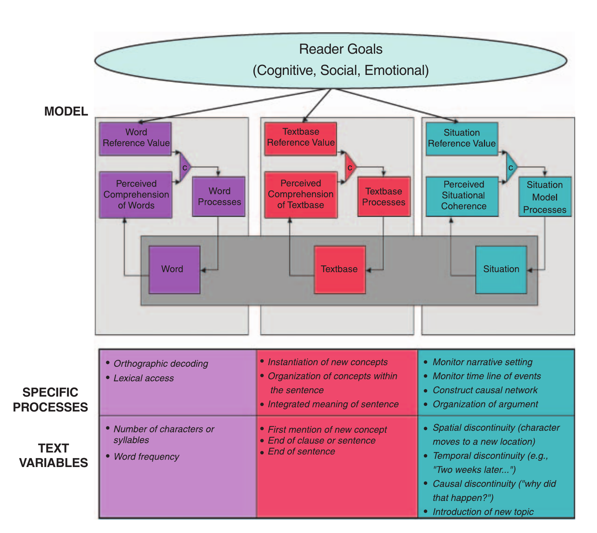
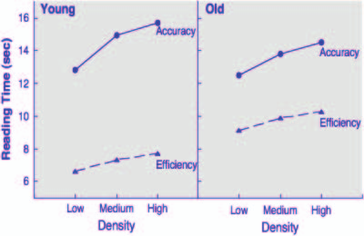

# 인지 노화의 덤블도어 가설

> Elizabeth A.L. Stine-Morrow · Beckman Institute 및 University of Illinois at Urbana-Champaign 교육심리학과 · Current Directions in Psychological Science, 16(6), 295-299 (2007)

> 연락처: Elizabeth A.L. Stine-Morrow, Department of Educational Psychology, University of Illinois at Urbana-Champaign, 226 Education Building, 1310 South Sixth Street, Champaign, Illinois, 61820-6990; e-mail: eals@uiuc.edu.

## 초록

인지 노화는 흔히 서로 경쟁하는 두 힘, 즉 인지 역학(mental mechanics)의 쇠퇴를 낳는 유전적으로 추동되는 노쇠 과정과 문화적·실용적·지식 기반 역량을 증진하는 생애경험의 축적이 개인의 발달을 결정하는 과정으로 설명된다. 복잡한 지적 활동(예: 언어 이해)의 수행 수준과 변화 속도에서 나타나는 상당한 변이는 흔히 이 두 힘과 관련된 능력의 개인차로 설명된다. 나는 노력을 어떻게 배분할 것인가에 관한 선택이 생애 전반의 인지 변화에 핵심적인 결정요인일 수 있다고 주장한다. 이러한 선택은 주의 관여(attentional engagement)의 형태로 직접 작용하기도 하고, 구성 능력을 낳는 신경 기질을 형성함으로써 간접적으로 작용하기도 한다.

## 핵심어

인지 노화; 관여; 자원 배분; 자기조절

의학과 그 밖의 문화적 진보로 기대수명이 늘어나면서 많은 사람은 삶의 4분의 1에서 3분의 1을 “노년기”로 규정되는 시기에 보내며, 그중 상당 부분은 건강과 정신활동에서 활력을 누릴 잠재력이 크다. 그러나 생애 후반에는 지적 활동의 기회가 흔히 제한되고(Riley & Riley, 2000), 지속적인 인지 활력에 대한 사회적 기대도 줄어든다(Hess, Auman, Colcombe, & Rahhal, 2003). 실제로 인지 노화는 성장과 쇠퇴를 모두 아우르는 다면적 현상으로 흔히 설명된다(Baltes, 1997). 새로운 정보를 빠르게 부호화하고 변환하는 데 의존하는 “인지 역학”인 유동성 능력은 유전적으로 추동되는 노쇠 과정의 결과로 통상적인 쇠퇴를 보이는 반면, 지식과 문화 습득에 의존하는 결정성 능력은 노년기 깊숙이까지 안정적으로 유지되거나 증가할 수 있다. 유동성 능력의 쇠퇴는 쉽게 관찰되기 때문에 연구자에게는 우려의 대상이며 나이 드는 당사자에게는 흔히 큰 불안을 안긴다. 기억, 주의통제, 언어 이해의 어려움은 일상생활 참여를 방해할 수 있다.

이 글이 제기하는 질문은 개인이 이러한 발달 궤적을 어느 정도 통제할 수 있는가이다. 어떤 면에서 우리는 나이가 들면서, 가상의 마법사 Harry Potter가 마법학교 Hogwarts에서 배정될 기숙사를 고르는 “분류 모자”를 썼을 때와 매우 비슷한 상황에 놓인다(Rowling, 1997). Harry에게는 Gryffindor 기숙사의 고결한 마법사들이 지닌 특성과 Slytherin 기숙사의 사악한 마법사들이 지닌 특성(이들 역시 영리하고 어려운 상황에서 결단력이 있다)이 모두 있기 때문에 분류 모자가 결정하기는 쉽지 않다. 분류 모자의 중얼거림을 들은 Harry는 Slytherin이 아니라 Gryffindor에 넣어 달라고 요청한다. 모자는 그에게 다른 선택을 설득하려 하지만 Harry가 고집하자 결국 동의한다. 이후 Harry는 큰 용기를 요구하는 끔찍한 시련에 맞설 때마다 자신이 “진정한 Gryffindor”인지 “진정한 Slytherin”인지 고민하며 이 대화를 마음에 걸려 한다.

이와 마찬가지로 우리는 나이가 들면서 노화에 대한 문화적 기대라는 “분류 모자”와 씨름한다. 큰 용기를 요구하는 지적 도전(예: 모임에서 사람들의 이름 기억하기, 새로운 기술 배우기, 은퇴설계안 해독하기)에 직면하면 자신이 정말 그 과제를 감당할 수 있는지 의문을 품는다. 우리는 인지적으로 도전적인 상황을 찾아 의미 있고 주의를 기울이는 방식으로 참여할지, 아니면 활동에서 물러날지를 암묵적으로 또는 명시적으로 선택한다. 이는 인지능력이 저하된다는 문화적 고정관념을 받아들이기 때문일 수도 있고, 의미 있는 지적 도전의 기회가 줄어들기 때문일 수도 있으며, 두 이유가 모두 작용할 수도 있다. 우리는 흔히 지적 능력을 노력으로는 크게 바꿀 수 없는 고정된 실체로 보는 문화적 맥락(Molden & Dweck, 2006), 그리고 노인이 인지적 결과를 통제할 수 있으리라고 대체로 기대하지 않는 문화적 맥락(Hess et al., 2003)에서 이러한 선택을 한다. 우리가 지적 활동에서 물러나는 만큼 과제 관련 과정이 실행되지 않아 수행이 저하될 수 있으며, 사용하지 않는 탓에 수행의 기반이 되는 인지기능에서 노쇠와 관련된 쇠퇴가 더 심해질 수도 있다.

Harry Potter는 놀라운 위업을 이룬 뒤에도 의심에 시달리고, 이를 교장 Dumbledore와 상의한다. Dumbledore는 Harry가 이룬 모든 일을 상기시키며 이렇게 확언한다. “우리가 진정 어떤 사람인지를 보여 주는 것은 ... 우리의 능력보다 훨씬 더, 우리가 내리는 선택이란다”(Rowling, 1999, p. 333). 이 글은 지적 도전에 참여하기로 선택하는 우리의 양식이 노쇠 과정보다 훨씬 더 인지 활력에 기여한다는 이론, 곧 인지 노화의 덤블도어 가설(Dumbledore hypothesis)이 타당한지를 살펴본다.

## 자기조절, 관여, 인지 최적화

지적 활동에 참여하기로 선택하는 일은 서로 매우 다른 두 가지 의미에서 인지 최적화의 중요한 결정요인일 수 있다. 첫째, 인지 수행이 궁극적으로 그 수행의 토대가 되는 인지 연산의 실행에서 나온다고 가정하면, 연산을 효과적으로 수행할 때 결과가 향상된다(예: 기억을 잘하기 위해 조직화 처리와 정교화 처리에 노력을 배분하는 것). 이러한 과제별 과정의 실행을 주의 관여라고 부를 수 있다. 다시 말해, 어떤 인지 과제든 제대로 해내려면 주의 자원을 효과적으로 배분하는 것이 중요하다. 이 원리를 설명하기 위해 언어처리의 사례를 사용한다(Stine-Morrow, Miller, & Hertzog, 2006). 둘째, 지적으로 자극적인 환경 맥락을 습관적으로 선택하는 활동 참여(activity engagement)는 잠재적으로 능력을 확장할 수 있다(Kramer, Bherer, Colcombe, Dong, & Greenough, 2004). 따라서 자신의 인지처리와 환경 맥락을 습관적으로 자기조절하는 일은 수행을 향상하고 미래 수행을 낳는 인지체계를 형성함으로써 성인 후기의 지적 활력에 기여할 수 있다고 나는 제안한다.

### 주의 관여

언어능력은 노년기까지도 회복력을 보이는 경우가 많은 결정성 능력이지만, 말과 글로 된 언어에 대한 기억은 나이가 들수록 흔히 쇠퇴한다(Johnson, 2003). 우리 연구실에서는 이러한 결함이 최적이 아닌 주의 관여에 뿌리를 두고 있을 가능성을 조사해 왔다. 자기조절 언어처리(Self-Regulated Language Processing, SRLP) 모형(Stine-Morrow, Miller et al., 2006)은 Figure 1에 시각적으로 제시되어 있다. 현대 담화이론을 토대로 한 SRLP 모형은 언어 이해와 기억이 텍스트의 어휘적 표현인 표층형식, 의미 내용인 아이디어, 그리고 그 아이디어가 제시하는 상황에 대한 지각적으로 풍부한 표상을 함께 구축하는 데서 나온다고 가정한다. 이러한 다면적 표상을 구성하려면 세 수준, 즉 단어 표상, 텍스트베이스(textbase) 표상, 상황모형(situation model) 표상 각각에서 여러 구성 과정이 필요하다. 과정과 관련된 텍스트 특성이 읽기시간에 어떤 영향을 미치는지 분석하면 개별 독자가 이러한 텍스트 처리 요구에 얼마나 민감하게 반응하는지를 나타내는 지표를 얻을 수 있다. 예를 들어 표층 특성(예: 단어 길이와 빈도)을 통제하면, 독자는 새로운 개념을 도입하는 단어의 문맥화된 의미를 형성하기 위해 그 단어에 시간을 더 배분하고, 이러한 의미를 아이디어로 통합하기 위해 절과 문장의 끝에 시간을 더 배분한다는 사실을 확인할 수 있다(다른 예는 Fig. 1 참조). 텍스트 특성의 변화에 따른 단위 읽기시간의 상대적 변화인 회귀계수로 조작화한 “배분 방침(allocation policy)”의 개인차를 이용하면 읽기에서 주의 관여의 질과 정도를 특성화할 수 있다.

한 개인의 배분 방침은 시간과 텍스트 유형이 달라져도 어느 정도 일관성을 보여, 자원 배분 양식이 “마음의 습관”을 반영할 수 있음을 시사한다(Stine-Morrow, Miller, Gagne, & Hertzog, in press). 중요한 점은 자원 배분의 특정 측면, 특히 개념 통합과 담화 상황을 정교화하는 데 배분한 노력이 기억과 이해 수행을 예측한다는 것이다(Stine-Morrow, Gagne, Morrow, & DeWall, 2004; Stine-Morrow et al., in press). 따라서 독자가 텍스트에 인지적으로 관여하는 방식이 학습 내용을 결정한다는 근거는 충분하다.

그렇다면 언어 수행의 연령 관련 쇠퇴는 처리 능력의 연령에 따른 변화를 효과적으로 수용하지 못하는 배분 방침에서 부분적으로 비롯된다고 볼 수 있다. 성공적인 노년 독자는 흔히 개념 통합에 두드러지게 더 많은 주의를 기울이고, 언어 입력을 더 자주 묶음화하며(즉, 개념 통합을 위해 더 자주 멈추며), 상황적 특성과 담화 구조에 주의를 더 많이 배분하는 등 여러 가지 배분 조정을 보인다(Stine-Morrow, Morrow, & Leno, 2002; Stine-Morrow et al., 2004; Stine-Morrow et al., in press). 이러한 연구 결과의 요점은 주의 관여에 관한 암묵적 또는 명시적 선택이 수행을 예측한다는 것이다. 반면 효과적인 주의 관여를 위해 자원을 동원하게 만드는 요인이 무엇인지는 덜 분명하다.

우리 연구실의 최근 연구는 노력의 투입이 기존 능력 및 노력이 좋은 수행으로 이어지리라는 믿음 모두와 관련될 수 있음을 시사한다. 이 연구에서(Stine-Morrow, Shake, Miles, & Noh, 2006) 성인들은 짧은 글을 정확하게 읽거나 효율적으로 읽으라는 지시를 받았다. 처리 능력에 연령차가 존재한다는 점을 고려하면 정확한 회상이 요구될 때 노인이 상대적으로 훨씬 많은 읽기시간을 배분해야 할 것으로 예상되지만, 실제 읽기시간 양상은 그 반대였다. 시간 배분이 정확성 목표에 특히 민감하게 반응한 쪽은 젊은 독자였다(Fig. 2 참조). 흥미롭게도 정확성 목표에 대한 반응성의 연령차(효율성 조건과 정확성 조건 사이의 시간 배분 비례 차이로 측정)는 작업기억 용량과 기억 자기효능감(자신이 기억 수행의 결과에 영향을 미칠 수 있다는 믿음을 지필검사로 평가한 것)으로 부분적으로 설명할 수 있었다. 따라서 노인이 실제로 과제 요구에 관여할 수 있었는지와 관계없이 자기효능감의 연령차가 이들이 그렇게 하기를 꺼리는 데 기여했다. 우리 연구실의 미출판 자료는 개념 통합에 관한 구체적인 지시를 제공하면 노년 독자가 더 철저한 의미 분석에 관여하도록 유도할 수 있음을 보여 준다.

Fig. 1. 자기조절 언어처리 모형(Stine-Morrow, Miller, & Hertzog, 2006). 이 모형에서 텍스트 이해는 표층형식인 단어, 텍스트가 표현하는 의미 내용 또는 아이디어인 텍스트베이스, 텍스트가 묘사하는 상황에 대한 다면적 정신표상(짙은 회색 상자)을 구축하는 데 달려 있다. 이 세 표상 수준은 각각 독자의 인지적·사회정서적 목표(상단)의 영향을 받는 기준인 준거값에 따라 더 완전하게 또는 덜 완전하게 구성될 수 있다. 각 수준에서는 관련 과정에 대한 주의가 음의 피드백 고리로 조절되는데, 이 고리에서는 현재 표상에 대한 지각(즉, 지각된 단어 이해, 지각된 텍스트베이스 이해, 지각된 상황적 일관성)을 준거값과 비교(C)하고, 표상이 “충분히 좋다”고 할 수 없으면 그 수준의 처리기가 평형에 도달할 때까지, 즉 지각된 이해가 준거값을 충족할 때까지 더 많은 자원을 요구한다. 각 수준의 특정 과정에 대한 노력 배분은 해당 과정을 동원한다고 가정되는 텍스트 변수에 따른 읽기시간의 상대적 변화로 조작화된다.

### 활동 참여

동시에 작업기억 용량과 처리속도 같은 핵심 인지능력이 인지 활력, 문제해결과 언어 이해 같은 복잡한 활동의 수행, 그리고 성인 후기에는 식사 준비나 청구서 납부 같은 단순한 수단적 일상생활 활동을 수행하는 능력에 강력하게 기여한다는 사실은 부인할 수 없다(Willis et al., 2006). 그렇다면 이러한 능력을 꾸준히 사용하고 연습함으로써 유지할 수 있는가라는 질문이 제기된다. 그러나 “쓰지 않으면 잃는다”는 권고가 자주 제시됨에도, 지적 활동이 풍부한 생활양식을 유지하는 것이 실제로 인지 쇠퇴를 늦추는지를 둘러싸고는 논쟁이 있다(Salthouse, 2006).

일부 근거는 지적 도전의 기회를 정기적으로 제공하는 맥락(예: 비구조화 문제를 자주 접해야 하는 요구 수준 높은 업무환경, 지적으로 자극적인 여가활동)에 놓인 사람이 여러 측면에서 더 좋은 결과를 보인다고 시사한다. 이들은 더 오래 살고, 연령 관련 병리 과정(예: 알츠하이머병, AD)의 심리적 발현에 더 잘 저항하며, 인지 수행 측정에서 더 높은 점수를 받을 가능성이 있다. 이러한 결과는 활동 참여가 활력에 광범위한 효과를 낸다는 생각과 일치하지만, 본질적으로 모호하다. 본래 활력 수준이 높은 사람이 그러한 경험을 찾아 나설 가능성도 더 크고, 경험을 찾은 뒤에도 참여를 유지할 가능성도 더 클 뿐일 수 있기 때문이다. 다시 말해 직업 참여, 여가활동, 치매 취약성 및 시간에 따른 각각의 궤적은 모두 모집단에서 정규분포하는 유전적으로 추동된 노화 과정의 생물행동적 지표일 수 있으며, 그렇다면 이 활력 지표들은 공통 원인에서 비롯되기 때문에 단순히 서로 상관될 뿐이라는 설명이 가능하다.

Fig. 2. 기억의 정확성을 위해 읽도록 했을 때와 효율성을 위해 읽도록 했을 때(요지를 빠르게 파악하기), 젊은 성인과 노년 성인이 정보밀도(즉, 명제 또는 아이디어의 수)에 따라 읽기에 배분한 시간(Stine-Morrow, Shake, Miles, & Noh, 2006). 정확성 조건의 젊은 성인은 효율성을 위해 읽도록 요청받았을 때보다 읽기에 더 많은 시간을 배분했으며, 특히 정보밀도가 높아질수록 그 차이가 커졌다. 노년 성인은 정보 습득, 즉 텍스트베이스 부호화에 더 엄격한 준거값을 설정한 정확성 목표에 덜 민감하게 반응했다.

교육 수준이 낮은 것이 AD의 위험요인이라는 결과와 교육 수준이 높은 사람이 임상 증상이 나타나기 전까지 그러한 뇌 병리를 더 오랫동안 견딘다는 결과는 선택 효과로 설명하기가 더 어렵다(생물학적 활력이 교육 수준을 형성한다는 설명은 제외한다). 이러한 결과는 경험이 풍부한 삶이 신경회로를 강화하여 병리에 맞설 대안적 처리 레퍼토리를 제공한다는 “인지예비력”의 효과로 설명되어 왔다(Scarmeas & Stern, 2003).

핵심 능력의 가소성을 뒷받침하는 또 다른 근거는 훈련 연구에서 나온다. 이러한 연구의 가장 영향력 있는 사례는 아마도 ACTIVE 시험(Willis et al., 2006)일 것이다. 이 무작위 임상시험에서는 노인에게 특정 인지능력(기억, 처리속도 또는 추론)에 대한 훈련 10회기를 제공했다. 비접촉 통제집단과 비교했을 때 훈련을 받은 집단은 훈련 효과를 보였고, 그 효과는 최대 5년까지 유지되는 것으로 확인되었다. 훈련 효과는 매우 구체적이었다. 예를 들어 처리속도 훈련의 효과는 속도가 요구되는 과제에만 나타났고 기억이나 추론으로 전이되지 않았다. 이러한 능력에 대응하는 일상활동으로 전이된다는 사실은 입증되지 않았지만, 추론 훈련을 받은 사람들은 수단적 일상생활 활동을 더 수월하게 수행한다고 보고했다.

따라서 참여가 활발한 생활양식과 교육의 상관 효과를 조사한 연구와 달리, 실험적 훈련 연구는 전문가 수행 연구와 더불어 경험의 효과가 훈련받은 능력에 매우 한정적임을 시사한다. 이는 수수께끼다. 한 가지 가능한 설명은 참여가 활발한 생활양식이 단지 더 넓은 범위의 능력을 연습시킨다는 것이지만, 구성 요소를 광범위하게 연습하는 일이 어떻게 생겨나는지는 거의 탐구되지 않았다. 연구마다 관여를 서로 다른 방식으로 조작화했지만, 근본적으로 관여란 자기주도성을 요구하는 실제 생활 맥락에 놓인 비교적 높은 수준의 도전적 활동을 뜻한다. 이 생각에서 중심이 되는 것은 맥락의 새로움과 마주치는 도전의 비구조적·비일상적 성격 때문에 개인이 문제를 선택하고 우선순위를 정하고 구조화하는 방식뿐 아니라 해결책을 개발하기 위한 자원을 조직하는 방식에 관해서도 선택해야 한다는 점이다.

따라서 관여는 잘 정의된 기술 집합을 수행하기 위한 준비인 “훈련”보다는 예측할 수 없는 맥락에서 사고하고 행동하기 위한 기초 준비인 “교육”에 더 가깝다. 실증 연구에서 통제하기 가장 어려운 바로 그 요소, 예컨대 “필요할 때” 기술을 활용하여 새로움과 비구조화 문제에 어떻게 접근할지 선택하는 일이 활동 참여의 광범위한 효과를 낳는 원천일 수 있다. 우리의 연구 전략은 참여가 활발한 생활양식을 구현한다고 판단되는 다중양식 개입을 만들고, 그러한 관여가 폭넓은 인지능력과 성향에 미치는 영향을 실험적으로 검증하는 것이다. Box 1에 설명한 Senior Odyssey 프로그램(Stine-Morrow, Parisi, Morrow, Greene, & Park, 2007)은 기존 프로그램인 Odyssey of the Mind와 연계하여 기존 사회구조를 발판으로 삼는다. 프로그램 개발과 효과 평가는 현재 진행 중이다.

#### Box 1. 활동 참여로서 Senior Odyssey 프로그램의 특징

우리는 참여가 활발한 생활양식을 재현하도록 노인을 위한 개입인 Senior Odyssey 프로그램을 설계했으며, 이를 이용해 활동 참여가 폭넓은 인지능력과 성향에 미치는 영향을 실험적으로 검증하고 있다. 개입의 특징은 다음과 같다.

- 실질적 복잡성이 높은 환경을 제공하는 팀 기반 협업을 통해 해결책을 개발하는 비구조화된 “장기” 문제(Schooler & Mulatu, 2001)
- 문제해결 기술을 뒷받침하기 위해 유동성 능력의 구성 요소(예: 추론, 작업기억, 시공간 처리, 유창성, 처리속도)를 연습시키는 여러 유형의 빠르게 진행되는 “즉석” 문제(“두뇌 퍼즐”)
- 필요할 때 요소 기술을 자기주도적으로 사용하도록 자극하는 창의성 발휘 기회
- 효과적인 해결책에 실질적 결과가 따르도록 수행에 상을 주는 팀 간의 우호적 경쟁
- 활동 선택권
- 기존 사회구조를 활용하고 프로그램의 규모 확대 가능성을 높이며 연령통합을 촉진하기 위해, 아동과 청년을 위한 기존 교육 프로그램 Odyssey of the Mind(www.odysseyofthemind.org)와 협력(Riley & Riley, 2000)

예비 결과에 따르면 대기자 명단 통제집단과 비교해 Senior Odyssey 참여자는 처리속도가 향상되었고 확산적 사고에서도 경계선 수준의 향상을 보였다. 또한 이들은 마음챙김(새로운 범주로 경험을 해석하려는 자신의 의향에 대한 지각)과 인지욕구(지적 도전에 참여하려는 자신의 의향에 대한 지각)가 상대적으로 증가했다. 관여의 한 형태인 Senior Odyssey가 인지기능을 광범위하게 향상하는지는 아직 밝혀져야 하지만, 그러한 경험이 인지적 요구에 관여하려는 성향을 바꿀 수 있는 만큼 이는 여전히 타당한 가설이다.

## 결론

그렇다면 생애 전반의 인지 활력에 이르는 길은 무엇인가? 노화의 본질은 이득과 손실의 역동적 상호작용이다. 손실은 “저절로” 찾아오지만 이득은 힘겹게 얻는다. 자원 배분에 관한 문헌은 읽기 같은 일상적 인지 과제의 요구에 개인이 관여하는 정도에 상당한 변이가 있음을 시사한다. 동시에 인지 가소성 연구를 보면 경험의 행동 효과는 극히 한정적이라는 점이 분명해 보인다. 따라서 활동 참여가 광범위한 인지 활력에 미치는 효과는 참여가 활발한 생활양식이 그 생활양식에 필요한 기술을 개발하고 유지하도록 주의 관여를 일으키기 때문에 나타날 가능성이 크다. 자기조절 효능감을 불러일으키는 지적으로 풍부한 맥락, 즉 훈련 모형과 대비되는 교육·관여 모형은 기술을 발달시키기 위해 주의 관여를 발휘할 기회를 충분히 의미 있고 정서적으로 만족스러우며 스스로 지속될 수 있는 방식으로 제공함으로써 활력을 자극할 수 있다. 경험적으로 검토해야 할 핵심 쟁점에는 주의 관여와 활동 참여의 발달·유지를 뒷받침하는 조건(예: 새로움), 이 두 관여 형태가 상호작용하는 방식, 그리고 새로움과 비일상적 도전에 노출되는 것이 관여를 낳을 수 있게 하는 심리사회적 기제(예: 자기효능감, 통제, 마음챙김)가 포함된다. 이러한 근거는 인지 활력이 우리가 선택한 활동의 과제 요구에 어떻게 관여하는지와 그러한 활동을 통해 어떤 능력을 형성하는지 모두에 달려 있다는 덤블도어 가설을 검증할 것이다. 나이가 들수록 우리가 진정 어떤 사람인지를 보여 주는 것은 바로 우리의 선택일지도 모른다.

## 권장 읽기

Kramer, A.F., Bherer, L., Colcombe, S.J., Dong, W., & Greenough, W.T. (2004). (참고문헌 참조). 성인 후기의 행동 및 신경 가소성에 관한 근거를 포괄적으로 검토한 글이다.

Salthouse, T.A. (2006). (참고문헌 참조). “쓰지 않으면 잃는다”는 관념을 뒷받침하는 근거가 놀랄 만큼 부족하다고 주장하는 도발적인 검토 논문이다.

Stine-Morrow, E.A.L., Miller, L.M.S., & Hertzog, C. (2006). (참고문헌 참조). 언어처리의 연령차를 검토하고, 이 글보다 SRLP 모형을 더 자세히 논의한다.

## 감사의 글

이 글에서 설명한 연구 일부에 연구비를 지원한 National Institute on Aging에 감사드린다(R01 AG13935 및 R03 AG024551). 초기 원고에 의견을 준 Dan Morrow와 Ron Spiro에게도 깊이 감사드린다.

## 참고문헌

Baltes, P.B. (1997). On the incomplete architecture of human ontogeny: Selection, optimization, and compensation as foundation of developmental theory. American Psychologist, 52, 366-380.

Hess, T.M., Auman, C., Colcombe, S.J., & Rahhal, T.A. (2003). The impact of stereotype threat on age differences in memory performance. Journal of Gerontology B: Psychological Sciences, 58, 3-11.

Johnson, R.E. (2003). Aging and the remembering of text. Developmental Review, 23, 261-346.

Kramer, A.F., Bherer, L., Colcombe, S.J., Dong, W., & Greenough, W.T. (2004). Environmental influences on cognitive and brain plasticity during aging. Journal of Gerontology A: Medical Sciences, 59, 940-957.

Molden, D.C., & Dweck, C.S. (2006). Finding “meaning” in psychology: A lay theories approach to self-regulation, social perception, and social development. American Psychologist, 61, 192-203.

Riley, M.W., & Riley, J.W., Jr. (2000). Age integration: Conceptual and historical background. The Gerontologist, 40, 266-270.

Rowling, J.K. (1997). Harry Potter and the Sorcerer’s Stone. New York: Scholastic, Inc.

Rowling, J.K. (1999). Harry Potter and the Chamber of Secrets. New York: Scholastic, Inc.

Salthouse, T.A. (2006). Mental exercise and mental aging: Evaluating the validity of the “use it or lose it” hypothesis. Perspectives on Psychological Science, 1, 68-87.

Scarmeas, N., & Stern, Y. (2003). Cognitive reserve and lifestyle. Journal of Clinical and Experimental Neuropsychology, 25, 625-633.

Schooler, C., & Mulatu, M.S. (2001). The reciprocal effects of leisure time activities and intellectual functioning in older people: A longitudinal analysis. Psychology and Aging, 16, 466-482.

Stine-Morrow, E.A.L., Gagne, D.D., Morrow, D.G., & DeWall, B.H. (2004). Age differences in rereading. Memory and Cognition, 32, 696-710.

Stine-Morrow, E.A.L., Miller, L.M.S., Gagne, D.D., & Hertzog, C. (in press). Self-regulated reading in adulthood. Psychology and Aging.

Stine-Morrow, E.A.L., Miller, L.M.S., & Hertzog, C. (2006). Aging and self-regulated language processing. Psychological Bulletin, 132, 582-606.

Stine-Morrow, E.A.L., Morrow, D.G., & Leno, R. (2002). Aging and the representation of spatial situations in narrative understanding. Journal of Gerontology B: Psychological Sciences, 57, 91-97.

Stine-Morrow, E.A.L., Parisi, J.M., Morrow, D.G., Greene, J.C., & Park, D.C. (2007). An engagement model of cognitive optimization through adulthood. Journal of Gerontology B: Psychological Sciences, 62, 62-69.

Stine-Morrow, E.A.L., Shake, M.C., Miles, J.R., & Noh, S.R. (2006). Adult age differences in the effects of goals on self-regulated sentence processing. Psychology and Aging, 21, 790-803.

Willis, S.L., Tennstedt, S.L., Marsiske, M., Ball, K., Elias, J., Koepke, K.M., et al. (2006). Long-term effects of cognitive training on everyday functional outcomes in older adults. JAMA: The Journal of the American Medical Association, 296, 2805-2814.
