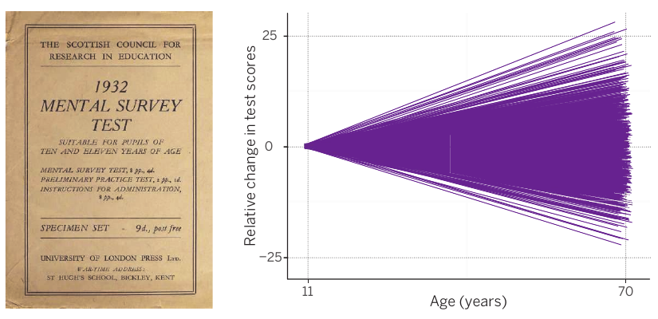
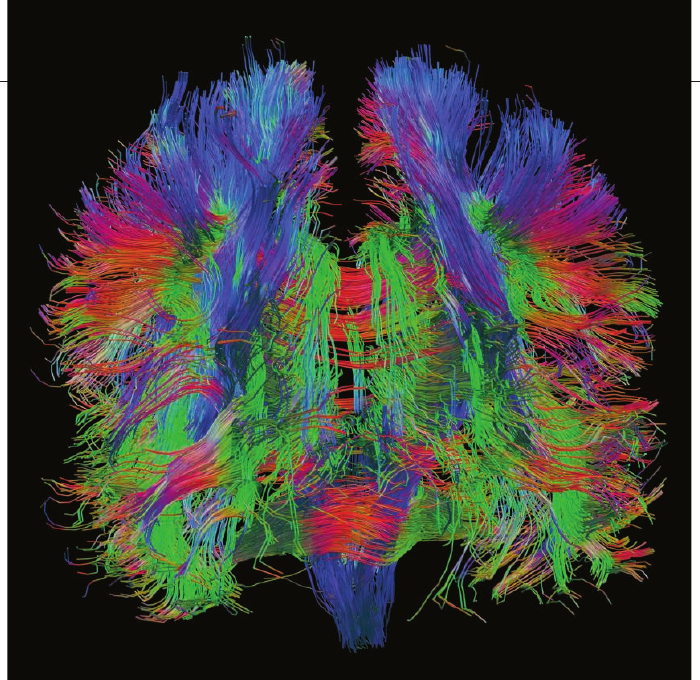

# 어릴 때부터 시작하기

> 스코틀랜드 아동의 수십 년 된 IQ 검사 기록은 뇌가 어떻게 노화하는지를 들여다볼 독특한 창을 열었다

> Emily Underwood 지음

## Sheila McGowan과 Scottish Mental Surveys

1947년 6월 4일, 여름방학을 앞둔 11세 Sheila McGowan은 스코틀랜드 Glasgow의 한 공립학교에서 연필과 종이를 들고 지능검사를 치렀다. 검사는 간단한 유추 문제로 쉽게 시작했다. 예를 들면 “사람과 피부의 관계는 무엇—외투, 동물, 새, 가죽, 천—과 털의 관계와 같은가?”라는 문제였다. 이내 공간 퍼즐, 산수, 암호 해독처럼 더 어려운 과제로 넘어갔다. 문항은 모두 71개였고, 주어진 시간은 45분뿐이었다.

그날 다른 11세 아동 70,000명 이상도 같은 검사를 치렀다. 한 나라의 같은 연령 코호트 전체를 대상으로 지능을 측정하려 한 최초의 시도 가운데 하나였다. 이 검사는 Scottish Mental Surveys라고 불렸다. 1932년에 시행된 앞선 조사까지 포함한 이 검사들의 애초 목적은 학교교육의 혜택을 받기에는 너무 “정신적으로 결함이 있는” 아동이 몇 명인지 파악하고, 전문직 가정이 자녀를 적게 낳으면서 스코틀랜드인의 평균 지능이 낮아지고 있다는 우려에 대응하는 것이었다.

McGowan은 검사를 치를 당시 어머니가 중병을 앓고 있었기 때문에 그날을 “아주 잘” 기억한다. 이듬해 4월 어머니가 세상을 떠난 뒤, McGowan은 생계를 위해 지역 조선소에서 야간근무를 해야 했던 아버지와 단둘이 살았다. 지능검사에서는 높은 점수를 받았지만, 당시 가난했던 많은 스코틀랜드 청소년처럼 학교를 마치지 못했다. 그는 16세에 Glasgow의 상점 점원으로 일하기 시작했다.

수십 년이 흘렀다. McGowan은 결혼해 두 딸을 낳았고, 청각장애인을 위한 대학의 교사가 되었으며, 심리학 학사학위도 받았다. 그러던 2003년, 1947년 정신능력 검사를 치렀는지 묻는 안내문 한 장이 집으로 배달되었다. 안내문은 영국 University of Edinburgh의 인지심리학자 Ian Deary와 동료들이 보낸 것이었다. Deary는 McGowan이 소녀 시절의 예리함을 유지했는지, 아니면 인지저하의 징후를 보이는지를 알아보기 위한 장기 연구에 참여해 같은 검사를 다시 치르기를 바랐다.

McGowan은 연구 참여에 동의하는 데 “조금은 용기가 필요했다”고 말한다. 실제로 그의 옛 학교 친구 중 몇 명은 과학자들이 자신의 정신기능이 내리막을 걷는 과정을 추적한다는 생각이 달갑지 않아 참여하지 않았다고 한다.

그러나 Deary와 동료들은 스코틀랜드 저지대 Lothian 지역에 사는 McGowan의 동년배 1,000명 이상과 1932년 조사 참여자 500명 이상을 설득해, 이제 10년째 이어진 후속연구에 등록시켰다. 2014년 4월 Deary는 생존한 참여자를 가능한 한 많이 Edinburgh의 Mound에 있는 Church of Scotland Assembly Hall로 초청해 최신 결과를 미리 보여 주었다. 1947년 코호트와 1932년 코호트는 당시 각각 78세와 93세였다. 얌전한 골든리트리버 한 마리와 함께 약 400명의 스코틀랜드 노인이 참석했다.

> 4월, 심리학자 Ian Deary(앞줄 중앙)가 Lothian Birth Cohorts의 생존 참여자들을 모아 그들의 뇌가 어떻게 노화하고 있는지를 설명했다.

Assembly Hall의 아치형 천장 아래 연단에 선 Deary는 연구 참여가 낳은 성과를 들려주었다. 이 연구는 아동기의 인지능력이 일생에 걸쳐 어떻게 유지되거나 변하는지를 독특하게 보여 준다. 약 2-3년 간격으로 실시한 인지검사와 뇌 스캔이 20,000시간을 넘고, 여기에서 나온 과학 논문도 250편이 넘는다. 무엇보다 오랫동안 논쟁해 온 질문에 답할 실마리를 제공한다. 건강한 사람 중 일부는 나이가 들어도 왜 인지적 예리함을 유지하는 반면, 다른 사람은 그 예리함을 잃는가?

Deary는 10년 넘게 Lothian 코호트의 여러 인지검사 점수를 연구하고, 유전 시료를 채취하고, 뇌를 스캔하고, 생활방식과 건강을 세세히 기록한 끝에 노년기 인지능력을 다른 어떤 단일 측정치보다 더 잘 예측하는 것으로 보이는 요인 하나를 찾아냈다. 운동이나 교육, 그 밖의 바람직한 활동이 아니라 그 사람이 11세 때 보인 지능 수준이었다. Deary는 Fred Astaire의 말을 빌려 노년에 관해 이렇게 말하곤 한다. “성공하려면 어릴 때부터 시작해야 한다.”

## 많은 나라와 마찬가지로

스코틀랜드에서도 인구고령화가 빠르게 진행되고 있으며, 65세 이상 인구는 앞으로 20년 동안 약 60% 늘어날 것으로 예상된다. 세계 곳곳의 수십 개 노화 연구가 McGowan 같은 노인을 추적하며 인지저하와 치매를 늦출 단서를 찾고 있다. 그러나 Lothian Birth Cohort 연구는 뜻밖의 횡재 덕분에 여전히 독보적이다.

1997년 Deary와 동료들은 University of Edinburgh의 한 지하실에 보관되어 있던 Scottish Mental Surveys 기록을 발견했다. 천공카드와 바늘을 사용하는 집계기계로 디지털 시대 이전에 힘들여 분석한 정보가 담긴 상자들이 정부와 대학 문서보관소에 겹겹이 쌓여 먼지를 뒤집어쓰고 있었다. 자료를 살펴보던 Deary와 정신과의사 Lawrence Whalley는 자신들이 금광을 발견했다는 사실을 깨달았다. Whalley는 당시 Deary가 “이것이 우리 인생을 바꿀 겁니다”라고 말했다고 회상한다.

일부 종단 노화 연구도 19-22세 무렵의 IQ 검사나 다른 인지능력 기록까지 거슬러 올라갈 수 있다. 그러나 Virginia주 Charlottesville에 있는 University of Virginia의 심리학자 Timothy Salthouse는 “이 사람들의 더 이른 연령대 인지능력에 관한 정보가 있는 경우는 매우 드물다”고 지적한다.

Deary는 사람마다 지능이 다른 인지적·생물학적 기초를 수십 년간 연구해 왔기 때문에 이 방대한 문서를 활용하기에 적합했다. 연구와 개인적 인연도 있었다. 그의 삼촌 Richard Deary는 1932년 Scottish Mental Survey에 참여했지만, 제2차 세계대전 중이던 21세 때 지중해에서 타고 있던 잠수함이 기뢰와 충돌해 숨졌다.

전국 조사자료를 찾아낸 뒤 Deary와 동료들은 영국의 자선기금과 정부 연구비를 받아 참여자들을 대상으로 새 연구를 시작했다. 1932년과 1947년에 Scottish Mental Surveys를 치른 약 160,000명의 아동 가운데 모든 생존자에게 다시 연락하는 것은 재정 여건상 현실적으로 어려웠다. 대신 한 대표표본을 구성하기 위해 Edinburgh 인근 Lothian 지역 거주자 약 5,000명에게 연락했다.

두 코호트에서 최종적으로 1,641명이 참여했다. 이들은 Scottish Mental Survey에서 사용한 원래 검사로 다시 평가받았다. Deary에 따르면 이 IQ 측정도구는 아동기와 노년기 모두에서 신뢰도와 타당도가 잘 확립되어 있다. 연구진은 다양한 인지·신체 검사도 실시하고 DNA 표본도 수집했다. 참여자들의 정신능력이 시간에 따라 다르게 변하는 이유를 설명할 유전적 변이를 찾기 위해서였다.

2005년 Deary의 연구진은 연구 수준을 “한 단계 끌어올렸다.” 노화 연구 자선단체 Age UK를 설득해 Lothian 참여자 1,000명을 MRI로 스캔하는 “The Disconnected Mind” 연구비를 확보한 것이다. Edinburgh 연구진은 여러 노화 연구와 달리 안정적으로 보장된 연구비가 없어서, 자료수집 차수마다 새 재원을 찾아야 한다. Deary는 “그 일에 제 시간을 아주 많이 씁니다”라고 말한다.

지금까지 연구는 명확한 결론을 뒷받침했다. 노년에 나타나는 참여자 간 인지능력 차이의 상당 부분은 또래와 비교했을 때 11세에 어느 위치에 있었는지에 달려 있다. Deary와 동료들의 추정에 따르면 11세 때 점수는 77세 때 IQ 분산의 약 50%를 예측할 수 있다.

### 큰 격차

Lothian 연구 참여자들이 나이가 들면서 Scottish Mental Survey 검사에서 어떤 변화를 보였는지를 나타낸다. 11세 때 모든 점수를 0으로 맞추었으며, 70세 때의 상승 또는 하락은 집단 평균점수를 기준으로 한 값이다.

다른 곳에서 수행된 몇몇 연구도 초기 인지능력이 나중까지 인지기능을 유지하는 데 중요하다는 점을 보여 주었다고 Los Angeles의 University of Southern California(USC) 신경과학자 Paul Thompson은 말한다. 예를 들어 University of Minnesota의 Nun Study of Aging and Alzheimer’s Disease에서는 가톨릭 수녀들이 약 22세에 수도회에 들어갈 때 쓴 자서전적 글을 연구자들이 분석했다. 글의 언어적 복잡성은 수녀들이 훗날 어떤 상태에 이를지를 강하게 보여 주는 지표였다. Thompson에 따르면, 글이 “Cicero처럼 훌륭하고 화려한 문체”였던 수녀들에 비해 간결하고 짧은 글을 쓴 수녀들은 58년 뒤 인지기능 저하와 알츠하이머병을 보일 가능성이 상당히 더 높았다.

Lothian 연구는 생애의 훨씬 이른 시점에 측정한 지능을 가지고 있기 때문에, 인지와 상관된 요인에 관한 방대한 문헌에서 겉만 번쩍이는 것과 진짜 가치를 구분하는 데 도움을 준다. Thompson은 최근의 좋은 사례로 음주의 잠재적 이익을 분석한 Deary의 연구를 든다. 일부 상관연구는 소량의 와인을 마시면 노년기 인지에 긍정적 효과가 있다고 시사했다. 실제로 Deary도 처음 Lothian 코호트에서 음주량과 인지수행의 관계를 살폈을 때 비슷한 결과를 발견했다. 그러나 Scottish Mental Survey의 IQ 점수를 통제하자 그렇게 보였던 이익은 사라졌다. 나이가 들어 와인을 마신 덕분에 인지적 이익을 얻은 것이 아니라, “술을 더 많이 마신 사람은 원래 똑똑했을 가능성이 컸다”고 Deary는 말한다.

Lothian 코호트는 식단, 체질량지수, 카페인 섭취처럼 인지에 영향을 준다고 보고된 다른 요인에도 비슷한 의문을 제기했다. Deary에 따르면 Lothian 코호트에서는 아동기 지능을 통제하면 이 요인 중 어느 것도 인지기능에 효과가 있는 것으로 보이지 않았다. 사회적·지적 활동의 효과조차 11세 때의 지능을 통제하자 사라졌다. 영리했던 아동이 성장한 뒤 사회적·지적 활동에 참여할 가능성도 더 높기 때문일 수 있다.

Virginia주 Fairfax에 있는 George Mason University의 심리학자 Pamela Greenwood는 Deary의 연구가 “매우 정교하다”고 평가하지만, 이것이 노년기 정신기능은 이미 결정되어 있고 인지능력을 높이거나 보존할 개입에는 희망이 없다는 뜻은 아니라고 주의를 준다. 인지훈련 연구는 아직 초기 단계지만, 주의통제 능력처럼 특정 능력을 향상하는 활동이 추론과 문제해결에 실질적인 이익을 줄 수 있다는 증거가 늘고 있다고 Greenwood는 말한다.

실제로 아동기 IQ가 노년기 지능의 가장 큰 요인일 수는 있지만, Lothian 연구는 그것이 노년기 지능 개인차의 절반만을 설명한다고 시사한다. 나머지 50%는 다른 요인으로 설명해야 한다. 아동기에 얼마나 영리했는지와 무관하게, Lothian 코호트에서 담배를 피우지 않았거나 신체적으로 건강했거나 이중언어를 사용했거나 교육을 더 많이 받은 사람들은 초기 점수로 예측한 수준보다 노년기 인지검사 점수가 약간 더 좋았다. 또한 Deary는 아동기 지능 순위가 상당히 낮았지만 성인기에 크게 향상한 사람이 있는 반면, “높은 수준에서 출발해 상당히 낮은 수준으로 끝나는” 사람도 있는 이유를 설명하려면 유전적·환경적 요인이 모두 작용해야 한다고 확신한다.

## 건강한 노화 추적하기

다른 노화 연구들은 인지변화를 추적하기 위해 여러 접근을 취해 왔다.

### Nun Study 1986

여성이 22세에 가톨릭 수녀회에 들어갈 때 쓴 자서전적 글은 이 장기연구에 초기 인지 측정치를 제공한다. 수녀 600명 가운데 다수가 사망 후 자신의 뇌를 연구용으로 기증하는 데 동의했다(위 사진).

### Swedish Adoption/Twin Study of Aging 1984

세계 여러 쌍둥이 연구와 마찬가지로, 서로 다른 가정에서 자란 일란성·이란성 쌍둥이 2,000명 이상을 연구해 인지저하에서 유전자와 환경이 하는 역할을 살핀다.

### Okinawa Centenarian Study 1976

900명 이상이 참여한 세계 최장수 백세인 연구로, 일본 Okinawa 주민의 이례적인 장수와 맑은 정신에 기여하는 유전적 요인과 생활방식 요인을 모두 찾는다.

### Baltimore Longitudinal Study of Aging 1958

지난 반세기 동안 이어져 온 이 노화 연구에는 현재 20-60세의 건강한 사람 1,000명 이상이 등록되어 있으며, 참여자들은 2년마다 Baltimore로 돌아와 인지검사와 신체검사를 받고 있다.

## 2014년 봄, Deary가 연설했을 때

Assembly Hall의 아치형 천장 아래에서 연구 참여자들에게 말할 때, 그는 농담으로 이야기를 시작했다. 흰 머리와 모직 카디건의 물결을 바라보며 “오늘은 방식을 좀 바꿔 1921년생과 1936년생을 맞붙여 보기로 했습니다”라고 말했다. 두 집단은 강당을 둘러보며 누가 어느 집단에 속하는지 가려내려 했다. 1932년 Scottish Mental Survey를 치르고 60여 년 뒤 연구에 등록한 550명 가운데 참석한 사람은 많지 않았다. 이제 93세가 되었기 때문이다. 반면 더 큰 1947년 검사 코호트의 78세 참여자들은 더 많이 참석했다. Deary는 “누가 누군지 구별할 수 없죠?”라고 농담했다.

그는 먼저 좋은 소식을 전했다. 지난 10년 동안 반복해 검사한 결과, 두 코호트 모두 한 문단 길이의 이야기를 기억하거나 단어를 발음하는 것 같은 기억·지식 검사에서는 좋은 상태를 유지했다. 다만 검사에 점점 익숙해진 덕분일 가능성도 있다고 Deary는 말한다. 반면 추상적 문제해결, 빠른 사고, 신속한 반응시간이 필요한 능력에서는 모든 집단이 이전 연도 결과보다 어느 정도 연령에 따른 저하를 보였다. 화면에 잠깐 나타난 길이가 다른 두 선을 빠르게 구별해야 하는 과제는 모든 참여자에게 특히 어려웠고, Deary가 그 과제를 말하자 곳곳에서 탄식이 터져 나왔다. 모든 참여자가 이 과제에서 어려움을 겪는다는 사실은 나이가 들수록 감각정보를 빠르고 효율적으로 표집하는 능력이 특히 손상될 수 있음을 시사한다고 Deary의 박사후연구원 Stuart Ritchie는 말한다. Deary는 “흥미로운 점은 이 단순한 감각 속도 측정치의 저하가 코호트가 나이 들면서 나타나는 복잡한 사고능력의 저하와 함께 움직인다는 것입니다”라고 말한다.

> 11세에 지능검사를 치렀던 Margaret Lawson은 현재 뇌가 어떻게 노화하는지에 관한 단서를 찾는 연구에 참여한 스코틀랜드인 1,641명 가운데 한 사람이다.

Lothian 코호트 평균은 흥미로운 경향을 보여 주지만, Deary가 진정으로 열정을 쏟는 대상은 개인별 분화다. 그는 참여자들이 70대와 80대에 접어들자 모든 검사의 코호트 점수가 부채처럼 벌어지고 많은 사람이 평균에서 멀어지는 모습을 담은 슬라이드를 보여 주었다. 그는 스코틀랜드 노인들에게 “저와 동료들이 하려는 일은 왜 평균만으로 전체 이야기를 알 수 없는지를 연구하는 것입니다”라고 말했다.

이 참여자들의 뇌 스캔은 노화가 사람마다 매우 다른 타격을 준다는 사실을 보여 준다고 Deary와 협력하는 University of Edinburgh의 신경영상의학자 Joanna Wardlaw는 말한다. Wardlaw와 동료들은 뇌 백질 신경로를 따라 물분자가 어떻게 이동하는지 추적하는 확산텐서영상 기법을 사용했다. 그 결과 Lothian 참여자의 전반적 인지기능 차이 가운데 약 10%는 신경 연결의 온전성에 달려 있음을 발견했다.

백질 고신호강도(white matter hyperintensities, WMH) 병변이라고 하는 얼룩진 비정상 백질 영역은 혈관, 주변 세포, 뉴런 사이 연결의 손상을 나타내는 것으로 알려져 있다. 백질 고신호강도 병변은 대체로 나이가 들수록 증가하지만 사람마다 크게 다를 수 있다고 Wardlaw는 말한다. Lothian 연구의 중요한 목표는 이 병변이 인지를 어떻게 방해하는지, 왜 어떤 사람은 더 취약한 반면 다른 사람에게는 뇌의 무해한 “주름”—눈가 잔주름이나 미간 주름에 해당하는 신경학적 흔적—처럼 보이는지를 밝히는 것이다. 백질 고신호강도 병변이 생기는 원인은 아직 충분히 밝혀지지 않았다. 다만 Lothian 코호트와 다른 연구집단의 결과는 스트레스에 반응해 분비되는 호르몬인 코르티솔의 높은 수준과 이 병변이 “상당히 밀접하게 연결되어” 있음을 시사한다고 USC의 Thompson은 지적한다.

Lothian 코호트에서 얻은 백질 연결 지도다. 이 73세 참여자의 사례처럼, 노년기에 신경 연결상태가 더 좋을수록 인지기능이 더 높은 것으로 보인다.

정상 노화에서 대뇌피질이 축소되는 이유도 Lothian 코호트의 스캔이 푸는 데 도움을 줄 수 있는 또 하나의 수수께끼라고 캐나다 Montreal의 McGill University 정신과의사 Sherif Karama는 말한다. 알츠하이머병 환자의 대뇌피질은 분명히 얇아진다. 그러나 사고와 의사결정 같은 뇌의 거의 모든 고차 인지과정에 관여하는 이 영역은 “정상” 노화에서도 축소된다고 그는 설명한다. 역사적으로 과학자들은 건강한 노인이 인지결함을 호소할 때 피질 축소가 원인이거나, 적어도 신경퇴행 과정이 반영된 것이라고 가정해 왔다. 하지만 2014년 초 Karama는 Lothian 자료를 이용해 노년기에 피질이 비교적 얇은 사람이 성인기뿐 아니라 아동기에도 IQ가 더 낮았음을 보였다. 이는 인지능력과 함께 뇌 용적을 잃는 것처럼 보이는 사람이 애초부터 회백질이 더 적었을 수 있음을 시사한다고 그는 말한다. Deary와 동료들은 어떤 사람은 다른 사람보다 더 잘 노화하는 이유를 설명할 수 있는 구조적·해부학적 차이를 더 자세히 살피기 위해 최근, Lothian 참여자들이 사망 후 기증한 뇌를 수집하기 시작했다.

2014년 4월 발표가 끝나 갈 무렵, Deary는 종이 한 장을 펼쳐 청중이 제출한 노화 관련 질문을 읽었다. “그렇다면 자신이 가진 뇌를 두고 그저 운이 좋거나 나쁜 것뿐인가요?”라는 질문이었다.

적어도 지금으로서는 “그 질문에 대한 짧은 답은 ‘그렇다’인 듯하다”고 이 연구들에 참여하지 않은 호주 Herston의 QIMR Berghofer Medical Research Institute 유전학자 Nicholas Martin은 말한다. 그는 Lothian Birth Cohort 연구와 다른 노화 연구에서 축적되는 자료가 일부 사람이 다소 불경하고 조금은 냉혹하게 “물탱크 가설”이라고 부르는 이론을 뒷받침한다고 말한다. 좋은 유전자와 어느 정도 유리한 초기 환경 덕분에 일찍부터 뇌가 더 잘 구성되어 있을수록 신경퇴행으로 잃을 수 있는 인지예비력이 더 많다는 것이다. Martin의 말로 바꾸면 “탱크에 더 많이 담긴 채 출발할수록 바닥날 때까지 더 오래 걸린다.”

탱크가 얼마나 차 있는지, 또 얼마나 빠르게 비워지는지를 결정하는 유전자를 정확히 찾아내려면 Deary의 연구보다 훨씬 큰 연구가 필요하다. 신경과학자와 유전학자는 서로 다른 유전적 변이가 뇌에 어떤 영향을 미치는지, 또 그러한 변이가 환경과 어떻게 상호작용해 행동에 영향을 주는지를 알아내는 데 아주 조금이라도 진전을 이루려면 수십만 개의 DNA 표본이 필요하다는 사실을 “뼈아픈 시행착오 끝에 깨달았다”고 Thompson은 지적한다.

2009년 Lothian 연구는 뇌에 영향을 주는 유전적 변이를 더 적극적으로 찾으려는 ENIGMA라는 연합에 참여하며 첫걸음을 내디뎠다. 이 연합에는 33개국의 70개 기관이 참여한다. 연구자들은 브라질, 미국, 캄보디아, 시베리아처럼 서로 다른 지역에 사는 수십만 명의 뇌 스캔과 DNA를 이용해 조현병 같은 매우 복잡한 장애에 관여하는 유전자 군집을 이미 찾아내고 있다. Thompson은 2014년 10월 미국 National Institutes of Health에서 1,100만 달러($11 million)의 연구비를 받아 USC에 ENIGMA 프로젝트 Center of Excellence를 설립했다. 그는 같은 접근이 인지노화에 영향을 주는 유전적 요인, 예컨대 높은 수준의 스트레스 호르몬에 노출될 때 어떤 사람의 뇌가 다른 사람보다 더 빨리 노화하는 이유를 밝히는 데도 도움이 될 가능성이 있다고 덧붙인다.

한편 Sheila McGowan은 Deary의 연구를 자신의 노화하는 뇌를 최대한 활용하고 실천에 나서는 계기로 받아들였다. 오랫동안 미술을 사랑해 온 그는 다시 그림을 그리기 시작했고 언젠가 작품을 전시하기를 바란다. Lothian 코호트에 참여한 뒤인 75세에는 철학과 미술사를 중심으로 한 온라인 대학 강좌도 듣기 시작했다. 자신의 뇌가 노화한다는 현실을 마주한 일이 “무기력에서 단숨에 벗어나게 했어요. 나는 그 변화에 맞서 보려 합니다”라고 그는 말한다.
