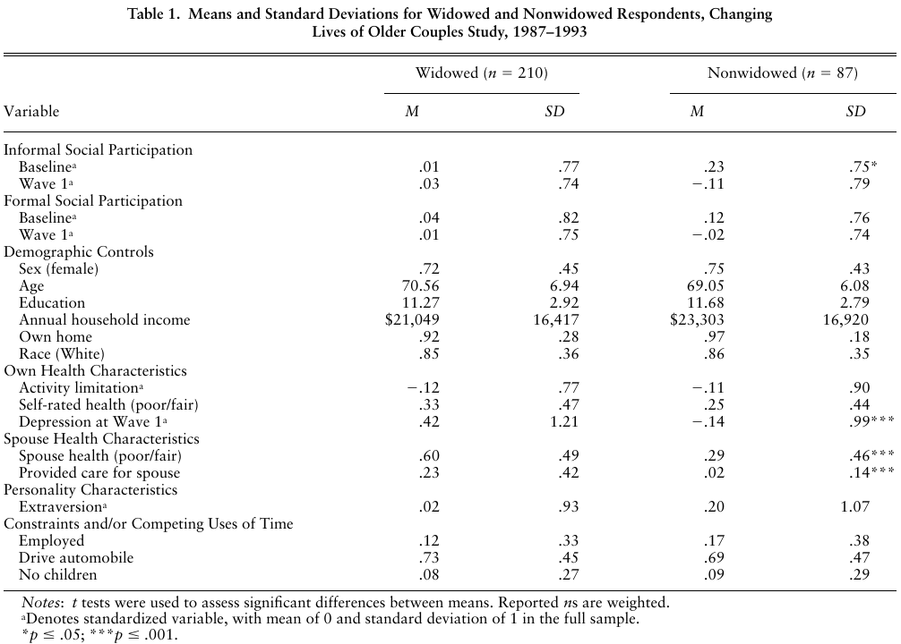
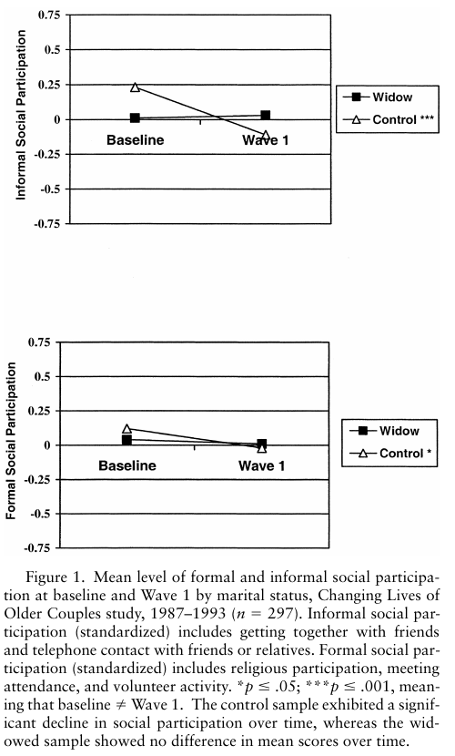
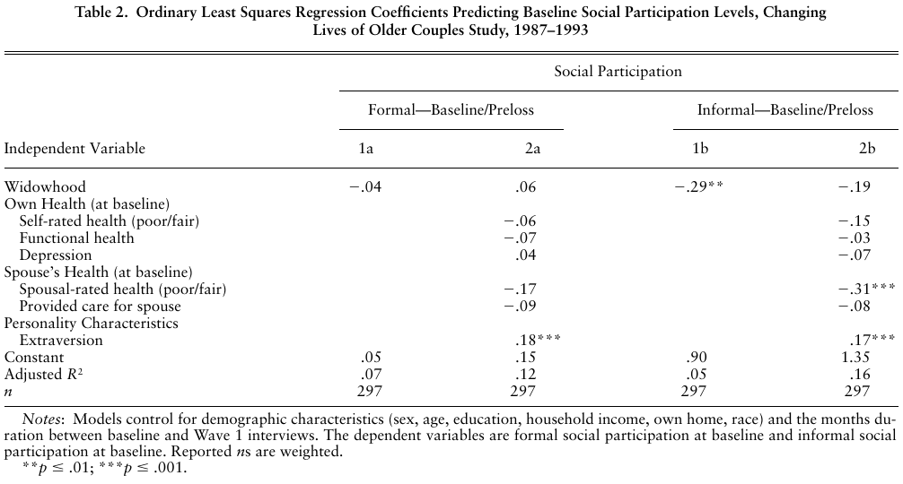
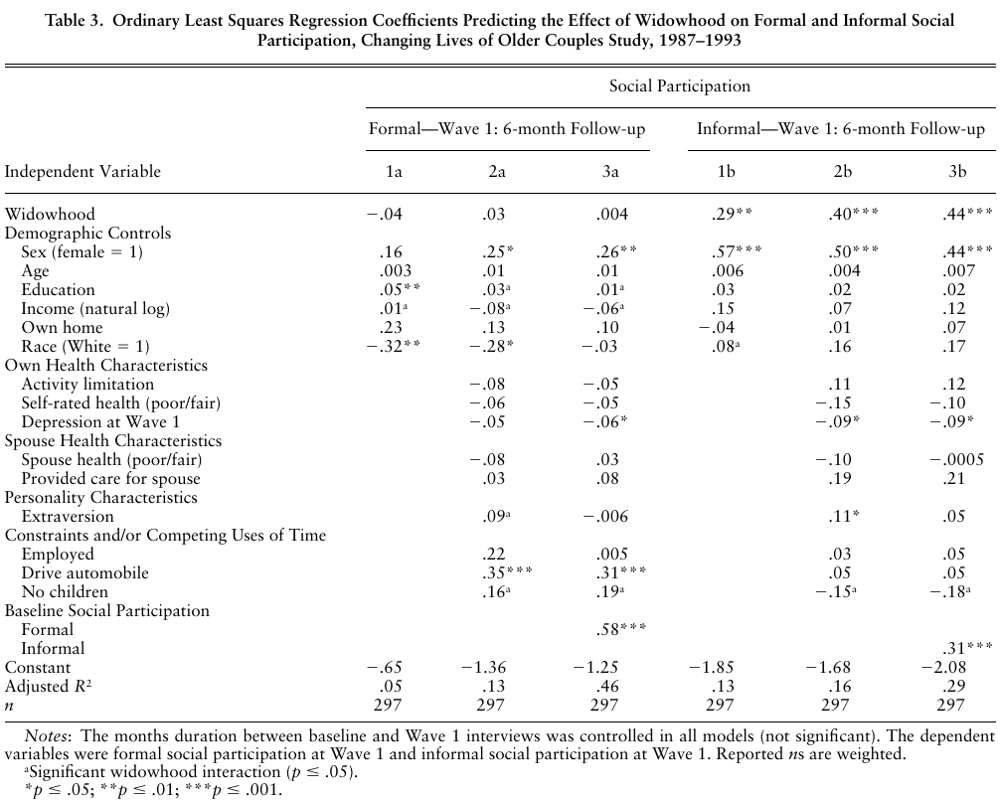
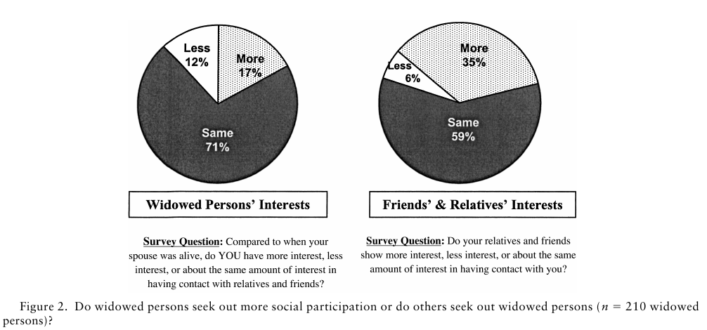
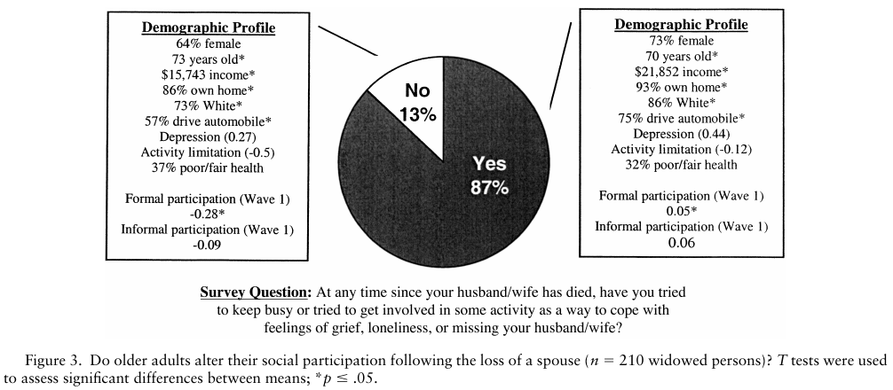

# 배우자 사별이 노인의 사회참여에 미치는 영향: 활동이론, 이탈이론, 지속성이론의 평가

> Rebecca L. Utz, MGS¹ · Deborah Carr, PhD¹˒² · Randolph Nesse, MD, PhD² · Camille B. Wortman, PhD³

> ¹ 미시간대학교 앤아버 캠퍼스 사회학과 및 ² 사회조사연구소. ³ 뉴욕주립대학교 스토니브룩 캠퍼스 심리학과.

> *The Gerontologist*, 42(4), 522–533 (2002). 미국노년학회 저작권 2002.

> 접수: 2001년 7월 17일; 게재 승인: 2002년 1월 24일. 담당 편집자: Laurence G. Branch, PhD.

> Changing Lives of Older Couples 연구는 미국 국립노화연구소(NIA) 연구비 P01-AG05561-01과 R01-AG15948-01의 지원을 받았다. Rebecca Utz의 참여는 NIA 박사과정 전 훈련지원금의 지원을 받았다. 이 논문의 이전 원고에 사려 깊고 상세한 의견을 제공한 익명의 심사자들에게 감사드린다. 이 논문은 2000년 11월 워싱턴 DC에서 열린 미국노년학회 제53차 연례학술대회에서 발표되었다.

> 교신: Rebecca Utz, Population Studies Center of the Institute for Social Research, 426 Thompson St., P.O. Box 1248, Ann Arbor, MI 48106-1248. 이메일: utzrl@umich.edu.

## 초록

**목적.** 이 연구는 노년기 배우자 사별의 결과로 사회참여 수준이 어떻게 변하는지를 평가했다. 사회참여는 공식적 사회역할(예: 모임 참석, 종교활동 참여, 자원봉사 의무)과 비공식적 사회역할(예: 전화 연락과 친구들과의 사회적 상호작용)을 모두 포함하는 다차원적 구성개념이다.

**설계 및 방법.** Changing Lives of Older Couples 연구 자료를 사용하여 배우자를 사별한 사람과 혼인을 계속 유지한 대조군을 비교함으로써 배우자 사별이 노인의 사회참여 수준에 영향을 미치는지를 평가했다.

**결과.** 배우자를 사별한 사람은 비사별자보다 비공식적 사회참여 수준이 높았지만, 공식적 사회참여 수준은 두 집단에서 비슷했다. 사회참여 수준은 배우자가 사망하기 전에 주로 배우자의 좋지 않은 건강 때문에 감소하고, 사별 후에는 친구와 친척의 지원이 늘어나면서 증가한다.

**함의.** 사회참여 영역의 지속성을 유지하는 것은 노인이 배우자 사별에 대처하기 위해 사용하는 전략이다. 그러나 모든 사별자가 사회참여 수준을 바꿀 수 있는 동일한 자원을 지닌 것은 아니다.

## 핵심어

사회통합, 사회적 지원, 공식적·비공식적 사회역할, 배우자 사별

## 서론

선행연구는 배우자 사별이 모든 생애사건 가운데 가장 큰 스트레스를 주는 사건 중 하나이며, 다른 어떤 생애전환보다 더 많은 심리적·행동적 적응을 요구한다고 주장해 왔다(Barrett & Schneweis, 1980–1981; D. Gallagher, Thompson, & Peterson, 1982–1983; Holmes & Rahe, 1967; Thompson, Breckenridge, Gallagher, & Peterson, 1984). 지금까지 사별 연구는 주로 배우자 사별에 대한 정서적·심리적 반응에 초점을 맞추었다(개관은 Stroebe, Hansson, Stroebe, & Schut, 2001 참조). 이와 달리 이 논문은 배우자 상실의 사회적·행동적 함의를 탐색한다. 노인은 평생에 걸친 습관, 행동, 태도를 굳히고 내면화해 왔으므로(Atchley, 1989), 노년기 사별에 수반되는 행동적 적응은 노인이 직면하는 가장 어려운 과제 중 하나일 수 있다. 배우자 사별을 겪으면 생존 배우자는 기혼자 지위를 내려놓고 사별자라는 정체성을 받아들여야 한다. 사별한 사람은 이러한 정체성 전환에 대응하여 사회연결망을 재편하거나 사회활동을 바꿀 수 있다. 부부관계 밖의 사회적 상호작용이 점점 더 중요해져 사별자의 사회적 관여 수준이 높아질 수 있다. 반대로 사별자가 기혼 친구들 사이에서 자신을 “끼어든 사람”처럼 느끼면 사회관계가 긴장되어 사회적 참여 수준이 낮아질 수도 있다. Changing Lives of Older Couples 연구(CLOC)를 사용하여, 기혼 노인과 배우자를 사별한 노인의 공식적·비공식적 사회참여가 시간에 따라 어떻게 변하는지, 그리고 사회노년학의 이론적 설명이 이러한 변화 양상을 설명하는 데 유용한지를 탐색했다.

### 사회참여의 정의

Rowe와 Kahn(1997)에 따르면 사회에 능동적이고 생산적으로 관여하는 것은 성공적 노화의 핵심 요소다. 이를 사별에 적용하면, 지속적인 사회적 관여 역시 성공적인 적응이나 대처의 핵심 요소일 수 있다. 사회활동과 안녕 사이의 정적 관계는 잘 입증되어 있다(Lowenthal & Haven, 1968). 높은 사회참여 수준은 낮은 자살 수준(Durkheim, 1897/1951), 더 좋은 신체건강과 낮은 사망률(House, Landis, & Umberson, 1988), 더 높은 심리적 안녕(Beck & Page, 1988)과 관련된다. 상징적 상호작용 패러다임의 문헌은 사회참여가 자기정체성을 만들고 유지하는 데 중요한 역할을 한다고 주장해 왔다(Markus & Wurf, 1987; Mead, 1934/1967; Swann, 1987; Swann & Hill, 1982; Thoits, 1983). 사회참여는 이론적으로 중요하므로 이해해야 할 일상생활의 중요한 측면이다. 이 연구에서는 사회참여를 배우자 이외 사람과의 사회적 상호작용으로 정의했다. 여기서 사용하는 사회참여라는 용어는 다른 연구자들이 조직 소속, 우정 관계, 친족 연결망, 사회적 연결성, 사회적 지원 또는 사회통합이라고 부른 것을 폭넓게 가리킨다(Anderson, 1983; Bahr & Harvey, 1980; Bankoff, 1983; Durkheim, 1897/1951; Ferraro, 1984; Thoits, 1983; Vachon et al., 1982). 사회참여 측정치는 공식적 사회역할(예: 모임 참석, 종교활동 참여, 자원봉사 의무)과 비공식적 사회역할(예: 전화 연락과 친구들과의 사회적 상호작용)을 모두 포함하는 다차원적 구성개념이다.

### 배우자 사별이 사회참여에 미치는 영향

사별 문헌은 대체로 사회적 지원 수준이 높은 사별자가 안녕과 삶의 만족도도 더 높다는 데 동의해 왔다(Anderson, 1983; Bahr & Harvey, 1980; Bankoff, 1983; Ferraro, 1984; Hershberger & Walsh, 1990; Lowenthal & Haven, 1968; Vachon et al., 1982). 이러한 결과는 배우자 사별 뒤 더 활발하게 활동할수록 적응 과정이 더 수월할 수 있음을 시사한다. 사별자는 처음 장례와 애도 기간에 친구 및 가족과 접촉이 늘어나는 경우가 많다(Lopata, 1996). 그러나 배우자 사별이 사별자의 사회참여에 일시적인 변화만 일으키는지, 아니면 더 지속적인 변화를 일으키는지는 알려져 있지 않다(Ferraro, 1984; Hollstein, 1998). 이 연구는 배우자를 잃은 지 6개월 뒤 노인의 사회참여 수준을 탐색한다. 배우자를 사별한 사람과 혼인을 계속 유지한 대조군을 비교하여 노인의 사회참여 변화가 배우자 사별이라는 사건 때문인지, 아니면 일반적으로 연령이나 시간 경과의 영향 때문인지 살펴본다.

### 이론적 설명: 활동이론, 이탈이론, 지속성이론

이 분석을 위해 사회노년학의 대표적 이론 세 가지를 적용하여 노년기 배우자 사별이 사회참여에 미치는 영향에 관한 구체적 가설을 제시했다. 첫째, 활동이론(Cavan, Burgess, Havinghurst, & Goldhammer, 1949)은 장애와 그 밖의 연령 관련 쇠퇴를 경험하면서 사회역할을 수행하기 어려워질 수 있다고 주장한다. 노인은 이러한 결손 속에서 자기정체성을 보존하기 위해 상실한 사회역할을 새롭고 보상적인 활동으로 대체한다. 따라서 활동이론은 다음 가설을 제시한다. 사별자와 대조군 모두 연령 관련 결손과 상실에 대응해 시간이 지나면서 사회참여를 늘리겠지만, 사별자는 결혼 또는 배우자와 연결된 여러 사회역할을 동시에 잃기 때문에 비사별자보다 더 높은 사회참여 수준을 보일 것이다.

둘째, 이탈이론(Cumming & Henry, 1961)은 나이 들어 가는 성인이 사회에서 물러나고 사회도 그들에게서 물러난다고 본다. 이러한 상호 이탈 과정은 젊은 세대가 들어설 자리를 마련하고 고령인구의 사망이 사회체계에 일으킬 불필요한 혼란을 막는다. 이 분석의 맥락에서 이탈이론은 다음 가설을 제시한다. 사별자와 대조군 모두 나이가 들면서 사회활동에서 서서히 이탈하겠지만, 배우자를 잃은 경험이 자신의 죽음과 죽음이 생존자에게 얼마나 큰 혼란을 일으킬 수 있는지를 선명하게 일깨우기 때문에 사별자는 연령이 비슷한 기혼자보다 더 낮은 사회참여 수준을 보일 것이다.

셋째, 지속성이론(Atchley, 1989)은 개인이 생애과정 전반에 걸쳐 역할의 안정성을 유지하려 한다는 가정에 기초한다. 노화 과정이 개인에게 변화하는 규범적 기대나 사회역할 이용 가능성의 잠재적 단절을 제시할 수 있지만, 노인은 생애과정 전반에 걸쳐 태도, 성향, 선호, 행동의 지속성을 보존하려 한다. 따라서 과거 행동과 태도는 흔히 현재 또는 미래 행동을 예측하는 가장 중요한 단일 요인이다. 배우자 사별의 맥락에서 가장 성공적으로 적응하는 사별자는 생애 초기에 형성한 생활방식을 가장 효과적으로 유지하는 사람일 것이다. 지속성이론에서 도출되는 구체적 가설은 사별자와 비사별자가 사회참여 수준에서 반드시 다르지는 않으며, 오히려 과거 사회참여 수준이 현재 사회참여 수준을 결정한다는 것이다.

노년학자들은 이 이론들이 등장한 이래 그 설명력을 논쟁해 왔다(개관은 Bengston & Schaie, 1999 참조). 지속성이론 비판자들은 은퇴, 사랑하는 사람의 죽음, 자녀의 독립 같은 사건을 통한 역할 상실이 불가피하다는 점에서 생활방식의 지속성과 역할 안정성은 거의 불가능하다고 주장한다(Matras, 1990). 이탈이론과 활동이론은 설명이 지나치게 단순하다는 비판을 받는다. 즉, 노인이 노화 과정에 특정한 방식으로 적응하는 이유를 하나의 변수로 정말 설명할 수 있느냐는 것이다(Quadagno & Street, 1996). 이러한 이론들이 상당한 비판을 받았지만, 앞서 제시한 가설은 분석을 위한 이론적 출발점을 제공하는 동시에 이 이론들의 유용성을 경험적으로 평가할 특별한 기회를 제공한다.

### 선행연구와 그 방법론적 한계

세 이론에 제기된 비판을 고려하면 경험적 근거 역시 결론이 일치하지 않는다는 사실은 놀랍지 않다. Chambre(1984)는 사람들이 나이 들어서도 비슷한 활동을 유지한다는 점을 보여 지속성이론을 지지했다. Arens(1982–1983)와 van den Hoonard(1998)는 사별 여성과 사별 남성이 이전보다 여가활동 참여에 쓰는 시간이 줄어든다는 결과를 통해 이탈이론을 지지했다. S. K. Gallagher와 Gerstel(1993)은 사별 여성이 기혼 여성보다 더 많은 친구와 유의하게 더 많은 시간을 보낸다는 점을 보여 활동이론을 지지했다. Hollstein(1998)은 사별 남녀의 소규모 표본 분석에서 사회연결망 변화의 전형적 양상 세 가지를 확인했으며, 각 양상은 세 이론 가운데 하나와 대체로 대응했다. Ward, Logan, Spitze(1992)도 사회적 관여 양상이 혼인상태에 따라 달라진다는 결과를 얻었다. 이는 부부는 추가적인 형태의 사회적 지원이 필요하지 않을 수 있지만, 사별자는 배우자와의 친밀감 상실을 보완하기 위해 추가적인 사회적 지원을 구할 수 있음을 시사한다. 이처럼 상이한 결과 때문에 노인의 활동수준을 결정하는 혼인상태의 역할과 혼인상태 전환의 영향은 분명하지 않다.

우리는 경험문헌의 결론이 일치하지 않는 데 네 가지 이유가 있다고 본다. 첫째, 분석이 매우 다른 유형의 사회참여에 근거하므로 연구 간 결과를 비교하기 어려울 수 있다. 배우자 사별은 특정 활동 유형에 대한 관여에는 영향을 미치지만 다른 활동에는 영향을 미치지 않을 수 있다. 둘째, 사별 연구는 흔히 여성만의 표본을 사용하여 적응 양상이 젠더에 따라 다른지를 평가할 수 없다. 부부의 사회연결망과 친족 유대를 유지하는 일을 아내가 맡는 경향을 고려하면(Goldscheider, 1990; Hagestad, 1986; Waite, 1995; Waite & Gallagher, 2000), 남성과 여성은 배우자 사별에 대응하여 현저히 다른 행동적·정서적 결과를 보일 수 있다(Miller & Wortman, in press; Umberson, Wortman, & Kessler, 1992). 셋째, 대부분의 연구는 배우자 사별 전 사회적 관여에 관한 회고적 진술에 의존했다. 회고적 진술은 생존 배우자가 과거 삶을 재해석한 내용을 반영하므로 사별 전의 실제 활동수준을 편향시킨다. 넷째, 배우자 사별과 사회적 지원에 관한 경험분석은 사별의 영향과 연령 증가 또는 시간 경과의 영향을 구분할 대조군을 거의 사용하지 않는다. 사별자 표본은 비사별자 표본보다 흔히 나이가 많고, 더 아프며, 정서적으로 더 큰 고통을 겪으므로, 선행연구는 사별자의 낮은 사회참여 수준을 선택 특성이 아니라 배우자 사별의 결과로 돌렸을 수 있다. 대조군이 없고 기초시점의 실제 사회참여 수준을 고려하지 않으면, 선행연구에서 배우자 사별에 귀속한 영향은 과대평가되었을 수 있다.

CLOC 연구 자료를 사용하면 위의 각 한계를 극복하고 노년기 배우자 사별이 사회참여에 어떤 영향을 미치는지 더 완전하게 답할 수 있다. 첫째, CLOC 자료에는 사회참여의 두 유형(공식적·비공식적 사회참여)을 측정하는 별도의 다문항 척도 두 개가 있어, 배우자 사별의 영향이 활동 유형에 따라 다른지를 탐색할 수 있다. 둘째, CLOC 표본은 젠더별로 층화되어 있다. 셋째, CLOC 연구에는 연령을 대응시킨 대조군이 있어 배우자 사별 효과와 연령 효과를 구분한다. 넷째, 기초시점(사별 전) 자료의 질과 범위가 사별 연구에서 나타나는 잠재적 선택편향을 제거한다. 요컨대 이 논문은 배우자 사별 뒤 노인이 일상의 사회참여를 어떻게 바꾸는지를 탐색하고, 그 결과를 활동이론, 지속성이론, 이탈이론에서 도출한 예측과 비교한다.

## 방법

### 표본

분석은 CLOC 연구에 근거한다. CLOC는 2단계 지역확률표집 기법으로 미시간주 디트로이트의 기혼자에게서 정보를 수집한 배우자 사별 전향연구다. 참여 자격은 시설에 거주하지 않고 영어를 구사하는 부부 가운데 남편이 65세 이상인 경우로 제한했다. 표집된 사람 중 1,532명이 기초면접을 완료하여 응답률은 68%였다.

기초면접(1987–1988) 뒤 미시간주의 월별 사망기록으로 응답자 배우자의 생존상태를 추적했다. 모든 배우자의 사망은 National Death Index로 확인했다. 연구기간에 배우자를 잃은 응답자는 사망 6개월, 18개월, 48개월 뒤 다시 면접했다. 원표본에서 연령, 인종, 성별을 개인별로 대응시킨 대조군도 비슷한 시점에 재면접했다. 1차 면접은 최초 기초면접 6개월 뒤가 아니라 배우자 사망 6개월 뒤 시행되었으므로, 기초면접과 비교해 배우자가 언제 사망했는지에 따라 면접 시점에 상당한 차이가 있다. 배우자가 더 늦게 사망한 사람은 기초평가 시점이 시간상 더 멀었다. 면접 시점 차이를 다루기 위해 모든 분석에서 기초면접과 1차 면접 사이의 기간(개월)을 통제했다. 이 통제변수는 어떤 분석에서도 유의하지 않았고, 배우자 사별 여부와의 상호작용도 유의하지 않았다.

분석은 기초면접과 1차 면접에 모두 참여한 노인 297명(여성 217명, 남성 80명)의 표본에 근거했다. 분석표본에는 배우자를 사별한 사람 210명과 비사별 대조군 87명이 포함되었다. 5년 연구기간에 사별 응답자 수를 최대화하기 위해 여성을 과대표집했다. 대조군 예산이 제안 예산안에서 삭감되었다가 1차 조사 자료수집 기간 중반이 되어서야 복구되었기 때문에, 사별 배우자 중 일부에게만 대조군이 있었다. 분석을 수행하기 전에 불균등한 선택확률과 무응답을 보정하는 최종 중심화 가중치를 모든 자료에 적용했다. 비가중 표본크기는 333명으로, 사별자 249명과 대조군 84명이었다.

### 측정

#### 종속변수

통계적으로도 개념적으로도 구별되는 사회참여의 두 차원을 고려했다. 비공식적 사회참여(α = .52)는 다음 문항으로 이루어진 지수다. (a) 친구, 이웃 또는 친척과 얼마나 자주 만나 함께 외출하거나 서로의 집을 방문하는 등의 활동을 합니까? (b) 일반적인 한 주에 친구, 이웃 또는 친척과 전화로 대략 몇 번 이야기합니까? 공식적 사회참여(α = .71)는 다음 세 문항을 포함했다. (a) 지난 6개월 동안 자원봉사에 몇 시간을 썼습니까? (b) 자신이 속한 집단, 동호회 또는 조직의 모임이나 프로그램에 얼마나 자주 참석합니까? (c) 종교의식에 얼마나 자주 참석합니까? 각 문항은 하루 한 번 이상부터 한 달에 한 번 미만까지의 5범주 응답으로 측정했다. 척도는 표준화했으며, 값이 클수록 사회참여 수준이 높음을 나타낸다. 비표준화 척도에서도 비슷한 결과가 나왔지만, 해석과 비교가 쉽도록 표준화된 종속변수를 사용했다.

#### 예측변수

배우자 사별은 기초면접과 1차 면접 사이에 배우자를 사별한 사람을 식별했다. 기초시점의 공식적·비공식적 사회참여는 앞서 설명한 두 척도와 동일하지만 1차 조사 응답이 아니라 기초시점 응답에 근거했다.

#### 통제변수

사회참여 문헌과 배우자 사별 문헌은 모두 인구학적 특성이 노년기 적응의 중요한 결정요인이라고 주장해 왔다(Arens, 1982–1983; Hershberger & Walsh, 1990; House, 1987; Lopata, 1996). 따라서 모든 분석에서 성별(여성을 나타내는 이분변수), 연령(기초면접 당시 나이를 연속형 연수로 측정), 교육(완료한 교육연수 3년부터 17년까지의 연속형 측정치), 기초시점 총가구소득(소득의 자연로그), 기초시점 주택소유(1 = 주택소유인 이분변수), 인종(백인을 나타내는 이분변수)을 통제했다.

#### 교란변수

분석에는 배우자 사별과 사회참여 수준 사이에 잠재적으로 허위적인 관계가 나타나는지를 드러낼 것으로 여겨지는 변수도 여러 개 포함했다. 분석에서 고려한 변수는 개인 및 부부 수준의 건강 역학, 스트레스 상황에서 개인을 더 회복탄력적으로 만들거나 ‘보호’할 수 있는 개인 성격 특성(Caspi, 1987; Rodin, 1987), 사회활동 참여 능력에 영향을 미칠 수 있는 구조적 장벽 또는 제약이다. 사별자는 이러한 변수에서 비사별자와 유의하게 다를 수 있으므로, 배우자 사별의 영향과 연령 관련 쇠퇴와 관련된 영향을 구분하려면 분석에 이러한 교란변수를 포함하는 것이 필수적이다. 부부관계의 질이나 사망 자체의 성격 같은 다른 부부 수준 특성은 애도의 중요한 예측요인이지만(Carr et al., 2000; Carr, House, Wortman, Nesse, & Kessler, 2001), 이러한 변수는 사별 후 사회참여의 변이를 설명하지 못했으므로 분석에 포함하지 않았다. 기초시점의 사회참여 측정치가 결혼의 관련 특성과 사망의 성격을 충분히 포착했을 것으로 추정된다. 우울을 제외한 다음의 모든 변수는 기초시점에 측정했다.

개인 및 부부 수준 건강 특성의 역할을 평가하기 위해 응답자의 건강 측정치 세 개와 배우자의 건강 측정치 두 개를 분석에 포함했다. 활동제한(α = .77)은 응답자의 기능적 건강과 장애를 측정한 표준화 척도로, 값이 클수록 일상생활활동 손상 수준이 높음을 나타낸다. 주관적 건강은 기초시점 건강이 나쁨 또는 보통임을 나타내는 이분변수였다. 응답자의 우울(α = .81)은 20문항 Center for Epidemiological Studies–Depression 척도(Radloff, 1977)의 부정적 문항 9개로 평가했으며, 값이 클수록 1차 조사 시점의 우울 수준이 높음을 나타낸다. 개인 건강의 세 측정치는 유의하게 상관되었지만(활동제한과 주관적 건강 = .37; 활동제한과 우울 = .13; 주관적 건강과 우울 = .16; p < .05), 각각 사회참여 수준에 영향을 미칠 수 있는 서로 다른 건강 측면을 포착했다. 활동제한은 활동 수행에 대한 신체적 장애를 나타냈고, 우울은 낮은 에너지 수준 및 활동 관여 감소와 관련되었으며, 주관적 건강은 전반적 건강평가의 총체적 측정치였다. 부부 수준 건강 특성의 역동적 역할을 평가하기 위해 건강 측정치 두 개를 추가했다. 배우자 건강은 배우자의 기초시점 건강이 나쁨 또는 보통이라고 보고한 응답자를 나타냈다. 배우자 돌봄 제공은 배우자에게 가정 내 돌봄을 제공한 응답자를 나타내는 이분변수였다. 주당 1시간 이상 돌봄을 제공한 배우자를 기초시점 돌봄제공자로 식별했다.

성격 측정치 하나를 분석에 포함했다. 외향성(α = .53)은 응답자가 정서적으로 연결되어 있고, 사회적으로 활발하며, 외향적인 정도를 나타내는 표준화 척도였다. 값이 클수록 외향성 수준이 높음을 나타낸다. 자존감, 개방성, 친화성, 성실성, 정서적 안정성 같은 다른 성격 특성도 처음에는 포함했지만 사회참여의 유의한 예측요인이 아니어서 나중에 제외했다.

마지막으로 변수 세 개는 활동 수행의 잠재적 제약을 나타낸다. 취업은 기초시점에 보수를 받고 일한 사람을 나타내는 이분변수였다. 취업은 사회연결망을 확대해 사회참여를 높일 수도 있고, 여가시간을 경쟁적으로 사용하게 하여 사회참여를 제한할 수도 있다. 자동차 운전은 기초시점에 자동차를 운전한 사람을 나타내는 이분변수였다. 스스로 운전할 수 있는 노인은 자율적으로 이동할 수단이 있으므로 사회적으로 더 많이 관여할 수 있다. 무자녀는 생존 자녀가 없는 응답자를 식별했다. 자녀는 노부모가 사회활동에 계속 적극적으로 참여하도록 장려할 수 있다.

### 분석계획

배우자 사별 뒤 사회참여 양상을 기술하기 위해 다양한 기술적 방법을 사용했다. 일부 분석은 배우자 사별의 영향과 노화의 영향을 구분하기 위해 사별자와 대조군을 비교했고, 추가 분석은 배우자 사별에 대한 상이한 반응을 평가하기 위해 사별자 표본 안의 하위집단을 비교했다. 보통최소제곱(OLS) 회귀기법을 사용하여 사별자와 대조군을 비교하고 사별 6개월 뒤 공식적·비공식적 사회참여 수준을 추정했다. 배우자 사별과 기초시점 사회참여의 추정 회귀계수를 세 경쟁가설의 검정에서 평가했다. 배우자 사별의 효과가 정적이면 활동이론이 지지되고, 부적이면 이탈이론이 지지되며, 기초시점 사회참여의 효과가 정적이면 지속성이론이 지지된다.

## 결과

### 표본 특성

표 1은 사별자 표본과 비사별자 표본이 주요 인구학적 특성에서 매우 비슷했음을 보여 준다. 평균 응답자는 약 70세였고 교육수준은 거의 고등학교 졸업 수준이었으며 연간 가구소득은 20,000달러대 초반이었다. 대부분 자기 집을 소유했고 자녀가 적어도 한 명 있었다. 3분의 2가 넘는 사람이 자동차를 운전했고, 취업자는 소수(<15%)였다. 응답자는 중간 수준의 활동제한을 경험했지만 건강이 보통 또는 나쁘다고 보고한 사람은 4분의 1에서 3분의 1뿐이었다. 두 표본 사이에는 주목할 만하지만 예상된 차이가 몇 가지 있었다. 사별자는 대조군보다 우울 수준이 유의하게 높았다(p ≤ .001). 사별자는 대조군보다 기초시점에 배우자를 돌보았을 가능성이 더 높았고(p ≤ .001), 배우자의 기초시점 건강이 나쁨 또는 보통이라고 보고할 가능성도 더 높았다(p ≤ .001).

표 1. Changing Lives of Older Couples 연구(1987–1993)에서 배우자 사별 응답자와 비사별 응답자의 평균과 표준편차. 접근성 설명: 이 표는 가중된 사별자(n = 210)와 비사별자(n = 87)의 기초시점 및 1차 조사 공식적·비공식적 참여, 인구학적 특성, 응답자와 배우자의 건강, 외향성, 취업, 운전, 자녀를 비교한다. 원문 crop에는 모든 평균, 표준편차, 유의성 기호와 주석이 보존되어 있다.

그림 1은 사별자 표본과 비사별자 표본의 기초시점 및 1차 조사 사회참여 평균수준을 그래프로 보여 준다. 혼인을 유지한 사람과 비교하면 사별자의 비공식적 사회참여는 기초시점에 유의하게 낮았고(.01 대 .23, p ≤ .05), 1차 조사에서는 비교적 비슷했다(.03 대 −.11, p ≤ .10). 반면 공식적 사회참여는 혼인상태에 따라 다르지 않았다. 반복측정 t 검정을 사용한 결과, 대조군은 비공식적 사회참여(p ≤ .001)와 공식적 사회참여(p ≤ .05)가 모두 유의하게 감소했지만, 사별자의 사회참여는 시간에 따라 비교적 일정하게 유지되었다. 이러한 기술 결과는 사별자의 사회참여가 기혼 대조군의 사회참여와 유의하게 다름을 시사한다. 또한 이 결과는 사별자가 배우자의 실제 사망 전부터 사회참여를 특이한 방식으로 바꾸는지를 묻게 한다.

그림 1. Changing Lives of Older Couples 연구(1987–1993)에서 혼인상태별 기초시점과 1차 조사 시점의 공식적·비공식적 사회참여 평균수준(n = 297). 비공식적 사회참여(표준화)는 친구와의 만남 및 친구나 친척과의 전화 연락을 포함한다. 공식적 사회참여(표준화)는 종교활동 참여, 모임 참석, 자원봉사 활동을 포함한다. *p ≤ .05; ***p ≤ .001이며, 이는 기초시점 ≠ 1차 조사를 뜻한다. 대조군 표본은 시간에 따라 사회참여가 유의하게 감소했지만, 사별자 표본은 시간에 따른 평균점수 차이를 보이지 않았다. 접근성 설명: 두 선그래프는 사별자와 대조군의 표준화된 비공식적·공식적 사회참여를 기초시점과 1차 조사에서 비교한다. 대조군은 두 측정치 모두에서 유의하게 감소하고, 사별 응답자는 기초시점 평균에 가까운 수준을 유지한다.

배우자 사망일 전에 사별 적응이 시작되는지를 탐색하기 위해 표 2는 기초시점(상실 전)의 사회참여 수준을 예측하는 OLS 회귀계수를 제시한다. 기술분석이 시사한 대로, 이후 배우자를 사별한 사람은 혼인을 계속 유지한 사람보다 기초시점의 비공식적 참여 수준이 유의하게 낮았다(βinformal = −.29, p ≤ .01). 배우자의 건강 역시 사회적 관여 감소의 중요한 예측요인이었다(βinformal = −.31, p ≤ .001). 이 분석은 실제 상실 전에 적응이 일어난다는 점을 시사하고, 노인의 일상활동을 평가할 때 남편과 아내 양쪽의 특성을 모두 고려해야 한다는 점을 다시 강조한다.

표 2. Changing Lives of Older Couples 연구(1987–1993)에서 기초시점 사회참여 수준을 예측하는 보통최소제곱 회귀계수. 접근성 설명: 가중 표본(n = 297)을 사용한 네 모형은 공식적·비공식적 기초시점/상실 전 참여를 예측한다. 모형 1b에서 배우자 사별은 더 낮은 비공식적 참여를 예측하고(−.29, p ≤ .01), 모형 2b에서 배우자의 나쁨/보통 건강은 더 낮은 비공식적 참여를 예측한다(−.31, p ≤ .001). crop에는 모든 계수, 수정 R² 값, 통제변수와 주석이 보존되어 있다.

### 배우자 사별이 사회참여에 미치는 영향

표 3의 다변량분석은 노인의 사회참여 수준이 시간에 따라, 그리고 배우자 사별에 대응하여 어떻게 변하는지를 더 자세히 탐색한다. 모형 1은 인구학적 특성을 통제한 배우자 사별의 효과를 보여 주고, 모형 2는 남편과 아내의 건강상태, 개인 성격 특성, 그 밖의 구조적 제약을 포함한 잠재적 매개변수를 추가했으며, 모형 3은 기초시점 사회참여 수준을 통제했다.

표 3. Changing Lives of Older Couples 연구(1987–1993)에서 배우자 사별이 공식적·비공식적 사회참여에 미치는 영향을 예측하는 보통최소제곱 회귀계수. 접근성 설명: 가중 표본(n = 297)을 사용한 여섯 모형은 1차 조사 참여를 예측한다. 배우자 사별은 공식적 참여에서는 유의하지 않지만 비공식적 참여에서는 .29에서 .40, .44로 증가하며, 기초시점 공식적·비공식적 참여 계수는 .58과 .31이다. crop에는 모든 인구학적·건강·성격·제약 변수, 상호작용, 수정 R²와 유의성 항목이 보존되어 있다.

모형 1에서 나타나고 모형 2–3에서도 반복된 것처럼, 배우자 사별은 비공식적 사회참여 수준을 유의하게 예측했지만 공식적 사회참여 수준은 유의하게 예측하지 않았다. 모형 3에서 사별자의 비공식적 사회참여 점수는 비사별자보다 0.44 표준편차 단위 높았지만, 공식적 사회참여 수준에서는 사별자와 대조군이 다르지 않았다. 여기에 제시하지는 않았지만 사별 18개월 뒤 사회참여를 예측하는 동일한 모형도 실행했다. 그 계수는 표 3과 비슷했고, 이는 사회참여 변화가 사별 뒤 처음 6개월 이내에 발생해 더 긴 기간에도 지속되었음을 시사한다. 요컨대 배우자 사별은 비공식적 활동수준을 지속적으로 높였지만 공식적 사회참여 수준은 바꾸지 않았다.

모형 2는 특정 사회적 관여 수준에 대한 성향을 갖게 할 수 있는 개인 및 부부 수준 특성의 효과를 고려했다. 예상대로 외향적인 사람은 사회활동에 더 많이 참여한 반면(βformal = .09, p ≤ .05; βinformal = .11, p ≤ .05), 우울한 사람은 비공식적 사회활동에 덜 참여했다(βinformal = −.09; p ≤ .05). 자동차 운전과 무자녀 역시 활동 증가의 중요한 예측요인이었다. 놀랍게도 개인의 건강과 배우자의 건강 모두 1차 조사에서 사회참여 수준을 예측하지 않았다. 그러나 표 2에서 앞서 살펴본 것처럼 배우자의 건강 특성은 기초시점 사회참여 수준을 결정하는 데 영향을 미쳤다.

모형 3은 기초시점 사회참여를 미래 사회참여의 잠재적 예측요인으로 고려했다. 기초시점 사회참여는 이후의 사회참여를 결정하는 데 매우 큰 영향을 미쳤다. 즉, 기초시점에 사회참여가 높았던 사람은 1차 조사에서도 비교적 높은 사회참여를 계속 보였다(βformal = .58, p ≤ .001; βinformal = .31, p ≤ .001). 모형 3에 기초시점 사회참여를 추가하자 모형 적합도가 유의하게 향상되었으며, 공식적 사회참여의 수정 R²는 .13에서 .46으로, 비공식적 사회참여의 수정 R²는 .16에서 .29로 증가했다. 배우자 사별이 잠재적으로 큰 단절을 일으키는데도 사별자가 배우자를 잃고 결혼에 수반되던 사회적 기회의 상실에 적응하는 과정에서는 지속성이 우세했다.

마지막으로 표 3의 모든 분석을 평가하여 배우자 사별에 대한 적응이 성별에 따라 다른지를 살펴보았다. 배우자 사별 × 성별 상호작용항은 어떤 모형에서도 유의하지 않았으며, 이는 배우자 사별이 사회참여에 미치는 영향이 사별 여성과 사별 남성에게서 비슷했음을 시사한다. 또한 예측변수의 효과가 배우자를 사별하는 사람과 계속 혼인을 유지하는 사람에게서 다른지도 분석했다. 표 3에서 위첨자 a로 표시된 것처럼 배우자 사별은 소득, 교육, 인종과 상호작용했다. 이는 아프리카계 미국인 사별자와 사회경제적 지위가 낮은 사별자의 사회참여 수준이 비사별자나 사회경제적 지위가 높은 사별자보다 유의하게 낮다는 뜻이다. 자녀가 없는 사별자도 배우자 사별 뒤 특히 낮은 사회참여 수준을 보였다.

위 분석만으로는 사별자의 사회참여 증가가 사별자가 추가 활동을 찾아 나섰기 때문인지, 아니면 친구와 친척이 최근 사별한 사람에게 돌봄과 지원을 제공하려는 성향 때문인지 분명하지 않다. 사별자 표본만 사용한 추가 분석은 사회참여 증가가 수동적 반응의 결과인지 능동적 대응의 결과인지 밝히는 데 도움을 준다. 사별자 다수(71%)는 배우자가 살아 있을 때와 같은 정도로 친척 및 친구와 접촉하고 싶어 했지만, 3분의 1이 넘는 사람(35%)은 자신이 사별했을 때 친구와 친척이 자신과 접촉하는 데 더 많은 관심을 보였다고 보고했다. 사별 후 사회참여에 대한 관심이 줄었다고 밝힌 사별자는 본인 쪽(12%)이든 친구와 친척 쪽(6%)이든 매우 적었다. 그림 2의 결과는 표 3에서 확인된 비공식적 사회참여의 예측 증가가 배우자의 죽음이 남긴 공백을 메우기 위해 추가 사회활동을 찾아 나선 결과라기보다 걱정하는 친구와 친척이 먼저 접촉한 결과일 수 있음을 시사한다. 이 분석에서는 성별 차이가 뚜렷하지 않았으며, 이는 남성과 여성이 친구와 친척에게서 늘어난 지원을 똑같이 받았다는 뜻이다. 남성에게 아내의 죽음은 흔히 자신의 사회활동 조정자를 잃는 것을 의미하지만, 사회참여 변화의 상당 부분이 추가 사회활동을 스스로 조정하는 것이 아니라 추가 지원을 받는 데서 비롯되므로 사별 여성과 사별 남성은 비슷한 행동결과를 보였을 가능성이 크다.

그림 2. 배우자를 사별한 사람이 더 많은 사회참여를 찾는가, 아니면 다른 사람이 사별자를 찾는가(n = 210명의 사별자)? 접근성 설명: 사별 응답자 본인의 관심은 17%가 증가, 71%가 동일, 12%가 감소라고 답했다. 친구와 친척의 관심은 35%가 증가, 59%가 동일, 6%가 감소라고 답했다. 두 원그래프에는 설문문항의 문구가 보존되어 있다.

행동적 적응에서는 지속성이 우세하지만, 사별자 대부분은 사회활동 증가를 상실과 관련된 심리적 고통에 맞서는 효과적인 방법으로 여겼다. 그림 3은 사별자 다수(87%)가 ‘배우자 사별의 부정적 영향에 대처하기 위한 방법으로 계속 바쁘게 지내거나 어떤 활동에 참여하려 했다’고 답했음을 보여 준다. 두 집단의 인구학적 특성을 비교했을 때 활동을 늘렸다고 보고한 응답자는 더 젊고 소득이 더 높은 경향이 있었으며, 자기 집을 소유하고, 백인이며, 자동차를 운전할 가능성이 더 컸다. 사회참여 증가가 배우자 사별에 대한 성공적 적응에 이롭다면, 나이가 더 많고 경제적으로 넉넉하지 않은 사별자는 배우자 사별에 수반되는 잠재적으로 파괴적인 상실에 성공적으로 대처할 능력에서 구조적으로 불리할 수 있다.

그림 3. 노인은 배우자를 잃은 뒤 사회참여를 바꾸는가(n = 210명의 사별자)? 평균 간 유의한 차이를 평가하기 위해 t 검정을 사용했으며, *p ≤ .05이다. 접근성 설명: 중앙 원그래프는 대처하기 위해 계속 바쁘게 지내거나 활동에 참여하려 했다는 응답이 예 87%, 아니요 13%였음을 보여 준다. 양쪽 패널은 두 집단의 성별, 연령, 소득, 주택소유, 인종, 운전, 우울, 활동제한, 건강, 1차 조사 참여를 비교하며, 별표는 평균의 유의한 차이를 표시한다.

## 논의

### 요약 및 결론

이 연구는 기혼 노인과 배우자를 사별한 노인의 사회참여가 시간에 따라 어떻게 변하는지, 그리고 사회노년학의 이론적 설명이 변화 양상을 설명하는 데 유용한지를 탐색했다. 사회참여는 공식적 참여와 비공식적 참여라는 서로 구별되는 두 하위유형으로 이루어지고, 두 유형은 배우자 사별에 다르게 반응한다는 결과를 얻었다. 남녀 모두에서 사별자는 배우자 상실 뒤 비공식적 사회참여가 지속적으로 증가했지만, 공식적 사회참여 수준은 시간이나 배우자 사별에 따라 변동하지 않았다. 사별자 다수는 배우자 사별의 부정적 영향에 대응하기 위한 능동적 대처전략으로 사회참여 증가를 사용했다고 인정했다. 이러한 행동양상은 사회참여, 특히 전화 연락과 친구와의 만남 같은 비공식적 활동이 노년기 사별의 영향을 깊이 받는 일상생활의 한 측면임을 시사한다. 공식적 사회참여는 비공식적 사회참여가 제공하는 정서적·도구적 지원을 제공하지 못할 수 있으며, 이것이 배우자 사별 뒤 공식적 사회참여 수준이 일정하게 유지되는 이유를 설명한다.

노년기 사별과 관련된 더 넓은 쟁점을 포괄하는 네 가지 큰 주제가 이 분석의 주요 결과를 특징짓는다. 첫 번째 주제는 지속성을 향한 욕구가 배우자 사별 뒤 적응 과정을 지배한다는 것이다. 사별자는 상실 전과 비교해 다른 사람과 얼마나 접촉하고 싶은지를 질문받았을 때 압도적으로 지속성을 원한다고 밝혔다. 분석에서는 이전 사회참여가 이후 사회참여를 단연 가장 잘 예측했다. 배우자 사별이 일으킨 단절에도 생존 배우자는 사회활동과 지역사회 관여 수준을 조정하는 데 큰 회복탄력성을 보였다. 노인은 선호와 실제 행동 모두에서 배우자를 사별하는 불행한 경험에 직면했을 때 지속성을 나타냈다.

두 번째 주제는 배우자 사별이 별개의 사건이나 고정된 상태가 아니라 과정이라는 것이다. 많은 선행연구는 배우자 사별을 배우자의 사망일로 정의되는 별개의 사건 또는 기혼·미혼·이혼 상태와 구별되는 사별 상태로 규정해 왔다. 선행연구는 대체로 횡단자료나 회고자료에 근거했지만, 이 분석은 사별자-대조군 표본의 전향적 종단자료를 사용했다. 방법론적으로 독특한 CLOC 연구를 사용한 결과는 배우자 사별이 실제 사망일 전에 시작되어 배우자 사별과 관련된 초기 애도기간을 훨씬 넘어 계속되는 적응과정임을 시사한다. 장차 사별할 사람과 아픈 배우자를 둔 사람은 죽음이 임박했다는 예감을 느끼고 배우자의 마지막 며칠이나 몇 달 동안 배우자에게 시간과 에너지를 쏟아 상실 전 사회적 관여 수준을 낮출 수 있다. 실제 사망 뒤에도 사별자는 적응 과정을 이어 가며, 대체로 가족 밖 사회활동이 지속적으로 늘어난다. 배우자 사별의 과정적 성격을 평가하려면 전향적 종단자료 사용이 필수적이다.

세 번째 주제는 사회적 행위자들이 서로 연결되어 있다는 점이다. 사별자라는 이름은 생존 배우자만 얻게 되지만, 배우자 사별의 영향은 고립된 채 경험되지 않는다. 사별자 표본에서 나타난 사회참여 증가는 생존 배우자가 추가 사회활동을 찾아 나선 결과라기보다 주변 사람들이 사별자를 둘러싸고 지원한 결과일 수 있었다. 선행연구와 일치하게 노인은 도움이 필요하다고 인식되는 시기에 친구와 친척에게서 많은 지원을 받는다(Hogan & Eggebeen, 1995). Lopata(1996)는 친구, 친척, 이웃이 최근 사별한 사람에게 정서적·도구적 지원을 조건 없이 제공하기 때문에 배우자 사별 뒤 사회적 관여가 늘어난다고 주장했다. 자녀가 없는 사별자는 특히 사회통합 수준이 낮으므로, 친족은 노부모가 사회적 관여를 유지하도록 장려함으로써 적응 과정에서 특히 중요한 역할을 할 수 있다. 수동적으로 얻든 능동적으로 얻든 사회참여 증가는 여러 행위자가 배우자 사별로의 전환을 경험하고 그 과정에 영향을 미치는 방식을 반영한다.

네 번째이자 마지막 주제는 개인의 사별 결과에 이르는 경로가 여러 개라는 것이다. 결과는 배우자 사별 뒤 행동적 적응 양상이 생존 배우자의 심리적·가족적·사회경제적 자원에 따라 달라짐을 시사한다. 일부 사별자는 인종, 계층, 교통수단의 이용 가능성이나 자녀의 존재 같은 다른 제약 때문에 더 유리한 특성을 지닌 사별자보다 유의하게 낮은 사회참여 수준을 보인다. 전통적인 노화이론과 일반 사별 문헌은 모든 사람이 나이가 들면서 동일한 자원을 가진다고 암묵적으로 가정한다. 이 결과는 노년기 일반 또는 배우자 사별이라는 사건에 구체적으로 성공적으로 적응하는 데 필요한 경제적·지적·대인적 자원이 보편적이거나 널리 이용 가능하다는 가정에 의문을 제기한다. 배우자 사별과 그에 따르는 애도로 향하는 경로는 생존 배우자가 이용할 수 있는 특정 자원에 의해 구조적으로 결정되고 다양해질 수 있으므로, 사별 연구는 적응 과정을 이해하기 위해 사별자가 이용할 수 있는 물질적 자원과 대인적 자원을 모두 고려해야 한다.

### 활동이론, 이탈이론, 지속성이론의 평가

노년기 배우자 사별과 관련된 행동적 적응을 경험적으로 분석하는 데 더해, 노인이 사회참여 수준을 조정하는 이유를 설명하는 사회노년학의 세 이론이 얼마나 유용한지도 탐색했다. 설명모형으로 비판을 받는데도 지속성이론은 노인의 사회참여에 관한 종단연구에서 고려한 세 이론 가운데 가장 적합한 이론으로 우세했다. 기혼자와 사별자 모두 미래에 생애 초기와 비슷한 사회참여 수준을 보일 가능성이 크다. 사별자 표본만 사용한 추가 결과는 노인이 상실 전후에 친척 및 친구와 비슷한 접촉수준을 유지하기를 선호했음을 보여 주었다. 이러한 결과는 생애과정 전반뿐 아니라 배우자 사별에 직면해서도 지속성이 존재하고 지속성을 원한다는 점을 설득력 있게 뒷받침한다. 그러나 65세 초과인 사람으로 제한된 이 분석은 개인이 65세 전에 사회연결망을 선택적으로 축소했을 가능성을 포착할 수 없다(Carstensen, 1992). 발달연구는 사회연결망이 생애과정 전반에 걸쳐 매우 적응적으로 변화하며, 특정 사회적 상대에 대한 선호가 이르면 3세(Macoby, 1990) 또는 청소년기(Dunphy, 1963)부터 시작된다고 제안해 왔다. 그렇다면 사별자는 정말 생애과정 내내 지속성을 유지한 것인가, 아니면 단지 두 자료수집 조사차수 사이에서 안정성을 보인 것인가?

사별자의 비공식적 사회참여 수준이 증가했다는 결과를 고려할 때, 이 분석은 활동가설을 경험적으로 지지하는가? 활동이론은 상실을 경험한 사람이 분석에서 시사한 것처럼 늘어난 사회적 지원을 수동적으로 얻는 것이 아니라, 상실한 사회역할을 보상적 사회역할로 능동적으로 대체한다고 본다. 따라서 변화 방향은 활동이론을 연상시키지만, 이 결과는 활동이론을 경험적으로 거의 지지하지 않는다고 판단한다. 경험 결과는 이탈가설도 설득력 있게 지지하지 않는다. 가설과 달리 사별자는 배우자 사망 뒤 사회참여가 유의하게 감소하지 않았기 때문이다. 그럼에도 곧 배우자를 사별할 사람이나 아픈 배우자를 둔 사람은 사회참여 수준이 낮았으며, 이는 노인이 배우자의 질병이나 임박한 배우자 사망 시기에 사회적 철수를 경험할 수 있음을 시사한다.

이러한 이론검증 작업은 대체로 결론이 분명하지 않지만 전혀 무익하지는 않다. 배우자 사별의 맥락에서 가정한 이론 가운데 어느 것도 전적으로 지지되거나 전적으로 반박되지 않았다. 이러한 제한적이고 신중한 지지는 고전 사회노년학 이론이 노화의 경험적 현실을 충분히 설명하지 못한다는 점을 더 뚜렷하게 보여 준다(Bengston, Rice, & Johnson, 1999). 발달적 관점이나 수명 관점은 노년기 변화를 평가하는 데 유용할 수 있다(Antonucci, 1989; Baltes, Reese, & Lipsitt, 1980). 예를 들어 Laura Carstensen(1987, 1991, 1992)의 사회정서선택이론과 Toni Antonucci 및 동료들(Antonucci, 1990; Antonucci & Jackson, 1987; Kahn & Antonnuci, 1980)의 사회적 호송모형이 노인의 변화하는 사회관계를 이해하는 데 더 적절해 보인다. 사회정서선택이론은 노년기 사회참여 수준이 사회적·정서적 이득을 극대화하고 사회적·정서적 위험을 최소화하는 사회연결망을 만들기 위해 생애과정 전반에 걸쳐 이루어진 전략적 선택의 결과라고 본다. 사회적 호송모형은 사람이 생애과정 전반에 걸쳐 나이 들면서 전환과 전환점의 스트레스를 경험하고, 엄선된 사람들로 이루어진 집단에서 자기정체성의 기반과 정서적·도구적 지원을 얻는다고 설명한다.

활동이론, 지속성이론, 이탈이론은 사회노년학에서 독보적인 위치를 차지하지만, 배우자 사별에 직면한 노인이 사회참여를 어떻게 또는 왜 바꾸는지를 설명하는 힘은 부족했다. 이러한 고전 노화이론은 인간 생애과정의 반응 다양성이나 과정적 성격을 포착하지 못하지만, 사회정서선택이론과 사회적 호송모형 같은 발달적 관점은 전체 생애과정에 걸쳐 전개되는 지속적인 적응을 이해하는 데 더 성공적일 수 있다. 사회노년학의 거대이론과 달리 독특한 생애궤적을 고려하는 중범위이론은 노년기 스트레스와 적응에 관한 미래 이론 구축에서 가장 유망한 길을 제공할 수 있다.

### 한계와 향후 연구

CLOC 자료가 노년기 적응과 관련된 경험적·이론적 결과를 제공했지만, 한계가 없는 연구는 없다. 이 연구의 사회참여 측정치는 통계적으로도 개념적으로도 고유한 사회적 관여와 지역사회 참여 영역을 포착한다는 점에서 선행연구보다 개선되었다. 공식적 사회역할과 비공식적 사회역할을 분리하여 배우자 상실이 사회참여의 두 큰 유형에 미치는 고유한 영향을 구분할 수 있었다. 그럼에도 향후 연구에서는 배우자 상실이 훨씬 더 구체적인 사회참여 유형에 미치는 영향을 평가하면 도움이 될 수 있다. 또한 접촉 빈도가 관계나 활동의 정서적 질을 포착하지 못할 수 있다는 선행연구를 고려하여(Rosow, 1967), 향후 연구에는 각 활동 유형에서 얻는 주관적 의미의 측정치를 포함해야 한다. 활동에 부여하는 질이나 가치가 배우자 사별 뒤 그 역할을 받아들이거나 포기하려는 의지에 영향을 미칠 수 있다. 향후 연구는 특정 행동변화와 관련된 지각된 스트레스도 탐색할 수 있는데, 이는 배우자 사별 뒤 심리적 고통을 일으키는 기제를 더 잘 이해하게 할 수 있다. 결혼의 상실은 중요한 타인의 상실일 뿐 아니라 부부 사이의 도구적 역할분담의 상실이기도 하다(Miller & Wortman, in press; Umberson et al., 1992). 생존 배우자의 도구적·사회적 영역 변화가 일으킨 스트레스와 부담은 배우자 사별 뒤 심리적 고통에 대한 취약성이 서로 다른 이유를 밝힐 수 있다.

향후 연구는 개인의 사회통합 수준을 결정하는 부부 수준 특성의 역할도 고려해야 한다. 이 연구에서는 배우자의 건강상태가 노인의 사회활동에 즉각적인 영향을 미친다는 결과를 얻었다. 이 결과는 서로 관련된 사회적 행위자의 맥락 안에서 개인의 행동을 고려해야 한다는 점을 다시 강조한다(Elder, 1998). 부부 수준 자료를 사용하여 향후 연구는 혼인상태 전환과 남편 및 아내 양쪽의 기저 건강 특성에 각별히 주목하면서 생애과정 전반의 사회참여 양상을 탐색해야 한다. 결혼관계의 역동성과 배우자 사별의 과정적 성격을 이해하려면 남편과 아내를 모두 고려해야 한다.

### 실천적 적용과 함의

마지막으로 앞선 분석에서 얻은 결과는 최근 사별한 사람을 위한 효과적인 돌봄·지원 전략을 고안하는 데 확장해 적용해야 한다. 사별자 대다수(87%)는 슬픔과 외로움에 대처하기 위한 방법으로 계속 바쁘게 지내거나 활동에 참여한다고 인정한다. 따라서 사회활동 증가는 노인이 배우자 사별과 관련해 지각하는 심리적 고통을 잠재적으로 줄일 수 있는 한 가지 방법이다. 높은 사회통합 수준이 유리한 신체·정신 건강결과를 낳는다는 점은 선행연구에서 일관되게 확인되었지만(Durkheim, 1897/1951; House et al., 1988; Lowenthal & Haven, 1968; Thoits, 1983), 활동 그 자체를 위한 활동이 최근 사별한 사람을 지원하는 가장 효과적인 방법이라고 가정해서는 안 된다. 노인복지관은 노인이 지역사회에 계속 참여하도록 하는 데 중요한 역할을 한다. 그러나 노인의 절대다수는 이러한 공식적 통합 노력에 참여하지 않는다(Carstensen, 1991). 대신 노인, 특히 배우자 사별처럼 파괴적이거나 스트레스가 큰 상실을 겪는 사람은 평생 이어진 사회관계의 호송에 의존하며, 그 관계에서 지원, 자기정의, 안정감과 지속성을 얻는 경향이 있다(Antonucci & Jackson, 1987; Kahn & Antonucci, 1980). 이 분석은 사별자가 의도와 행동 모두에서 생애과정 전반에 가장 의미 있고 보람 있었던 관계와 활동을 유지하기를 선호함을 보여 준다. 따라서 사별자에게 새로운 활동을 많이 제공하기만 하는 것은 다른 사람들(예: 가족, 친구, 종교공동체, 이웃)이 생활방식의 지속성과 사회관계의 안정성을 이루도록 돕는 것만큼 효과적이지 않다.

개입은 보상적 사회활동의 이용 가능성을 극대화하기보다 사회역할의 단절을 최소화하는 데 목적을 두어야 한다. 한 가지 제안은 노인, 특히 더 이상 운전하지 않는 사람에게 저렴하고 유연한 교통수단을 제공하는 것이다. 지리적 거리나 신체장애가 있어도 노인이 접촉을 유지할 수 있게 하는 전화, 인터넷, 그 밖의 통신수단(Litwak & Longino, 1987)도 배우자 사별에 성공적으로 적응하는 데 매우 중요할 수 있다. 통신기술을 통한 지원이 미래 노인 코호트에는 더 효과적인 지원전략일 수 있지만, 모든 프로그램 또는 정책 개입은 새로운 활동과 새로운 지인으로 새 삶을 구성하기보다 일상활동의 단절을 최소화해야 한다. 또한 개입은 지원활동에서 혜택을 얻을 가능성이 가장 큰 사람을 대상으로 해야 한다. 이 결과는 사회경제적 자원이 적은 사람과 자녀가 없는 사람이 배우자 사별 뒤 사회적 고립에 특히 취약할 수 있음을 시사한다. 곧 배우자를 사별할 사람과 병든 배우자를 둔 사람도 최근 사별한 사람만큼 지원이 필요할 수 있다. 따라서 지원활동은 최근 배우자를 잃은 사람뿐 아니라 배우자의 생애 마지막 단계를 겪는 부부에게도 향할 수 있다.

이 연구의 결과는 노년기 사별에 수반되는 일상적 사회적 적응에 관한 지식을 넓힐 뿐 아니라, 개인이 노화 과정에 적응하는 방식의 차이를 활동이론, 이탈이론, 지속성이론이 얼마나 잘 설명하는지를 둘러싼 사회노년학의 지속적인 논쟁에도 기여한다. 또한 이 논문은 향후 연구를 위한 여러 제안을 제시하고, 가족과 실천가가 최근 사별한 사람에게 더 효과적인 돌봄과 지원을 제공하는 데 도움이 될 수 있는 실천적 함의를 제시한다.

## 참고문헌

Anderson, T. B. (1983). Widowhood as a life transition: Its impact on kinship ties. Journal of Marriage and the Family, 46, 105–114.

Antonucci, T. C. (1989). Understanding adult social relationships. In K. Kreppner & R. L. Lerner (Eds.), Family systems and life-span development (pp. 303–317). Hillsdale, NJ: Erlbaum.

Antonucci, T. C. (1990). Social supports and social relationships. In R. H. Binstock & L. K. George (Eds.), Handbook of aging and the social sciences (3rd ed., pp. 205–227). San Diego, CA: Academic Press.

Antonucci, T. C., & Jackson, J. S. (1987). Social support, interpersonal efficacy, and health: A lifecourse perspective. In L. Carstensen & B. A. Edelstein (Eds.), Handbook of clinical gerontology (pp. 291–311). Elmsford, NY: Pergamon Press.

Arens, D. A. (1982–1983). Widowhood and well-being: An examination of sex differences within a causal model. International Journal of Aging and Human Development, 15(1), 27–40.

Atchley, R. C. (1989). The continuity theory of normal aging. The Gerontologist, 29, 183–190.

Bahr, H. M., & Harvey, C. D. (1980). Correlates of morale among the newly widowed. Journal of Social Psychology, 110, 219–233.

Baltes, P. B., Reese, H., & Lipsitt, L. (1980). Life-span developmental psychology. Annual Review of Psychology, 31, 65–110.

Bankoff, E. A. (1983). Social support and adaptation to widowhood. Journal of Marriage and the Family, 45, 827–839.

Barrett, C., & Schneweis, K. (1980–1981). An empirical search for stages of widowhood. Omega, 11, 97–104.

Beck, S. H., & Page, J. W. (1988). Involvement in activities and the psychological well-being of retired men. Activities, Adaptation, and Aging, 11(1), 31–47.

Bengston, V. L., Rice, C. J., & Johnson, M. L. (1999). Are theories of aging important? Models and explanations in gerontology at the turn of the century. In V. L. Bengston & K. W. Schaie (Eds.), Handbook of theories of aging (pp. 3–20). New York: Springer.

Bengston, V. L., & Schaie, K. W. (Eds.). (1999). Handbook of theories of aging. New York: Springer.

Carr, D., House, J. S., Kessler, R. C., Nesse, R., Sonnega, J., & Wortman, C. B. (2000). Marital quality and psychological adjustment to widowhood among older adults: A longitudinal analysis. Journal of Gerontology: Social Sciences, 55B, S197–S207.

Carr, D., House, J. S., Wortman, C. B., Nesse, R., & Kessler, R. C. (2001). Psychological adjustment to sudden and anticipated spousal death among the older widowed. Journal of Gerontology: Social Sciences, 56B, S237–S248.

Carstensen, L. (1987). Age-related changes in social activity. In L. Carstensen & B. A. Edelstein (Eds.), Handbook of clinical gerontology (pp. 222–237). New York: Pergamon Press.

Carstensen, L. (1991). Selectivity theory: Social activity in life-span context. Annual Review of Gerontology and Geriatrics, 11, 195–217.

Carstensen, L. (1992). Social and emotional patterns in adulthood: Support for socioemotional selectivity theory. Psychology and Aging, 7, 331–338.

Caspi, A. (1987). Personality in the life course. Journal of Personality and Social Psychology, 53, 1203–1213.

Cavan, R. S., Burgess, E. W., Havinghurst, R. J., & Goldhammer, H. (1949). Personal adjustment in old age. Chicago: Science Research Associates.

Chambre, S. M. (1984). Is volunteering a substitute for role loss in old age? An empirical test of activity theory. The Gerontologist, 24, 292–298.

Cumming, E., & Henry, W. (1961). Growing old: The process of disengagement. New York: Basic Books.

Dunphy, D. C. (1963). The social structure of urban adolescent peer groups. Sociometry, 26, 230–246.

Durkheim, E. (1951). Suicide (J. A. Spaulding & G. Simpson, Trans.). New York: Free Press. (Original published 1897)

Elder, G. H. (1998). The life course as developmental theory. Child Development, 69(1), 1–12.

Ferraro, K. F. (1984). Widowhood and social participation in later life: Isolation or compensation? Research on Aging, 6(4), 451–468.

Gallagher, D., Thompson, L. W., & Peterson, J. (1982–1983). Psychosocial factors affecting adaptation to bereavement in the elderly. International Journal of Aging and Human Development, 14, 79–95.

Gallagher, S. K., & Gerstel, N. (1993). Kinkeeping and friend keeping among older women: The effect of marriage. The Gerontologist, 33, 675–681.

Goldscheider, F. K. (1990). The aging of the gender revolution: What do we know and what do we need to know? Research on Aging, 12(4), 531–545.

Hagestad, G. O. (1986). The aging society as a context for family life. Daedalus, 115, 119–139.

Hershberger, P. J., & Walsh, W. B. (1990). Multiple role involvements and the adjustment to conjugal bereavement: An exploratory study. Omega, 21(2), 91–102.

Hogan, D. P., & Eggebeen, D. J. (1995). Sources of emergency help and routine assistance in old age. Social Forces, 73(3), 917–936.

Hollstein, B. (1998, August). Changes in social integration after the loss of the spouse in old age. Paper presented at the annual meeting of the American Sociological Association, San Francisco, CA.

Holmes, J. H., & Rahe, R. H. (1967). The social readjustment scale. Journal of Psychosomatic Research, 11, 213–228.

House, J. S. (1987). Social support and social structure. Sociological Forum, 2(1), 135–146.

House, J. S., Landis, K. R., & Umberson, D. (1988, July 29). Social relationships and health. Science, 241, 540–545.

Kahn, R. L., & Antonucci, T. C. (1980). Convoys over the life-course: Attachment, roles, and social support. In P. B. Baltes & O. G. Brim (Eds.), Life-span development and behavior (pp. 253–286). San Diego, CA: Academic Press.

Litwak, E., & Longino, C. F. (1987). Migration patterns among the elderly: A developmental perspective. The Gerontologist, 27, 266–272.

Lopata, H. Z. (1996). Current widowhood: Myths and realities. Thousand Oaks, CA: Sage.

Lowenthal, M. F., & Haven, C. (1968). Interaction and adaptation: Intimacy as a critical variable. American Sociological Review, 33(1), 20–30.

Macoby, E. E. (1990). Gender and relationships. American Psychologist, 45, 513–520.

Markus, H., & Wurf, E. (1987). The dynamic self-concept: A social psychological perspective. American Review of Psychology, 38, 299–337.

Matras, J. (1990). Dependency, obligations, entitlements: A new sociology of aging, the life course, and the elderly. Englewood Cliffs, NJ: Prentice Hall.

Mead, G. H. (1967). Mind, self, and society: Form the standpoint of a social behaviorist. Chicago: University of Chicago Press. (Original published 1934)

Miller, E., & Wortman, C. B. (in press). Gender differences in mortality and morbidity following a major stressor: The case of conjugal bereavement. In G. Weidner, S. M. Kopp, & M. Kristenson (Eds.), Heart disease: Environment, stress, and gender (Vol. 327). Amsterdam: IOS Press.

Quadagno, J., & Street, D. (1996). Aging for the twenty-first century: Readings in social gerontology. New York: St. Martin’s Press.

Radloff, L. (1977). The CES-D scale: A self-report depression scale for research in the general population. Applied Psychological Measurement, 1, 385–401.

Rodin, J. (1987). Personal control through the life course. In R. P. Abeles (Ed.), Life-span perspectives and social psychology (pp. 103–119). Hillsdale, NJ: Erlbaum.

Rosow, L. (1967). Social integration of the aged. New York: Macmillan.

Rowe, J. W., & Kahn, R. L. (1997). Successful aging. The Gerontologist, 37, 433–440.

Stroebe, M. S., Hansson, R. O., Stroebe, W., & Schut, H. (Eds.). (2001). Handbook of bereavement research: Consequences, coping, and care. Washington, DC: American Psychological Association.

Swann, W. B. (1987). Identity negotiation: Where two roads meet. Journal of Personality and Social Psychology, 53, 1038–1051.

Swann, W., & Hill, C. A. (1982). When our identities are mistaken: Reaffirming self-conceptions through social interaction. Journal of Personality and Social Psychology, 43, 59–66.

Thoits, P. A. (1983). Multiple identities and psychological well-being: A reformulation of social isolation hypotheses. American Sociological Review, 48(2), 174–187.

Thompson, L. W., Breckenridge, J. N., Gallagher, D., & Peterson, J. (1984). Effects of bereavement on self-perceptions of physical health in elderly widows and widowers. Journal of Gerontology, 39, 309–314.

Umberson, D., Wortman, C. B., & Kessler, R. C. (1992). Widowhood and depression: Explaining long-term gender differences in vulnerability. Journal of Health and Social Behavior, 33(1), 10–24.

Vachon, M. L., Rogers, J., Lyall, W., Lancee, W., Sheldon, A., & Freeman, S. (1982). Predictors and correlates of adaptation to conjugal bereavement. American Journal of Psychiatry, 139, 998–1002.

van den Hoonard, D. K. (1998, July). Moving from the couples’ world: Widows’ strategies that express the social meaning of widowhood. Paper presented at the ISA XIV World Congress of Sociology, Montreal, Quebec, Canada.

Waite, L. (1995). Does marriage matter? Demography, 32(4), 483–504.

Waite, L., & Gallagher, M. (2000). The case for marriage: Why married people are happier, healthier, and better off financially. New York: Doubleday.

Ward, R., Logan, J., & Spitze, G. (1992). The influence of parent and child needs on coresidence in middle and later life. Journal of Marriage and the Family, 54, 209–221.
