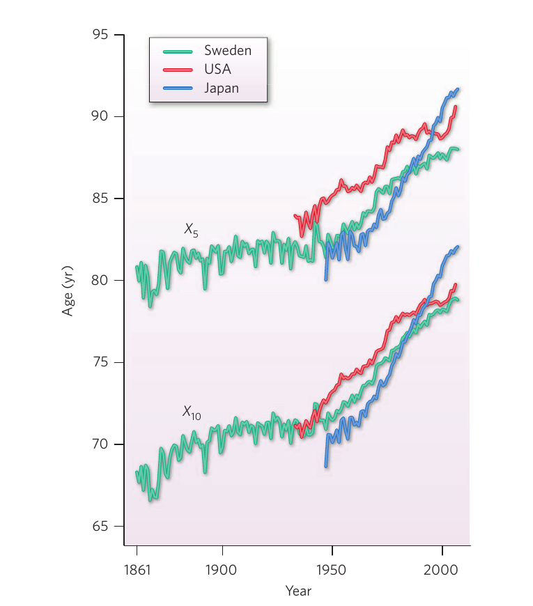
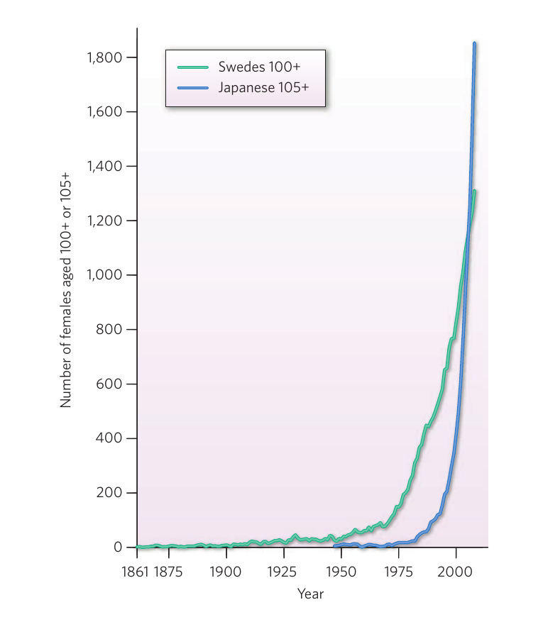
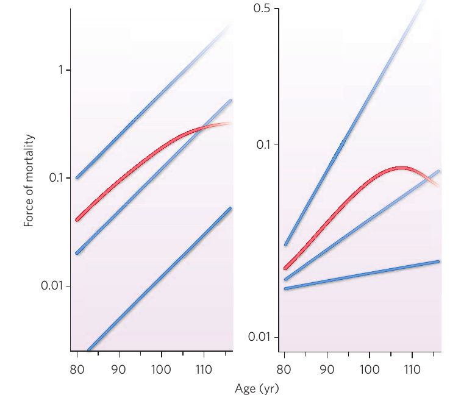
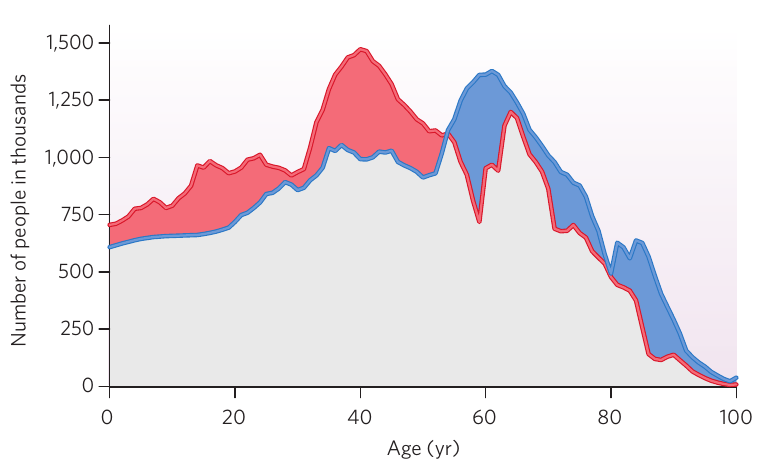
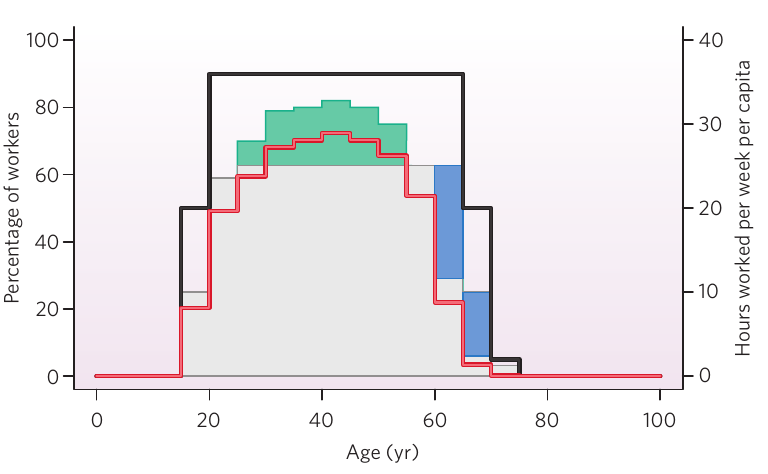

# 인간 노화의 생물인구학

> James W. Vaupel · Nature, 464, 536–542 (2010) · doi:10.1038/nature08984

> Max Planck Institute for Demographic Research, Konrad-Zuse-Strasse 1, D-18057 Rostock, Germany; Institute of Public Health, University of Southern Denmark, DK-5000 Odense C, Denmark; Center on the Demography of Aging, Sanford School of Public Policy, Duke University, Durham, North Carolina 27708, USA.

## 초록

인간의 노쇠는 10년 늦춰졌다. 이 발견은 1994년에 보고되고 이후 더욱 확고해졌으며, 인간 노화의 생물학에 관한 근본적인 발견으로서 개인과 사회, 경제에 심대한 함의를 지닌다. 놀랍게도 나이에 따른 기능 저하 속도는 개인 간에도 시간에 걸쳐서도 일정한 것으로 보인다: 즉, 사람들이 더 나은 건강 상태로 노년에 이르기 때문에 사망이 지연되는 것으로 보인다. 인구학자, 역학자 및 그 밖의 생의학 연구자들의 연구는 생존의 최전선, 그리고 건강한 생존의 최전선을 훨씬 더 높은 연령으로 전진시키는 추가 진전이 이루어질 가능성이 크다는 점을 시사한다.

고령기의 사망을 늦출 수 있고 실제로 늦추고 있다는 발견은 노인의 생존을 연장할 수 있는지를 둘러싼 수천 년의 논쟁을 해결했다1–13. 이 발견을 뒷받침하는 1994년 이후의 증거는 설득력이 매우 높다14–27. 다른 종에 대한 연구의 결과일 수도 있는 획기적인 돌파구가 이루어지지 않는 한, 인간은 계속 노쇠를 겪겠지만 그 과정이 다루기 불가능한 것은 아니다. 사망은 상당히 지연되어 왔는데, 이는 노화 과정을 둔화시키는 혁명적 진전이 아니라 건강을 개선해 온 지속적인 진전의 결과다. 생애 마지막 몇 년을 흔히 특징짓는 쇠약 또한 지연된 것으로 보이지만, 기능 저하를 정의하고 측정하기 어려운 점 등으로 인해 증거는 엇갈린다28–36. 미래는 불확실하지만 오늘날 살아 있는 젊은 사람들에게 매우 긴 삶이 개연성 높은 운명일 수 있다. 논쟁의 여지가 있기는 하지만37, 사망률을 낮추는 진전이 지난 두 세기와 같은 속도로 계속된다면23 기대수명이 높은 국가에서 2000년 이후 태어난 아동 대부분은 22세기에 100번째 생일을 맞을 것이다28. 더 긴 수명은 개인이 생애의 시간을 배분하고자 하는 방식을 바꾸고 고용, 은퇴, 보건, 교육 및 그 밖의 정책을 근본적으로 개편하도록 요구할 것이다9,38,39.

Oliver Wendell Holmes는 오래 살고 싶은 사람에게 “둘 다 장수 집안 출신인 부모 한 쌍을 구한다는 광고를 내라”고 조언했지만40, 개인의 수명을 결정하는 데 유전적 요인이 하는 역할은 크지 않다41–45. 수명을 연장하고 노쇠를 지연하는 지금의 진전은 전적으로 의료 및 공중보건 노력, 생활수준 향상, 더 나은 교육, 더 건강한 영양 섭취, 건강에 더 이로운 생활방식 덕분이다23,46. 그러나 앞으로 노인의 건강을 개선하는 진전은 인간과 비인간 종의 유전학45,47–51 및 노화의 근본 원인6,52–62에 대한 더 깊은 이해를 바탕으로 개발한 개입에 의해 부분적으로 촉진될 가능성이 크다.

이 종설에서는 사망이 지연되고 있다는 증거를 요약한 뒤 쇠약 역시 지연되고 있다는, 결론이 덜 확고한 증거를 검토한다. 나이에 따른 기능 저하 과정은 시간이 흐르면서 둔화되는 것이 아니라 지연되고 있다. 이를 논의한 다음 지연의 원인으로 넘어간다. 마지막 절들에서는 인간 노화와 인간 노화의 생물인구학 연구가 앞으로 어떻게 전개될 가능성이 있는지를 살펴본다.

## 사망의 지연

고령기의 사망이 지연되고 있다는 가설은 사망률 감소의 진전과 모르몬교 대제사장 같은 특수집단에 관한 시사적인 자료를 근거로 20년 전에 제시되었다9,10,12. 사망이 지연되고 있다는 최초의 결정적 발견은 스웨덴 사망률 자료 분석에서 나왔다14. 사망률은 건강을 측정하는 지표 가운데 단연 가장 쉽고 신뢰성 있게 측정할 수 있는 지표다. 대부분의 국가는 수십 년 동안 활용할 만한 인구동태통계를 축적해 왔다. 스웨덴은 사망 자료의 체계적 수집을 선도했으며, 1750년대부터 양호한 국가 보고체계를, 1861년부터는 거의 흠잡을 데 없는 체계를 유지해 왔다.

이 자료를 이용하면 잔여 기대수명이 5년으로 떨어지는 연령을 연구할 수 있었다(그림 1). 이러한 “노화 과정이 ··· 지연되었다”는 발견은 시간에 따른 고령기 사망률 감소 분석으로 뒷받침되었다14. 역시 1994년에 발표된 후속 연구 2편15,16은 다른 국가에서도 사망이 지연되고 있음을 확인했다. 이후의 연구는 이러한 지연이 계속되고 있음을 보여 준다17–27. 주목할 만한 발견은 사망 지연이 100세 이상 인구의 크고 빠른 증가를 촉진하고 있다는 점이다63(그림 2).

그림 1. 사망의 지연. 스웨덴(1861–2008년), 미국(1933–2006년), 일본(1947–2008년) 여성에서 잔여 기대수명이 각각 5년과 10년이 되는 연령인 X5와 X10의 역사적 추세. 스웨덴 여성의 경우 1950년 이후 X10으로 측정한 노쇠가 약 8년 지연되었다. 일본 여성의 경우 1950년 이후 X10이 약 12년 상승했다. 세 국가 모두에서 X5 곡선은 X10 곡선과 대체로 같은 궤적을 따르지만 연령 차이는 약 10년으로 거의 일정하다는 점에 주목하라. 이는 이 두 측정치로 포착한 노쇠가 길어지는 것이 아니라 지연되고 있음을 보여 준다. 두 지표 모두 미국 여성의 노쇠 지연이 1980년부터 2000년까지 더디게 진행되었음을 보여 준다. 앞으로는 더 빠른 진전을 기대할 수 있으며77,83, 최근 미국 여성의 X5와 X10이 빠르게 상승한 것은 그 전조일 수 있다. (Human Mortality Database (http://www.mortality.org), 스웨덴의 2008년 자료는 Statistics Sweden, 일본의 2008년 자료는 일본 후생성의 정보를 사용하여 참고문헌 14의 그래프를 연장하고 갱신했다.)

그림 2. 초고령자의 출현. 스웨덴의 1861–2008년 100세 이상(100+) 여성 수와 일본의 1947–2007년 105세 이상(105+) 여성 수. 약 반세기 전까지 초고령자는 드물었다. 이후 스웨덴의 100세 이상 인구는 빠르게 늘었고, 1975년 이후 일본의 105세 이상 여성 수는 거의 수직으로 증가했다. (Kannisto–Thatcher Database on Old Age Mortality (http://www.demogr.mpg.de)의 자료에 Statistics Sweden 및 일본 후생성 자료를 보완했다.)

사망이 지연되고 있다는 증거는 인구학자와 보험계리사를 놀라게 했다. 사망률 추세를 예측하는 일을 업으로 삼는 이 전문가 대부분은 인간의 기대수명이 상한에 가까워졌다고 믿었다11,23. 이들은 자료와 이론 모두를 근거로 이러한 견해를 세웠다. 이들은 사망률 추세에 관한 방대한 자료를 분석했지만 85세 이후 사망률 자료는 분석하지 않았다. 사망률이 하락하고 있음을 볼 수 있었지만 더 크게 낮아질 수는 없다고 생각했다. 이러한 비관론은 사망을 늦출 수 있는 진전을 상상하지 못한 데서 비롯되었고23, 사망률 이론에 대한 이해가 이를 더욱 굳혔다.

특히 이들은 고령기에는 사인이 오직 하나, 곧 노령뿐이며 이에 대해서는 아무것도 할 수 없다는 널리 퍼진 견해1,8,13를 받아들였다. 조기사망과 노쇠성 사망을 구분한 Aristotle의 논의2까지 거슬러 올라가는 이 관념은 각 종마다 고유한 최대수명이 있다는 결론으로 이어졌다. 서기 2세기 후반의 Galen3과 1500년대의 Cornaro5에서 오늘날의 학자64,65에 이르기까지 다른 학자들은 식이제한이 수명을 연장할 수 있다고 주장했고, 장수의 비결에 관한 수많은 다른 추측도 제시되었다1,4,66. 진화생물학자들은 노쇠, 곧 나이에 따른 기능 저하가 다세포 생물에게 불가피하다고 믿었지만6,54–62 유전적 개입과 그 밖의 개입이 그 과정을 둔화시킬 수 있다고 보았다54–59. 인구학자와 보험계리사는 그러한 개입이 단기간에 인간에게 이루어질 가능성이 낮다고 올바르게 결론 내렸다. 또한 인간 노화를 연구하는 많은 학자는 더 낮은 연령에서 생명을 구하면 취약한 개인이 더 높은 연령까지 생존하여 나이가 들수록 사망률과 이환을 낮추기가 갈수록 어려워질 것이라고 믿었다7.

고령기 사망이 지연되고 있음을 입증한 연구와 더불어 다른 연구들도 기대수명이 한계에 가까워지고 있다는 믿음을 뒤집는 데 기여했다. 다루기 어려운 노쇠성 사망과 종별 최대수명이라는 관념은 1992년 Science에 연이어 실린 두 논문49,67에서 반박되었다. 또한 1870년 이후 태어난 덴마크 쌍둥이 연구에서는 일란성 쌍둥이가 공유하는 선천적 최대수명의 증거가 발견되지 않았다. 성인 수명 변이 가운데 개인 간 유전적 변이로 설명할 수 있는 비율은 약 25%에 불과했다41,42. 이 비율은 나이가 들면서 조금 증가하는 것으로 보이지만, 노인에게서도 유전적 변이의 영향은 여전히 크지 않은 것으로 보인다44. 그러나 최고령층에서는 그 영향이 더 중요할 수도 있다43. 다음 절에서 논의하듯 생명을 구한 진전은 고령기에도 건강을 개선한 것으로 보이지만, 이는 여전히 불확실하며 중요한 연구 주제다.

인간의 주요 장수 유전자를 찾으려는 시도는 별다른 성공을 거두지 못했다45. 아포지질단백질 E 유전자(APOE)의 두 변이는 흔한 변이를 지닌 사람이 직면하는 기준 위험과 비교해 고령기의 사망 가능성을 각각 약 1/1.1배로 낮추거나 약 1.2배로 높이는 위험요인임이 여러 연구에서 나타났다47,48. 수명에 영향을 미친다고 알려진 많은 유전자를 연구들이 발견했지만, APOE의 크지 않은 효과만큼 큰 효과를 지닌 것은 없고 여러 연구에서 반복 검증된 것도 거의 없다. 모든 종의 모든 기능 유전자는 번식력이나 생존, 또는 둘 모두에 직간접적으로 기여하며, 진화이론과 몇몇 실증연구는 장수를 크게 늘리는 변이가 번식을 감소시키기 때문에 자연조건에서 드물 가능성이 크다는 점을 시사한다55,57–59,62,68. 선충 Caenorhabditis elegans에서는 수백 개 유전자가 수명을 연장하도록 인위적으로 변형되었으며50, 일부는 효과가 매우 크다. 그중 처음 발견된 age-1 유전자는 노화 유전학에 대한 우리의 이해를 혁신한 획기적 진전이었다51. 인간에게서는 수백 개, 어쩌면 수천 개 유전자 좌위의 다형성이 각각 고령기 사망과 쇠약의 위험을 높이거나 낮추는 데 작은 역할을 할 가능성이 커 보인다.

노화의 진화이론은 노쇠가 모든 다세포 생물에게 불가피하다는 뜻으로 해석되어 왔다6. 새롭게 등장한 생물인구학 분야 연구자들의 주요한 기여는 이론을 확장하여 이른바 역노쇠, 곧 성인기 전체 또는 대부분에 걸쳐 사망률이 낮아지고 건강이 좋아지는 현상60–62을 포함해 노화 양상의 더 큰 변이를 허용해야 한다고 밝힌 것이다. 실험실과 현장 연구는 일부 종과 성인기의 일부 기간에는 나이에 따라 사망률이 낮아질 수 있고, 유전적 변화뿐 아니라 식이 및 그 밖의 환경요인의 변화도 생존의 연령별 궤적을 크게 바꿀 수 있음을 확인한다49–51,54,55,60,64.

## 쇠약 지연의 진전

사망과 비교하면 건강은 측정하기 어렵고 흔히 신뢰하기 어려운 방식으로 보고된다. 인구건강 추정치는 대개 낮은 참여율, 특히 환자의 낮은 참여율에 제약받는 조사 자료에 근거한다. 인구학자와 역학자는 여러 건강지표로 포착한 노쇠 지연에 관해 활용할 만한 정보를 축적하기 시작했지만28–36, 특히 85세가 넘는 사람의 자료와 인지 수행에 관해서는 사망통계가 제공하는 명료한 관점에 비해 상황이 훨씬 덜 명확하고 더 혼재되어 있다.

노인의 질병과 병적 장애 유병률은 시간이 지나며 증가하는 경향을 보였다28. 이러한 증가의 일부는 예를 들어 제2형 당뇨병, 고혈압, 일부 암을 더 일찍 진단하게 된 데서 비롯된다. 심장질환과 관절염 유병률은 증가한 것으로 보이며, 여러 질환을 함께 지닌 것으로 보고되는 사람도 더 많아졌다.

장애는 보통 옷 입기, 목욕하기, 장보기 같은 일상생활활동에서 스스로 보고한 제약으로 측정한다. 더 나은 치료와 노쇠 지연을 반영하여 장애 유병률이 낮아지고 있을 수 있다는 증거가 늘고 있지만28,29,31–34, 일부 연구에서는 장애 유병률이 증가한 것으로 나타난다33,35,36.

건강기대수명은 현재의 건강 상태를 전제로 한 사람이 기대할 수 있는 건강한 삶의 연수를 측정한다28. 자신이 건강하다고 느끼며 보내는 연수는 연구된 대부분의 국가에서 증가해 왔지만28, 장애를 지닌 채 보내는 연수의 추세는 장애의 심각도에 따라 다르게 전개되어 가장 심각한 수준에서는 줄고 덜 심각한 수준에서는 늘었으며, 국가 간 차이도 상당했다28.

85세 이후 이환, 기능, 건강기대수명의 개선에 관해 이용할 수 있는 증거는 거의 없지만, 적어도 미국에서는, 그리고 적어도 장애에 관해서는 1990년대에 상당한 개선이 이루어진 것으로 보인다28,29,34. 덴마크에서는 1895–1896년에 태어난 100세 이상 인구의 정보를 1905년에 태어난 100세 이상 인구의 유사한 정보와 비교할 수 있다. 후대 코호트의 100세 이상 인구는 이전 코호트보다 50% 더 많았는데, 주된 이유는 80세부터 100세까지 생존할 가능성이 크게 향상되었기 때문이다32. 그럼에도 두 코호트의 신체장애와 인지장애는 비슷했으며, 더 최근 코호트의 여성 건강이 조금 더 좋았다31.

질병이나 상태의 유병률은 사망과 발생 사이의 순균형에 달려 있는데, 더 효과적인 치료는 사망을 늦추며 발생은 해당 상태 자체의 빈도 증가뿐 아니라 검진 개선으로도 늘어난다. 건강 상태는 건강함, 건강하지 않음, 사망이라는 세 가지로 구분할 수 있다. 건강하지 않은 상태가 사망보다는 낫다는 범위에서는 노인의 이환 유병률 증가가 긍정적인 변화일 수 있다. 건강하지 않은 상태는 만성질환이 있지만 기능할 수 있는 상태와 장애가 있는 상태의 두 가지로 다시 나눌 수 있다. 효과적인 재활은 이환을 줄이지는 않지만 장애를 줄인다. 불규칙한 심장박동이 있어도 심박조율기로 조절하거나 뇌졸중을 겪고도 물리치료를 받으면 이환 유병률은 높아지지만 질병으로 무력해지거나 사망하는 것보다는 낫다. 어느 국가가 장애를 최소화하는 데 가장 뛰어난지, 그리고 어떻게 그렇게 하는지를 연구하면 노인에게 큰 도움이 될 수 있다.

더 많은 증거가 없을 때에는 간접평가가 유용하다. 심장질환과 치매를 포함한 대부분의 이환과 장애는 사망률을 높인다. 따라서 85세 이후의 건강 악화가 지연되지 않는다면 이 연령 이후의 사망률을 낮추기 어려울 것이다. 단기적으로는 연구한 건강지표에 따라 생명을 구하는 과정과 건강을 개선하는 과정이 함께 낳는 순결과가 이환 및 장애 유병률의 증가 또는 감소 중 어느 쪽으로도 이어질 수 있다. 이러한 역학은 사망률 감소의 진전이 더딜 때 노인의 건강이 때때로 개선되고(예: 1980년대와 1990년대 미국29,34(그림 1)과 덴마크31,32), 그 진전이 더 빠를 때 건강이 악화되는 이유(예: 최근 수십 년의 스웨덴35, 특히 일본36(그림 1))를 설명할 수 있다. 그러나 장기적으로는 고령기의 더 나은 건강이 지속적인 생존 개선의 전제조건일 수도 있다. 이는 개연성 있는 가설이지만 결정적 증거는 부족하다.

비인간 종의 인구집단에서 노화를 다룬 거의 모든 연구는 사망률을 노쇠 지표로 삼는다. 다른 종의 연령별 이환 및 장애 양상에 관한 실험실 연구와 현장 연구가 더 필요하다.

나이가 들수록 여성은 인구에서 더 큰 비중을 차지한다. 스웨덴에서는 2008년 출생아의 거의 52%가 남아였으며, 남성의 사망률이 더 높은데도 60세까지는 남성이 여성보다 많았다. 이때 80세에는 남성 2명당 여성이 3명이었고, 100세 이상 인구에서는 남성 1명당 여성이 6명이었다. 그러나 여러 건강 및 장애 지표에서 고령 남성은 대체로 같은 나이의 여성보다 더 양호하다. 이것이 건강–생존 역설이다: 남성은 여성보다 더 건강해 보이지만 더 일찍 사망한다69. 사회적 요인과 생물학적 요인이 상호작용하여 취약한 여성과 사망한 남성의 비율을 결정하지만, 구체적인 기제들의 상대적 중요성은 충분히 밝혀지지 않았다69–71. 남성은 자신의 건강이 실제보다 더 좋다고 믿는 경향이 있고 여성만큼 자주 의료서비스를 찾지 않으며, 일반의 진료는 더 적게 받지만 응급치료는 더 자주 필요로 한다69. 여성은 건강이 좋지 않아도 더 잘 생존할 수 있는 것으로 보인다72. 남성은 무모한 행동을 하는 경향이 있다. 이 성향은 부분적으로 유전적 기원을 지닐 수 있으며, 남성과 여성이 직면하는 번식 기회의 차이에 근거할 수 있다70,71.

## 감속이 아니라 지연

노쇠는 손상과 복구 사이에 누적되는 불균형에서 비롯된다57,62. 손상을 줄이는 진전(예: 생활조건을 개선하고 질병을 예방하려는 공중보건 노력)과 복구를 늘리는 진전(예: 의료개입)은 건강 개선의 두 가지 근본 원인이다. 이러한 진전이 기능 저하 속도를 늦춰 예전에 70세부터 80세 사이에 일어나던 쇠약이 70세부터 85세 사이에 일어나고, 예전에 80세부터 90세 사이에 일어나던 쇠약이 85세부터 100세 사이에 일어날 것이라고 생각할 수도 있다. 놀랍게도 실제로는 그렇지 않은 것으로 보인다. 오히려 사망률이 나이에 따라 증가하는 속도는 20세기 대부분에 걸쳐 다소 빨라졌고 최근 수십 년에는 거의 일정했다17–19,24–27. 증거는 기능 저하가 길게 늘어지는 대신 지연되고 있음을 시사한다: 예전에 70세에서 나타나던 사망률 수준과 그 밖의 건강지표 수준이 이제는 80세에서 나타나고, 예전에 80세에서 나타나던 수준이 이제는 90세에서 나타난다. 위에서 검토한 여러 갈래의 인구학적·역학적 증거와 흥미로운 몇몇 동물연구64는 초장수인, 곧 110세 이상인 사람을 다룬 연구의 새로운 증거73로 더욱 강화되었다.

100세 이상이라고 보고된 사례는 대부분 잘못되었으며, 초장수인 사례는 그보다도 훨씬 더 많이 잘못 보고되었다73,74. 알려진 초고령을 검증하려면 정확한 출생기록을 찾아야 한다. 세심한 연구 노력은 주목할 만한 사실을 밝혀냈다: 검증된 110세부터 114세 사이에서는 연간 사망확률이 매년 50% 수준으로 일정하다73. 한편 114세 이후의 드문 생존 관측치는 110세 이후 모든 연령에서 사망률이 이 수준에 머문다는 가설과 모순되지 않는다. Box 1에서 설명하듯 이 결과는 적어도 고령기에는 인간 개인의 기능이 같은 속도로 저하된다는 점을 함의한다.

### Box 1 | 이질적 인구집단의 역학

여기에 제시한 두 그림은 이질적인 인구집단의 연령별 사망률 양상(빨간색)이 그 인구집단을 이루는 하위집단들의 연령별 양상(파란색)과 질적으로 어떻게 다를 수 있는지를 보여 준다.

왼쪽 그림은 연령별 사망률 수준은 서로 다르지만 노화 속도, 곧 나이에 따른 사망률 증가 속도는 똑같이 일정한 하위집단들로 이루어진 인구집단을 나타낸다. 노화 속도는 파란색 궤적의 기울기를 결정하며, 세로축이 로그척도이기 때문에 이 궤적들은 직선이다. 하위집단이 사라지는 현상은 파란색이 흐려지는 것으로 나타냈다. 사망률 수준이 가장 높은 하위집단이 먼저 사라지고, 두 번째 하위집단과 점점 더 큰 비중을 차지하는 세 번째 하위집단으로 이루어진 인구집단이 남는다. 하위집단이 연속적으로 분포하고 파란색으로 표시한 세 집단이 예시 사례라면, 전체 인구집단, 곧 생존 인구집단의 사망력은 빨간색과 비슷한 궤적을 따를 수 있다. 전체 인구집단의 사망률은 각 하위집단의 사망률 증가와 하위집단 구성의 변화 사이의 균형을 반영하는 일정한 값에서 평탄화될 수 있다97–99.

오른쪽 그림도 이와 유사하지만 하위집단들의 노화 속도가 서로 다르며, 80세의 초기 사망률 수준에도 차이가 있다. 초기 사망률 수준의 차이가 얼마나 큰지와 관계없이, 서로 다른 속도로 노화하는 하위집단들로 이루어진 인구집단에서는 빨간색 곡선이 보여 주듯 전체 인구집단의 사망력이 결국 감소하는 것이 일반적이다98.

인간의 사망률은 110세 이후 평탄화되는 것으로 보이며(참고문헌 73), 이는 왼쪽 그림과 부합한다. 예외적으로 장수하는 사람은 다른 사람보다 더 서서히 노쇠해서(오른쪽 그림의 가장 낮은 파란색 곡선) 고령에 이르는 것이 아니라, 더 나은 건강 상태로 노년에 도달하기 때문에(왼쪽 그림의 가장 낮은 파란색 곡선) 고령에 이르는 것으로 보인다. 분절성 조로증을 앓는 사람에게서 노화 과정을 빠르게 하는 유전적 결함이 발견된 바 있다. 그러나 적어도 인간에게서는 이 과정을 감속하는 돌연변이가 발견되지 않았으며, 그러한 돌연변이가 인간 인구집단에 널리 존재하지 않을 수도 있다. 따라서 가속노화 장애가 있는 사람을 제외하면 모든 노인은 나이에 따른 사망률 증가 속도가 비슷하고, 어쩌면 본질적으로 같다는 가설을 제안한다. 나는 이 가설을 검증해야 한다고 생각한다.

이 가설은 노쇠 과정이 감속되는 것이 아니라 지연되고 있다는 발견과 일치한다. 장수가 늘어나는 이유는 왼쪽 그림의 파란색 곡선 집합이 아래로, 또는 같은 의미에서 오른쪽으로 이동하고 있기 때문이다. 오른쪽 그림에 나타난 것처럼 파란색 곡선의 기울기가 낮아진 것은 아니다.

참고문헌 100은 이질적 인구집단의 역학을 쉽게 이해할 수 있게 소개한다.

## 과거와 미래의 지연 원인

번영과 의학은 노쇠 지연에 기여하는 두 가지 주요 요인으로 보인다34,46. 단열된 주택에 살고 적절한 옷을 입으며 맛있는 음식을 먹고 일상을 즐길 때 노인은 더 건강하기 때문에 번영은 중요하다. 특히 혁신적인 치료는 의료비가 많이 들 수 있고, 경제가 부유할수록 생의학 연구에 더 많은 자원을 투입할 수 있다는 점에서도 번영은 중요하다. 더 나아가 부유한 국가의 시민은 교육을 잘 받는 경향이 있고 교육을 잘 받은 사람은 더 건강하고 오래 사는 경향이 있으므로 번영은 중요하다. 의학적 치료, 외과적 개입, 질병과 장애를 예방하거나 완화하는 공중보건 노력은 노쇠로 약해진 사람에게 특히 중요하다. 번영과 의학이 서로 상호작용하기도 하므로 어느 쪽이 더 중요한 요인인지는 알려져 있지 않다. 번영은 더 나은 치료, 추가 교육, 더 많은 연구를 가능하게 하고, 더 건강한 인구는 더 생산적이고 더 번영한다. 또한 1인당 소득 수준이 같은 두 국가도 건강기대수명이 다를 수 있으며, 생활수준이 높지 않은 일부 국가가 훨씬 부유한 국가만큼 좋은 성과를 내기도 한다75. 그 이유를 이해하는 것이 연구의 우선과제다.

평균보다 더 길거나 더 짧게 건강한 삶을 사는 사람이 생기는 이유는 많은 추가 요인의 상호작용으로 결정된다59,76. 집중적인 연구에도 불구하고 가족구조, 사회연결망, 비만 및 그 밖의 요인의 영향은 충분히 밝혀지지 않았다77. 예를 들어 노년기 건강을 결정할 때 생애 초기 조건과 생애 후기 조건 가운데 어느 쪽이 상대적으로 더 중요한지를 두고 견해가 엇갈린다. 한편으로 태내와 아동기에 일어난 일부 사건은 노년기 건강에 중대한 영향을 미치며78, 출생 계절도 여기에 포함된다79,80. 예를 들어 1900년 무렵 유럽에서 11월에 태어난 아기는 5월에 태어난 아기보다 50세 이후 몇 달 더 오래 살았다79. 그러나 기근을 겪은 결과가 오래 지속되는지에 관한 증거는 엇갈리며81, 태내에서 쌍둥이였다는 사실은 장기적 영향을 미치지 않는 것으로 보인다82. 또한 쌍둥이 연구는 성인 수명 변이 가운데 쌍둥이가 공유한 아동기 환경으로 설명할 수 있는 비율이 10% 미만이라고 보고한다41,42. 다른 한편으로 성인기의 흡연이 수십 년 뒤에도 건강에 매우 심각한 영향을 미친다는 점은 알려져 있으며, 흡연 양상은 성인 사망률을 낮추는 진전이 어떤 국가에서 다른 국가보다 빠른 이유를 설명하는 가장 중요한 열쇠인 것으로 보인다77,83. 의료 발전이나 경제성장 같은 생애 후기 사건이 노인의 사망률 감소를 진전시키는 주된 결정요인이라는 점도 분명하다16,17,26,77,84: 두드러진 사례로 20년 전 독일 통일 이후 옛 동독의 고령자와 초고령자 사망률은 빠르게 낮아져 옛 서독의 수준에 가까워졌다85.

흡연하고 운동을 거의 하지 않으며 고도비만인 사람은 초고령까지 생존할 가능성이 거의 없지만, 건강하게 행동하려고 노력하는 사람조차 현재의 건강 조건에서는 100세까지 살 확률이 몇 퍼센트에 불과하다. 한 세기 전 100세 이상이 될 가능성은 현재의 약 100분의 1이었다(그림 2). 이와 대조적으로 오늘날 기대수명이 높은 국가에 사는 아동의 절반은 100번째 생일을 맞을 수도 있다28. 개인의 행동은 동시대 사람과 비교해 상대적으로 오래 사는 데 결정적으로 중요하지만, 한 인구집단의 전반적인 장수 수준은 번영과 의학이 결정한다.

미래에 노쇠를 더 지연하려면 노인뿐 아니라 젊은 사람의 건강도 개선하여 그들이 더 나은 상태로 노년에 이르게 해야 한다. 기존 지식을 토대로도 많은 일을 할 수 있다37. 가정과 야외 환경을 더 안전하게 만들고 자기위해 행동(흡연, 과도한 음주, 비만, 운동 부족 등)을 줄이는 공중보건 노력은 모든 사람에게 양질의 의료서비스를 제공하려는 노력과 마찬가지로 중요할 것이다. 평등주의 사회에서도 수명에는 상당한 차이가 있다86. 2008년 스웨덴 사망률 양상을 보면 대부분은 84세를 넘어 살지만 6명 중 1명은 70세 이전에 사망할 것으로 예상된다.

기대수명을 100년 이상으로 높이려면 새로운 지식이 필요할 것이다37. 연구의 진전은 미래에 심혈관질환과 악성종양을 훨씬 더 효과적으로 예방하고 치료하게 될 것임을 시사한다. 노쇠가 가져오는 두 가지 큰 고통은 흔히 Alzheimer병 때문에 생기는 인지장애와 감각 박탈(Shakespeare의 “이도 없고, 눈도 없고, 맛도 없고, 아무것도 없는”)이다. 이러한 고통을 극복하는 진전은 노년기를 크게 개선할 것이다. 인간45과 비인간 종50 모두를 대상으로 한 유전학 연구는 노쇠를 일으키는 기제를 더 깊이 이해하는 데 기여하며, 개인의 유전체 지식에 기초한 맞춤형 치료를 가능하게 할 수도 있다. 식이제한64,65과 그 밖의 비유전적 개입 연구도 인간의 노화를 지연하는 전략으로 이어질 수 있다. 새롭게 등장한 재생의학 분야는 큰 가능성을 보이며, 앞으로 수십 년 안에 장기와 조직을 젊게 되돌리는 일이 가능해질 수도 있다. 나노기술 역시 노쇠 지연에 역할을 할 수도 있다.

## 수명 연장의 전망과 결과

인구학자는 대체로 과거 추세를 외삽하여 미래의 사망률 수준을 예측하며23,87,88, 때로는 예상되는 추세 변화를 반영해 조정한다83. 미래에는 재난(예: 유행병, 전쟁, 경제위기, 기후변화)이나 돌파구(어쩌면 노쇠의 통제)가 생길 수 있지만, 과거에도 재난과 돌파구가 있었다. 지난 170년 동안 기대수명이 가장 높은 국가에서 이러한 사건들은 기대수명의 장기적 증가를 감속시키지도 가속하지도 않았으며, 기대수명은 10년마다 2.5년, 곧 하루에 6시간씩 늘었다23.

1860년대 초 스웨덴에서는 해마다 평균 약 3명, 주로 여성이 100번째 생일을 맞았지만 2007년에는 750명이 넘어서 250배 증가했다. (그림 2는 스웨덴의 100세 이상 여성 수가 급증한 모습을 보여 준다.) 2107년에는 2007년에 태어난 코호트의 절반이 넘는 50,000명 또는 60,000명이 100세 이상이 될 수도 있는데, 이는 추가로 ~75배 증가하는 것으로 그 혜택은 오늘날 살아 있는 아동에게 돌아갈 수 있다28.

사망률이 나이에 따라 높아지는 속도를 늦출 수 있게 된다면 노쇠는 상당히 감속될 것이다. 예를 들어 50세의 잔여 기대수명을 생각해 보자. 오늘날 스웨덴 여성의 경우 50세 이후 연간 사망확률을 절반으로 줄이면 기대사망연령이 84세에서 90세로 높아진다. 그러나 50세 이후의 노화 속도를 절반으로 줄이면 기대사망연령은 118세로 높아진다. 이러한 전망 때문에 일부 노화 전문가는 질병 연구에 “노화 자체에 대한 체계적 공격”52을 더하는 “전략의 변화”52를 주장해 왔다. 어느 한 특정 질병의 사망을 줄이는 것만으로 기대수명이 근본적으로 늘지는 않지만, 특히 노인에게 동반이환이 매우 흔하므로 여러 질병에 맞선 진전은 서로 상승작용을 일으킨다. 질병별 진전은 고령기의 잔여수명을 해마다 몇 개월씩 늘려 왔고 앞으로도 계속 늘릴 가능성이 크다23,37. 한편 “노화를 7년 늦추자”는 새로운 전략의 요구53는 사망이 이미 그보다 더 오래 지연되었다는 점(그림 1), 그리고 지난 수십 년과 같은 속도로 진전이 이어지면 앞으로 30년 또는 40년 안에 사망이 다시 7년 지연될 것이라는 점을 인정해야 한다.

젊은 사람이 자신이 아마 100세를 넘어 생존하고 그중 90년 또는 95년을 양호한 인지능력과 신체능력을 유지하며 살 것임을 안다면, 오늘날 대부분의 사람과는 다른 방식으로 삶을 보내고 싶어 할 가능성이 크다9,38,39. 많은 국가, 특히 기대수명이 긴 국가에서 사람들은 자녀를 낳고 함께 시간을 보낼 수 있는 연령에 열심히 일한 뒤, 자녀에게 더 이상 일상적 돌봄이 필요하지 않은 연령에 은퇴한다. 그리고 20년 이상을 교육에, 그다음 30년 또는 40년을 일과 가족을 병행하려는 노력에 쓰고, 이어 아마 40년 동안 여가를 견디는 방식은 교육, 일, 자녀양육, 여가를 더 긴 생애에 걸쳐 분산하고 섞는 방식보다 덜 바람직해 보일 수 있다.

그림 3은 2005년 독일의 인구분포와 2025년의 예상 분포를 보여 준다. 그림 4는 연령별로 얼마나 많은 사람이 일하고 얼마나 많이 일하는지를 보여 준다. 다른 부유한 국가의 상황도 대체로 반영하는 그림 3과 4의 양상에서 독일인은 1인당 주 16.3시간 일한다는 뜻밖의 결과가 나온다. 노동 투입이 2005년 수준에 머무는 가운데 인구분포만 2025년 양상으로 바뀌면 1인당 주당 노동시간은 14.9시간으로 떨어진다. 독일 경제의 산출을 유지하려면 추가 노동을 투입해야 하며, 정책은 50대 후반과 60대 초반의 고용을 늘려 이를 달성하려 한다. 그러나 생애 대부분을 열심히 일한 사람들이 더 오래 일해야 한다는 데 반감을 품기 때문에 이러한 정책은 반대에 부딪힌다.

합리적인 대안은 젊은 사람들이 나이 들어서도 일하는 대신 생애 전체에 걸쳐 주당 노동시간을 줄이도록 허용함으로써 보상하는 것이다. 시민이 더 오랜 기간 일하되 그에 상응해 주당 노동시간을 줄이면 독일 경제의 총산출을 유지할 수 있다. 그 한 가지 방안을 그림 4에 제시했다. 한편 20세기가 부의 재분배 시대였다면 21세기는 노동 재분배의 시대가 될 가능성이 크다39.

그림 3. 연령별 독일 인구. 독일의 1세 단위 연령별 인구수로, 2005년은 빨간색 선, 2025년 전망치는 파란색 선으로 나타냈다. 이때 2025년의 전망 인구분포는 2005년 분포와 비슷하지만 오른쪽으로 20년 이동해 있다는 점에 주목하라. 두 분포의 차이는 주로 사망에서 비롯되며, 국제이민의 유입과 유출은 독일에서는 상대적으로 중요하지 않다. 빨간색 영역은 2005년부터 2025년까지 54세 미만 인구의 감소를, 파란색 영역은 54세 초과 인구의 증가를 나타낸다. (Human Mortality Database (http://www.mortality.org)와 독일 통계청의 Coordinated Population Projection for Germany 자료를 사용했다.)

그림 4. 연령별 독일의 고용. 독일에서 연령별로 일하는 사람의 비율은 2005년을 빨간색 선, 가상의 2025년을 검은색 선으로 나타냈고, 노동자 1인당 주당 노동시간은 2005년을 회색–초록색 영역, 가상의 2025년을 회색–파란색 영역으로 나타냈다. 가상 시나리오에서는 검은색 선과 빨간색 선의 차이가 보여 주듯 대부분의 연령에서 더 높은 비율의 사람이 일한다. 연령이 55세 미만인 경우 2025년 취업자의 평균 주당 노동시간은 2005년 취업자보다 적어 초록색 영역으로 표시한 노동을 제공하지 않는다. 연령이 60세부터 70세 사이인 경우 2025년 취업자의 평균 주당 노동시간은 2005년 취업자보다 많아 파란색 영역으로 표시한 추가 노동을 제공한다. 가상 시나리오에서 20세부터 65세까지 사람들은 주당 평균 약 25시간 일하고, 이 가운데 일하는 90%는 평균 약 28시간의 노동을 제공한다. 또한 20세부터 65세까지 인구의 10분의 1이 전혀 일하지 않는다면, 또 다른 10분의 1은 주 40시간, 10분의 4는 주 30시간, 나머지 10분의 4는 주 20시간 일함으로써 2005년 수준의 노동 산출을 유지할 수 있다. (EU Labour Force Survey 자료를 바탕으로 계산했다.)

## 전망

노쇠를 지연할 수 있다는 발견 전에는 노인의학이 죽어 가는 사람의 고통을 완화하려는 칭찬할 만하지만 다소 헛된 노력으로 여겨졌다. 그러나 오늘날 노인의학은 더 매력적이고 점점 더 중요한 전문분야가 되고 있다. 마찬가지로 한때 관찰에 머무르는 변방 분야였던 노화 연구는 이제 흥미롭고 능동적인 과학이 되었으며, 미국 National Institute on Aging의 상당한 지원을 받고 있지만 다른 국가의 지원은 훨씬 적다.

노화인구학은 인구학에서 가장 흥미로운 분야 가운데 하나로 발전했으며89, 노화의 생물인구학 연구56,89–91와 최근의 노화에 관한 진화생물인구학 연구60–62,91–93가 혁신적 연구 분야로 등장했다. 인구학은 수학적 토대에 기반하고 방대한 자료의 혜택을 받으며 정책결정자와 대중의 관심을 끌고 사회과학과 생물과학 모두에 연결되어 있어, 노화에 대한 이해를 심화하는 데 지금까지 중요한 역할을 해 왔고 앞으로도 그럴 것이다. Dobzhansky는 “진화의 빛을 비추지 않고서는 생물학의 어떤 것도 이해할 수 없다”고 단언했다94. 이와 마찬가지로 인구학의 빛을 비추지 않고서는 진화의 어떤 것도 이해할 수 없으며 그 반대도 마찬가지라고 말할 수 있는데, 이는 진화가 비인간 종의 출산, 사망, 이동의 역학에 의해 움직이고 동시에 그 역학을 움직이며 인간에서도 상당 부분 그러하기 때문이다. 이러한 역학이 인구학의 핵심이다95,96.

평균 수명이 늘어나면서 사망연령의 분산은 줄어들었으며86, 기대수명이 가장 높은 국가는 수명 격차가 가장 작은 국가다. 부유한 국가의 대부분 사람과 개발도상국에서 점점 더 큰 비중을 차지하는 사람은 길고 대체로 건강한 삶을 기대할 수 있다. 이는 현대문명의 가장 중요한 성취라고 해도 지나치지 않을 것이다.

많은 정책결정자가 세계 인구가 고령화하고 있음을 알고 있지만, 이 변화의 속도와 그에 따른 사회적·경제적·보건의료적 결과는 충분히 인식되지 않았다. 이 발견이 실험실 실험이나 임상시험에서 나오지 않았기 때문인지, 생의학 연구자 대부분은 사망 지연을 충분히 이해하지 못하며 일부는 이를 알지 못하는 것으로 보인다53. 그러나 노쇠를 지연할 수 있고 실제로 지연하고 있다는 사실은 노년학 연구, 노인의학 실천, 정책 개혁을 이끌고 장려해야 한다.

노인의 생존을 연장할 수 있는지를 둘러싼 수천 년의 논쟁은 놀라운 결말을 맞았다. 고령기에는 사망률이 나이에 따라 증가하는 속도가 둔화되기 때문이 아니라 사람들이 더 나은 건강 상태로 초고령에 이르기 때문에 사망을 늦출 수 있다. 기능 저하 속도를 늦추는 일은 적어도 지금까지는 다루기 어려운 것으로 드러났다. 그러나 노화의 또 다른 측면인 노인의 건강 수준은 바꿀 수 있다. 이 발견들을 함께 보면 너무도 수수께끼 같아서 ‘장수의 수수께끼’라고 부를 수 있다: 인간의 노화를 형성한 진화의 힘은 왜 건강 수준을 바꿀 여지는 허용하면서 쇠약 속도를 바꿀 여지는 허용하지 않는가? 이와 관련된 질문은 인간이 어떤 연령에서든 건강 수준은 크게 다르면서 노화 속도는 크게 다르지 않은 이유가 무엇인가 하는 것이다(Box 1의 그림). 노화 속도를 늦출 수 있는지, 또 어떻게 늦출 수 있는지를 밝히는 연구가 진행 중이다37,52,53. 노쇠가 왜, 어떻게 지연되었으며 어떻게 더 늦출 수 있는지에 관한 연구도 적어도 그만큼 중요할 수 있다37. 우선과제에는 90대, 100세 이상, 초장수인에 관한 연구, 남성과 여성의 건강 및 생존에 관한 연구, 젊은 층과 중년층의 건강 개선 및 사망률 감소가 노년기 건강과 사망률에 어떻게 영향을 미치는지에 관한 연구가 포함된다. 이 글이 제시한 가설, 곧 인간의 사망 가능성이 나이에 따라 증가하는 속도는 기본적인 생물학적 상수일 수 있고 개인 간에도 시간에 걸쳐서도 매우 비슷하며 어쩌면 변하지 않을 수 있다는 가설을 연구하면 우리가 어떻게, 왜 노화하는지를 이해하는 데 근본적으로 기여할 것이다.

## 참고문헌

1. Jeune, B. Living longer—but better? Aging Clin. Exp. Res. 14, 72–92 (2002).

   238개의 참고문헌을 담은 이 흥미로운 글은 『창세기』와 수메르의 Gilgamesh 전설에서 현재에 이르기까지 장수에 관한 생각과 이론을 요약한다.

2. Aristotle. in The Complete Works of Aristotle: The Revised Oxford Translation (ed. Barnes, J.) 740–744 (Princeton Univ. Press, 1984).

3. Galen. in Hygiene: De Sanitate Tuenda Vol. 1, Ch. 2 (Thomas, 1951).

4. Bacon, R. in The Code of Health and Longevity (ed. Sinclair, J.) (Constable, 1806).

5. Cornaro, L. The Art of Living Long (Springer, 2005).

6. Hamilton, W. D. The moulding of senescence by natural selection. J. Theor. Biol. 12, 12–45 (1966).

7. Gruenberg, E. M. The failures of success. Milbank Q. 55, 3–24 (1977).

8. Fries, J. F. Aging, natural death, and the compression of morbidity. N. Engl. J. Med. 303, 130–135 (1980).

9. Vaupel, J. W. & Gowan, A. E. Passage to Methuselah: some demographic consequences of continued progress against mortality. Am. J. Public Health 76, 430–433 (1986).

10. Guralnik, J. M., Yanagishita, M. & Schneider, E. L. Projecting the older population of the United States: lessons from the past and prospects for the future. Milbank Q. 66, 283–308 (1988).

11. Olshansky, S. J., Carnes, B. A. & Cassel, C. In search of Methuselah: estimating the upper limits to human longevity. Science 250, 634–640 (1990).

12. Manton, K. G., Stallard, E. & Tolley, H. D. Limits to human life expectancy: evidence, prospects, and implications. Popul. Dev. Rev. 17, 603–637 (1991).

13. Hayflick, L. Biological aging is no longer an unsolved problem. Ann. NY Acad. Sci. 1100, 1–13 (2007).

14. Vaupel, J. W. & Lundström, H. in Studies in the Economics of Aging (ed. Wise, D. A.) 79–104 (Univ. Chicago Press, 1994).

    당시 새로 구축된 스웨덴 자료를 네 가지 상호보완적 분석으로 검토해 사망 지연을 발견한 결과는 이 책의 장에서 처음 보고되었다.

15. Kannisto, V., Lauritsen, J., Thatcher, A. R. & Vaupel, J. W. Reductions in mortality at advanced ages: several decades of evidence from 27 countries. Popul. Dev. Rev. 20, 793–810 (1994).

16. Kannisto, V. Development of Oldest-Old Mortality, 1950–1990: Evidence from 28 Developed Countries (Odense Univ. Press, 1994).

17. Kannisto, V. The Advancing Frontier of Survival: Life Tables for Old Age (Odense Univ. Press, 1996).

18. Vaupel, J. W. The remarkable improvements in survival at older ages. Phil. Trans. R. Soc. Lond. B. 352, 1799–1804 (1997).

19. Vaupel, J. W. et al. Biodemographic trajectories of longevity. Science 280, 855–860 (1998).

20. Tuljakurpar, S., Li, N. & Boe, C. A universal pattern of mortality decline in the G7 countries. Nature 405, 789–792 (2000).

21. Wilmoth, J. R., Deegan, L. J., Lundström, H. & Horiuchi, S. Increase of maximum life-span in Sweden, 1861–1999. Science 289, 2366–2368 (2000).

22. Kannisto, V. Mode and dispersion of the length of life. Population 13, 159–171 (2001).

23. Oeppen, J. & Vaupel, J. W. Broken limits to life expectancy. Science 296, 1029–1031 (2002).

    이 논문은 기대수명이 가장 높은 국가들에서 1840년 이후 기대수명이 10년마다 2년 넘게 늘었으며 추가 증가에 임박한 한계가 없음을 보여 준다.

24. Cheung, S. L. K. & Robine, J.-M. Increase in common longevity and the compression of mortality: the case of Japan. Popul. Stud. (Camb.) 61, 85–97 (2007).

25. Canudas-Romo, V. The modal age at death and the shifting mortality hypothesis. Demogr. Res. 19, 1179–1204 (2008).

26. Rau, R., Soroko, E., Jasilionis, D. & Vaupel, J. W. Continued reductions in mortality at advanced ages. Popul. Dev. Rev. 34, 747–768 (2008).

27. Bongaarts, J. Trends in senescent life expectancy. Popul. Stud. (Camb.) 63, 203–213 (2009).

28. Christensen, K., Doblhammer, G., Rau, R. & Vaupel, J. W. Ageing populations: the challenges ahead. Lancet 374, 1196–1208 (2009).

    이 논문은 사망률, 이환, 장애에 관한 연구를 철저히 검토한 결과, 고령층에서 생존과 건강이 모두 개선되고 있다고 결론 내린다.

29. Freedman, V. A. et al. Resolving inconsistencies in trends in old-age disability: report from a technical working group. Demography 41, 417–441 (2004).

30. Christensen, K., McGue, M., Petersen, I., Jeune, B. & Vaupel, J. W. Exceptional longevity does not result in excessive levels of disability. Proc. Natl Acad. Sci. USA 105, 13274–13279 (2008).

31. Engberg, H., Christensen, K., Andersen-Ranberg, K., Vaupel, J. W. & Jeune, B. Improving activities of daily living in Danish centenarians — but only in women: a comparative study of two birth cohorts born in 1895 and 1905. J. Gerontol. A 63, 1186–1192 (2008).

32. Jeune, B. & Brønnum-Hansen, H. Trends in health expectancy at age 65 for various health indicators, 1987–2005, Denmark. Eur. J. Ageing 5, 279–285 (2008).

33. Jagger, C. et al. Inequalities in healthy life years in the 25 countries of the European Union in 2005: a cross-national meta-regression analysis. Lancet 372, 2124–2131 (2008).

34. Cutler, D. M. & Wise, D. A. (eds) Health at Older Ages: The Causes and Consequences of Declining Disability among the Elderly (Univ. Chicago Press, 2008).

35. Parker, M. G., Schön, P., Lagergren, M. & Thorslund, M. Functional ability in the elderly Swedish population from 1980 to 2005. Eur. J. Ageing 5, 299–309 (2008).

36. Robine, J.-M. & Saito, Y. in Frontiers of Japanese Demography (ed. Goldstein, J. R.) (Springer, in the press).

37. Sierra, F., Hadley, E., Suzman, R. & Hodes, R. Prospects for life span extension. Annu. Rev. Med. 60, 457–469 (2009).

    방대한 문헌을 포괄적으로 검토한 이 글은 고령기 건강 및 생존 연구에서 기대할 수 있는 진전과 잠재적 과제를 균형 있게 설명한다.

38. Lee, R. D. & Goldstein, J. R. in Life Span: Evolutionary, Ecological, and Demographic Perspectives (eds Carey, J. R. & Tuljapurkar, S.) 183–207 (Population Council, 2003).

39. Vaupel, J. W. & Loichinger, E. Redistributing work in aging Europe. Science 312, 1911–1913 (2006).

40. Holmes, O. W. in Over the Teacups 181 (Houghton Mifflin, 1890).

41. McGue, M., Vaupel, J. W., Holm, N. V. & Harvald, B. Longevity is moderately heritable in a sample of Danish twins born 1870–1880. J. Gerontol. A 48, B237–B244 (1993).

42. Herskind, A. M. et al. Untangling genetic influences on smoking, body mass index and longevity: a multivariate study of 2464 Danish twins followed for 28 years. Hum. Genet. 98, 467–475 (1996).

43. Perls, T. T. et al. Life-long sustained mortality advantage of siblings of centenarians. Proc. Natl Acad. Sci. USA 99, 8442–8447 (2002).

44. Hjelmborg, J. vB. et al. Genetic influences on human lifespan and longevity. Hum. Genet. 119, 312–321 (2006).

45. Christensen, K., Johnson, T. E. & Vaupel, J. W. The quest for genetic determinants of human longevity: challenges and insights. Nature Rev. Genet. 7, 436–448 (2006).

46. Riley, J. C. Rising Life Expectancy: A Global History (Cambridge Univ. Press, 2001).

47. Gerdes, L. U., Jeune, B., Andersen-Ranberg, K., Nybo, H. & Vaupel, J. W. Estimation of apolipoprotein E genotype-specific relative mortality risks from the distribution of genotypes in centenarians and middle-aged men: apolipoprotein E gene is a ‘frailty gene’, not a ‘longevity gene’. Genet. Epidemiol. 19, 202–210 (2000).

48. Ewbank, D. C. Differences in the association between apolipoprotein E genotype and mortality across populations. J. Gerontol. A 62, 899–907 (2007).

49. Curtsinger, J. W., Fukui, H. H., Townsend, D. R. & Vaupel, J. W. Demography of genotypes: failure of the limited life-span paradigm in Drosophila melanogaster. Science 258, 461–463 (1992).

50. Tissenbaum, H. A. & Johnson, T. E. in Molecular Biology of Aging (eds Guarente, L., Partridge, L. & Wallace, D. C.) 153–183 (Cold Spring Harbor Laboratory Press, 2008).

51. Johnson, T. E. Increased life-span of age-1 mutants in Caenorhabditis elegans and lower Gompertz rate of aging. Science 249, 908–912 (1990).

52. Butler, R. N. et al. New model for health promotion and disease prevention for the 21st century. Br. Med. J. 337, 149–150 (2008).

53. Farrelly, C. Has the time come to take on time itself? Br. Med. J. 337, 148–149 (2008).

54. Finch, C. E. Longevity, Senescence and the Genome (Univ. Chicago Press, 1990).

55. Rose, M. R. Evolutionary Biology of Aging (Oxford Univ. Press, 1994).

56. Wachter, K. W. & Finch, C. E. (eds) Between Zeus & the Salmon (US Natl Acad. Press, 1997).

57. Kirkwood, T. B. L. Time of Our Lives: The Science of Human Aging (Oxford Univ. Press, 1999).

58. Kirkwood, T. B. L. & Austad, S. N. Why do we age? Nature 408, 233–238 (2000).

59. Kirkwood, T. B. L. Understanding the odd science of aging. Cell 120, 437–443 (2005).

60. Vaupel, J. W., Baudisch, A., Dölling, M., Roach, D. A. & Gampe, J. The case for negative senescence. Theor. Popul. Biol. 65, 339–351 (2004).

61. Baudisch, A. Hamilton’s indicators of the force of selection. Proc. Natl Acad. Sci. USA 102, 8263–8268 (2005).

62. Baudisch, A. Inevitable Aging? Contributions to Evolutionary-Demographic Theory (Springer, 2008).

    이 선구적 연구는 진화이론과 인구학 개념에 기초한 모형을 사용하여 노쇠가 모든 종에 불가피한 것은 아님을 보여 준다.

63. Vaupel, J. W. & Jeune, B. in Exceptional Longevity: From Prehistory to the Present (eds Jeune, B. & Vaupel, J. W.) 109–116 (Odense Univ. Press, 1995).

64. Mair, W., Goymer, P., Pletcher, S. D. & Partridge, L. Demography of dietary restriction and death in Drosophila. Science 301, 1731–1733 (2003).

65. Sohal, R. S. & Weindurch, R. Oxidative stress, caloric restriction, and aging. Science 273, 59–63 (1996).

66. Perls, T. T., Silver, M. H. & Lauerman, J. F. Living to 100 (Perseus, 1999).

67. Carey, J. R., Liedo, P., Orozco, D. & Vaupel, J. W. Slowing of mortality rates at older ages in large medfly cohorts. Science 258, 457–461 (1992).

68. Doblhammer, G. & Oeppen, J. Reproduction and longevity among the British peerage. Proc. R. Soc. Lond. B 270, 1541–1547 (2003).

69. Oksuzyan, A., Juel, K., Vaupel, J. W. & Christensen, K. Men: good health and high mortality; sex differences in health and aging. Aging Clin. Exp. Res. 20, 91–102 (2008).

70. Austad, S. Why women live longer than men. Gend. Med. 3, 79–92 (2006).

71. Bonduriansky, R., Maklakov, A., Zajitschek, F. & Brooks, R. Sexual selection, sexual conflict and the evolution of ageing and life span. Funct. Ecol. 22, 443–453 (2008).

72. Olsen, T. S., Dehlendorff, C. & Andersen, K. K. The female stroke survival advantage: relation to age. Neuroepidemiology 32, 47–52 (2009).

73. Maier, H., Gampe, J., Jeune, B., Robine, J.-M. & Vaupel, J. W. (eds) Supercentenarians (Springer, in the press).

74. Jeune, B. & Vaupel, J. W. (eds) Validation of Exceptional Longevity (Odense Univ. Press, 1999).

75. Preston, S. H. The changing relation between mortality and level of economic development. Popul. Stud. (Camb.) 29, 231–248 (1975).

76. Rogers, R. G., Hummer, R. A. & Nam, C. B. Living and Dying in the USA: Behavioral, Health, and Social Differentials of Adult Mortality (Academic, 2000).

77. Crimmins, E. M. & Preston, S. H. (eds) Divergent Trends in Life Expectancy (National Research Council, in the press).

78. Barker, D. J. P., Bergmann, R. L. & Ogra, P. L. (eds) The Window of Opportunity: Pre-Pregnancy to 24 Months of Age (Karger, 2008).

79. Doblhammer, G. The Late Life Legacy of Very Early Life (Springer, 2004).

80. Moore, S. E., Cole, T. J., Poskitt, E. M. E. & Sonko, B. J. Season of birth predicts mortality in rural Gambia. Nature 388, 434–435 (1997).

81. Kannisto, V., Christensen, K. & Vaupel, J. W. No increased mortality in later life for cohorts born during famine. Am. J. Epidemiol. 145, 987–994 (1997).

82. Christensen, K., Vaupel, J. W., Holm, N. V. & Yashin, A. I. Mortality among twins after age 6: fetal origins hypothesis versus twin method. Br. Med. J. 310, 432–436 (1995).

83. Wang, H. & Preston, S. H. Forecasting United States mortality using cohort smoking histories. Proc. Natl Acad. Sci. USA 106, 393–398 (2009).

84. Vaupel, J. W., Wang, Z., Andreev, K. F. & Yashin, A. I. Population Data at a Glance: Shaded Contour Maps of Demographic Surfaces over Age and Time 22; 39; 52; 54; 59–63 (Odense Univ. Press, 1997).

85. Vaupel, J. W., Carey, J. R. & Christensen, K. It’s never too late. Science 301, 1679–1681 (2003).

86. Edwards, R. D. & Tuljapurkar, S. Inequality in life spans and a new perspective on mortality convergence across industrialized countries. Popul. Dev. Rev. 31, 645–675 (2005).

87. Wilmoth, J. R. The future of human longevity: a demographer’s perspective. Science 280, 395–397 (1998).

88. Alho, J. M. & Spencer, B. D. Statistical Demography and Forecasting (Springer, 2005).

89. Haaga, J. G. et al. What’s next for the demography of aging? Popul. Dev. Rev. 35, 323–365 (2009).

90. Carey, J. R. & Vaupel, J. W. in Handbook of Population (eds Poston, D. L. Jr & Micklin, M.) 625–658 (Springer, 2005).

91. Carey, J. R. & Tuljapurkar, S. (eds) Life Span: Evolutionary, Ecological, and Demographic Perspectives (Population Council, 2003).

92. Chu, C. Y. C., Chien, H.-K. & Lee, R. D. Explaining the optimality of U-shaped age-specific mortality. Theor. Popul. Biol. 73, 171–180 (2008).

93. Steinsaltz, D. R., Evans, S. N. & Wachter, K. W. A generalized model of mutation-selection balance with applications to aging. Adv. Appl. Math. 35, 16–33 (2005).

94. Dobzhansky, T. Nothing in biology makes sense except in the light of evolution. Am. Biol. Teach. 35, 125–129 (1973).

95. Preston, S. H., Heuveline, P. & Guillot, M. Demography: Measuring and Modeling Population Processes (Blackwell, 2000).

96. Caselli, G., Vallin, J. & Wunsch, G. Demography: Analysis and Synthesis Vols 1–4 (Academic, 2006).

97. Vaupel, J. W., Manton, K. G. & Stallard, E. The impact of heterogeneity in individual frailty on the dynamics of mortality. Demography 16, 439–454 (1979).

98. Finkelstein, M. & Esaulova, V. Asymptotic behavior of a general class of mixture failure rates. Adv. Appl. Probab. 38, 244–262 (2006).

99. Steinsaltz, D. R. & Wachter, K. W. Understanding mortality rate deceleration and heterogeneity. Math. Popul. Stud. 13, 19–37 (2006).

100. Vaupel, J. W. & Yashin, A. I. Heterogeneity’s ruses. Am. Statist. 39, 176–185 (1985).

## 감사의 글

Z. Zhang, A. Baudisch, K. Christensen, G. Doblhammer, J. Haaga, B. Jeune, S. Leek, R. Rau, S. Scherneck, R. Suzman, N. Vaupel에게 감사드린다. 이 연구는 Max Planck Society와 미국 National Institute on Aging(NIA P01-08761)의 지원을 일부 받았다.

## 저자 정보

별쇄본과 허가에 관한 정보는 www.nature.com/reprints에서 확인할 수 있다. 저자는 재정적 이해상충이 없음을 밝힌다. 서신은 저자(jwv@demogr.mpg.de)에게 보내야 한다.
